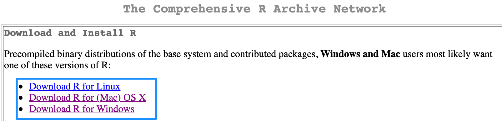
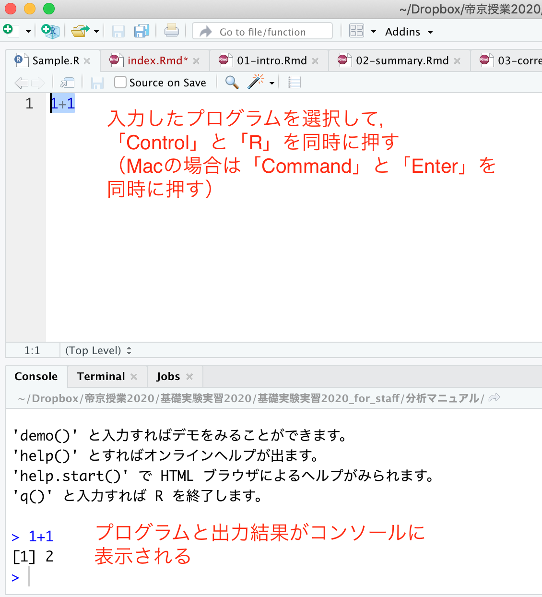
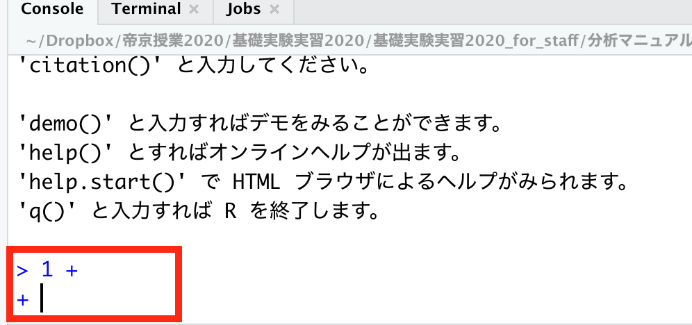
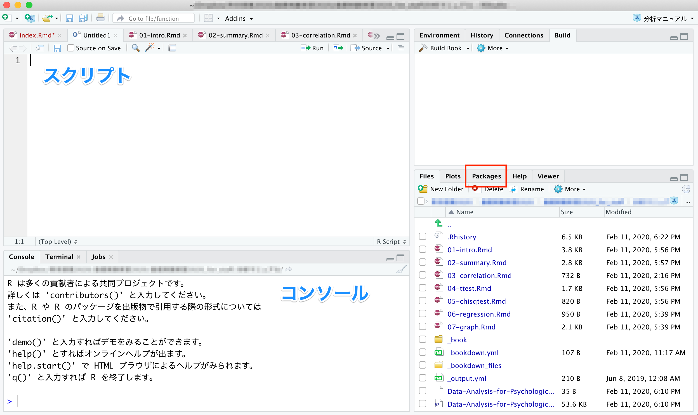

```{r, include=FALSE}
knitr::opts_chunk$set(echo = TRUE)
library(ggplot2)
```

# Rの使い方{#chap01}

はじめてRを使う人向けに、下準備について解説する。

* R 及び RStudio のインストール  
（このテキストの手順でうまくいかない場合は、「R インストール」などでWeb検索してみよう）  

* パッケージ  
* Rの終わらせ方  

## Rのインストール{#chap01_R}

インストールは、[R-ProjectのWebページ](https://cran.r-project.org)から可能。自分の OS にあったインストーラを選ぶ。  

```{r, echo=FALSE}

```


インストーラを実行したら、あとは指示に従ってインストールをすすめる。  
  

## RStudioのインストール{#chap01_RStudio}


RStudio とは、R の使いやすさを向上させる目的で開発されているアプリケーションである。R をインストールしたら、RStudio もインストールしておくこともすすめる。このテキストでも、RStudio を使って解析することを前提に説明する。    
  
インストールは、[RStudioのWebページ](https://posit.co/download/rstudio-desktop/)からできる。
  
  
R と Rstudio の両方をインストールできたら、RStudio の方を開く。  
以下のような画面が表示される。

```{r, echo=FALSE}
knitr::include_graphics("./images/image01_RStudio_ex.png")
```


***
注意:  
  
ここまでの手順で「R もしくは RStudio をインストールできない」あるいは「R 及び RStudio はインストールできたが、起動できない」という人は、以下の可能性を考えてみてほしい。  
  
* OS が Windows の場合、管理者権限のあるアカウントで R 及び RStudio をインストールする必要がある。インストールする際は、管理者権限として実行しよう。  
  
* 同じく OS が Windows の場合、アカウント名にマルチバイト文字（全角文字）を含んでいると R が正常に起動しない。例えば、マシンにログインする時の名前を「ほげ」など全角文字（日本語）にしてしまっていると、うまくいかない。この場合は面倒ではあるが、「既にあるアカウントの名前を半角英数に変更する（hoge など）」、あるいは「もう一つ別の半角のアカウントを作る」といった方法で対処してみよう。  
  
* R に限らず、ファイルやフォルダ名に全角文字が含まれていると障害になる場合がある。ファイル名やフォルダ名には、なるべく日本語（全角文字）は使わない習慣を身に着けよう。  

***

  
## プログラムの書き方{#chap01_Programing}

RStudioの画面構成について確認する。


### コンソール{#chap01_Console}

**コンソール（Console）**という部分にプログラムを入力すると、結果が出力される。
ためしに、コンソールの`>`の部分に、以下のプログラムを入力して、Enter を押してみよう。  
  
* このテキストでは以下のように、背景が灰色の箇所にプログラムとその出力結果（行頭に##が付いている部分）が示されている。

```{r, echo=TRUE}
1 + 1
```

同じコンソールに、答えである`r 1+1`が出力されたはずである。
このように、コンソールに直接プログラムを入力すると、結果を返してくれる。  
  
### スクリプト{#chap01_Script}

コンソールに入力したプログラムや出力結果は、R を閉じると消えてしまう。これでは復習できないので、プログラムは別のファイルに残しておいた方が良い。  
  
プログラムを書き込んだテキストのことを「**スクリプト (Script)**」と呼ぶ。プログラムはなるべく、スクリプトに残しておく習慣をつけよう。  
  
    
* 「File」から「New Script」を選ぶ。何も書かれていないファイル（R Editor）が開かれる。  
* 名前をつけて保存する。「File」から「Save as..」を選び、名前をつけて保存する。拡張子が「.R」のファイルとして保存される。  
  
  


スクリプトに、試しに以下のプログラムを入力してみよう。  

```{r, eval=FALSE}
1 + 1
```

プログラムを選択し、Ctrl と Enter を同時に押して実行する（「Run line or selection」を選んでも可）。すると、「R Console」にプログラムの結果が出力される。  

```{r, echo=FALSE}

```

スクリプトファイルを開きたいときは、RStudio を立ち上げて、「File」から「Open File」を選び、スクリプトのファイルを選ぶ。  


*** 
初心者が戸惑いやすい点について説明する。  
    
ためしに、コンソールに以下のプログラムを入力してEnterを押してみよう。

```{r, eval=FALSE}
1 + 
```

```{r, echo=FALSE, out.width="50%"}

```


何も表示されないし、冒頭が`>`ではなく`+`が表示される。Enter を押しても元に戻らない。  
  
プログラムが不完全なことが原因である。`1 + `と中途半端な状態で入力したので、Rはプログラムの続きがあるものと思って入力を待っている状態にある。プログラムの続きを入力すれば、結果が出力される。例えばこの例ならば、`1`を入力してEnterを押せば、答えである`2`が出力される。  
  
他にもカッコの閉じ忘れなどでも、同じようなことが生じる。  
  
なお、**Esc（エスケープ）キーを押せば**、プログラムを中止することができる。困ったときには、Escキーを押そう。  
  
他にも、エラーが生じた場合は、エラーメッセージを読んで、**プログラムの書き方に間違いがないかを確認しよう**。たいてい、入力間違いなど大したことのないミスが原因である。ちょっとプログラムを間違えたくらいでRが壊れるということは決してないので、冷静に対処しよう。

## パッケージ{#chap01_Package}

パッケージとは、R の機能を拡張するためにインターネットからインストールして使うものである。 


### パッケージのインストール{#chap01_InstallPackage}

パッケージをインストールする。`install.packages()`で、インストールしたいパッケージを入力する。  
  
ここでは`ggplot2`というパッケージをインストールするのを例として、パッケージのインストール方法について示す。

```{r, eval=FALSE}

install.packages("ggplot2")

```

もし「Please select a CRAN mirror ...」というのが表示されたら、Japan (Tokyo)を選んで「OK」を押す。  

***
パッケージのインストールは、RStudioの右下の「Packages」というタブからも行うことができる。「Install」を選択して、インストールしたいパッケージ名を入力して実行する。

```{r, echo=FALSE, out.width="50%"}

```

パッケージは世界中で開発され、アップデートもなされている。RStudioならば同じく「Packages」の「Update」を選ぶことでアップデートすることができる。

***

  
### パッケージのロード{#chap01_LoadPackage}
  
単にインストールしただけではパッケージを使うことができない。使う前にロードする必要がある。`library()`で、括弧内に使いたいパッケージ名を入力する。  
インストールのときとは違って、クオテーションマーク("")でパッケージ名を囲む必要はない。

```{r, eval=FALSE}
library(ggplot2)
```

一度インストールしておけば、今後は最初に`library()`でロードするだけで使うことができる。毎回インストールし直す必要はない。  

## ヘルプ{#chap01_Help}

R の関数やパッケージなど、使い方がわからない場合は`help()`でヘルプを参照することができる（英語）。RStudio ならば、画面右下の「Help」にヘルプが出力される。ヘルプにはプログラムの例も記されている。

```{r, eval = FALSE}

help(mean)
?mean #?でもヘルプを表示させることができる。

```


## Rを終わらせる{#chap01_End}

そのまま閉じてよい。

「Save workspace image?（作業スペースを保存しますか？）」が表示されるが、「いいえ」で良い。

