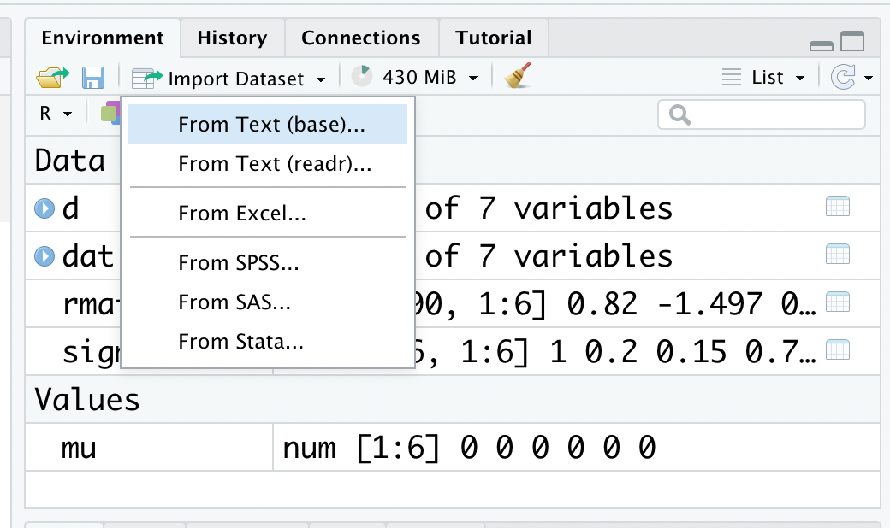
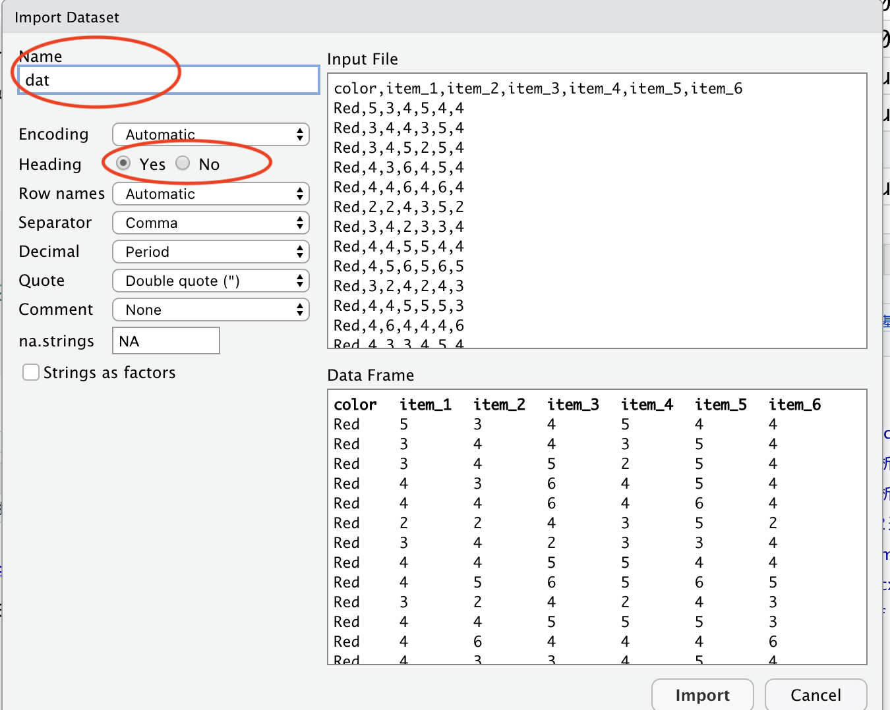

```{r, include=FALSE}
knitr::opts_chunk$set(echo = TRUE)
library(ggplot2)
```

# Rの使い方

* R 及び RStudio のインストール  
（このテキストの手順でうまくいかない場合は、「R インストール」などでWeb検索してみよう）  

* プログラムの書き方  
* 変数  
* データ構造  
* 欠損値の扱い  
* パッケージ  
* データの読み込み  


## Rのインストール

インストールは、[R-ProjectのWebページ](https://cran.r-project.org)から可能。自分の OS にあったインストーラを選ぶ。  

```{r, echo=FALSE}
knitr::include_graphics("./images/image01_R.png")
```


インストーラを実行したら、あとは指示に従ってインストールをすすめる。  
  

## RStudioのインストール


RStudio とは、R の使いやすさを向上させる目的で開発されているアプリケーションである。R をインストールしたら、RStudio もインストールしておくこともすすめる。このテキストでも、RStudio を使って解析することを前提に説明する。    
  
インストールは、[RStudioのWebページ](https://posit.co/download/rstudio-desktop/)からできる。
  
  
R と Rstudio の両方をインストールできたら、RStudio の方を開く。  
以下のような画面が表示される。

```{r, echo=FALSE}
knitr::include_graphics("./images/image01_RStudio_ex.png")
```


***
注意:  
  
ここまでの手順で「R もしくは RStudio をインストールできない」あるいは「R 及び RStudio はインストールできたが、起動できない」という人は、以下の可能性を考えてみてほしい。  
  
* OS が Windows の場合、管理者権限のあるアカウントで R 及び RStudio をインストールする必要がある。インストールする際は、管理者権限として実行しよう。  
  
* 同じく OS が Windows の場合、アカウント名にマルチバイト文字（全角文字）を含んでいると R が正常に起動しない。例えば、マシンにログインする時の名前を「ほげ」など全角文字（日本語）にしてしまっていると、うまくいかない。この場合は面倒ではあるが、「既にあるアカウントの名前を半角英数に変更する（hoge など）」、あるいは「もう一つ別の半角のアカウントを作る」といった方法で対処してみよう。  
  
* R に限らず、ファイルやフォルダ名に全角文字が含まれていると障害になる場合がある。ファイル名やフォルダ名には、なるべく日本語（全角文字）は使わない習慣を身に着けよう。  

***

  
## プログラムの書き方

RStudioの画面構成について確認する。


### コンソール（Console）

**コンソール（Console）**という部分にプログラムを入力すると、結果が出力される。
ためしに、コンソールの`>`の部分に、以下のプログラムを入力して、Enter を押してみよう。  
  
* このテキストでは以下のように、背景が灰色の箇所にプログラムとその出力結果（行頭に##が付いている部分）が示されている。

```{r, echo=TRUE}
1 + 1
```

同じコンソールに、答えである`r 1+1`が出力されたはずである。
このように、コンソールに直接プログラムを入力すると、結果を返してくれる。  
  
### スクリプト

コンソールに入力したプログラムや出力結果は、R を閉じると消えてしまう。これでは復習できないので、プログラムは別のファイルに残しておいた方が良い。  
  
プログラムを書き込んだテキストのことを「**スクリプト**」と呼ぶ。プログラムはなるべく、スクリプトに残しておく習慣をつけよう。  
  
    
* 「File」から「New Script」を選ぶ。何も書かれていないファイル（R Editor）が開かれる。  
* 名前をつけて保存する。「File」から「Save as..」を選び、名前をつけて保存する。拡張子が「.R」のファイルとして保存される。  
  
  


スクリプトに、試しに以下のプログラムを入力してみよう。  

```{r, eval=FALSE}
1 + 1
```

プログラムを選択し、Ctrl と Enter を同時に押して実行する（「Run line or selection」を選んでも可）。すると、「R Console」にプログラムの結果が出力される。  

```{r, echo=FALSE}
knitr::include_graphics("./images/image01_Script2.png")
```

スクリプトファイルを開きたいときは、RStudio を立ち上げて、「File」から「Open File」を選び、スクリプトのファイルを選ぶ。  


*** 
初心者が戸惑いやすい点について説明する。  
    
ためしに、コンソールに以下のプログラムを入力してEnterを押してみよう。

```{r, eval=FALSE}
1 + 
```

```{r, echo=FALSE, out.width="50%"}
knitr::include_graphics("./images/image01_Error1.png")
```


何も表示されないし、冒頭が`>`ではなく`+`が表示される。Enter を押しても元に戻らない。  
  
プログラムが不完全なことが原因である。`1 + `と中途半端な状態で入力したので、Rはプログラムの続きがあるものと思って入力を待っている状態にある。プログラムの続きを入力すれば、結果が出力される。例えばこの例ならば、`1`を入力してEnterを押せば、答えである`2`が出力される。  
  
他にもカッコの閉じ忘れなどでも、同じようなことが生じる。  
  
なお、**Esc（エスケープ）キーを押せば**、プログラムを中止することができる。困ったときには、Escキーを押そう。  
  
他にも、エラーが生じた場合は、エラーメッセージを読んで、**プログラムの書き方に間違いがないかを確認しよう**。たいてい、入力間違いなど大したことのないミスが原因である。ちょっとプログラムを間違えたくらいでRが壊れるということは決してないので、冷静に対処しよう。

## パッケージのインストールとロード

パッケージとは、R の機能を拡張するためにインターネットからインストールして使うものである。 


### パッケージのインストール

パッケージをインストールする。`install.packages()`で、インストールしたいパッケージを入力する。  
  
ここでは`ggplot2`というパッケージをインストールするのを例として、パッケージのインストール方法について示す。

```{r, eval=FALSE}

install.packages("ggplot2")

```

もし「Please select a CRAN mirror ...」というのが表示されたら、Japan (Tokyo)を選んで「OK」を押す。  

***
パッケージのインストールは、RStudioの右下の「Packages」というタブからも行うことができる。「Install」を選択して、インストールしたいパッケージ名を入力して実行する。

```{r, echo=FALSE, out.width="50%"}
knitr::include_graphics("./images/image01_RStudio_packages.png")
```

パッケージは世界中で開発され、アップデートもなされている。RStudioならば同じく「Packages」の「Update」を選ぶことでアップデートすることができる。

***

  
### パッケージのロード
  
単にインストールしただけではパッケージを使うことができない。使う前にロードする必要がある。`library()`で、括弧内に使いたいパッケージ名を入力する。  
インストールのときとは違って、クオテーションマーク("")でパッケージ名を囲む必要はない。

```{r, eval=FALSE}
library(ggplot2)
```

一度インストールしておけば、今後は最初に`library()`でロードするだけで使うことができる。毎回インストールし直す必要はない。  


## Rを終わらせる

そのまま閉じてよい。

「Save workspace image?（作業スペースを保存しますか？）」が表示されるが、「いいえ」で良い。

## プログラミングの練習

ここでは、Rで使える識別子(operator)の解説を通して、プログラミングの練習を行う。  

### コメント文

文頭に`#`を挿入すると、`#`から改行まではコメント文として理解され、プログラムが実行されない。スクリプトにメモを残しておきたいときに便利である。

```{r, eval=FALSE}

#1 + 1 
#この部分は実行されない

```


### 算術識別子

`+`、`-`、`*`、`/`で、四則演算（足し算・引き算・割り算・掛け算）を行える。

```{r}
1 + 1 #足し算
1 - 1 #引き算
2 * 3 #掛け算
10 / 2 #割り算
```

他にも演算用の識別子として、`^`、`%%`、`%/%`がある。それぞれ、累乗、割り算の余り、割り算の整数部分の計算を結果を返す。

```{r, eval=FALSE}
2 ^ 3 #2の3乗
5 %% 3 #5/3の余り
5 %/% 3 #5/3の整数部分
```


カッコ`()`を使うと、カッコ内の演算が優先される。

```{r}
(1 + 3)/2
```


### 比較識別子

数値の大小関係などを扱うときに用いる。その式が成り立っていればTRUE、成り立っていなければFALSEが出力される。

```{r}

2 == 1 #2 と 1 は同じか？
2 != 1 #2 と 1 は同じではないか？
2 < 1　#2 は 1 よりも小さいか？
2 <= 1 #2 は 1 以下か？
2 > 1 #2 は 1 より大きいか？
2 >= 1 #2 は 1 以上か？

```


## 変数

数値を変数に代入して扱うことができる。

```{r}

x = 5 + 8 
x

y = x - 2 
y

```

なお、`=`の代わりに`<-`を使っても良い。

```{r}

x <- 5 + 8
x

```


### 変数の使い方の注意

**Rは小文字と大文字を区別する**。たとえば、`a`（小文字）と入力して実行すると結果が出力されるが、`A`（大文字）では出力されない。

```{r, eval=FALSE}
a = 2 #aに2を代入する。
a - 2 #ゼロが出力されるはず。
A - 2 #Aでは答えが表示されない。Aという変数は作られていないので。
```

また、数値を全角で入力していないかにも注意すること。全角文字は数値ではなく、文字として認識される。数値は常に半角で入力すること。

```{r, eval=FALSE}

x = 2 #半角の2
x = ２ #全角の２

```


### 変数の型  

R では変数の種類として、*数値型*、*文字列*、*日付*、*論理型*の区別をする。

#### 数値型(numeric){-}

数値型として格納した変数は、数値として扱うことができる。数値型の変数同士で、演算（足し算・引き算・掛け算・割り算）を行うことができる。

```{r}

x_num = 5
class(x_num) #class()でその変数の型を確認することができる
y_num = 1.2
class(y_num) #class()でその変数の型を確認することができる

x_num + y_num #数値型同士は演算することができる
```


#### 文字列(character){-}

文字として扱われる。文字列同士は演算をすることができない。
文字を変数として代入したい場合は、文字をクオテーションマーク`""`で囲む。


```{r}

x_char = "hello"
class(x_char) #class()でその変数の型を確認することができる

y_char = "1"
class(y_char) #数値でもクオテーションで囲めば文字列として扱われる。

```


#### 日付(date){-}

Date型は日付のみを保存し、POSIXct型は日付と時間を保存する。
日付型同士で日数や秒数などの演算をすることができる。

```{r}

x_date = as.Date("2020-06-15")
class(x_date) #class()でその変数の型を確認することができる


x_date_1 = as.POSIXct("2020-06-14 12:00")
class(x_date_1)

x_date_2 = as.POSIXct("2020-06-15 12:00")
x_date_2- x_date_1

```


#### 論理型(logical){-}

`TRUE`か`FALSE`の2つの値のどちらかを取る変数の型である。

```{r}

a = TRUE
class(a) #class()でその変数の型を確認することができる

b = FALSE
class(b) #class()でその変数の型を確認することができる

```


##  データ構造  

複数の数値などをまとめたものをデータと呼ぶ。R には、データを扱うための形式がいくつか用意されている。

### ベクトル

同じ型の要素を集めたもの。R では、`c()`関数でベクトルを作成することができる。

```{r}
x = c(1, 2, 3, 4, 5)
x
y = c("a", "b", "c", "d", "e")
y

```

`ベクトル[x]`の表記でカッコの中に数値を入れると、そのベクトルの x 番目の要素を取り出せる。

```{r}

x[2]
y[3]

```

カッコの中に条件式を入れると、その条件に当てはまる部分を取り出せる。

```{r}

x[x >= 3] #3以上の部分を取り出す
y[y == "c"] #3cを取り出す
y[y != "c"] #3c以外を取り出す

```


ベクトルが数値で構成されている場合は、演算をすることもできる。

```{r}

x * 2 #ベクトル内の全ての要素に2を掛ける

x_2 = c(6, 7, 8, 9, 10)
x + x_2 #（ベクトルに格納されている変数の数が同じならば、ベクトル同士で演算ができる）


```


### データフレーム

複数のベクトルを行列でまとめたデータ構造を、R では**データフレーム**と呼ぶ。データフレームは頻繁に使うので、構造を覚えよう。  
  
まず、2つのベクトルを作成する。

```{r}
x_vec = c(1, 2, 3, 4, 5)
y_vec = c("a", "b", "c", "d", "e")

```

次に、以下のプログラムを実行して、データフレームを作る。`data.frame()`は、データフレームを作るための関数である。  
  
以下では、ベクトル`x_vec`と`y_vec`をそれぞれ、`x`と`y`という名前にして`dat`という名前の行列データを作成している。  
  
```{r}
dat = data.frame(x = x_vec, y = y_vec)
dat
```

  
#### 変数の扱い
  
以下のように、**データフレーム$変数名**で、データフレームの変数をベクトルとして取り出すができる。

```{r}
dat$x
```


データフレームに新たに変数を加えることも出来る。

```{r}
dat$x_2 = c(6, 7, 8, 9, 10)
dat

dat$x_3 = dat$x + dat$x_2
dat

```


**データフレーム$変数名**でデータ内の変数にアクセスする方法は、今後もよく使うので覚えておこう。  
  
#### データの抽出 

`データフレーム[行数,列数]`のかたちで指定することで、データフレームの行列を取り出すことができる。

```{r}

dat[1,2] #1行目, 2列目に該当する部分を抽出

dat[1,] #1行目を抽出（列を指定しなければ，データフレームの全ての列が抽出される）
dat[,1] #1列目を抽出（行を指定しなければ，データフレームの全ての行が抽出される）

dat[1:3,] #1行目から3行目を抽出

dat[c(1,3,5),] #1行目, 3行目, 5行目を抽出

```


カッコ内に条件式を入れると、その条件と一致する部分を取り出せる。

```{r}

dat[dat$x > 2,] #xが2を超える行を抽出

dat[dat$x > 2 & dat$y != "c",] #xが2を超え，かつyがc以外の行を抽出

```

## 欠損値  

心理学ならば一部の質問への無回答など、データが取得できなかったケースも生じ得る。そのような場合には、データの一部を**欠損値**として扱う。  
  
Rでは、欠損値は`NA`で扱う。

先程の例で作ったデータフレーム`dat`に、欠損値を含むベクトル`x_4`を入れてみよう。

```{r}

dat$x_4 <- c(1, 2, NA, 4, 5)
dat

dat$x + dat$x_4

```

欠損値を含むベクトルは、計算に用いることができない。例えば、R には平均値を計算するための`mean()`という関数がある。しかし、欠損値を含むベクトルの場合は結果が出力されない。

```{r}

mean(dat$x_4) 

```

関数によっては、欠損値を含むデータを使うときには欠損値の処理を指定する必要がある。例えば、`mean()`ならば、オプションとして`na.rm =TRUE`を入れると欠損値を除いた上で平均値を計算してくれる。

```{r}

mean(dat$x_4, na.rm = TRUE)

```


## データの読み込み

大抵の場合、データは Excel ファイルなどに入力して使うことが多い。RでExcelなどの外部ファイルを読み込む方法として、以下の手順がある。

### 1: RStudioの機能を使って読み込む{-}

RStudio の場合、右上にある「Import Dataset」でデータの読み込みを行うことができる。

```{r, echo=FALSE, out.width="50%"}

```

「From Text (base)」を選び、読み込む CSV ファイルを選ぶ。


```{r, echo=FALSE, out.width="50%"}

```

Name には「dat」と入力、ファイルの1行目に変数名を入力している場合は Heading は「Yes」を選ぶ。設定ができたら、「Import」を選ぶ。  


### 2: プログラムを書いてデータを読み込む。{-}

読み込みたいデータをデスクトップに置いた場合を例として、外部データの読み込み方について確認していく。  
  
まず、**ワーキングディレクトリ**を指定する必要がある（R にデータのある場所を教える作業）。ワーキングディレクトリとは、「現在居る場所」のことである。  
試しに、現在のワーキングディレクトリを確認しよう。以下のプログラムをコンソールに入力して実行する。

```{r, eval=FALSE}

getwd()

```


出力された場所が、現在のワーキングディレクトリである。R はワーキングディレクトリを起点として読み込むファイルを探す。**読み込むファイルは、ワーキングディレクトリに置くことにしよう**。  
  
以下に、ワーキングディレクトリにデスクトップを指定する方法を例として説明する。  

##### プログラムから指定する{-}

コンソールに以下のプログラムを直接書き込んで実行する。 

```{r, echo=TRUE, eval=FALSE}

#Windowsの場合
setwd("C:/Users/ユーザー名/Desktop") #ユーザー名には設定しているアカウント名を入れる。

#Macの場合
setwd("~/Desktop") 

#正しく設定されたかを確認する
getwd() 

```

##### RStudioの機能を使う{-}

* RStudioならば、右の方にある「File」からデスクトップを表示し、「Set As Working Directory」を選ぶ。  

```{r, echo=FALSE, out.width="50%"}
knitr::include_graphics("./images/image02_Working.png")
```

他にも、メニューバーの「Session」から「Set Working Directory」、「Choose Working Directory」で指定することもできる。  

```{r, echo=FALSE, out.width="50%"}
knitr::include_graphics("./images/image02_Working2.png")
```

ワーキングディレクトリの指定ができたら、プログラムを書いてデータを読み込む。
  
#### csvファイルの場合{-}

`read.csv()`関数で読み込むことが出来る。

```{r, eval=FALSE, message=FALSE}

dat = read.csv("data.csv") #ファイル名をクオテーションで囲んで入れる。ここでは読み込んだデータを「dat」という名前で保存した。

dat #データの中身がコンソールに出力される
```


#### Excelファイルの場合{-}


`readxl`パッケージをインストール及びロードした上で、`read_excel()`を使う。  
＊`readxl::read_excel`は、`readxl`パッケージに入っている`read_excel`という関数を使うということを意味する（第4章で、また説明する）。


```{r, eval=FALSE}

dat = readxl::read_excel("data.xlsx")
dat
```


#### 相対パス{-}


ワーキングディレクトリを起点として指定されるファイルの場所のことを**相対パス**という。  
  
上記の例では、デスクトップ上に読み込みたいファイルを保存し、デスクトップをワーキングディレクトリに指定してデータを読み込んだ。しかし、例えばデスクトップにあるフォルダの中にデータを保存してあってそのファイルを読み込みたい場合、いちいちワーキングディレクトリを設定し直すのは面倒である。  
  
このような場合、相対パスでファイルを指定するのが便利である。
「sample_data」のフォルダをダウンロードしてデスクトップに保存し、フォルダの中にある「0_sample.csv」を読み込んでみよう。

```{r, eval=FALSE}
#デスクトップをワーキングディレクトリに指定する
##Windowsの場合
setwd("C:/Users/ユーザー名/Desktop") #ユーザー名には設定しているアカウント名を入れる。
##Macの場合
setwd("~/Desktop") 

#デスクトップにあるsample_dataフォルダの中の「0_sample.csv」を読み込む
dat = read.csv("./sample_data/0_sample.csv")

```

`.`（ピリオド）は、ワーキングディレクトリを意味する。`/`（スラッシュ）でフォルダの階層を区切り、ファイルを指定する。


### サンプルデータ

R には予めサンプルデータがいくつか用意されている。このテキストでもところどころで、R に入っているサンプルデータを使って解析の練習を行う。

```{r, eval = FALSE}
iris #有名なフィッシャーのあやめデータ
cars #自動車の速度と停止距離との関係

data() #data()で、入っているデータを確認できる

```


## ヘルプ

R の関数など、使い方がわからない場合は`help()`でヘルプを参照することができる（英語）。RStudio ならば、画面右下の「Help」にヘルプが出力される。ヘルプにはプログラムの例も記されている。

```{r, eval = FALSE}

help(mean)

?mean #?でもヘルプを表示させることができる。
?iris

```


## 確認問題{-}

R でのプログラムの書き方、データフレームの使い方、外部データの読み込み方について復習しよう。

### 問１{-}

R を使って以下のa, bを計算し、aとbの式どちらの方が答えが大きいかを確認せよ。  
  
a: 1 × 1 × 2 × 2 × 3 × 4 × 5 × 9 × 8 × 7 × 6  
  
b: 9 × 8 × 7 × 6 × 1 × 7 × 5 × 1 × 3 × 2 × 1  
  
  
### 問２{-}

ある細菌が、1分後に2個に分裂して増殖するとする。つまり、1個の細菌が1分後には2個に、2分後にはその2個が分裂して合計4個に、3分後にはその4個が分裂して合計8個になる。  
1個の細菌は、30分後には何個になっているだろうか？

ヒント：aのx乗は\^を使って求める（a^x）  


### 問３{-}
  
サンプルデータ「1_sample.csv」をデータフレームとして読み込もう。更に、データフレーム上の変数X, Yを用いて、Z = X - 3Y の新しい変数Zをデータフレームに追加しよう。  


