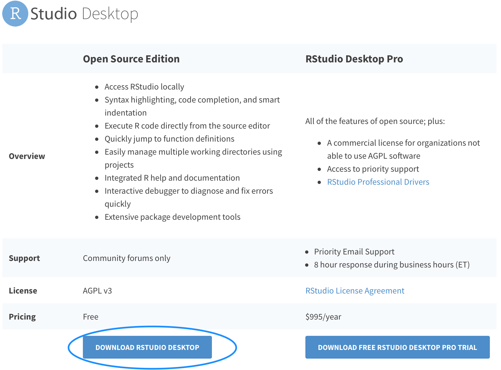
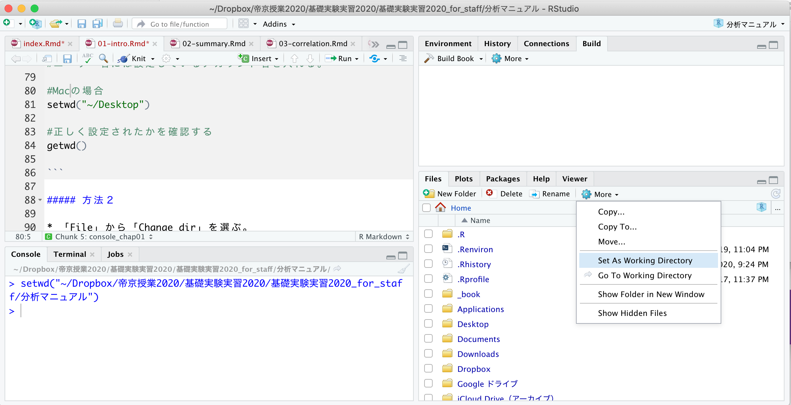
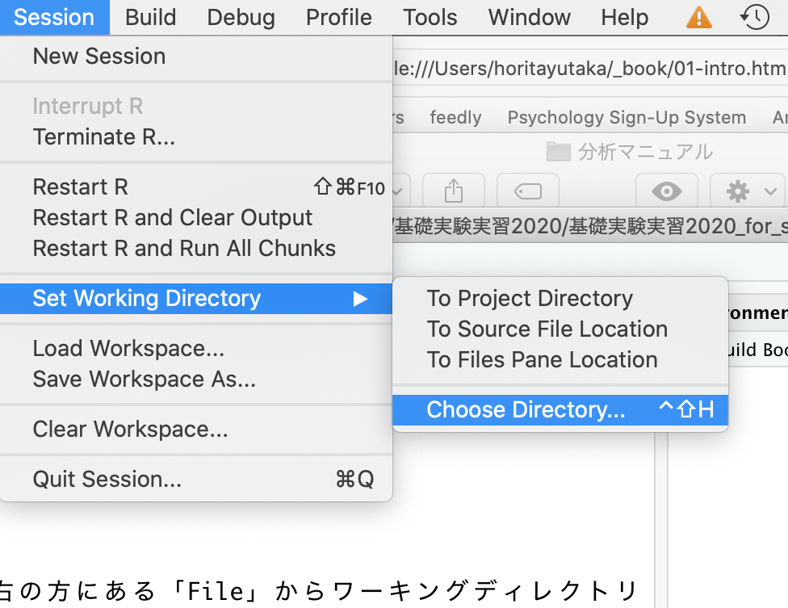

```{r, include=FALSE}
knitr::opts_chunk$set(echo = TRUE)
library(tidyverse)
```

# Rの使い方

Rのインストールから使い方までを解説する。

* R及びRStudioのインストール  
（このテキストの手順でうまくいかない場合は，「R インストール」などで検索してみよう）  

* プログラムの書き方  
* 変数  
* データ構造  
* 欠損値  
* パッケージ  
* データの読み込み  


## R及びRStudioのインストール

インストールは，[https://cran.r-project.org](https://cran.r-project.org)から可能。自分のOSにあったインストーラを選ぶ。  


インストーラを実行したら，あとは指示に従ってインストールをすすめる。  
  

## RStudioのインストール


RStudioとは，Rの使いやすさを向上させる目的で開発されているアプリケーションである。Rをインストールしたら，RStudioもインストールしておくこともすすめる。このマニュアルでも，RStudioを使って解析することを前提に説明する。    
  
インストールは，[https://rstudio.com/products/rstudio/#rstudio-desktop](https://rstudio.com/products/rstudio/#rstudio-desktop)からできる。
  


「DOWNLOAD RSTUDIO DESKTOP」を選択（無料版で良い）。  
  
  
RとRstudioの両方をインストールできたら，RStudioの方を開く。  
以下のような画面が表示される。    


***
注意:  
  
ここまでの手順で「そもそも自分のマシンにR及びRStudioをインストールできない」あるいは「R及びRStudioはインストールできtが，起動できない」という人は，以下の可能性を考えてみてほしい。  
  
OSがWindowsの場合，管理者権限のあるアカウントでR及びRStudioをインストールする必要がある。インストールする際は，管理者権限として実行しよう。  
  
同じくOSがWindowsの場合，アカウント名にマルチバイト文字（日本語）を含んでいるとRが正常に起動しない。つまり，マシンにログインする時の名前を「ほげ」など日本語にしてしまっていると，うまくいかない。この場合は面倒ではあるが，「既にあるアカウント名を半角英数に変更する（[hoge]など）」，あるいは「半角のアクアンと名を別に作る」といった方法で対処してみよう。  
  
Rでの日本語の文字コードの扱いについては，以降の外部データの読み込みの際にも障害になる場合がある。ファイル名やフォルダ名には，なるべく日本語（全角文字）は使わない習慣を身に着けよう。  
  
## プログラムの書き方


### コンソールとスクリプト


#### コンソール（Console）

**コンソール（Console）**という部分にプログラムを入力すると，結果が出力される。
ためしに，コンソールの`>`の部分に，以下のプログラムを入力して，Enterを押してみよう。  
  
※このマニュアルでは以下のように，背景が灰色の箇所にプログラムとその出力結果（行頭に##が付いている部分）を示す。

```{r, echo=TRUE}
1 + 1
```

同じコンソールに，答えである`r 1+1`が出力されたはずである。
このように，コンソールに直接プログラムを入力して結果を確認することができる。  
  


#### スクリプト

コンソールに入力したプログラムや出力結果は，Rを閉じると消えてしまう。これでは復習できないので，プログラムは別のファイルに残しておく。  
  
プログラムを書き込んだ別ファイルのことを「**スクリプト（Script）**」と呼ぶ。プログラムはなるべくコンソールではなく，スクリプトファイルに書く習慣をつけよう。  
  
    
* 「File」から「New Script」を選ぶ。何も書かれていないファイル（R Editor）が開かれる。  
* 名前をつけて保存する。「File」から「Save as..」を選び，名前をつけて保存する。拡張子が「.R」のファイルとして保存される。  
  


スクリプトに，試しに以下のプログラムを入力してみよう。  

```{r, eval=FALSE}
1 + 1

1 - 1

2 * 3

10 / 2

2^3

(1 + 3)/2

#1 + 1 （#から改行まではコメント文として理解され，実行されない）

```

プログラムを選択し，Ctrl+Rで実行する（「Run line or selection」を選んでも可）。すると，「R Console」にプログラムの結果が出力される。  
  


書いたプログラムは，スクリプトに残しておこう。  
スクリプトファイルを開きたいときは，RStudioを立ち上げて，「File」から「Open File」を選び，スクリプトのファイルを選ぶ。  


*** 
注意:  
  
ためしに，コンソールに以下のプログラムを入力してEnterを押してみよう。

```{r, eval=FALSE}
1 + 
```


何も表示されないし，冒頭が`>`ではなく`+`が表示される。Enterを押してももとに戻らない。  
  
これはプログラムが不完全であるためである。`1 + `と中途半端な状態なので，Rはプログラムの続きがあるものと思って入力を待っている状態なのである。プログラムの続きを入力すれば，結果が出力される。例えばこの例ならば，`1`を入力してEnterを押せば，答えである`2`が出力される。  
  
他にもカッコの閉じ忘れでも同じようなことが生じる。  
  
なお，**Escキーを押せば**，プログラムを中止することができる。困ったときには，Escキーを押そう。  
  
  
他にも，エラーが生じた場合は，エラーメッセージを読んで，**プログラムの書き方に間違いがないかを確認しよう**。たいてい，「変数の入力間違い」など大したことのないミスが原因である。ちょっとプログラムを間違えたくらいでRが壊れるということは決してないので，冷静に対処しよう。


## 変数

数値を変数に代入して使うことができる。

```{r}

x = 5 + 8 

## = の代わりに <- を使ってもOK
x <- 5 + 8

x

```


```{r}

y = x - 2 
y

```

### 変数の使い方の注意

**Rは小文字と大文字を区別する**。たとえば，`x`（小文字）と入力して実行すると結果が出力されるが，`X`（大文字）では出力されない（変数が作られていないので）。

```{r, eval=FALSE}
x = 2 #小文字のxに2を代入する。
x - 2 #ゼロが出力されるはず。
X - 2 #大文字のXでは答えが表示されない。大文字のXの変数は作られていないので。
```

また，半角と全角で入力を間違えていないかにも注意すること。

```{r, eval=FALSE}

x = 2 #半角の2
x = ２ #全角の２

```

Rでは全角を数字ではなく，文字として認識する。数字は常に半角で入力すること。

### 変数の型  

Rでは変数の種類として，*数値型*，*文字列*，*日付*，*論理型*の区別をする。

#### 数値型

数値型として格納した変数は，数値として扱うことができる。数値型の変数同士で，演算（足し算・引き算・掛け算・割り算）を行うことができる。

```{r}

x = 5
class(x) #class()でその変数の型を確認することができる
y = 1.2
class(y) #class()でその変数の型を確認することができる

x + y #数値型同士は演算することができる
```


#### 文字列

文字として扱われる。文字列同士は演算をすることができない。
文字を変数として代入したい場合は，文字をクオテーションマーク`("")`で囲む。


```{r}

x = "hello"
class(x) #class()でその変数の型を確認することができる

y = 1
class(y) #class()でその変数の型を確認することができる

y_2 = "1"
y_2 #数値でもクオテーションで囲めば文字列として扱われる。

```


#### 日付（＊）

Dateは日付のみを保存し，POSIXctは日付と時間を保存する。
日付型同士で日数や秒数などの演算をすることができる。

```{r}

date = as.Date("2020-06-15")
class(date) #class()でその変数の型を確認することができる


date_1 = as.POSIXct("2020-06-14 12:00")
class(date_1)

date_2 = as.POSIXct("2020-06-15 12:00")
date_2 - date_1

```


#### 論理型（＊）

`TRUE`か`FALSE`の2つの値のどちらかを取る変数の型である。

```{r}

a = TRUE
class(a) #class()でその変数の型を確認することができる

b = FALSE
class(b) #class()でその変数の型を確認することができる

```

##### 論理式


```{r}

2 == 1 #2 と 1 は同じか？
2 != 1 #2 と 1 は同じではないか？
2 < 1　#2 は 1 よりも小さいか？
2 <= 1 #2 は 1 以下か？
2 > 1 #2 は 1 より大きいか？
2 >= 1 #2 は 1 以上か？

```


##  データ構造  

複数の数値などをまとめたものをデータと呼ぶ。Rには，データを扱うためのいくつかのデータ構造が用意されている。

### ベクトル

同じ型の要素を集めたもの。Rでは，`c()`関数でベクトルを作成することができる。

```{r}
x = c(1, 2, 3, 4, 5)
y = c("a", "b", "c", "d", "e")

x * 2 

x_2 = c(6, 7, 8, 9, 10)
x + x_2 #（格納されている変数の数が同じならば，ベクトル同士で計算ができる）


```


### データフレーム

複数のベクトルを行列でまとめたデータ構造を，Rでは*データフレーム*と呼ぶ。データフレームは頻繁に使うので，構造を覚えよう。  
  
まず，2つのベクトルを作成する。

```{r, eval=FALSE}
x = c(1, 2, 3, 4, 5)
y = c("a", "b", "c", "d", "e")

```

次に，以下のプログラムを実行して，データフレームを作る。`data.frame()`は，データフレームを作るための関数である。

```{r}
dat = data.frame(x, y)
dat
```

以下のように，**データフレーム$変数名**で，データフレームの変数をベクトルとして取り出すができる。

```{r}
dat$x
```


データフレームに新たに変数を加えることも出来る。

```{r}
dat$x_2 = c(6, 7, 8, 9, 10)
dat

dat$x_3 = dat$x + dat$x_2
dat

```


**データフレーム$変数名**でデータ内の変数にアクセスする方法は，今後もよく使うので覚えておこう。

## 欠損値  

心理学ならば実験の失敗や質問への無回答など，データが取得できなかったケースも生じ得る。そのような場合には，データの一部を**欠損値**として扱う。  
  
Rでは，欠損値は`NA`で扱う。

先程の例で作ったデータフレーム`dat`に，欠損値を含むベクトル`x_4`を入れてみよう。

```{r}

dat$x_4 <- c(1, 2, NA, 4, 5)
dat

dat$x + dat$x_4

```

欠損値を含む変数は，計算に用いることができない。例えば，Rには平均値を計算するための`mean()`という関数がある。しかし，欠損値を含むベクトルの場合は計算がなされない。

```{r}

mean(dat$x_4) 

```

関数によっては，欠損値を含むデータを使うときには欠損値の処理をする必要がある。例えば，`mean()`ならば，オプションとして`na.rm =TRUE`を入れると欠損値を除いた上で平均値を計算してくれる。

```{r}

mean(dat$x_4, na.rm = TRUE)

```


## パッケージのインストールとロード

パッケージとは，Rの機能を拡張するためにインターネットからインストールして使うものである。 
Rに標準で入っている機能に加え，追加で**tidyverse**パッケージをインストールして使おう。  


### パッケージのインストール

パッケージをインストールする。`install.packages()`で，インストールしたいパッケージを入力する。  
  
ここでは`tidyverse`というパッケージをインストールするのを例として，パッケージのインストール方法について示す。

```{r, eval=FALSE}

install.packages("tidyverse")

```

もし「Please select a CRAN mirror ...」というのが表示されたら，Japan (Tokyo)を選んで「OK」を押す。  
  
  
インストールしただけではパッケージは使えない。使う前にロードする必要がある。`library()`で，括弧内に使いたいパッケージ名を入力する。  

```{r, eval=FALSE}
library("tidyverse")
```


一度インストールしておけば，今後は最初に`library()`でロードするだけで使うことができる。毎回インストールする必要はない。  

***
マシンにインストールされているパッケージの情報は，RStudioの右下の「Packages」というタブから確認することができる。  
パッケージは世界中で開発され，アップデータもなされている。RStudioならば同じく「Packages」の「Update」を選ぶことでアップデートすることができる。


## データの読み込み

大抵，データはExcelファイルなどに入力して使う場合が多い。RでExcelなどの外部ファイルを読み込んで解析するには，以下の手順を踏む必要がある。

1. ワーキングディレクトリを指定する。  
2. データを読み込む

読み込みたいデータをデスクトップに置いた場合を例として，外部データの読み込み方について確認していこう。


### ワーキングディレクトリを指定する。

**ワーキングディレクトリ**とは，「現在居る場所」のことである。  
試しに，現在のワーキングディレクトリを確認しよう。以下のプログラムをコンソールに入力して実行する。

```{r, eval=FALSE}

getwd()

```


出力された場所が，現在のワーキングディレクトリである。Rは読み込むファイルをワーキングディレクトリを起点として探す。**読み込むファイルは，ワーキングディレクトリに置くことにしよう**。  


#### ワーキングディレクトリの指定

以下に，ワーキングディレクトリをデスクトップに指定する方法について説明する。  

##### 方法１

* コンソールに以下のプログラムを直接書き込んで実行する。 

```{r, echo=TRUE, eval=FALSE}

#Windowsの場合
setwd("C:/Users/ユーザー名/Desktop") #ユーザー名には設定しているアカウント名を入れる。

#Macの場合
setwd("~/Desktop") 

#正しく設定されたかを確認する
getwd() 

```

##### 方法２

* RStudioならば，右の方にある「File」からデスクトップを表示し，「Set As Working Directory」を選ぶ。  




##### 方法３

* RStudioならば，「Session」から「Set Working Directory」，「Choose Working Directory」を選び，デスクトップを選ぶ。  




### データを読み込む
  
#### csvファイルの場合

`read.csv()`関数で読み込むことが出来る。

```{r, eval=FALSE, message=FALSE}

dat = read.csv("data.csv") #ファイル名をクオテーションで囲んで入れる。ここでは読み込んだデータを「dat」という名前で保存した。

dat #データの中身がコンソールに出力される
```


#### Excelファイルの場合


`tidyverse`パッケージをロードした上で，`read_excel()`を使う。


```{r, eval=FALSE}

dat = readxl::read_excel("data.xlsx")
dat
```


#### 相対パス（＊）


ワーキングディレクトリを起点として指定されるファイルの場所のことを*相対パス*という。  
  
上記の例は，デスクトップ上に読み込みたいファイルを保存し，デスクトップをワーキングディレクトリとして指定して読み込むという手順であった。しかし，例えばデスクトップにあるフォルダの中にデータを保存してあってそのファイルを読み込みたい場合，いちいちワーキングディレクトリを設定し直すのが面倒くさいだろう。  
  
このような場合，相対パスでファイルを指定するのが便利である。
「sample_data」のフォルダをダウンロードしてデスクトップに保存し，フォルダの中にある「0_sample.csv」を読み込んでみよう。

```{r, eval=FALSE}
#デスクトップをワーキングディレクトリに指定する
##Windowsの場合
setwd("C:/Users/ユーザー名/Desktop") #ユーザー名には設定しているアカウント名を入れる。
##Macの場合
setwd("~/Desktop") 

#デスクトップにあるsample_dataフォルダの中の「0_sample.csv」を読み込む
dat = read.csv("./sample_data/0_sample.csv")

```

`.`（ピリオド）は，ワーキングディレクトリを表現している。`/`（スラッシュ）でフォルダの階層を区切り，ファイルを指定する。


### サンプルデータ

Rには予めサンプルデータがいくつか用意されている。

```{r, eval = FALSE}
iris #有名なフィッシャーのあやめデータ
cars #自動車の速度と停止距離との関係

data() #data()で，入っているデータを確認できる

```


## Rを終わらせる

そのまま閉じてよい。

「Save workspace image?（作業スペースを保存しますか？）」が表示されるが，これは「いいえ」で良い。


## 確認問題

Rでのプログラムの書き方，データフレームの使い方，外部データの読み込み方について復習しよう。

### 問1

Rを使って以下のa, bを計算し、aとbの式どちらの方が答えが大きいかを確認せよ。  
  
a: 1 × 1 × 2 × 2 × 3 × 4 × 5 × 9 × 8 × 7 × 6  
  
b: 9 × 8 × 7 × 6 × 1 × 7 × 5 × 1 × 3 × 2 × 1  
  
  
### 問2

ある細菌が，1分後に2個に分裂して増殖するとする。つまり，1個の細菌が1分後には2個に，2分後にはその2個が2秒後にはその2個が分裂して合計4個に，3分後にはその4個が分裂して合計8個になる。  
1個の細菌は，30分後には何個になっているだろうか？

ヒント：aのx乗は\^を使って求める（a^x）  


### 問3
  
サンプルデータ「1_sample.csv」をデータフレームとして読み込もう。更に，データフレーム上の変数X, Yを用いて，Z = X - 3Y の新しい変数Zをデータフレームに追加しよう。  


