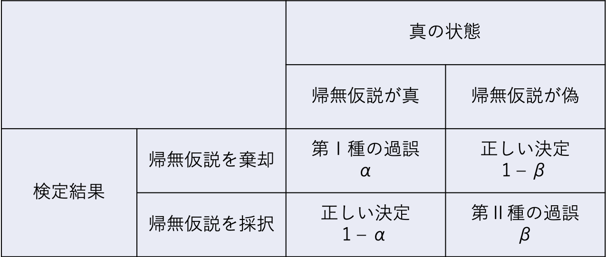

```{r, include=FALSE}
knitr::opts_chunk$set(echo = TRUE)
library(tidyverse)
library(knitr)
set.seed(1234)
```

# 統計的仮説検定

統計的仮説検定の考え方とそれが抱える問題について理解する。

* 統計的仮説検定の考え方（p値とは何か？）
* 統計的仮説検定が抱える問題


## 準備

この章でも、tidyverseパッケージを使う。予めロードしておく。

```{r, echo=TRUE, eval = FALSE, message=FALSE, warning=FALSE}
library(tidyverse)
```

## 統計的仮説検定の考え方

前の章で学んだ二項分布を用いて、統計的仮説検定の考え方について学ぶ。p値とは何なのかを理解する。

### 二項分布の復習

コインを10回投げて表が出た回数$x$をカウントしていく。”理論的”には、表が$x$回出る確率$P(x)$は、コインを投げる回数$n$と表が出る確率$q$をパラメータとする二項分布に従う。

$$
P(x) = {}_n\mathrm{C}_xq^{x}(1-q)^{(n-x)}\\
x \sim Binomial(n, q)
$$

```{r dbinom_2_plot, echo=TRUE}

plot = data.frame(x=0:10, p=dbinom(x=0:10, size=10, prob=0.5))

ggplot2::ggplot() + 
  geom_bar(data=plot, aes(x=factor(x), y=p), stat="identity") + 
  labs(y = "P(x)", x ="x")
```


### 統計的仮説検定

”理論的には”、表が出る回数$x$が生じる確率は上の図のようになる（平均は$nq = 10*0.5 = 5$）。  
  
では、実際にコインを10回投げてみて表が出た回数を数えてみたところ、表が2回しか出なかったとする。この結果から、「このコインには歪みがあって、片一方の面だけが出やすい」と言ってもよいのか？  
  
これを検討するために、表と裏それぞれが出る確率の等しいコインを投げる場合（すなわち、$q=0.5$の場合）との比較を行い、今回の実験結果がどれくらいまれな事象と言えるのかを比較する。  
このとき、研究者が検証したい仮説を**対立仮説（alternative hypothesis）**、対立仮説を検証するために比較の対象とする「偏りを仮定しない」仮説のことを**帰無仮説(null hypothesis)**と呼ぶ。  
  
  
では、今回の帰無仮説となる二項分布（2つのパラメータが、$n=10, q=0.5$の場合)の分布を見てみよう。理論的には、表が$x$回出る確率$P(x)$は、$x$それぞれについて以下のようになる。

```{r dbinom}
d = data.frame(x=0:10, p_x =dbinom(x=0:10, size=10, prob=0.5))
d
```

表もしくは裏が出る回数が2回以下の場合の確率を計算すると、

```{r dbinom2}
d$p_x[1] + d$p_x[2] + d$p_x[3] + d$p_x[9] + d$p_x[10] + d$p_x[11]
```

となる。つまり、もし歪みのないコインならば、片一方の面だけが出る回数が2回以下の確率はおおよそ`r round(d$p_x[1] + d$p_x[2] + d$p_x[3] + d$p_x[9] + d$p_x[10] + d$p_x[11], 2)`ということになる。  
  
この例で求めた確率`r round(d$p_x[1] + d$p_x[2] + d$p_x[3] + d$p_x[9] + d$p_x[10] + d$p_x[11], 2)`のように、「帰無仮説の前提のもとで、特定の実験結果よりもまれな結果が得られる確率」を**p値**と呼ぶ。  
    
p = `r round(d$p_x[1] + d$p_x[2] + d$p_x[3] + d$p_x[9] + d$p_x[10] + d$p_x[11], 2)` は小さい確率のように思える。なので、「歪みのないコインならば、一方の面が2回出る確率は本来`r round(d$p_x[1] + d$p_x[2] + d$p_x[3] + d$p_x[9] + d$p_x[10] + d$p_x[11], 2)`である。本来だったらあまり起こり得ない実験結果が得られたので、このコインは歪みのないコインであると結論づけるのは自然ではない。ゆえに、このコインには歪みがあって片一方の面が出やすい」という結論を出すのが妥当なように思える。  
  
しかし、人によって`r round(d$p_x[1] + d$p_x[2] + d$p_x[3] + d$p_x[9] + d$p_x[10] + d$p_x[11], 2)`を小さいと評価しても良いのか、基準が分かれる。そこで、研究者の間でどこまでの数値を小さいと評価するかの基準が決まっている。この基準となる確率が、**有意水準**である。  
  
一般的に有意水準には0.05（5%）とされることが多い。ただし、なぜ5％を判断基準とするのかについては特に明確な理由はない（みんなから合意されているからという以上の理由はない）。  
  
つまり、「帰無仮説（フェアなコインを投げる）の前提のもとでは、表が出る回数が2回以下の確率は`r round(d$p_x[1] + d$p_x[2] + d$p_x[3] + d$p_x[9] + d$p_x[10] + d$p_x[11], 2)`  であった。これは小さい確率のように思えるが、判断基準の5％よりかは大きい。すなわち、このコインはゆがんでいると結論付ける訳にはいかない」ことになる。
  
以上が、**統計的仮説検定**の考え方である。まとめると、  
1)ある特定の理論分布（帰無仮説）のもとで今回の実験結果が生じる確率（p値）を求め、  
2)その確率が小さいかを評価し、  
3)小さい場合は帰無仮説を棄却する  
というのが、統計的仮説検定のプロセスである。
  

*** 
今回のように「コインが表か裏かに関わらず、一方の面だけが出やすい」という対立仮説を検討する場合の検定は、**両側検定**という。仮に、今回の仮説で表と裏を区別するとして「表が出にくい」つまり「表が出る回数が2回以下の確率」を対象とする場合、このような検定を**片側検定**という。二項分布は左右対称の分布なので、両側p値は片側p値の2倍の値である(厳密には左右対称ではないのであくまで近似値)。多くの場合、両側検定を使うのが一般的である。  
*** 

## 統計的仮説検定の種類

### 二項検定

コイン投げの例は、二項分布に従う事象である。二項分布に従う事象の統計的仮説検定は、**二項検定**と呼ばれる。

Rにも、二項検定を行うための関数`binom.test()`が用意されている。

`binom.test()`に二項分布のパラメータ（$n$と$q$にあたる数値）と実験結果を入れると、p値を求めてくれる。  
  
上の例について、`binom.test()`でp値を求めてみよう。

```{r}

binom.test(x = 2, n = 10, p = 0.5) #出てくる結果はデフォルトで両側検定になる。

```


### t検定

2つのグループの間で平均値に差があるかどうかの統計的仮説検定として、t検定を使うことが多い。連続量の変数を扱う検定の場合は、t検定がよく使われる。
  
t検定の考え方も、基本的に上と同じである。2つの集団の間で平均値に差がないと仮定したときの理論分布（t分布）と比べて、実際に得られた差の値がどれくらい珍しいのかを検討する。  
  
例えば、母集団Aと母集団Bの平均値をそれぞれ$\mu_{A}$、$\mu_{B}$とする。帰無仮説は「$\mu_{A} - \mu_{B} = 0$」、対立仮説は「$\mu_{A} - \mu_{B} \neq 0$」である。  
  

2つの集団の標本平均の差が帰無仮説のもとの理論分布と比べて珍しいかを検討する。  
  
ただし、実際に平均値の差を検討する際には、通常は理論分うとして正規分布ではなくt分布を扱う。

以下のサンプルデータを使って、平均値の差の検定をしてみよう。まず、以下のプログラムを実行する。

```{r}
set.seed(1)
Value = c(rnorm(n = 10, mean = 0, sd = 1), rnorm(n = 10, mean = 1, sd = 1))
Treatment = c(rep("X", 10), rep("Y", 10))
sample_data = data.frame(Treatment = Treatment, Value = Value)

head(sample_data)

```

実験でXとYの２つの条件(`Treatment`)を設定し、ある値（`Value`）を測定したとする。  
まず、2つの条件別に`Value`の平均値や標準偏差を求める。

```{r}

sample_data %>% dplyr::group_by(Treatment) %>%
  dplyr::summarise(Mean = mean(Value), SD = sd(Value), N = length(Value))

```

条件Yの方が条件Xよりも平均値が大きいよう見えるが、そう結論づけて良いのか。これをt検定で検討しよう。  
  
まず、2つの集団間の平均値の差を元に、以下の式から「t値」を求める。

$$
t = \frac{\bar{X} - \bar{Y}}{\sqrt{\sigma^2_{X}/n_{X}+\sigma^2_{Y}/n_{Y}))}}
$$
$\bar{X}$と$\bar{Y}$はそれぞれ条件Xと条件Yの平均値、$\sigma^2_{X}$と$\sigma^2_{Y}$はそれぞれ条件Xと条件Yの分散、$n_{X}$と$n_{Y}$はそれぞれ条件Xと条件Yのサンプル数である。  
  
XとYが同じ正規分布$Normal(\mu, \sigma^2)$から抽出される場合、t値は自由度$n_{X}+n_{Y}-2$のt分布に従う。  

t分布は、自由度によって分布が変化する（サンプルサイズの大小に応じて理論分布を調整することができる）。  
  

```{r}

x = seq(-3, 3, 0.05)
y_t2 = dt(x = x, df = 2) #自由度2のt分布
y_t5 = dt(x = x, df = 5) #自由度5のt分布
y_t20 = dt(x = x, df = 20) #自由度20のt分布

dat_t2 = data.frame(df = 2,x = x, y = y_t2)
dat_t5 = data.frame(df = 5,x = x, y = y_t5)
dat_t20 = data.frame(df = 20,x = x, y = y_t20)

dat_t = rbind(dat_t2, dat_t5, dat_t20)

p = ggplot2::ggplot() + 
  geom_line(data = dat_t, aes(x = x, y = y, color = factor(df))) + 
  labs(x = "t", y = "value", color = "Degree of freedom") +
  theme_bw()
p

```

標本から得た差の値が理論分布のどこに位置するかを検討する。
  
Rに入っている`t.test()`関数を使うことで、２つの集団の間の平均値の差の検定を行える。

```{r}

t.test(data = sample_data, Value ~ Treatment) #dataにデータの名前、比較の対象となる変数~グループを意味する変数とうかたちで入力すると結果が出力される。

```

p値は`r round(t.test(data = sample_data, Value ~ Treatment)$p.value,2)`であった。これは5%よりも小さいので、「今回の結果が生じる確率はまれであり、XとYの母集団の平均値は等しいとする帰無仮説を棄却し、XとYは平均値が異なる集団を母集団とする」と結論づける。


*** 
t検定には、2つの標本の母集団の分散が等しいと仮定するかしないかで二種類の検定がある。母集団の分散が等しいと*仮定しない*場合の検定はウェルチの検定(Welch's t-test)と呼ばれ、Rの`t.test()`関数でデフォルトで出る検定結果はこのウェルチの検定による結果である。一般的に2つの標本の母分散は不明であるので、それらが等しいかどうかも不明である。なので、等分散を仮定しないt検定をしておくほうが保守的である。  

*** 


## 統計的仮説検定で重要な概念

### 第1種の過誤と第2種の過誤

「帰無仮説が真なのに、帰無仮説を棄却してしまう誤り」のことを、**第1種の過誤（type Ⅰ error）**という。つまり、「本当は差がないのに、”差がある”と判断してしまう誤り」のことである。  
これに対し、「帰無仮説が偽なのに、帰無仮説を採択してしまう」誤りのことを、**第2種の過誤（type Ⅱ error）**という。つまり、「本当は差があるのに、”差がない”と判断してしまう誤り」のことである。  
  
第1種の過誤を犯す確率$\alpha$は、要は有意水準の値そのものである（$\alpha=0.05$）。有意水準を高くする、すなわち「差があると判断する基準をゆるく」してしまうと、誤った仮説を採用してしまう恐れが増えてしまう。    
      
第2種の過誤を犯す確率を$\beta$と表現する。$1 - \beta$は**検定力**と呼ばれ、検定力とは「帰無仮説が偽であるときに、正しく帰無仮説を棄却する確率」のことをいう。つまり、差があるときに、”差がある”と正しく判断できる確率である。統計的仮説検定では、この検定力をいかに高く保つかが重要となる。  


  


第1種の過誤と第2種の過誤はトレード・オフの関係にある。第1種の過誤を避けようとして有意水準を小さくすれば（例えば$\alpha=0.001$とする）帰無仮説の棄却が厳しくなり、逆に第2種のエラーを犯してしまう確率も高くなる（帰無仮説が偽であるにもかかわらず、棄却しない）。


## 統計的仮説検定が抱える問題

以下に、統計的仮説検定を行う上で留意すべき問題をいくつか示す。

### p値と標本数の関係

p値は標本数に依存する。標本数が多くなるほどp値は小さくなる。  
  
例えば、平均0, 標準偏差1の正規分布に従う母集団Aと平均0.1, 標準偏差1の正規分布に従う母集団Bからそれぞれ標本を抽出し、AとBの間で平均値に差があるかを検討する。帰無仮説は$\mu_{A} = \mu_{B}$である（母集団Aと母集団Bの平均値は等しい）。t検定でこの帰無仮説が棄却されるかを検定する。  
実際の母集団の平均値の差は$|0-0.1|=0.1$である。  
  
2つの集団はほとんど重なりあっていて、違いがなさそうに見える。

```{r, include=FALSE}

x = seq(-3, 3, 0.05)

y_1 = dnorm(x=x, mean=0, sd=1) 
y_2 = dnorm(x=x, mean=0.1, sd=1) 

dat_norm_1 = data.frame(group = "A", x = x, y = y_1)
dat_norm_2 = data.frame(group = "B", x = x, y = y_2)
d_pop = rbind(dat_norm_1, dat_norm_2)

p = ggplot2::ggplot() + 
  geom_line(data = d_pop, aes(x = x, y = y, color = group)) + 
  labs(y = "value", x = "", color = "population")
p


```

  
まずは、それぞれのグループで10個ずつ標本を抽出する。


```{r}

set.seed(1)
N = 10
g_A = rnorm(n = N, mean = 0, sd = 1)
g_B = rnorm(n = N, mean = 0.1, sd = 1)
d = data.frame(group = c(rep("A", N), rep("B", N)), value = c(g_A, g_B))

t.test(data = d, value ~ group)

```

p値は0.05よりも大きい。5%未満かどうかで有意な差があると判断するのならば、10人ずつ標本を抽出したこの結果からは、帰無仮説（$\mu_{A}=\mu_{B}$）を棄却することはできない。  
    
次に、各グループそれぞれ1,000個標本を抽出して、t検定をしてみる。

```{r}

set.seed(1)
N = 1000
g_A = rnorm(n = N, mean = 0, sd = 1)
g_B = rnorm(n = N, mean = 0.1, sd = 1)
d = data.frame(group = c(rep("A", N), rep("B", N)), value = c(g_A, g_B))

t.test(data = d, value ~ group)

```

今度は、p値が0.05よりも小さい。1,000人ずつ標本を抽出したこの結果からは、帰無仮説（$\mu_{A}=\mu_{B}$）は棄却され、AとBとの間に平均値に有意な差があるという結論が導かれることになる。  
  
しかし、実際にはAとBの間の差は0.1しかない。  
  
このように、p値は標本数が大きくなるほど小さくなるという性質がある。実質的にあまり意味のない大きさの差でも、標本数を多く取れば「有意な差がある」と結論が出てしまう可能性がある。   

***

異なるグループから標本を抽出したのならば、平均値に差が存在しないということはありえない。どんなに小さくても、差は存在する(差の大きさが0.00001でも)。小さい標本では、わずかな差は誤差として評価されて「有意差がある」という結論は導かれにくい。しかし、標本数を大きくすることで差を検出しやすくなる。  

統計的仮説検定で検討しているのは、**差の大きさ（効果の大きさ）ではない**ということには注意が必要である。

効果の大きさそのものを表す指標として、**効果量（Effect size）**というものも提案されている。詳細については別の文献を参照してほしいが、例えば、相関係数$r$も効果の大きさ（2変数の関連の強さ）を示す効果量の一つである。

***

### 第1種の過誤  

今度は、同じ平均0、標準偏差1の正規分布に従う母集団AとBから20個ずつ標本を抽出しグループAとBの間で平均値に差があるかをt検定で検定する。帰無仮説は$\mu_{A} = \mu_{B}$である。
  
すなわち、*帰無仮説が正しい前提のもとで抽出された標本*について、検定の結果正しい結論（帰無仮説を棄却せずに採用する）が導かれるかを検討する。  
  
有意差があるかどうかを判断する基準である有意水準は、5%（0.05）とする。  
  
```{r}

set.seed(1)
N = 20
g_A = rnorm(n = N, mean = 0, sd = 1)
g_B = rnorm(n = N, mean = 0, sd = 1)
d = data.frame(group = c(rep("A", N), rep("B", N)), value = c(g_A, g_B))

t.test(data = d, value ~ group)

```

$p<.05$であり、帰無仮説は棄却されない。  
  
では、グループA・Bそれぞれ20個ずつ標本を抽出して平均値の差があるかをt検定で検定することを100回やってみる。以下が、そのシミュレーションのプログラムである。

```{r}

set.seed(1)
d_sim = data.frame()
for(s in 1:100){
  N = 20
  g_A = rnorm(n = N, mean = 0, sd = 1)
  g_B = rnorm(n = N, mean = 0, sd = 1)
  d = data.frame(group = c(rep("A", N), rep("B", N)), value = c(g_A, g_B))

  result = t.test(data = d, value ~ group)
  p = result$p.value
  
  temp = data.frame(s = s, p = p)
  d_sim = rbind(d_sim, temp)

}

```

$p<.05$となった結果をカウントする。

```{r}

d_sim$significant = ifelse(d_sim$p < 0.05, "significant", "insignificant")
table(d_sim$significant)

```

実際には帰無仮説が正しい（母集団の間で差がない）にも関わらず、標本抽出してt検定をするのを100回行うと、$p<.05$となって帰無仮説を誤って棄却する結果が100回中6回確認された。

```{r}

ggplot2::ggplot() + 
  geom_point(data = d_sim, aes(x = s, y = p)) + 
  geom_hline(yintercept = 0.05, linetype = "dotted", color= "red") +
  labs(x = "Simulation", y = "p")

```

有意水準を0.05と設定してしまうと、100回中5回は「帰無仮説が正しいにもかかわらず誤って帰無仮説を棄却してしまう誤り（第1種の過誤）」を許容することになる。  
有意水準は慣例的に0.05と設定されているが、上記のシミュレーションのようにたまたま有意な結果が得られて間違った結論を導いてしまう恐れが存在する。

### 多重比較の問題

統計的仮説検定を繰り返すほど、差がなくても差があると評価してしまう確率（第1種の過誤を犯す確率）は増える。
例えば、5%水準で10回検定を行えば、少なくとも1回は帰無仮説を誤って棄却してしまう確率が`r round(1 - (1 - 0.05)^10, 2)`  になる。

```{r}

1 - (1 - 0.05)^10 #全ての確率から、「10回検定を行って全て正しい判断を行う」確率を差し引いたものが、「少なくとも1回は誤った判断をしてしまう確率」

```

このように複数回検定を行うことを**多重比較**という。分散分析で3つ以上の条件間で平均値を比較するときなど、検定を複数行う場合は多重比較の補正が必要とされる（8章で触れる）。  


## 確認問題{-}


### 問１{-}


以下のプログラムを読み込む。  
  
ある教授法に児童の学力向上の効果があるかを検討した。学校Bにはその教授法を実施し、学校Aには何もしなかった。その後、学校Aと学校Bそれぞれ10人の生徒に学力テストを行った。A、Bそれぞれが学校A、Bそれぞれの生徒の成績である（架空のデータである）。


```{r}

A = c(38, 53, 61, 27, 54, 55, 44, 45, 44, 41)
B = c(48, 40, 43, 56, 69, 53, 47, 41, 42, 91)
Value = c(A, B)
Treatment = c(rep("A", 10), rep("B", 10))
sample = data.frame(Treatment = Treatment, Value = Value)

str(sample)

```

学校Aと学校Bそれぞれについて、テストの得点の平均値及び標準偏差を求めて報告せよ。  
この教授法に成績向上があったかどうかについてt検定（等分散を仮定しない）で検討し、結果について報告するとともに結論を述べよ。  
  
※`t.test()`関数を使う。等分散を仮定しない検定の場合は、特にオプションをしていしないでもよい。 


```{r, eval = FALSE, include = FALSE}


```
