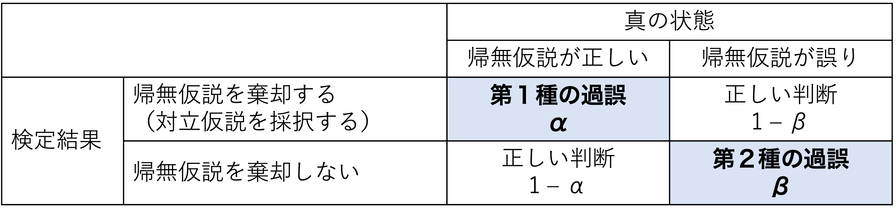

```{r, include=FALSE}
knitr::opts_chunk$set(echo = TRUE)
library(tidyverse)
library(knitr)
set.seed(1234)
```

# 統計的仮説検定

統計的仮説検定の考え方とそれが抱える問題について理解する。

* 統計的仮説検定の考え方（p値とは何か？）
* 第1種の過誤と第2種の過誤
* p値とサンプル数との関係


## 準備

この章でも，tidyverseパッケージを使う。予めロードしておく。

```{r, echo=TRUE, eval = FALSE, message=FALSE, warning=FALSE}
library(tidyverse)
```

## 統計的仮説検定の考え方

前の章で学んだ二項分布を用いて，統計的仮説検定の考え方について学ぶ。p値とは何なのかを理解する。

### 二項分布の復習

コインを10回投げて表が出た回数$x$をカウントしていく。”理論的”には，表が$x$回出る確率$P(x)$は，コインを投げる回数$n$と表が出る確率$q$をパラメータとする二項分布に従う。

$$
P(x) = {}_n\mathrm{C}_xq^{x}(1-q)^{(n-x)}\\
x \sim Binomial(n, q)
$$

```{r dbinom_2_plot, echo=TRUE}

plot = data.frame(x=0:10, p=dbinom(x=0:10, size=10, prob=0.5))

ggplot2::ggplot() + 
  geom_bar(data=plot, aes(x=factor(x), y=p), stat="identity") + 
  labs(y = "P(x)", x ="x")
```


### 統計的仮説検定

”理論的には”，表が出る回数$x$が生じる確率は上の図のようになる（平均は$nq = 10*0.5 = 5$）。  
  
では，実際にコインを10回投げてみて表が出た回数を数えてみたところ，表が2回しか出なかったとする。この結果から，「このコインには歪みがあって，片一方の面だけが出やすい」と言ってもよいのか？  
  
これを検討するために，表と裏それぞれが出る確率の等しいコインを投げる場合（すなわち，$q=0.5$の場合）との比較を行い，今回の実験結果がどれくらいまれな事象と言えるのかを比較する。  
このとき，研究者が検証したい仮説を**対立仮説（alternative hypothesis）**，対立仮説を検証するために比較の対象とする「偏りを仮定しない」仮説のことを**帰無仮説(null hypothesis)**と呼ぶ。  
  
  
では，今回の帰無仮説となる二項分布（2つのパラメータが，$n=10, q=0.5$の場合)の分布を見てみよう。理論的には，表が$x$回出る確率$P(x)$は，$x$それぞれについて以下のようになる。

```{r dbinom}
d = data.frame(x=0:10, p_x =dbinom(x=0:10, size=10, prob=0.5))
d
```

表もしくは裏が出る回数が2回以下の場合の確率を計算すると，

```{r dbinom2}
d$p_x[1] + d$p_x[2] + d$p_x[3] + d$p_x[9] + d$p_x[10] + d$p_x[11]
```

となる。つまり，もし歪みのないコインならば，片一方の面だけが出る回数が2回以下の確率はおおよそ`r round(d$p_x[1] + d$p_x[2] + d$p_x[3] + d$p_x[9] + d$p_x[10] + d$p_x[11], 2)`ということになる。  
  
この例で求めた確率`r round(d$p_x[1] + d$p_x[2] + d$p_x[3] + d$p_x[9] + d$p_x[10] + d$p_x[11], 2)`のように，「帰無仮説の前提のもとで，特定の実験結果が得られる確率」を**p値**と呼ぶ。  
    
p = `r round(d$p_x[1] + d$p_x[2] + d$p_x[3] + d$p_x[9] + d$p_x[10] + d$p_x[11], 2)` は小さい確率のように思える。なので，「歪みのないコインならば，一方の面が2回出る確率は本来`r round(d$p_x[1] + d$p_x[2] + d$p_x[3] + d$p_x[9] + d$p_x[10] + d$p_x[11], 2)`である。本来だったらあまり起こり得ない実験結果が得られたので，このコインは歪みのないコインであると結論づけるのは自然ではない。ゆえに，このコインには歪みがあって片一方の面が出やすい」という結論を出すのが妥当なように思える。  
  
しかし，人によって`r round(d$p_x[1] + d$p_x[2] + d$p_x[3] + d$p_x[9] + d$p_x[10] + d$p_x[11], 2)`を小さいと評価しても良いのか，基準が分かれる。そこで，研究者の間でどこまでの数値を小さいと評価するかの基準が決まっている。この基準となる確率が，**有意水準**である。  
  
一般的に有意水準には0.05（5%）とされることが多い。ただし，なぜ5％を判断基準とするのかについては特に明確な理由はない（みんなから合意されているからという以上の理由はない）。  
  
つまり，「帰無仮説（フェアなコインを投げる）の前提のもとでは，表が出る回数が2回以下の確率は`r round(d$p_x[1] + d$p_x[2] + d$p_x[3] + d$p_x[9] + d$p_x[10] + d$p_x[11], 2)`  であった。これは小さい確率のように思えるが，判断基準の5％よりかは大きい。すなわち，このコインはゆがんでいると結論付ける訳にはいかない」ことになる。
  
以上が，**統計的仮説検定**の考え方である。まとめると，  
1)ある特定の理論分布（帰無仮説）のもとで今回の実験結果が生じる確率（p値）を求め，  
2)その確率が小さいかを評価し，  
3)小さい場合は帰無仮説を棄却する  
というのが，統計的仮説検定のプロセスである。
  

*** 
今回のように「コインが表か裏かに関わらず，一方の面だけが出やすい」という対立仮説を検討する場合の検定は，**両側検定**という。仮に，今回の仮説で表と裏を区別するとして「表が出にくい」つまり「表が出る回数が2回以下の確率」を対象とする場合，このような検定を**片側検定**という。二項分布は左右対称の分布なので，両側p値は片側p値の2倍の値である(厳密には左右対称ではないのであくまで近似値)。多くの場合，両側検定を使うのが一般的である。  
*** 

## 統計的仮説検定の種類

### 二項検定

コイン投げの例は，二項分布に従う事象である。二項分布に従う事象の統計的仮説検定は，**二項検定**と呼ばれる。

Rにも，二項検定を行うための関数`binom.test()`が用意されている。

`binom.test()`に二項分布のパラメータ（$n$と$q$にあたる数値）と実験結果を入れると，p値を求めてくれる。  
  
上の例について，`binom.test()`でp値を求めてみよう。

```{r}

binom.test(x = 2, n = 10, p = 0.5) #出てくる結果はデフォルトで両側検定になる。

```


### t検定

心理統計では，2つのグループの間で平均値に差があるかどうかの統計的仮説検定として，t検定を使うことが多い。連続量の変数を扱う検定の場合は，t検定がよく使われる。
  
t検定の考え方も，基本的に上と同じである。2つの集団の間で平均値に差がないと仮定したときの理論分布（t分布）と比べて，実際に得られた値がどれくらい珍しいのかを検討する。
  
Rにも，t検定を行うための関数`t.test()`が標準で入っている。  
  
まず，以下のプログラムを実行して，サンプルデータを作る。

```{r}
set.seed(1)
Value = c(rnorm(n = 10, mean = 0, sd = 1), rnorm(n = 10, mean = 1, sd = 1))
Treatment = c(rep("X", 10), rep("Y", 10))
sample_data = data.frame(Treatment = Treatment, Value = Value)

str(sample_data)

```

実験でXとYの２つの条件(`Treatment`)を設定し，ある値（`Value`）を測定したとする。  
まず，2つの条件別に`Value`の平均値や標準偏差を求める。

```{r}

sample_data %>% group_by(Treatment) %>%
  summarise(Mean = mean(Value), SD = sd(Value), N = length(Value))

```

条件Yの方が条件Xよりも平均値が大きいよう見えるが，そう結論づけて良いのか。これをt検定で検討しよう。  
  
まず，2つの集団間の平均値の差を元に，以下の式から「t値」を求める。

$$
t = \frac{\bar{X} - \bar{Y}}{\sqrt{\sigma^2_{X}/n_{X}+\sigma^2_{Y}/n_{Y}))}}
$$
$\bar{X}$と$\bar{Y}$はそれぞれ条件Xと条件Yの平均値，$\sigma^2_{X}$と$\sigma^2_{Y}$はそれぞれ条件Xと条件Yの分散，$n_{X}$と$n_{Y}$はそれぞれ条件Xと条件Yのサンプル数である。  
  
XとYが同じ正規分布$Normal(\mu, \sigma^2)$から抽出される場合，t値は自由度$n_{X}+n_{Y}-2$のt分布に従う。  
つまり，同じ平均値を持つ母集団からXとYが抽出された（つまり，$\bar{X} = \bar{Y}$のとき）と仮定した上でp値を求め，今回のデータが得られる確率がどのくらいまれであるかを検討する。  
  
Rの`t.test()`関数を使って実験データの情報を入力すれば，p値を求めてくれる。

```{r}

t.test(data = sample_data, Value ~ Treatment) #dataにデータの名前，比較の対象となる変数~グループを意味する変数とうかたちで入力すると結果が出力される。

```

p値は`r round(t.test(data = sample_data, Value ~ Treatment)$p.value,2)`であった。これは5%よりも小さいので，「今回の結果が生じる確率はまれである。XとYの母集団の平均値は等しいちう帰無仮説を棄却し，XとYは平均値が異なる集団を母集団とする」と結論づけることになる。


*** 
t検定には，2つの標本の母集団の分散が等しいと仮定するかしないかで二種類の検定がある。母集団の分散が等しいと*仮定しない*場合の検定はウェルチの検定(Welch's t-test)と呼ばれ，Rの`t.test()`関数でデフォルトで出る検定結果はこのウェルチの検定による結果である。一般的に2つの標本の母分散は不明であるので，それらが等しいかどうかも不明である。なので，等分散を仮定しないt検定をしておくほうが保守的である。  

*** 


## 統計的仮説検定で重要な概念

### 第1種の過誤と第2種の過誤

「帰無仮説が真なのに，帰無仮説を棄却してしまう誤り」のことを，**第1種の過誤（type Ⅰ error）**という。つまり，「本当は差がないのに，”差がある”と判断してしまう誤り」のことである。  
これに対し，「帰無仮説が偽なのに，帰無仮説を採択してしまう」誤りのことを，**第2種の過誤（type Ⅱ error）**という。つまり，「本当は差があるのに，”差がない”と判断してしまう誤り」のことである。  
  
第1種の過誤を犯す確率$\alpha$は，要は有意水準の値そのものである（$\alpha=0.05$）。有意水準を高くする，すなわち「差があると判断する基準をゆるく」してしまうと，誤った仮説を採用してしまう恐れが増えてしまう。    
      
第2種の過誤を犯す確率を$\beta$と表現する。$1 - \beta$は**検定力**と呼ばれ，検定力とは「帰無仮説が偽であるときに，正しく帰無仮説を棄却する確率」のことをいう。つまり，差があるときに，”差がある”と正しく判断できる確率である。統計的仮説検定では，この検定力をいかに高く保つかが重要となる。  


  


第1種の過誤と第2種の過誤はトレード・オフの関係にある。第1種の過誤を避けようとして有意水準を小さくすれば（例えば$\alpha=0.001$とする）帰無仮説の棄却が厳しくなり，逆に第2種のエラーを犯してしまう確率も高くなる（帰無仮説が偽であるにもかかわらず，棄却しない）。


## 統計的仮説検定が抱える問題

以下に，統計的仮説検定を行う上で留意すべき問題をいくつか示す。

### p値と標本数の関係

p値は標本数に依存する。標本数が多くなるほどp値は小さくなる。  
  
再び，コイン投げの例に戻る。先程の例では，コインを10回投げて2回表が出たケースについて二項検定で評価をしたが，今度は100回コインを投げて20回表が出た場合についても二項検定をしてみよう。どちらのケースも，表が出る割合は0.2で等しい。  
  
`binom.test()`関数で，「フェアなコインの場合と比べてこのコインはゆがんでいるか」を検討してみよう。


```{r}

binom.test(x = 2, n = 10, p = 0.5)  #表が出る確率0.5のコインを10回(n=10)なげて，2回(x=2)表が出た
binom.test(x = 20, n = 100, p = 0.5)#表が出る確率0.5のコインを100回(n=100)なげて，20回(x=20)表が出た

```

100回コインを投げたケースについては，p値が`r binom.test(x = 20, n = 100, p = 0.5)$p.value`と非常に小さい値となった。  
  
二項分布$Binomial(n = 100, q = 0.5)$のグラフも確認してみよう。$x < 20$が非常に小さい確率であることがグラフからもわかる。

```{r}
plot = data.frame(x=0:100, p=dbinom(x=0:100, size=100, prob=0.5))

ggplot2::ggplot() + 
  geom_bar(data=plot, aes(x=factor(x), y=p), stat="identity") + 
  scale_x_discrete(breaks = seq(0,100,10)) +
  labs(y = "P(x)", x ="x")
```


「有意ではない（$p > 0.05$）」というのは，**「差がない」ということを意味しているわけではない**。差自体は常に存在する（今回の実験結果0.2とフェアなコインの結果0.5の間には，0.3という差が存在する）。統計的仮説検定で評価するのは，その差が意味のある差かどうかである。  
    
少ない標本数では，珍しい結果が生じることもありえる。10回投げた程度では，その差が意味のある差かどうかが，標本数が少なすぎて判断できない。  
    
逆に，実質意味のない差であっても，標本数が多ければ統計的に有意な差（$p < .05$）が得られてしまう。もっと極端に，10,000回コインを投げて，表が出た回数が4,900回だった場合（つまり表が出る割合は0.49）を考えてみよう。このコインがフェアなコインよりも歪んでいるかを検定してみると，有意（$p < .05$）な結果が得られる。

```{r}
n = 10000
x = 0.49 * n
binom.test(x = x, n = n, p = 0.5)

```

しかし，0.49と0.50の差，すなわち1%の違いを意味のある差と判断してよいのだろうか？  
  
このように，統計的仮説検定には差の有無の評価が標本数に依存する。実質意味のない大きさの差でも，場合によっては「有意な差がある」と結論付けられてしまうときもある。  
  
統計的仮説検定で検討しているのは，**差の大きさ（効果の大きさ）ではない**ということには注意が必要である。
  
***

効果の大きさそのものを表す指標として，**効果量（Effect size）**というものも提案されている。詳細については別の文献を参照してほしいが，例えば，相関係数$r$も効果の大きさ（2変数の関連の強さ）を示す効果量の一つである。

***

  
### 多重比較の問題

統計的仮説検定を繰り返すほど，差がなくても差があると評価してしまう確率（第1種の過誤を犯す確率）は増える。
例えば，5%水準で10回検定を行えば，少なくとも1回は帰無仮説を誤って棄却してしまう確率が`r round(1 - (1 - 0.05)^10, 2)`  になる。

```{r}

1 - (1 - 0.05)^10 #全ての確率から，「10回検定を行って全て正しい判断を行う」確率を差し引いたものが，「少なくとも1回は誤った判断をしてしまう確率」

```

このように複数回検定を行うことを**多重比較**という。分散分析で3つ以上の条件間で平均値を比較するときなど，検定を複数行う場合は多重比較の補正が必要とされる（8章で触れる）。  


## 確認問題{-}


### 問１{-}


以下のプログラムを読み込む。  
  
ある教授法に児童の学力向上の効果があるかを検討した。学校Bにはその教授法を実施し，学校Aには何もしなかった。その後，学校Aと学校Bそれぞれ10人の生徒に学力テストを行った。A，Bそれぞれが学校A，Bそれぞれの生徒の成績である（架空のデータである）。


```{r}

A = c(38, 53, 61, 27, 54, 55, 44, 45, 44, 41)
B = c(48, 40, 43, 56, 69, 53, 47, 41, 42, 91)
Value = c(A, B)
Treatment = c(rep("A", 10), rep("B", 10))
sample = data.frame(Treatment = Treatment, Value = Value)

str(sample)

```

学校Aと学校Bそれぞれについて，テストの得点の平均値及び標準偏差を求めて報告せよ。  
この教授法に成績向上があったかどうかについてt検定（等分散を仮定しない）で検討し，結果について報告するとともに結論を述べよ。  
  
※`t.test()`関数を使う。等分散を仮定しない検定の場合は，特にオプションをしていしないでもよい。 

