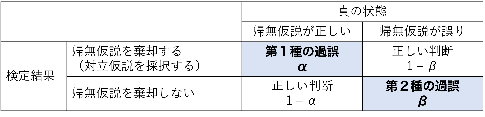

```{r, include=FALSE}
knitr::opts_chunk$set(echo = TRUE)
library(ggplot2)
library(knitr)
library(patchwork)
library(pwr)
set.seed(1234)
```

# 統計的仮説検定が抱える問題{#chap08_SNHTproblems}

統計的仮説検定が抱える問題について理解する。

-   p値とサンプルサイズの関係  
-   効果量  
-   第1種の過誤、第2種の過誤  
-   検出力  
  
この章では乱数を用いたシミュレーションを通して、サンプルサイズ、効果量、p値のそれぞれの関係について理解していく。

## 準備{#chap08_preparation}

この章では、`ggplot2`、`pwr`パッケージを使う。

```{r, echo=TRUE, eval = FALSE, message=FALSE, warning=FALSE}
library(ggplot2)
library(pwr)

```

## シミュレーション{#chap08_SNHTsims}

正規分布を母集団とする２つのグループA, Bがあるとする。グループAの正規分布は平均$\mu_{A}$、標準偏差$\sigma_{A}$、グループBの正規分布は平均$\mu_{B}$、標準偏差$\sigma_{B}$とする。それぞれのグループから$n$個のサンプルを抽出するとする。  
  
`rnorm()`関数を使って、正規分布から乱数を生成する。以下は、平均及び標準偏差が同じ($\mu_{A} = \mu_{B} = 0, \sigma_{A} = \sigma_{B} = 0$)グループAとBから20個ずつサンプルを抽出したシミュレーションの例である。


```{r}

set.seed(1) #乱数の種の設定。これに任意の数値を設定しておけば同じ結果が再現できる。
N = 20
g_A = rnorm(n = N, mean = 0, sd = 1) 
g_B = rnorm(n = N, mean = 0, sd = 1) 
d = data.frame(group = c(rep("A", N), rep("B", N)), value = c(g_A, g_B)) #データフレームdとして保存
head(d)
t.test(data = d, value ~ group) #グループの間でvalueの平均値に差があるかをt検定で検定

```

### 関数の作成{#chap08_function}

上記のプログラムを毎回書き直すのも大変なので、**関数(function)**を作成して手順を簡略化する。  
  
グループA,
Bのサンプルサイズ、平均、標準偏差を任意のものに設定して上記の一連のプログラムをできるように、関数`simulation_p`を自作する。以下のプログラムを全て実行する。
実行すると、RStudioの右ウィンドウ「Environmment」の「Functions」に、`simulation_p`が表示される。

```{r}

simulation_p = function(N, mu_A, sigma_A, mu_B, sigma_B){
  g_A = rnorm(n = N, mean = mu_A, sd = sigma_A) 
  g_B = rnorm(n = N, mean = mu_B, sd = sigma_B) 
  d = data.frame(group = c(rep("A", N), rep("B", N)), value = c(g_A, g_B)) 
  result = t.test(data = d, value ~ group) #t検定の結果
  return(result)
  }

```

以下はグループAの母集団の平均値を0かつ標準偏差を1($\mu_{A} = 0, \sigma_{A} = 1$)、
グループBの母集団の平均値を1かつ標準偏差を1($\mu_{B} = 1, \sigma_{A} = 1$)として、それぞれのグループから100個($n=100$)のサンプルを抽出し、t検定を行った結果である。

```{r}

set.seed(1)
simulation_p(N = 100, 
             mu_A = 0, sigma_A = 1, 
             mu_B = 1, sigma_B = 1)

```

以降では、この関数を使ってサンプルサイズやグループAとBの平均値の差を変えてシミュレーションを行い、p値がどう変化するかを見ていく。

## p値とサンプルサイズの関係{#chap08_pvalue}

p値はサンプルサイズ（標本数）に依存する。サンプルサイズが多くなるほどp値は小さくなる。

例えば、平均0, 標準偏差1の正規分布に従う母集団Aと平均0.2, 標準偏差1の正規分布に従う母集団Bからそれぞれ標本を抽出し、AとBの間で平均値に差があるかを検討する。帰無仮説$H_{0}:\mu_{A} - \mu_{B} = 0$が棄却されるかをt検定で検定する。\
実際の母集団の真の平均値の差は$|0-0.2|=0.2$である。

図で表してみると、分布はほとんど重なりあっていて2つのグループの平均値の間にあまり差がなさそうに見える。

```{r, include=FALSE}

x = seq(-3, 3, 0.05)

y_1 = dnorm(x=x, mean=0, sd=1) 
y_2 = dnorm(x=x, mean=0.2, sd=1) 

dat_norm_1 = data.frame(group = "A", x = x, y = y_1)
dat_norm_2 = data.frame(group = "B", x = x, y = y_2)
d_pop = rbind(dat_norm_1, dat_norm_2)

p = ggplot2::ggplot() + 
  ggplot2::geom_line(data = d_pop, aes(x = x, y = y, color = group)) + 
  ggplot2::labs(y = "value", x = "", color = "population") + theme_classic()
p


```

先ほど作成した`simulation_p`関数を使って、シミュレーションをしてみよう。まずは、それぞれのグループから100個サンプルを抽出してt検定を行ってみる。

```{r}
set.seed(1)
result = simulation_p(N = 100, 
             mu_A = 0, sigma_A = 1,
             mu_B = 0.2, sigma_B = 1
             )
result

```

p値は`round(result$p.value, 3)`であり、有意水準5%とすると有意な差があるという結論は出ない。つまり、10人ずつ標本を抽出したこの結果からは、帰無仮説$H_{0}:\mu_{A} - \mu_{B}=0$を棄却することはできない。

次に、同じ平均値の差で、各グループそれぞれ500個, 500個標本を抽出してt検定をしたシミュレーション結果を見てみよう。

```{r}
set.seed(1)
result = simulation_p(N = 500, 
             mu_A = 0, sigma_A = 1,
             mu_B = 0.2, sigma_B = 1
             )
result
```

今度は、p値が0.05よりも小さい。500人ずつ標本を抽出したこの結果からは、帰無仮説$H_{0}:\mu_{A} - \mu_{B}=0$は棄却され、AとBとの間に平均値に有意な差があるという結論が導かれる。  
  
更に、1,000個ずつサンプルしてt検定をした結果もみてみよう。

```{r}
set.seed(1)
result = simulation_p(N = 1000, 
             mu_A = 0, sigma_A = 1,
             mu_B = 0.2, sigma_B = 1
             )
result
```

p値は更に小さくなり、AとBとの間に平均値に有意な差があるという結論が導かれる。  
  
しかし、サンプルサイズが100個、500個、1,000個いずれのシミュレーションも、母集団の平均値差は0.2である。  
  
このように、**p値はサンプルサイズが大きくなるほど小さくなる**という性質がある。実質的にあまり大きくない差でも、サンプルを多く取れば「有意な差がある」と結論が出てしまう可能性がある。

異なるグループから標本を抽出したのならば、平均値に差が存在しないということはありえない。どんなに小さくても、差は存在する(差の大きさが0.00001でも)。小さい標本では、わずかな差は誤差として評価されて「有意差がある」という結論は導かれにくい。しかし、サンプルサイズを大きくすることで差を検出しやすくなる。

すなわち、p値が示しているのは**差の大きさ（効果の大きさ）ではない**。

## 効果量（差の大きさとp値の関係）{#chap08_EffectSize}

そこで、平均値の差のように、効果の大きさそのものを表す指標が別にある。**効果量（effect size）**と呼ばれるものである。効果量には様々な種類が提案されている。  
  
例えば、2グループ間の差を表す効果量として**Cohenのd (Cohen's d)**という指標がある。Cohenの dは，以下の式で計算される。$n$はそれぞれのグループ（ここでは、AもしくはB）のサンプルサイズ、$\bar{x}$はそれぞれのグループの標本平均，$s_{A}^2$と$s_{B}^2$はそれぞれ2群の不偏分散とする。$s$は2群を合成した上での標準偏差を意味する。

$$
d = \frac{|\bar{x_{A}} - \bar{x_{B}|}}{s} \\
s = \sqrt{\frac{(n_{A}-1)s_{A}^2 + (n_{B}-1)s_{B}^2}{n_{A}+n_{B}}}
$$

つまり、Cohenのdは２つのグループの平均値の差を標準偏差で調整したものである。一般的に、$d=0.2$は小さい効果、$d=0.5$が中程度の効果、$d=0.8$が大きい効果として理解されている。このように、指標によって効果の大きさの基準が決まっている。
  
以下に`simulation_p`を使って、サンプルサイズを100個で固定したうえで、差の効果量(d)を変化させたシミュレーションを行う。


```{r}
set.seed(1)
result = simulation_p(N = 100, 
             mu_A = 0, sigma_A = 1,
             mu_B = 0.2, sigma_B = 1
             )
result

result = simulation_p(N = 100, 
             mu_A = 0, sigma_A = 1,
             mu_B = 0.5, sigma_B = 1
             )
result

result = simulation_p(N = 100, 
             mu_A = 0, sigma_A = 1,
             mu_B = 0.8, sigma_B = 1
             )
result
```

効果量が大きいほど、同じサンプルサイズでも有意な差が検出しやすくなる。  
  
他にも、効果量には様々な種類がある。相関係数も係数の値が２変数間の関連の大きさを表すので、効果量の仲間である。  


## 第1種の過誤と第2種の過誤{#chap08_Type12Erros}

例えば、２つの集団AとBの間で平均値に差があるかどうかを検定する。帰無仮説$H_{0}$（母集団AとBの平均は等しい）と対立仮説$H_{1}$（母集団AとBの平均の間に差がある）を以下のように表す。

$$
H_{0}: \mu_{A} - \mu_{B}=0\\
H_{1}: \mu_{A} - \mu_{B}\neq0\\
$$

「帰無仮説が真なのに、帰無仮説を棄却してしまう（本当は差がないのに、"差がある"と判断してしまう）」の誤りのことを、**第1種の過誤（type Ⅰ error）**と呼ぶ。\
これに対し、「帰無仮説が偽なのに、帰無仮説を棄却しない（本当は差があるのに、"差がない"と判断してしまう）」誤りのことを、**第2種の過誤（type Ⅱ error）**と呼ぶ。

第1種の過誤を犯す確率$\alpha$は、要は有意水準として設定した値そのものである（$\alpha=0.05$）。有意水準を高くする、すなわち「差があると判断する基準をゆるく」してしまうとより帰無仮説を棄却しやすくなってしまう。それは同時に、「帰無仮説を誤って棄却してしまう」可能性を高めてしまう。

第2種の過誤を犯す確率は、$\beta$と表現される。

それぞれの関係をまとめると、以下のように表現できる。



```{r echo=FALSE, warning=FALSE, message=FALSE}

effect_size = function(x_min = -10, x_max = 10, a = 0.05, delta = 1, sd = 1){
  
  alpha = qnorm(p = 1 - a/2, mean = 0, sd = sd)
  d_H_0 = data.frame(x = seq(x_min, x_max, 0.01), 
                   y = dnorm(seq(x_min, x_max, 0.01), mean = 0, sd = sd), hyp ="H0")
  d_alpha = data.frame(x = seq(alpha, x_max, 0.01), 
                   y = dnorm(seq(alpha, x_max, 0.01), mean = 0, sd = sd))

  d_H_1 = data.frame(x = seq(x_min, x_max, 0.01), 
                   y = dnorm(seq(x_min, x_max, 0.01), mean = delta, sd = sd), hyp ="H1")
  d_beta = data.frame(x = seq(x_min, alpha, 0.01), 
                     y = dnorm(seq(x_min, alpha, 0.01), mean = delta, sd = sd))
  d_power = data.frame(x = seq(alpha, x_max, 0.01), 
                      y = dnorm(seq(alpha, x_max, 0.01), mean = delta, sd = sd))
  
  d_H = rbind(d_H_0, d_H_1)
  return(list(d_H, d_power, d_alpha, d_beta))
}

```

例えば、以下に帰無仮説と対立仮説との関係のイメージを図で示している。２つの集団の母集団の平均値の差の効果量を$d$とし、帰無仮説$H_{0}: d = 0$と対立仮説$H_{1}: d > 0$とした場合の分布を示している（単純化のため片側検定とする）。

```{r echo=FALSE, warning=FALSE, message=FALSE}

#baseline
plot_d = effect_size(x_min = -10, x_max = 10, a = 0.05, delta = 2, sd = 1)
p_1 = ggplot()+
  geom_line(data = plot_d[[1]], aes(x = x, y = y, color = hyp)) +
  geom_area(data = plot_d[[3]], aes(x = x, y = y), fill = "red", alpha = 0.8) + 
  geom_area(data = plot_d[[4]], aes(x = x, y = y), fill = "blue", alpha = 0.8) + 
  scale_color_manual(values = c("red", "blue")) +
  xlim(c(-4, 6.5)) +
  labs(x = "d", y = "density", color = "Hypothesis") +
  theme_classic(base_size = 12) + theme(legend.position = "top")
p_1

```

差$d$が赤い部分に当てはまるときは、帰無仮説を棄却することとなる。同時に、赤い部分は第1種の過誤を犯す確率$\alpha$を意味する。逆に、差$d$が青い部分に含まれるときは、対立仮説の分布にも含まれているにも関わらず帰無仮説を棄却しないことを意味する。すなわち、青い部分が第２種の過誤を犯す確率$\beta$を意味する。

第1種の過誤と第2種の過誤はトレード・オフの関係にある。第1種の過誤を避けようとして有意水準を小さくすれば帰無仮説の棄却が厳しくなり、逆に第2種のエラーを犯してしまう確率も高くなる（帰無仮説が偽であるにもかかわらず、棄却しない）。\
例えば、以下の左図が$\alpha = 0.05$のとき、右図が$\alpha = 0.01$の場合である。右図は左図と比べて赤い部分（$\alpha$）が小さくなった一方、青い部分（$\beta$）が大きくなっているのがわかる。

```{r echo=FALSE, warning=FALSE, message=FALSE}

##alphaを下げると？（type 1エラーを小さくする）➔betaが増える（逆にtype 2errorが増えてしまう）
plot_d = effect_size(x_min = -10, x_max = 10, a = 0.01, delta = 2, sd = 1)
p_0 = ggplot()+
  geom_line(data = plot_d[[1]], aes(x = x, y = y, color = hyp)) +
  #geom_area(data = plot_d[[2]], aes(x = x, y = y), fill = "green", alpha = 0.8) + 
  geom_area(data = plot_d[[3]], aes(x = x, y = y), fill = "red", alpha = 0.8) + 
  geom_area(data = plot_d[[4]], aes(x = x, y = y), fill = "blue", alpha = 0.8) + 
  scale_color_manual(values = c("red", "blue")) +
  xlim(c(-4, 6.5)) +
  labs(x = "d", y = "density", color = "Hypothesis") +
  theme_classic(base_size = 12) + theme(legend.position = "top")

p_1_1 = p_1 + theme(legend.position = "none")
p_0_1 = p_0 + theme(legend.position = "none")

p_1_1 + p_0_1

```

以下の図は、第1種の過誤$\alpha$（有意水準）と第2種の過誤$\beta$との関係を示したものである。$d$は2グループ間の差の効果量を意味する。それぞれのグループのサンプルサイズは50としている（縦の赤い点線が$\alpha = 0.05$の場合）。$\alpha$と$\beta$は一方が増えれば、もう一方が減る関係にあることがわかる。

```{r echo=FALSE, warning=FALSE, message=FALSE}

#第1種の過誤と第2種の過誤の関係（n = 50で固定）
sim_d = data.frame()
for(delta in c(0.2, 0.5, 0.8)){
  for(alpha in seq(0.001, 0.10, 0.001)){
    result = power.t.test(n = 50, delta = delta, sd = 1, sig.level = alpha)
    type_2 = 1 - result$power
    sim_d = rbind(sim_d, data.frame(alpha, delta, type_2))
  }
}

ggplot()+
  geom_line(data = sim_d, aes(x = alpha, y = type_2, linetype = factor(delta))) + 
  geom_vline(aes(xintercept = 0.05), linetype = "dotted", color = "red") + 
  labs(x = "alpha", y = "beta", linetype = "d") + 
  theme_classic()
```

## 検出力{#chap08_Power}

帰無仮説が偽（対立仮説が正しい）のときに帰無仮説を棄却するのが、正しい判断である。さきほどの表でも示しているように、このときの確率は$1 - \beta$で表すことができる。この$1 - \beta$は**検出力(power)**と呼ばれる。以下の図でいうと、対立仮説の分布全体から、青い部分（$\beta$）を差し引いたところが検出力を示している。

```{r echo=FALSE, warning=FALSE, message=FALSE}

#baseline
plot_d = effect_size(x_min = -10, x_max = 10, a = 0.05, delta = 2, sd = 1)
p_1 = ggplot()+
  geom_line(data = plot_d[[1]], aes(x = x, y = y, color = hyp)) +
  geom_area(data = plot_d[[2]], aes(x = x, y = y), fill = "green", alpha = 0.8) + 
  geom_area(data = plot_d[[3]], aes(x = x, y = y), fill = "red", alpha = 0.8) + 
  geom_area(data = plot_d[[4]], aes(x = x, y = y), fill = "blue", alpha = 0.8) + 
  scale_color_manual(values = c("red", "blue")) +
  xlim(c(-4, 6.5)) +
  labs(x = "d", y = "density", color = "Hypothesis") +
  theme_classic(base_size = 12) + theme(legend.position = "top")
p_1

```

検出力とは、「実際に差があるときに、"差がある"と正しく判断できる確率」である。統計的仮説検定では、この検出力をいかに高くするかが重要となる。

### 検出力に影響する要因{#chap08_Power1}

検出力は、**サンプルサイズが大きいほど**、または**効果量が大きいほど**上昇する。

以下の図は、サンプルサイズを変えたときの検出力の変化を示したものである。右図は、左図よりも2つの集団A, Bそれぞれのサンプルサイズを大きくした場合である。サンプルサイズを大きくすると分布が狭くなる（標準誤差が小さくなる）ので、差を検出しやすくなる。

```{r echo=FALSE, warning=FALSE, message=FALSE}

plot_d = effect_size(x_min = -10, x_max = 10, a = 0.05, delta = 2, sd = 0.6)
p_3 = ggplot()+
  geom_line(data = plot_d[[1]], aes(x = x, y = y, color = hyp)) +
  geom_area(data = plot_d[[2]], aes(x = x, y = y), fill = "green", alpha = 0.8) + 
  geom_area(data = plot_d[[3]], aes(x = x, y = y), fill = "red", alpha = 0.8) + 
  geom_area(data = plot_d[[4]], aes(x = x, y = y), fill = "blue", alpha = 0.8) + 
  scale_color_manual(values = c("red", "blue")) +
  xlim(c(-4, 6.5)) +
  labs(x = "d", y = "density", color = "Hypothesis") +
  theme_classic(base_size = 12) + theme(legend.position = "top")

p_1_1 = p_1 + theme(legend.position = "none")
p_3_1 = p_3 + theme(legend.position = "none")

p_1_1 + p_3_1

```

以下の図は、効果量を変えたときの検出力の変化を示したものである。右図は、左図よりも母集団AとBとの差（効果量）が大きい場合である。効果量が大きいほど、統計的仮説検定で有意な差を検出しやすくなる。

```{r echo=FALSE, warning=FALSE, message=FALSE}

plot_d = effect_size(x_min = -10, x_max = 10, a = 0.05, delta = 4, sd = 1)
p_2 = ggplot()+
  geom_line(data = plot_d[[1]], aes(x = x, y = y, color = hyp)) +
  geom_area(data = plot_d[[2]], aes(x = x, y = y), fill = "green", alpha = 0.8) + 
  geom_area(data = plot_d[[3]], aes(x = x, y = y), fill = "red", alpha = 0.8) + 
  geom_area(data = plot_d[[4]], aes(x = x, y = y), fill = "blue", alpha = 0.8) + 
  scale_color_manual(values = c("red", "blue")) +
  xlim(c(-4, 6.5)) +
  labs(x = "d", y = "density", color = "Hypothesis") +
  theme_classic(base_size = 12) + theme(legend.position = "top")

p_1_1 = p_1 + theme(legend.position = "none")
p_2_1 = p_2 + theme(legend.position = "none")

p_1_1 + p_2_1

```

以下の図は、サンプルサイズ、効果量及び検出力の関係をまとめた図である。有意水準$\alpha = 0.05$としている（横の赤い点線が、一般的に必要とされる検出力$\beta = 0.80$である）。サンプルサイズが増えるほど検出力は上昇し、効果量が大きいほど検出力も上昇する。

```{r echo=FALSE, warning=FALSE, message=FALSE}

#サンプルサイズと検出力の関係（alpha = 0.05で固定）
sim_d = data.frame()
for(delta in c(0.2, 0.5, 0.8)){
  for(n in 2:100){
    result = power.t.test(n = n, delta = delta, sd = 1, sig.level = 0.05)
    power = result$power
    sim_d = rbind(sim_d, data.frame(n, delta, power))
  }
}

ggplot()+
  geom_line(data = sim_d, aes(x = n, y = power, linetype = factor(delta))) + 
  geom_hline(aes(yintercept = 0.8), linetype = "dotted", color = "red") + 
  scale_y_continuous(breaks = seq(0, 1, 0.1)) + 
  labs(x = "sample size", y = "power (1 - beta)", linetype = "d") + 
  theme_classic()

```

## 検出力分析{#chap08_PowerTest}

これまで見てきたように、サンプルサイズ、p値、検出力、効果量はそれぞれ関わり合っている。

-   サンプルサイズが増えれば、p値は小さくなる。

-   サンプルサイズが増えれば、検出力は上昇する。

-   効果量が大きければ、検出力は上昇する。

事前に効果量、有意水準、検出力を決めておけば、有意な差を検出するために最低限必要なサンプルサイズを求めることができる。このようなサンプルサイズの設計方法は、**事前の検出力分析（prior power analysis）**という。\
＊効果量は事前に知ることはできないが（研究によって調べたいことそのものなので）、先行研究からこれくらいだろうという予想あるいはこのくらいの大きさを検出したいという期待によって決める。

また、データの取得後に、取ったサンプルサイズ、明らかになった効果量及び有意水準から、検出力を求めることができる。これを、**事後の検出力分析（post-hoc power analysis）**という。

`pwr`パッケージに、検出力分析をするための関数がいくつか用意されている。

```{r power_test}
#事前の検出力分析（サンプルサイズの設計）
#2群間の差をt検定で検定する場合
#各群のサンプルサイズ(n)，効果量（d: Cohen's d），有意水準（sig.level），検出力（power）のどれか３つを入れると，入れなかったものの結果が出力される。
pwr::pwr.t.test(d = 0.5, power = 0.8, sig.level = 0.05, n = NULL)


#事後の検出力分析
#２群それぞれのサンプルサイズ(n1, n2)，効果量(d), 有意水準(sig.level)を入れると，検出力が求められる。
pwr::pwr.t2n.test(n1 = 40, n2 = 40, d = 0.8, sig.level = 0.05, power = NULL)


```


## p値と第1種の過誤{#chap08_Type1P}

今度は、同じ平均0、標準偏差1の正規分布に従う母集団AとBから1000個ずつ標本を抽出しグループAとBの間で平均値に差があるかをt検定で検定する。帰無仮説は$H_{0}:\mu_{A} = \mu_{B}$であり、母集団の真の平均値差もゼロ（母集団AとBは全く同じ分布）なので帰無仮説が正しい。  
  
ここで、*帰無仮説が正しい前提のもとで抽出された標本*についてt検定を行い、統計的仮説検定によって正しい結論（帰無仮説を棄却しない）が導かれるかをシミュレーションしてみる。有意水準は、5%（0.05）とする。この章の最初で作成した`simulation_p`関数を使ってシミュレーションを行う。

```{r}

set.seed(1)
result = simulation_p(N = 1000, mu_A = 0, sigma_A = 1, mu_B = 0, sigma_B = 1)
result$p.value #p値を取り出す

```

$p \geq .05$であり、帰無仮説は棄却されない。

では、このシミュレーションを1,000回やってみる。以下のプログラムを実行してみよう。

```{r}

set.seed(1)
p = NULL
for(i in 1:1000){
    result = simulation_p(N = 1000, mu_A = 0, sigma_A = 1, mu_B = 0, sigma_B = 1)
    p = c(p, result$p.value)
}

head(p) #1,000回のシミュレーションで得られたp値をpという名前で保存した。head()で最初の数個のみを表示する。
```

1,000回のシミュレーション中、$p<.05$が得られた結果をカウントする。

```{r}

significant = ifelse(p < 0.05, "significant", "insignificant") #p<0.05ならば"significant（有意）", ちがうのならば"insignificant（非有意）"とする
table(significant) #有意、非有意の数を集計

```

帰無仮説が真である（母集団の間で差がない）にも関わらず、標本抽出してt検定をするのを1,000回行うと、$p<.05$となって帰無仮説を誤って棄却する結果が1,000回中`r `as.numeric(table(significant)[2])`回確認された。これは約5%で、有意水準5%と近似している。    
  
有意水準を5%に設定することはすなわち、全ての検定のうちの5%（1,000回中約50回）については誤って帰無仮説を棄却することを許してしまうのである（有意水準が第1種の過誤の確率そのものであることの理由）。有意水準は慣例的に0.05と設定されているが、上記のシミュレーションのようにたまたま有意な結果が得られて間違った結論を導いてしまう恐れが存在する。  
  
これを利用して、本当は差がないにもかかわらず「有意な差がある結果」を導くこともできる。**pハッキング(p-hacking)**とも表現される。

-   たくさん実験を行って，有意な差が出た結果だけを報告する。

-   たくさんの質問項目について個別に検定を行い、有意な結果だけについて議論する。

-   参加者を少しずつ追加して、追加した度に検定を行い、有意差が出たら追加するのをやめる。

## 多重比較の問題{#chap08_MultipeComparison}

上述のシミュレーションのように、統計的仮説検定を繰り返すほど、差がなくても差があると評価してしまう確率（第1種の過誤を犯す確率）は増える。 検定をn回行ったときに、「1回でも帰無仮説を誤って棄却してしまう確率」は以下の式で表すことができる（1から全て正しく帰無仮説を棄却しなかった確率を引く）。

$$
p(\text{Type 1 Error}) = 1 - (1 -\alpha)^n
$$

例えば、5%水準で10回検定を行えば、少なくとも1回は帰無仮説を誤って棄却してしまう確率が`r round(1 - (1 - 0.05)^10, 2)` になる。

```{r}

1 - (1 - 0.05)^10 #全ての確率から、「10回検定を行って全て正しい判断を行う」確率を差し引いたものが、「少なくとも1回は誤った判断をしてしまう確率」

```

このように複数回検定を行うことを**多重比較**という。多重比較を行うと、第1種の過誤を犯す確率が上昇する。以下は、検定の回数と「少なくとも1回は第1種の過誤を犯してしまう確率」との関係を有意水準$\alpha$別に示したものである。\
図からも、有意水準を厳しく設定すれば、第1種の過誤を回避することができる。そこで、分散分析で3つ以上の条件間で平均値を比較するときなどのように検定を複数行う場合には、有意水準を通常よりも厳し目に調整する**多重比較の補正**がなされる。

```{r}
alpha = 0.05
x = 1:20

m_c = function(x = 1:20, alpha = 0.05){
  p = 1 - (1 - alpha)^x  
  return(p)
}

d = rbind(
  data.frame(x = 1:20, p = m_c(alpha = 0.001), alpha = 0.001),
  data.frame(x = 1:20, p = m_c(alpha = 0.01), alpha = 0.01),
  data.frame(x = 1:20, p = m_c(alpha = 0.05), alpha = 0.05)
)

p = ggplot() + 
  geom_line(data = d, aes(x = x, y = p, linetype = factor(alpha), color = factor(alpha))) + 
  labs(x = "number of comparisons", y = "Type 1 error", linetype = "alpha", color = "alpha") +
  theme_classic()
p
```

## まとめ{#chap08_Summary}

この章では統計的仮説検定の結果を解釈するうえで注意すべき点について挙げてきた。  
以下に要点をまとめる。  

- サンプルサイズが大きくなるほど、同じ差でも小さいp値が出やすくなる。  
- p値は効果（差）そのものを表す指標ではない。効果の大きさを表す「効果量」という指標が別にある。  
- 有意水準は、第１種の過誤（本当は差がないのに、「有意差がある」と判断してしまうこと）を犯す確率と等しい。しかし、第１種の過誤を避けるために有意水準を小さくすると、第２種の過誤（本当は差があるのに、「有意差がない」と判断してしまうこと）も犯しやすくなる。  
- 正しく差を検出する確率を「検出力」と呼ぶ。効果量が大きいほど差を検出しやすくなるのはもちろんのこと、サンプルサイズが大きければ差を検出しやすくなる。  
- サンプルサイズ、効果量、有意水準、検出力はそれぞれ密接に関わっている。すなわち、効果量、有意水準、検出力があらかじめ決まっていれば、有意な差を検出するために最低限必要なサンプルサイズが求まる。このように必要なサンプルサイズを計算することを、検出力分析と呼ぶ。


