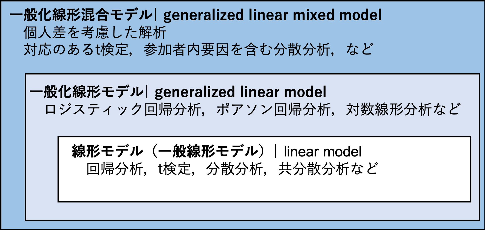

```{r, include=FALSE}
knitr::opts_chunk$set(echo = TRUE)
library(tidyverse)
set.seed(1234)
```

# 線形モデル

線形モデルについて学ぶ。  

* 一般化線形モデル
* 線形モデル

  
これまで学んできたいくつかの分析（t検定，分散分析，回帰分析）が，「線形モデル」という一つの枠組みで捉えることができることを理解する。
  
まず，一般化線形モデルの前に，**線形モデル**を学ぶ。線形モデルは，一般化線形モデルに含まれるものである。今後学ぶもの関係図を示すと，以下のようになる。


Figure: 一般化線形混合モデル，一般化線形モデル，線形モデルの関係図


## 一般化線形モデル

一般化線形モデルとは，データを線形の式で従属変数と独立変数の関係で表現したモデルのことをいう。  
  
一般化線形モデルを理解するには，「**線形予測子**」，「**誤差分布**」，「**リンク関数**」の３つの要素を知っておく必要がある。

### 線形予測子

従属変数と独立変数を表した式。いわゆる，「回帰式」である。

$$
\begin{equation}
  \hat{y} = \beta_{0} + \beta_{1} x \\
\end{equation}
$$

xを独立変数（説明変数），yを従属変数（応答変数または目的変数）と呼ぶ。独立変数は1個でなくても構わない。また，独立変数は質的変数でも量的変数でも構わない（その両方でもOK）。
線形予測子から，従属変数の予測値($\hat{y}$)を推定する。

### 誤差分布

従属変数の実際の値($y$)と従属変数の予測値($\hat{y}$)の誤差が従う確率分布のことをいう。

#### 確率分布の復習

確率分布の種類として，正規分布，二項分布，ポアソン分布などがあった。変数の種類によって，ある変数が従うだろうと仮定する確率分布が異なることを学んだ。  

* 例えば，連続量ならば正規分布，二値の値ならば二項分布，カウントデータ（非負の離散値）ならばポアソン分布というように，変数の特徴によって仮定する確率分布が異なる。


### リンク関数

線形予測子と従属変数との関係をリンクさせる関数。  
  
* 恒等リンク（線形予測子を変形せずにそのまま利用すること），logリンク，logitリンク関数などがある（誤差分布によってどのリンク関数を指定するかは大体定まっている）。  
    

#### 恒等リンクの場合{-}
    
$$
\begin{equation}
  \hat{y} = \beta_{0} + \beta_{1} x \\
\end{equation}
$$


#### logがリンク関数の場合{-}
    
$$
\begin{equation}
  \log\hat{y} = \beta_{0} + \beta_{1} x \\
\end{equation}
$$

#### logitがリンク関数の場合{-}

$$
\begin{equation}
  \log\frac{\hat{y}}{1-\hat{y}} = \beta_{0} + \beta_{1} x \\
\end{equation}
$$


詳しくは次回以降で触れるが，線形予測子そのままだと，推定されるyの予測値は，-∞から∞の値をとり得る。これだと，従属変数の種類によっては不自然な場合もある（例えば従属変数が1個，2個といった頻度なのに-1個といった負の値が推定されてしまう，確率を推定したいのに，1.5や-1など0から1に収まらない値が推定されてしまうなど）。  
  
そのため，リンク関数によって，推定される従属変数の予測値を正の値に限定したり（対数を求める），0から1の範囲に限定する（ロジットを取る）事を行う。
  
誤差分布とリンク関数については，次回で詳しく扱う。とりあえず今回は，一般化線形モデルはこれら3つの要素で構成されていると言うことを理解しておく。

## 一般化線形モデルと統計解析との関係

誤差分布やリンク関数の組み合わせによって，様々な解析を表現することが可能になる。
  
  
1. 重回帰分析：誤差分布が正規分布，リンク関数には何も指定しない（線形式をそのまま使う）  
2. ロジスティック回帰：誤差分布が二項分布，リンク関数はロジット
3. ポアソン回帰：誤差分布がポアソン分布，リンク関数はlog
4. 対数線形分析：誤差分布がポアソン分布，リンク関数はlog（ポアソン回帰と同じだが，説明変数がカテゴリカルのみの場合）
  
  
つまり，一般化線形モデルとは，ある特定の分析手法を指す言葉ではなく，「**あらゆる統計解析を共通の枠組みから包括的に理解する統計解析の考え方**」である。誤差分布やリンク関数をカスタマイズすることで，あらゆるデータの解析に対応させることができるといったイメージである。  
  
  
今回は，「**従属変数の誤差分布を正規分布，リンク関数には何も指定しない場合」**に，どのような解析ができるかについて見ていく。  
  
* 要は前回学んだ回帰分析の式をそのまま扱う。新しく学ぶことはなにもない。今回の目的は，「回帰分析の式により，t検定など他の分析も行うことができる」ことを理解することである。    
  
「従属変数の誤差分布を正規分布，リンク関数には何も指定しない」場合の統計モデルのことを，「**線形モデル(linear model)**」と表現することもある。  

* 正確には，「一般線形モデル（general linear model）」と呼ばれる事が多い。ただ，これだと一般”化”線形モデル（generalized linear model）と区別がつきにくいので，ここでは”線形モデル”と表現する。

## Rでの一般化線形モデルの方法

Rには，一般化線形モデルで解析を行うための`glm()`が用意されている。


前回の回帰分析の練習との時に用いたデータを使い，`glm()`で重回帰分析を行ってみる。  


```{r}

set.seed(1234)
N = 100
a = 10
b1 = 3
b2 = 0.5
x1 = rnorm(n = N)
x2 = rnorm(n = N)
e = rnorm(n = N, sd = 5)
y = b1*x1 + b2*x2 + a + e
sample_data = data.frame(x1 = x1, x2 = x2, y = y)

head(sample_data) #サンプルデータの上数行を表示
qplot(data = sample_data, x1, y) #x1とyの散布図を示す

```

今回のデータは正規分布に従うという前提を置くことにする。  


$$
\begin{equation}
  \hat{y} = \beta_{0} + \beta_{1} x_{1} + \beta_{2} x_{2} \\
  y \sim Normal(\hat{y}, \sigma)
\end{equation}
$$

まず，独立変数と切片及び傾きのパラメータから従属変数yの予測値を求める。予測値と実測値との間には誤差が生じると考えられる。その誤差は予測値を平均，$\sigma$を標準偏差とする正規分布に従うだろうと考える。  


```{r regression_glm_chap09, echo=TRUE}
result_glm = glm(data = sample_data, y ~ x1 + x2, family = gaussian(link = "identity"))
summary(result_glm)
```

familyで指定しているのが誤差分布である。ここでは，gaussian（正規分布はガウス分布とも呼ばれる）としている。  
linkで指定しているのが，リンク関数である。ここでは，identity（恒等リンク。要は何も変換しないで線形式そのまま使うという意味）。  

* なお，family及びlinkを特に何も指定しなければ，デフォルトでそれぞれgausian, identityとなる。  
  

前回は重回帰分析を行うための関数は`lm()`であると学んだ。`lm()`を使った結果と比べてみよう。

```{r regression_lm_chap09, echo=TRUE}
result_lm = lm(data = sample_data, y ~ x1 + x2)
summary(result_lm)
```

全く同じ結果が出力されている。  
lmはlinear modelの略で，`lm()`は線形モデル（誤差分布が正規分布で，リンク関数が恒等リンクの場合の一般化線形モデル）の解析を行うための関数である。


## 線形モデルに含まれる統計解析

線形モデルでできる解析は，重回帰分析に限らない。`lm()`の結果は説明変数がどのような種類かによって，いわゆる  

* 独立変数が一つ以上で，独立変数が質的か量的変数かは問わない → 回帰分析  
* 独立変数が一つで，独立変数が二値[0, 1]の変数 → t検定  
* 独立変数が一つ以上で，独立変数がすべて質的変数 →　分散分析  
    + 更に共変量を加える →　共分散分析  

と呼ばれる統計解析と対応する。

### 重回帰分析

既に学んだので省略。

### t検定

二群間の差の検定を，対応のないt検定を行った場合と群をダミー変数とした単回帰分析の結果は一致する。

```{r, echo=TRUE}
set.seed(1234)
y = rnorm(100)
x = round(runif(100),0)
dat_t = data.frame(y = y, x = x)

t.test(data = dat_t, y ~ x, paired = F, var.equal = T) #等分散を仮定する
summary(lm(data = dat_t, y ~ x))

```


回帰分析の傾きの検定は，「傾きがゼロである」という帰無仮説の検定をしている。  傾きの係数が意味することは，独立変数xが1単位増えたときのyの変化量であった。傾きの検定は，「x=0 から x=1 に変化することによって， y が上昇（下降）するか（傾きがゼロではないか）」を検定している。  すなわち，「x=0とx=1の間にyの値に差があるかを検定している」のと同じである。  
  　　
* t検定も，測定値の誤差が正規分布に従うという前提が置かれている。
  
このように，2群間の対応のないt検定も線形モデルの中に含まれる。  
  
* ただし，対応のあるt検定の場合は線形モデルでは表現できない。これについては，「一般化線形混合モデル」の回で扱う。


### 分散分析

分散分析は，独立変数が質的変数の場合（ダミー変数に変換する必要あり）の線形モデルである。  
　　
Rで分散分析をしたい場合は，`lm()`と`anova()`を使えば良い。各変数の主効果・交互作用効果について，F統計量が出力される。


#### 1要因の分散分析

```{r}

#サンプルデータ
set.seed(1234)
y = rnorm(12)
x1 = c("A", "B", "C", "A", "B", "C", "A", "B", "C", "A", "B", "C") #要因1：A,かBかC
dat = data.frame(y = y, x1 = x1)

```


```{r}

result_anova = aov(data = dat, y ~ x1)
summary(result_anova)

result_anova = lm(data = dat, y ~ x1)
anova(result_anova)
summary(result_anova)
```


* `lm()`は変数が文字列でも，自動でダミー変数化してくれる。今回の結果で言うと，X1BとX1Cという変数が自動で作られており，要因1がAのときはX1B=0かつX1C=0，BのときはX1B=1かつX1C=0，CのときはX1B=0かつX1C=1となっている（ダミー変数の個数は「水準の数-1」）。

線形モデルの結果のsummaryを見てみると，Bのダミー変数の係数が正でかつ有意であった。このことから，条件Bにおいてyの値が顕著に高い傾向にあることがわかる。  

* ただし，これでわかるのはB条件が従属変数に及ぼす効果の強さのみである。BとAの間，あるいはBとCの間に有意な差があるかはわからない。条件間の差に興味があるのならば，多重比較を行う必要がある。

このように，単に各独立変数が従属変数に及ぼす効果を見たいときは，線形モデルの方が結果を直感的に理解しやすい。  

* ただし，自動で変数名がつけられて混乱するので，自分でダミー変数を作り直したほうが良い。


#### 2要因以上の分散分析

独立変数の主効果だけではなく交互作用も考える。分散分析は独立変数（要因）の数が増えると複雑になるが，線形モデルならばモデルを立てるのも，結果を解釈するのもわかりやすい。


```{r, echo=TRUE}

#サンプルデータ: 2x2の2要因配置
set.seed(1234)
y = rnorm(12)
x1 = c("A", "B", "A", "B", "A", "B", "A", "B", "A", "B", "A", "C") #要因1：A,かB
x2 = c("M", "M", "M", "M", "M", "M", "F", "F", "F", "F", "F", "F")　#要因2:MかF
dat_anova = data.frame(y = y, x1 = x1, x2 = x2)

#ダミー変数を作る
dat_anova$x1_A = ifelse(dat_anova$x1 == "A", 1, 0)
dat_anova$x2_M = ifelse(dat_anova$x2 == "M", 1, 0)

dat_anova
```

```{r, echo=TRUE}
result_anova2 = lm(data = dat_anova, y ~ x1_A + x2_M + x1_A:x2_M)  #lm(data=dat_anova, y ~ x1_A*x2_M) #これでも同じ
summary(result_anova2)
anova(result_anova2) #分散分析表が出力される

```

  
* 交互作用は独立変数同士をかけ合わせた項で表現される。
    + Rの`lm()`ならば，x1_A:x2_Mが交互作用項を意味する。x1_A*x2_Mとすれば，主効果と交互作用効果の項の両方が自動で入る。  

ただし，ここで行っているb分散分析は，要因がどれも「対応なし」の場合である。「対応あり」の要因が含まれる分散分析は，lm関数ではできない。このような場合どうするかは，「一般化線形混合モデル」の回で扱う。


### 共分散分析

例えば，ある大学Aと大学Bで，体重測定を行ったとする。その結果，大学Aの学生の方が大学Bの学生よりも平均体重が大きかった。しかし，もしかしたら大学Aには身長が高い学生が多く，それにより体重にも違いが生じてしまったのかもしれない（体重と身長は正の相関関係にある）。  
  
**共分散分析（ANCOVA: analysis of covariance）**は，データに影響を及ぼす別の変数の影響を統制した上で平均値の群間比較を行う分散分析である。要因に影響を及ぼす別の変数のことを，共変量と呼ぶ。  

* 要は重回帰分析である。重回帰分析の利点の１つとして，他の変数の影響を統制した上での，ある独立変数が従属変数に及ぼす効果を見れる点があると学んだ。共分散分析では，共変量の効果を統制した上で，注目する独立変数の効果を見ている。

```{r, echo=TRUE}
#サンプルデータ
# 2x2の2要因配置
y = rnorm(12)
x1 = c("A", "B", "A", "B", "A", "B", "A", "B", "A", "B", "A", "C") #要因1：A,かB
x2 = rnorm(12)　#共変量
dat_ancova = data.frame(y=y, x1=x1, x2=x2)

result_ancova = lm(data = dat_ancova, y ~ x1 + x2)
summary(result_ancova)
```


次回は更に，誤差分布及びリンク関数を別の物に変えた時に，どのような解析ができるのかについて検討する。

## 練習問題{-}

問１は宿題にしない。問２を宿題とする。小数点第３位まで報告すること（小数点第４位以下は四捨五入）。

### 問１{-}

一般化線形モデルを構成する「線形予測子」，「誤差分布」，「リンク関数」それぞれを説明せよ。

### 問２{-}

以下のプログラムを読み込み，サンプルデータを作成する。


```{r}

Height = c(149.9, 164.8, 172.8, 138.5, 166.3, 167.1, 156.3, 156.5, 156.4, 153.1, 145.2, 140, 142.2, 150.6, 159.6, 148.9, 144.9, 140.9, 141.6, 174.2)
Class = c(rep("A", 10), rep("B",10))
A = c(rep(1, 10), rep(0,10))
Weight = c(56.3, 50.1, 50.6, 59.6, 48.1, 40.5, 60.7, 44.8, 54.8, 45.6, 66, 50.2, 47.9, 50, 38.7, 43.3, 33.2, 41.6, 52.1, 50.3)
sample_data = data.frame(Height = Height, Class = Class, A = A, Weight = Weight)
sample_data

```

ある学校でAクラスとBクラスの二つのクラスで，生徒の身長と体重の測定を行ったとする。それぞれ，身長（Height），クラス(Class: A or B)，体重（Weight）が保存されている。更に，クラスAか否かを意味するダミー変数（A: 1=クラスA, 0=クラスB）もある。  
  
  
* このデータを使って，一般化線形モデルで身長を従属変数，体重とクラスを独立変数とした分析を行え。ただし，従属変数の誤差分布は正規分布に従うとし，リンク関数は恒等リンク関数とすること。  
    + ヒント：つまり，「重回帰分析を行え」ということ。  
  
* 結果を報告せよ（独立変数の係数及びp値を報告すること）。また，分析の結果から，独立変数の増減が従属変数にどう影響を及ぼす傾向にあるかを述べよ。

```{r, include=FALSE}
#サンプルデータ
set.seed(1234)
y_1 = round(rnorm(n=10, mean=162, sd=10), 1)
y_2 = round(rnorm(n=10, mean=150, sd=10), 1)
y = c(y_1, y_2)
Class = c(rep("A", 10), rep("B",10))
x1 = c(rep(1, 10), rep(0,10))
x2 = round(rnorm(n=20, mean=55, sd=10), 1)

sample_data = data.frame(Height = y, Class = Class, A = x1, Weight = x2)

result = lm(data = sample_data, Height ~ A + Weight)
summary(result)


sample_data
```

