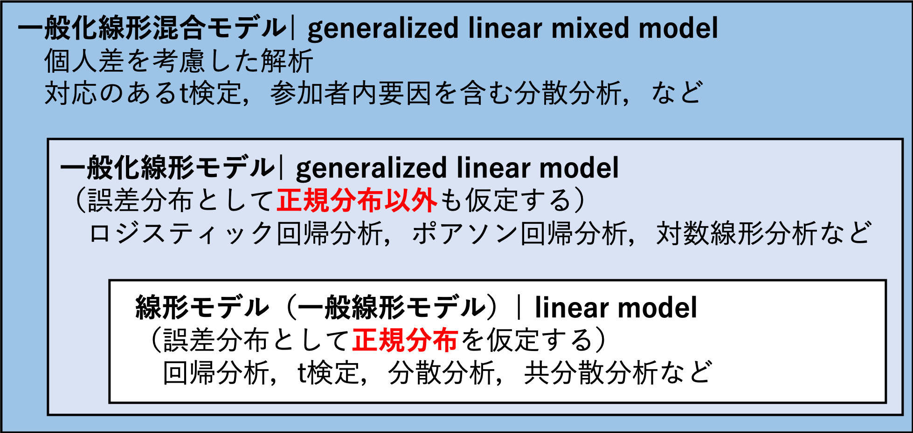

```{r setup_chap10, include=FALSE}
knitr::opts_chunk$set(echo = TRUE)
library(tidyverse)
library(MASS)
set.seed(1234)
```

# 一般化線形モデル

誤差分布が正規分布以外の場合の「一般化線形モデル」について学ぶ。  

* ロジスティック回帰
* 最尤法  
* ポアソン回帰


```{r prepare_chap10, eval=FALSE}
install.packages("tidyverse", "MASS")
library(tidyverse)
library(MASS)
```

## 一般化線形モデル（再掲）

一般化線形モデルとは，線形の式で従属変数と独立変数の関係を表した統計モデルのことをいう。一般化線形モデルを理解するには，以下の３つの要素を知っておく必要がある。

### 線形予測子

従属変数と独立変数を表した式。いわゆる，「回帰式」である。

$$
\hat{y} = \beta_{0} + \beta_{1} x  \tag{1}\\
$$

xを独立変数（説明変数），yを従属変数（応答変数または目的変数）と呼ぶ。独立変数は1個でなくても構わない。また，独立変数は質的変数でも量的変数でも構わない（その両方でもOK）。
線形予測子から，従属変数の予測値($\hat{y}$)を推定する。

### 誤差分布

従属変数の実際の値($y$)と従属変数の予測値($\hat{y}$)の誤差が従う確率分布のことをいう。

#### 確率分布の復習{-}

* 正規分布，二項分布，ポアソン分布などがあった。変数の種類によって，ある変数が従うだろうと仮定する確率分布が異なることを学んだ。
    + 例えば，連続量ならば正規分布，二値の値ならば二項分布，カウントデータ（非負の離散値）ならばポアソン分布というように，変数の特徴によって仮定する確率分布が異なる。


### リンク関数

* 線形予測子と従属変数との関係をリンクさせる関数。
    + 恒等リンク（線形予測子を変形せずにそのまま利用すること），logリンク，logitリンク関数などがある（誤差分布によってどのリンク関数を指定するかは大体定まっている）。  


### 一般化線形モデルと統計解析との関係

誤差分布やリンク関数の組み合わせによって，様々な解析を表現することが可能になる。

1. 重回帰分析：誤差分布が正規分布，リンク関数には何も指定しない（線形式をそのまま使う）  
2. ロジスティック回帰：誤差分布が二項分布，リンク関数はロジット
3. ポアソン回帰：誤差分布がポアソン分布，リンク関数はlog
4. 対数線形分析：誤差分布がポアソン分布，リンク関数はlog（ポアソン回帰と同じだが，説明変数がカテゴリカルのみの場合）


つまり，一般化線形モデルとはある分析手法を指す言葉というよりも，「あらゆる統計解析を共通の枠組みから包括的に理解する統計解析の考え方」といえる。  
  

## 今回の予定
  
前回は，誤差分布が正規分布である場合の解析（回帰分析，t検定，分散分析など）を扱った。今回は，誤差分布として正規分布以外を仮定する場合の解析について扱う。



Figure: 一般化線形混合モデル，一般化線形モデル，線形モデルの関係図


## ロジスティック回帰

ロジスティック回帰は，「ある事象が生じる確率を予測する回帰分析」である。誤差分布が**二項分布**に従う場合において，二項分布のパラメータq（ある事象が生じる確率）を独立変数から推定する回帰分析である。

### 二項分布

$$
P(r) = {}_n\mathrm{C}_rq^{r}(1-q)^{(n-r)} \tag{2}
$$

qはある事象が生じる確率（投げたコインが表の確率など），nがすべての試行数，rがある事象が生じた回数を意味する。  
  
n=1のときは，「ベルヌーイ分布」と呼ばれる（例えば誰か1人を選んだときに，その人が病気であるか否かなど）。  
  
二項分布は，**生じる事象が2つのカテゴリに分けられる場合**に当てはまる確率分布である。コインを投げたときに出る面が「表か裏」か，学生の中から選んだ人の性別が「男か女」か，ある意見について「賛成か反対」かなど。このような事象が生じる確率は，理論的には二項分布に従う。  

### 例題

例えば次のようなデータを考えてみる。MASSパッケージに入っている生検の結果のサンプルデータを用いる。


```{r logstic_data_chap10, echo=TRUE}
library(MASS) 
b <- biopsy
b$classn[b$class=="benign"] <- 0
b$classn[b$class=="malignant"] <- 1

head(b)

```


V1は整数の変数，classnは1ならば癌，0ならば癌ではないことを意味する変数とする。  まず，独立変数V1と従属変数classnとの関係をプロットする。

```{r logstic_plot_chap10, echo=TRUE}
p1 = ggplot(b, aes(x=V1, y=classn)) + geom_point(position=position_jitter(width=0.3, height=0.06), alpha=0.8, shape=21, size=3) + xlab("V1") + ylab("classn")
p1

```


これに回帰分析のモデルを当てはめる。

```{r logstic_plot2_chap10, echo=TRUE}
fit_lm = lm(data=b, classn ~ V1)
summary(fit_lm)

p2 = ggplot(b, aes(x=V1, y=classn)) + geom_point(position=position_jitter(width=0.3, height=0.06), alpha=0.8, shape=21, size=3) + stat_smooth(method=lm, se=F, size=2) + xlab("x") + ylab("q")
p2
```

推定された回帰式をプロット上に当てはめる。  
  
がんにかかるリスク（確率）を推定したいが，例えばxが10を超えると，従属変数の予測値として1以上の値が推定されてしまう。xが2.5を下回ったときも，0未満の数値が推定されてしまう。従属変数は0か1しか取らない変数なのに，それぞれを超える値が予測されてしまう。これは確率の推定としては不都合である。  
  
そこで，この直線を以下のように変換してみたらどうだろうか。

```{r logstic_plot3_chap10, echo=TRUE}
p3 = ggplot(b, aes(x=V1, y=classn)) + geom_point(position=position_jitter(width=0.3, height=0.06), alpha=0.8, shape=21, size=3) + stat_smooth(method=glm, method.args = list(family = "binomial"),se=F, size=2) + xlab("x") + ylab("q")
p3
```

この予測線は，以下の式で作成されたものである。


$$
q_{i} =  \frac{1}{1+\exp[-(\beta_{0} + \beta_{1}x_{i})]} \tag{3}
$$


qは「y=1が生じる確率」を意味する。$1/(1+\exp(-y))$は，ロジスティック関数と呼ばれる。  
xがどのような値をとっても，$q_{i}$は$0\leq q \leq1$となる。

```{r logistic_function_chap10, echo=FALSE}
x = seq(-3, 3, 0.01)
q = 1/(1+exp(-1*x))  
logistic_graph = data.frame(y=q, x=x)

ggplot(data = logistic_graph, aes(x=x, y=q)) + geom_line(size = 1.5) + theme_bw()+ xlab("x") + ylab("q_{i}") + ylim(c(0,1)) + xlim(c(-3, 3))

```


更に，式(3)は，以下の式(4)に変換することができる（理由は付録参照）。

$$
\log\frac{q_{i}}{1-q_{i}} = \beta_{0} + \beta_{1} x_{i} \tag{4}\\
$$

左辺のことを，ロジット関数（logit function）という。つまり，線形の式をロジット関数でリンクさせたものがロジスティック回帰である（リンク関数を”ロジット”とする理由）。  
  
まとめると，ロジスティック回帰は誤差分布が二項分布，リンク関数をロジット関数とした一般化線形モデルのことをいう。  


### まとめ

* ロジスティック回帰は，独立変数がある事象が生じる確率に及ぼす影響を推定したいときに使う回帰分析である。従属変数が0か1を取る変数の場合には，ロジスティック回帰を行う。  
  
* 一般化線形モデルの誤差分布を二項分布，リンク関数をロジット関数としたものが，ロジスティック回帰に相当する。


### Rでのロジスティック回帰

glm()関数で行う。familyにbinomial, linkにlogitを設定すれば良い。先程のサンプルデータbを使って，glm()関数でロジスティック回帰を行ってみる。

```{r logstic_chap10, echo=TRUE}
fit_logistic = glm(data=b, classn ~ V1, family = binomial(link="logit"))
summary(fit_logistic)
```

* (link="logit")は省略しても良い。familyにbinomialを設定すれば，リンク関数はデフォルトでlogitとなる。  
  
* 結果の見方は，重回帰と同じである。  

* [Coefficients]の部分を見る。Estimateが係数。更にその効果のp値が表示される。係数の推定値の解釈は重回帰分析のときと同じで，プラスならば従属変数が1の値，マイナスならば従属変数が0の値を取りやすいことを意味する。


## 最尤法（＊）

線形回帰のときは，切片及び傾きの値は最小二乗法で求めると学んだ。ロジスティック回帰の場合はどうなのだろうか？  
  
一般化線形モデルでは，**最尤法**（さいゆうほう）と呼ばれる手法を通してパラメータの推定を行う。  

  
  
表が出る確率が未知のコインを何回か投げて，表が出る確率$\theta$（シータ）を推定するとする。  
  
  
1回目は，表が出た。この実験結果が生じる確率は$\theta$である。  
2回目は，裏が出た。ここまでの実験結果が生じる確率は$\theta(1-\theta)$である。  
3回目は，表が出た。ここまでの実験結果が生じる確率は$\theta(1-\theta)*\theta$である。  
    
その後，4回目は裏，5回目は裏だったとする。この実験結果が生じる確率は以下のように表すことができる。  

$$
L = (1-\theta)^3 \theta^2 \tag{5}
$$

Lのことを**尤度**(likelihood)と呼ぶ（”ゆうど”と読む。”いぬど”ではない）。  
  
尤度とは「もっともらしさ」を示すものである。イメージとしては，「今回の実験結果が得られる確率」である。今回の観測データに対して最も当てはまりが良くなる，すなわち最も尤度の高いパラメータを求めるのが，最尤法と呼ばれる手法である。   
掛け算を扱う尤度は計算が困難なので，対数化して足し算にする。対数化した尤度を対数尤度と呼ぶ。対数尤度が最大となるパラメータを求めるのが，最尤法である。  
  


$$
\log L = \log(1-\theta)+\log(1-\theta)+\log(1-\theta)+\log(\theta)+\log(\theta) \tag{6}
$$

パラメータ$\theta$と対数尤度$\log L$との関係を以下に示す。


```{r MLE_chap10, echo=FALSE}

D <- c(1, 0, 1, 0, 0)

LogLikelihood <- function(x){
  return(function(theta){
    L <- 1
    for(i in 1:length(x)){
      L <- L * theta^(x[i]) * (1-theta)^(1-x[i])
    }
    return(log(L))
  })
}

result <- optimize(f = LogLikelihood(D), c(0, 1), maximum=TRUE)
AIC_result <- -2 * (result$objective - 1)

#
theta <- seq(0.01,0.99,0.01)
logL <- log(theta)+log(1-theta)+log(theta)+log(1-theta) + log(1-theta)

data <- data.frame(x=theta, y=logL)
ggplot(data=data, aes(x=x, y= y)) + geom_line(size=1)+ xlab("theta") + ylab("log L") + geom_vline(xintercept=0.4, linetype="dashed", colour="red", size=1)

```

対数尤度が最も大きくなるのは，$\theta= 0.40$ のときである（2/5と一致）。  
  
一般化線形モデルでは，最尤法で対数尤度の高くなる切片及び傾きを推定する（上の例の$\theta$を線形予測子に置き換えて同様の計算をする）。  
  
* なお，回帰分析で切片及び傾きを求めるときに最小二乗法を使うと前回説明したが，最尤法でも同じ値が推定される（証明は省略）。  
  

## ポアソン回帰分析（＊）

従属変数がカウントデータ（非負の整数。1個，2個,3個といった個数など）の場合は，理論的にはポアソン回帰分析をするのが適切である。  

確率分布はポアソン分布(poisson)，リンク関数はlogを指定する。

### ポアソン分布（＊）

$$
P(y) = \frac{\lambda^y\exp(-\lambda)}{y!} \tag{7}\\
$$

* yは0以上の整数（0, 1, 2, 3, ...）とする。P(y)はyが生じる確率。  
* ポアソン分布のパラメータは$\lambda$だけである。期待値（平均）は$\lambda$，分散は$\lambda$である。つまり，平均と分散が等しい分布である。

```{r poisson_distribution_plot2, echo=FALSE}
pois_1 <- data.frame(x=seq(0,10), p=dpois(seq(0,10), lambda=1), lambda=1)
pois_2 <- data.frame(x=seq(0,10), p=dpois(seq(0,10), lambda=2), lambda=2)
pois_3 <- data.frame(x=seq(0,10), p=dpois(seq(0,10), lambda=3), lambda=3)
pois <- rbind(pois_1, pois_2, pois_3)
ggplot(data=pois, aes(x=factor(x), y=p, fill=factor(lambda))) + geom_bar(stat="identity", position = "dodge") + ylab("P(x)") + xlab("x") + labs(fill = "lambda")
```


### ポアソン回帰（＊）


$$
\log\lambda_{i}=\beta_{0}+\beta_{1}x_{i} \tag{8}\\
$$

$$
\lambda_{i}=\exp(\beta_{0}+\beta_{1}x_{i}) \tag{9}\\
$$

ポアソン回帰では，誤差分布をポアソン分布，リンク関数を対数（log）に設定する。


### 例題（＊）

嶋田・阿部(2017)「Rで学ぶ統計学入門」 p. 167の演習問題（改題）。  
  
鳥種Aの雄はときどき高い柱にとまって，自分の縄張りを見張る行動を示す。鳥の体重(wt)と見張り行動の発生数（mihari）を調べた。体重が見張り行動に及ぼす影響を調べる。

```{r poisson_chap10, echo=TRUE}

#　サンプルデータ（嶋田・阿部(2017) p. 167より）
mihari = c(7, 3, 3, 5, 10, 8, 3, 1, 2, 9, 8) 
wt = c(110, 88, 80, 95, 120, 103, 97, 84, 91, 114, 107)
data_poisson <- data.frame(mihari = mihari, wt = wt)

head(data_poisson)

#　family にpoisson，linkにlogを指定する。
result_poisson <- glm(data = data_poisson, mihari ~ wt, family = poisson (link = "log"))
summary(result_poisson)

```

```{r poisson_graph_chap10, echo=FALSE}
x <- seq(80, 120, 1)
y_pred <- exp(0.04263 * x -2.67643)
hoge <- data.frame(wt=x, mihari = y_pred)

p <- ggplot() + geom_point(data = data_poisson, aes(x=wt, y=mihari), size = 3) 
p + geom_line(data = hoge, aes(x=wt, y=mihari), size = 1)

```


## モデルの予測力

### 決定係数 

回帰分析では，データに対する回帰分析のモデルの予測力を表す指標として，決定係数（R-squared）というものがある。

```{r R2_chap10, echo=TRUE}

model_lm = lm(data=iris, Sepal.Length ~ Petal.Width)
summary(model_lm)

summary(model_lm)$r.squared #r.squaredで決定係数のみを取り出すことができる。

```

これは，回帰式から求めた予測値と実測値の分散が，実際のデータの分散に占める割合を意味する指標である。つまり，回帰分析でどれだけ全データの分散を説明できているかを意味する。

$$
R^2 = \sum_{i=1}^{n} \frac {(y_{i}-\hat{y}_{i})^2}{(y_{i}-\bar{y})^2} \tag{10}
$$

ただし，決定係数は単純に，独立変数が増えるほど大きくなる（説明できる分散の量が増える）。

```{r R2_2_chap10, echo=TRUE}

model_lm2 = lm(data=iris, Sepal.Length ~ Sepal.Width + Petal.Length + Petal.Width)
summary(model_lm2)$r.squared

```

仮に独立変数に影響を及ぼさない変数を含めても，モデルのデータに対する説明力は上昇してしまう。

* 複雑なモデルは現在のデータによく当てはまるのは，ある意味当然である（単なる偶然で生じた誤差も無駄に説明してしまっている）。しかし，複雑なモデルは現在のデータに当てはまっても，未知のデータにもうまく当てはまるとは限らない（overfittingと呼ばれる問題）。  
* 良いモデルとは，「予測力が高く，かつできるだけシンプルである」ことである。  
* 決定係数は上記の目的をかなえるのに常に適切な指標であるとは言えない。

### 赤池情報量基準（AIC）

変数の少なさとモデルの予測力の高さのバランスを取った指標の一つとして，AIC(Akaike inoformation criteria)が知られている。AICは以下の式で計算される。

$$
AIC = -2 \log L + 2k \tag{11}\\
$$

$\log L$は最大対数尤度，kはパラメータ（独立変数）の数である。  
  
AICの値が低いほど，データに対するモデルの予測力が高いと評価する。  
  
AICは余計なパラメータが多くなる（kが大きくなる）ほど大きい値を取る。つまり，データをうまく予測しつつ，かつパラメータ数を抑えてシンプルなモデルを探ることにかなっている。


* Rではglm関数でAICの結果も出力してくれる。

```{r AIC_chap10, echo=TRUE}

model=glm(data=b, classn ~ V1+V2+V3+V4+V5+V6+V7+V8+V9, family=binomial(link="logit"))
summary(model)

```

### モデル選択（＊）

最も予測力の高いモデルを探す手続きを「モデル選択（model selection）」という。

* MASSパッケージに入っているstepAICという関数を使ってAICが最も低いモデルの探索を行うことができる（stepwise法）。  

```{r stepAIC_chap10, echo=TRUE}

MASS::stepAIC(glm(data=b, classn ~ V1+V2+V3+V4+V5+V6+V7+V8+V9, family=binomial(link="logit")))

```

* しかし，データに含まれるすべての変数を対象にしてstepwiseで最適なモデルを探して，出てきた結果を鵜呑みにするのは，あまり良い方法とは言えない。解析の前に研究者自身が仮説を立て，関連するであろう変数をモデルに入れる作業を繰り返してモデルを選択するのが仮説検証型の研究としてふさわしいメソッドである。

* 他にもモデル選択に使われる指標として，BIC（ベイズ情報量基準）などもある。


## 練習問題{-}

宿題にはしない。

### 問１{-}

```{r making_renshu_sample_chap10, eval=FALSE, include=FALSE}

#データの作成
set.seed(1234)
N = 30
BMI = sort(sample(x=15:45, size = N, replace=TRUE))
Exercise = sample(x=0:4, size = N, replace=TRUE)
Sleep = sample(x=4:7, size = N, replace=TRUE)


Disease = c(0, 0, 0, 0, 0, 1, 0, 0, 0, 1, 0, 0, 1, 0,  1, 0, 1, 0, 1, 1, 1, 1, 1, 1, 0, 1, 1, 1, 1, 1)

data_q01 = data.frame(Disease = Disease, BMI = BMI, Exercise = Exercise, Sleep = Sleep)

model1 = glm(data = data_q01, Disease ~ BMI , family=binomial(link="logit"))
summary(model1)
model2 = glm(data = data_q01, Disease ~ BMI + Exercise, family=binomial(link="logit"))
summary(model2)
model3 = glm(data = data_q01, Disease ~ BMI + Exercise + Sleep, family=binomial(link="logit"))
summary(model3)

```

以下のプログラムを実行し，サンプルデータを作成する。   
  
変数の意味は以下の通りである。  
  
Disease: ある病気にかかっているか（1=かかっている，0=かかっていない）  
BMI: BMI（肥満度を表す指標）    
Exercise: 1週間あたりの運動時間（単位：時間）    
Sleep: 1日の睡眠時間（単位：時間）  


```{r renshu_sample_chap10, echo=TRUE}

Disease = c(0, 0, 0, 0, 0, 1, 0, 0, 0, 1, 0, 0, 1, 0,  1, 0, 1, 0, 1, 1, 1, 1, 1, 1, 0, 1, 1, 1, 1, 1)
BMI = c(15, 16, 16, 18, 19, 20, 21, 22, 22, 23, 23, 23, 24, 24, 24, 30, 31, 31, 33, 34, 34, 34, 35, 36, 40, 40, 40, 41, 43, 43)
Exercise = c(2, 1, 1, 2, 0, 3, 1, 1, 4, 4, 2, 3, 1, 3, 1, 2, 3, 2, 1, 3, 0, 1, 3, 2, 0, 2, 2, 3, 0, 4)
Sleep = c(7, 4, 5, 4, 4, 6, 5, 6, 4, 6, 4, 7, 4, 7, 4, 6, 5, 4, 5, 6, 7, 5, 4, 6, 4, 7, 5, 5, 4, 7)

data_q01 <- data.frame(Disease = Disease, BMI = BMI, Exercise = Exercise, Sleep = Sleep)

```


#### 小問１{-}

Diseaseを従属変数，BMI，Exercise，Sleepを独立変数としたロジスティック回帰を行い，結果について報告せよ。

ヒント: 重回帰のときと同じく，回帰係数とp値を報告すれば良い（b=x.xxx, p = .xxx）。有意な効果があった場合は，その係数の増減によって従属変数がどう影響するかを述べる。


#### 小問２{-}

BMIのみを独立変数とした場合(model 1)，BMIとExerciseを独立変数とした場合(model 2)，BMI, Exercise, 及びSleepを独立変数とした場合(model 3)について，いずれのモデルの方がデータに対する説明力が高いかを，それぞれのモデルのAICを報告した上で述べよ。


## 参考文献{-}

久保拓弥 (2012) データ解析のための統計モデリング入門　岩波書店  
嶋田正和・阿部真人 (2017) Rで学ぶ統計学入門　東京化学同人
