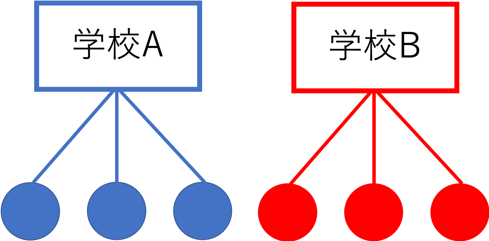

```{r, include=FALSE}
knitr::opts_chunk$set(echo = TRUE)
library(tidyverse)
library(lme4)
library(lmerTest)
library(knitr)
```

# 一般化線形混合モデル

一般化線形混合モデルについて学ぶ。  

* 個人差や集団差の影響  
* 一般化線形混合モデルとは？ 
* Rでの実践  


```{r, eval=FALSE}
install.packages("tidyverse")
install.packages("lme4")
install.packages("lmerTest")
library(tidyverse)
library(lme4)
library(lmerTest)
```


**一般化線形モデル（genelarized linear model: GLM）**は，回帰分析やロジスティック回帰分析など，様々な統計分析を行うことのできる統計モデルであった。  
**一般化線形混合モデル（generalized linear mixed model: GLMM）**は，一般化線形モデルを更に拡張させたものである。
  


## 個人差や集団差の影響

以下では，Rにデフォルトで入っている iris データを例として使う。irisデータには，3種類のあやめの種（Speicies: setosa, versicolor, virginica）ごとに，がくの長さ（Sepal.Length）やがくの幅（Sepal.Width）などのデータが入っている。  
  

```{r, echo=FALSE, message=FALSE, warning=FALSE}

head(iris) #irisデータの上数行を表示

```

まず，がくの長さ（Sepal.Length）とがくの幅（Sepal.Width）の関係を散布図で示してみよう。


```{r, echo=TRUE, message=FALSE, warning=FALSE}

graph_1 = ggplot(data=iris, aes(x=Sepal.Length, y=Sepal.Width)) + geom_point(size = 3)  + theme_bw()
graph_1

```


がくの幅を従属変数，がくの長さを独立変数とした回帰分析をしてみる。


```{r, echo=TRUE, message=FALSE, warning=FALSE}
iris_lm = lm(data = iris, Sepal.Width ~ Sepal.Length)
summary(iris_lm)
```

がくの長さ（Sepal.Length）は，がくの幅に対して負の影響を持っていることがわかる。回帰式の直線を引くと，以下のようになる。  


```{r, echo=TRUE, message=FALSE, warning=FALSE}

graph_lm = ggplot(data=iris, aes(x=Sepal.Length, y=Sepal.Width)) + geom_point(size = 3)  + stat_smooth(method = "lm", se = FALSE) + theme_bw()
graph_lm

```

  
では，先程の散布図を種（Species）ごとに色をわけて示してみる。

```{r, echo=TRUE, message=FALSE, warning=FALSE}

graph_2 = ggplot(data=iris, aes(x=Sepal.Length, y=Sepal.Width, color=Species, shape = Species)) + geom_point(size = 3) + theme_bw()
graph_2

```


種を無視して検討したところ，がくの長さとがくの幅の間には負の相関関係があるように思えたが，実際にはどの種でもがくの長さが大きくなるほど，がくの幅が大きくなる関係にあるように見える。  
  
このあやめのデータのように，いくつかのデータが同じグループに属している構造の場合，グループの影響を統制しないと誤った結論を招いてしまう恐れがある。それらのデータ間には，**統計的独立性が保証されていない**ためである。つまり，同じ種同士のものは似た傾向にある可能性が高い（データ間で相関が存在する）。  
  
* 独立とは，各データが他のデータに影響されないという意味である。これまで学んできた確率分布では，統計的独立性が前提とされている。例えば，コインを数回投げて投げて表が出る回数は二項分布に従うと学んだが，表が出るかどうかは前の試行に影響されることはない（前回表が出たら次も表が出やすいということは起こりえないという前提を置く）。  
* しかし，上述の同じグループのデータは似ている傾向が強いなど，現実のデータでは独立性を前提とすることに無理がある場合がある。  
  

この例に限らず，**階層構造を持つデータや繰り返し測定データ**にも，同じことがいえる。学校ごとに学力テストを行った場合，同じ学校の生徒たちは成績が似通っている可能性がある（上位校の生徒は他の学校と比べて成績が良いなど）。同一参加者に複数の実験条件に参加してもらった場合，その参加者のデータは似たような傾向を取る可能性にある。  
  
  
  
  
**個人差や集団差の影響を統制して**独立変数が従属変数に持つ効果を検討するための統計モデルが，一般化線形混合モデルである。  
  
* 一般化線形混合モデルは「階層モデル」と呼ばれることもある。  


一般化線形混合モデルでは，独立変数が従属変数に及ぼす効果（**固定効果：fixed effect**）だけではなく，個人差や集団差を表す**ランダム効果（random effect）**と呼ばれる影響を考慮する。一般化線形モデルは固定効果のみを含むモデルである。固定効果だけではなく，ランダム効果も混ぜたモデルなので，**混合モデル(mixed model)**と呼ばれる。


## 一般化線形混合モデル  

 **繰り返し測定されたデータ**を扱う。具体例として，以下のようなデータを分析する場合をイメージしてほしい。$i$がデータを意味する番号（何行目か），$j$を個人もしくはグループを意味する番号とする。例えば，個人jが$x=0$の場合と$x=1$の場合の2回$y$を測定している，あるいは同じ集団$j$から2人選ばれて$y$が測定された，といったケースが当てはまる。  

```{r, echo=FALSE, message=FALSE, warning=FALSE}

example = data.frame(i = 1:6, j = c(1, 1, 2, 2, 3, 3), y = round(rnorm(6), 2), x = rep(c(0, 1),3) )
kable(example)

```


一般化線形モデルの線形予測子（回帰式）は，以下のような数式で表現される。

$$
y_{i} = \beta_{0} + \beta_{1} x_{i} 
$$

$\beta_{0}$が切片，$\beta_{1}$が独立変数$x$に係る傾きを意味する。この式から従属変数の値を予測する。  
  
それに対し，一般化線形混合モデルの線形予測子は以下の式で表現できる。

$$
y_{i} = \beta_{0} + \beta_{1} x_{i} + \alpha_{j}
\\
\alpha_{j} \sim Normal(0, \sigma_{\alpha})
$$

線形予測子に，$\alpha_{j}$が加わっている。  
  
  
つまり，すべての個人に共通して影響する切片$\beta_{0}a$と，個人ないしはグループごとに異なる値を取る切片$\alpha_{j}$を考慮している。  
更に，この切片は平均をゼロ，$\sigma_{\alpha}$を標準偏差とする正規分布から生成されるという仮定を置いている（多くの個人が平均して0の切片を持つが，中には0よりも大きい，ないしは小さい値を切片として持つ個人もいるという仮定）。  
これにより，同じグループ（例えば$j=1$）には同じ効果（$\alpha_{1}$）が共通して係ることを表現できる。  
  
一般化線形混合モデルでは，すべてのデータに共通する効果（$\beta_{0}$，$\beta_{1}$）を**固定効果（fixed effect）**，個体ごとに異なる効果（$\alpha_{j}$）を**ランダム効果**と呼ぶ。  
  
  
ランダム効果は切片に限らない。例えば傾きを$\beta_{1, j}$にする，すなわち個人ごとに独立変数に係る効果が異なるという前提を置く場合もある。  

* しかし，傾きもランダム効果として考慮したモデルの推定は，最尤推定法でも場合によっては解が求まらない場合がある。多くの場合，個人差の影響（ランダム効果）は切片のみを考慮したモデルで表現されることが多い。  
* しかし最近は，ベイズ統計手法によってランダム効果として傾きを考慮したモデルも扱われている（この講義で扱う内容を超えるので，詳細は省く）。  


## Rでの一般化線形混合モデル

Rで一般化線形混合モデルで解析を行うためには，外部パッケージが必要になる。様々なパッケージがあるが，`lme4`パッケージが有名である（`lmerTest`も必要）。以下では，`lme4`パッケージに含まれる`lmer()`を使った解析の例を示す。


```{r, echo=TRUE, message=FALSE}

model_lmm = lmer(data= iris, Sepal.Length ~ Sepal.Width + (1|Species)) #(1|Species)を加える
summary(model_lmm)

```


出力結果を見てみると，*Fixed effects*という部分がある。ここに，固定効果の結果が表示されている。見方は，一般化線形モデルのときと同じである。回帰式の切片(intercept)と独立変数に係る傾きの係数の推定結果が表示されている（個体差にかかわらず，すべての個体共通に係る独立変数の効果）。 
    
    
ランダム効果の推定結果が，*Random effects*という部分に表示されている。  
  
  
上述のサンプルプログラムでは，回帰式に個体やグループを意味する変数を`(1|個体やグループを意味する変数)`というかたちで加えた。これは，`lmer()`及び`glmer()`特有の書き方で，「*ランダム効果を切片として入れよ*」という命令である。  
  
ランダム効果の出力結果に，Std.Dev.が表示されている。これが，さきほどの式の$\sigma_{\alpha}$の推定結果を意味している。  
  
  
がくの幅（Sepal.Width)の回帰係数（Estimate）を見ると，`lm()`での推定結果とは逆に，プラスになっている。やはり，グループの違いを統制すると，実際にはがくの幅が大きくなるほど，がくの長さも大きくなる関係にあることが，`lmer()`による推定結果からわかる。
  
* `lmer()`では，デフォルトでは係数のp値は表示されない。p値もみたいのならば，`lmerTest()`パッケージをインストールしておく必要がある。

### 対応のある要因を含む分散分析

以下に，サンプルデータを作成する。

要因１（Factor_1）はAとBの２つの水準，要因２（Factor_2）はX，Y，Zの３つの水準をもつとする。IDは参加者を識別する番号とする。  
ある実験で，参加者はAかBのどれかの群に割り振られ，その中でX, Y, Zの3つの実験条件に参加したとする。つまり，要因１は参加者間要因，要因２は参加者内要因として配置されたとする。  


```{r, echo=TRUE, message=FALSE}

Score = c(6,4,5,3,2,10,8,10,8,9,11,12,12,10,10,5,4,2,2,2,7,6,5,4,3,12,8,5,6,4)
Factor_1 = c(rep("A", 15), rep("B", 15))
Factor_2 = rep(c(rep("X", 5),rep("Y", 5), rep("Z", 5)),2)
ID = c(1,2,3,4,5,1,2,3,4,5,1,2,3,4,5,6,7,8,9,10,6,7,8,9,10,6,7,8,9,10)

dat_anova = data.frame(Score = Score, Factor_1 = Factor_1, Factor_2 = Factor_2, ID = ID)
dat_anova　= dat_anova %>% arrange(ID)
dat_anova

dat_anova %>% group_by(Factor_1, Factor_2) %>% summarise(Mean = mean(Score), SD = sd(Score), N = length(Score)) #平均値と標準偏差を出力


```

こういった参加者内要因と参加者間要因を含む複雑な要因配置の分析も，一般化線形混合モデルならば簡単にモデルを立てることができる。

すなわち，従属変数をScore，独立変数をFactor_1とFactor_2の主効果と交互作用効果，参加者をランダム効果とした一般化線形混合モデルを考える（誤差分布は正規分布，リンク関数は恒等リンク）。

```{r, echo=TRUE, message=FALSE}

result = lmer(data = dat_anova, Score ~ Factor_1 * Factor_2 + (1|ID)) #２つの変数を*でつなげると，主効果と交互作用効果の組み合わせを全て独立変数として投入してくれる。
summary(result) #線形混合モデルの結果。Factor_1及びFactor_2について，自動でダミー変数を作ってくれる。
anova(result) #分散分析表を出力したいときは，anova()を使う。主効果と交互作用効果の検定結果が出る。

```


## 一般化線型混合モデルの拡張（ロジスティック回帰）

もちろん，回帰分析に限らず，ロジスティック回帰などでもランダム効果を含めることができる。  
  
  
`lme4`の`glmer()`で，誤差分布として正規分布以外のものを指定した一般化線型混合モデルを行うことができる。以下では，ランダム効果を加えたロジスティック回帰分析の例を示す。  
  
  
まず，サンプルデータを作る。


```{r, echo=TRUE}
x1 = c(1.0, 2.0, 3.0, 4.2, 5.1, 3.1, 4.2, 5.0, 6.1, 7.0, 5.3, 6.0, 7.0, 8.1, 9.0)
y1 = c(0, 0, 1, 1, 1, 0, 0, 0, 0, 1, 0, 1, 1, 1, 1)
ID = c(rep("a",5),rep("b",5),rep("c",5))
data_sample = data.frame(ID, x1, y1)
data_sample
```

x1を独立変数（量的変数），y1を従属変数（0か1のいずれかを取る），IDが個体を示す変数とする。1つの個体からx1を変えて5回，y1が計測がされたデータをイメージしてほしい。  
  
まずは，通常のロジスティック回帰分析の復習である。Rでは，`glm()`でロジスティック回帰分析を行うことができた。  
オプションとして，誤差分布として二項分布（binomial）, リンク関数としてロジット（logit）を指定する。


```{r, echo=TRUE}

model_logistic = glm(data = data_sample, y1 ~ x1, family = binomial(link="logit"))
summary(model_logistic)

```


次に，個体差を統制する。`lme4`パッケージの`glmer()`を使う。 
回帰式に個体を識別する変数（ID）を加える。以下のように，`(1|ID)`というかたちで入れる。あとのオプションの指定などは，`glm()`のときと同じである。


```{r, echo=TRUE}

model_logistic_glmm = glmer(data = data_sample, y1 ~ x1 + (1|ID), family = binomial(link="logit"))
summary(model_logistic_glmm)

```


## 練習問題{-}

### 問１{-}

`car`パッケージに入っているカナダにおける職業の威信度に関する調査データ`Prestige`を使う。102業種に関する調査結果が入っている。

```{r, echo=TRUE, message=FALSE, warning=FALSE}

library(car)
head(Prestige)

```


prestigeを従属変数，education, income及び womenを独立変数，typeをランダム効果（切片）とした一般化線型混合モデルを行え。ただし，誤差分布として正規分布，リンク関数は恒等リンクを用いるものとする。  
  
分析の結果，有意な効果を持った独立変数を挙げ，結論を述べよ（その独立変数が大きくなるほど，従属変数がどう変化するか）。 
    
なお，変数の意味は以下の通りである。  
prestige：職業威信度（値が高いほど威信度が高い）  
education：在職者の平均教育年数  
income：平均所得（単位はドル）  
women：女性の割合  
type：職業のカテゴリ（bc=ブルーカラー，wc=ホワイトカラー，prof=専門職）  
  
    
* ヒント：ランダム効果を考慮した単なる回帰分析の場合は，`lme4`パッケージの`lmer()`を使えば良い。なお，p値を出力したい場合は，`lmerTest()`パッケージも必要になる。

```{r, eval=FALSE, include=FALSE}

result = lmer(data = Prestige, prestige ~ education + income + women + (1|type))
summary(result)


```


### 問２{-}

以下の問題は，嶋田・阿部 (2017)「Rで学ぶ統計学入門」東京化学同人　p.177より抜粋。  
以下のデータは，寄生蜂が生んだ子供の性比に関するデータである。motherが母蜂を意味する番号（1〜12。合計12匹），wtが宿主の体重，yが生まれた子供の性別（オス=1, メス=0）を意味する。12匹の母蜂が4匹ずつ子供を生んだ場合，宿主の大きさによってオス・メスの産み分けがされているのかを検討する。


```{r, echo=TRUE}

mother = sort(rep(seq(1:12), 4))
wt = c(0.28, 0.31, 0.15, 0.36, 0.21, 0.17, 0.16, 0.41, 0.22, 0.45, 0.22, 0.33, 0.11, 0.24, 0.36, 0.32, 0.51, 0.19, 0.36, 0.28, 0.30, 0.42, 0.11, 0.56, 0.33, 0.25, 0.35, 0.15, 0.35, 0.42, 0.26, 0.45, 0.31, 0.49, 0.31, 0.43, 0.35, 0.27, 0.6, 0.29, 0.35, 0.39, 0.26, 0.15, 0.26, 0.27, 0.51, 0.36)
y = c(1, 1, 1, 0, 1, 1, 1, 0, 1, 1, 1, 1, 1, 1, 0, 0, 0, 1, 0, 0, 1, 0, 1, 0, 1, 0, 0, 1, 0, 0, 0, 0, 0, 0, 0, 0, 0, 0, 0, 0, 1, 0, 1, 1, 0, 0, 0, 0)

data_q2 = data.frame(mother = mother, wt = wt, y = y)
data_q2


```


生まれた子供の性別（y）を従属変数，宿主の体重(wt)を独立変数，母蜂(mother)をランダム効果（切片）として，一般化線形混合モデルによる分析を行え。そして，寄生蜂が宿主の大きさによってオス・メスの産み分けをしているのかについて，結論を述べよ。  
  
* ヒント：ランダム効果を含むロジスティック回帰を行う。誤差分布とリンク関数として何を指定すべきか？yは0か1を取る値なので，二項分布に従うという前提を置く。

```{r, eval=FALSE, include=FALSE}

summary(glmer(data = data_q2, y ~ wt + (1|mother), family=binomial(logit)))

```


## 参考文献{-}

久保拓弥 (2012). データ解析のための統計モデリング入門　岩波書店  
粕谷英一 (2012). 一般化線型モデル　共立出版  
嶋田正和・阿部真人(2017). Rで学ぶ統計学入門　東京化学同人


