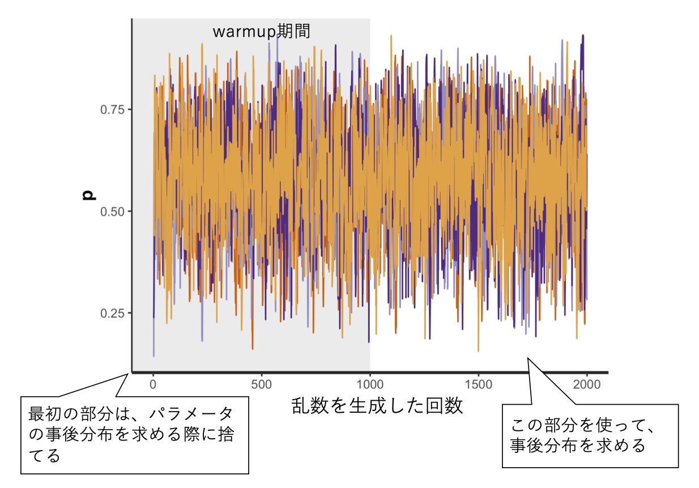
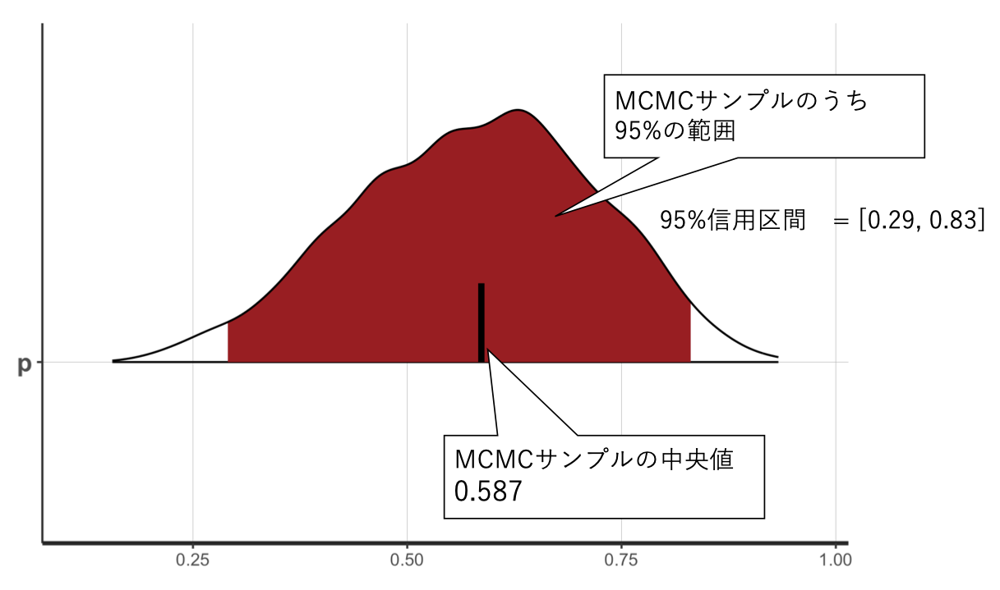

```{r, include=FALSE}
knitr::opts_chunk$set(echo = TRUE)
library(tidyverse)

library(rstan)

#計算を高速化するオプション
rstan_options(auto_write = TRUE)
options(mc.cores = parallel::detectCores())

```


# ベイズ統計

これまでの章で扱ってきた帰無仮説検定に基づく統計手法は，**頻度主義**の枠組みに分類される。これに対し，**ベイズ統計学**という別の統計学の流派が存在する。この章では，ベイズ統計学の基礎について触れる。

## 頻度主義統計学とベイズ統計学の違い


両者の違いは，パラメータ（母数）の値をどう捉えるかの違いである。  
  
頻度主義統計学では，**パラメータが定数（固定された一定の値）である**という仮説を立て，データを確率変数とみなしてデータが生じる確率を推定するという考え方を置く。例えば平均値の差の有無を調べる統計的仮説検定では，パラメータである2つの母集団の平均値が等しい（$\mu_{1} = \mu_{2}$）という前提を置き，帰無仮説のもとでデータが生じる確率であるp値を求めた。  
  
頻度主義は，以下の式で表される尤度（あるパラメータ$\theta$のもとでデータxが生じる確率）を求めることに相当する。

$$
Pr(x|\theta)
$$

これに対し，ベイズ統計学ではパラメータを確率的に変動する値であると考える。データは固定された値であり，未知である**パラメータの分布を推定する**のがベイズ統計学の考え方である。以下の式で表されるように，ベイズ統計は頻度主義に対しデータxのもとにおけるパラメータ$\theta$が生じる確率を求めることに相当する。

$$
Pr(\theta|x)
$$

ベイズ統計では，「母集団の平均値の分布が-1〜1に分布する確率は90%である」といった範囲を求める。データからパラメータの分布を推定する手法を，**ベイズ推定**と呼ぶ。

## ベイズの定理

まず，ベイズの定理について整理する。ベイズの定理とは，条件付き確率を求めるための定理である。  
  
条件付き確率とは，ある条件のもとである事象が生じる確率のことをいう。例えば，「事象Bが起こったときに事象Aが生じる」条件付き確率を$Pr(A|B)$と表現したとする。  
  
ベイズの定理は，以下で表される。$\bar{A}$はAの余事象（Aではない事象）とする。

$$
Pr(A|B) = \frac{Pr(B|A) Pr(A)}{Pr(B)}\\
=  \frac{Pr(B|A) Pr(A)}{Pr(B|A) Pr(A) + Pr(B|\bar{A}) Pr(\bar{A})}
$$


### 例題

ベイズの定理を使って，ある条件付き確率を求めてみよう。

***
ある感染症に感染している確率は0.1%だとする。

ある感染症の検査方法を受けると，99%の確率で感染者に対して陽性反応が出ることがわかっている。その一方，1%の確率で感染していない者に対して陽性反応が出ることがわかっている。

あなたがこの検査を受けたとき，陽性反応が出た。

あなたが本当にその感染症にかかっている確率は何%か？

***

陽性と診断されたときに感染している確率を，ベイズの定理で解いてみる。


先程のベイズの定理の式について，A=感染，B=陽性に置き換えて考えると，

$$
Pr(感染|陽性) = \frac{Pr(陽性|感染) Pr(感染)}{Pr(陽性)}\\
=  \frac{Pr(陽性|感染) Pr(感染)}{Pr(陽性|感染) Pr(感染) + Pr(陽性|非感染) Pr(非感染)}
$$


つまり，陽性と診断される確率（分母）のうち，感染かつ陽性である確率（分子）の占める割合が，「陽性と診断されたときに感染している確率」を意味する。
  
問題文より，  
Pr(感染) = 0.001（感染している確率0.1%）  
Pr(非感染) = 0.999（感染していない確率[1- 0.1%]）  
Pr(陽性|感染) = 0.99（感染者が陽性と正しく診断される確率99%）  
Pr(陽性|非感染) = 0.01（非感染者が陽性と誤って診断される確率1%）  
  
これらを当てはめると，

$$
Pr(感染|陽性) = \frac{0.99 \times 0.001}{0.99 \times 0.001 + 0.01 \times 0.999}
= 0.09
$$

つまり，実際に感染している確率は約9%ということになる。


### 事前確率，事後確率

もう一度ベイズの定理をおさらいすると，

$$
Pr(A|B) = \frac{Pr(B|A) Pr(A)}{Pr(B)}
$$

$Pr(A)$は**事前確率(prior probability)**，$Pr(B|A)$は**尤度(likelihood)**，$Pr(A|B)$は**事後確率(posterior probability)**という。ベイズ推定は，もとの事前確率について与えられたデータをもとに事後確率へと更新するプロセスである。

### ベイズ統計

データxのもとにおけるパラメータ$\theta$の分布は，ベイズの定理から以下のように求められる。

$$
Pr(\theta|x) = \frac{Pr(x|\theta) Pr(\theta)}{Pr(x)}
$$

$Pr(x)$はデータの分布を意味しているが，確率変数を含まないので定数とみなすことができる（基準化定数や周辺尤度と呼ばれる）。したがって，この式は以下のようなかたちで表現されることもある。$\propto$は「比例する」という意味である。

$$
Pr(\theta|x) \propto Pr(x|\theta) Pr(\theta)
$$

$Pr(\theta|x)$を**事後分布(posterior distribution)**，$Pr(\theta)$を事**前分布(prior distribution)**，$Pr(x|\theta)$を**尤度(likelihood)**と呼ぶ。事後分布はデータを得たあとで推定したパラメータの分布であり，事前分布と尤度の積に比例する。


## ベイズ推定の例

具体的な例を使って，ベイズ推定を行ってみよう。  
  
手元にゆがんだコインがあるとする。このコインの表が出る確率は不明なので，何回かコインを投げて推定することにする。このコインを10回投げたら，6回表が出た。このデータから，コインの表が出る確率$\theta$の事後分布を推定しよう。  
  
```{r, include=FALSE}

theta_seq = seq(0,1,0.01)
theta_prior = rep(1, length(theta_seq))
theta_likelihood = dbinom(x=6, size=10, prob = theta_seq)
theta_posterior = theta_likelihood * theta_prior
theta_posterior_std = theta_posterior/sum(theta_posterior)

d_Bayese = data.frame(theta = theta_seq, 
           prior = theta_prior, 
           likelihood = theta_likelihood,
           posterior = theta_posterior,
           posterior_std = theta_posterior_std)

```


### 事前分布

まずは，コインを投げる前に考えるコインの表が出る確率$\theta$である，$\theta$の事前分布を設定する。しかし，事前分布をどう設定するかについては，研究者の恣意性が介入してしまう恐れがある。  
  
仮説について情報がないときに設定する事前分布は**無情報事前分布**と呼ばれ，一様分布が無情報事前分布として採用される。一様分布は，どの値も生じる確率が一定であるという前提の分布であるので，恣意性を排除できる。  
  
この例では，表が出る確率$\theta$の事前分布を0から1の範囲の連続一様分布に設定する。連続一様分布は確率密度関数なので，縦軸は確率そのものを意味しないので注意（面積が確率を意味する。0から1までの範囲の面積が1となっている）。
  

$$
Pr(\theta) = 1
$$


```{r}
theta_seq = seq(0,1,0.01) #0から1までの範囲で0.01刻みでベクトルを作る
theta_prior = rep(1, length(theta_seq))
```

```{r, echo=FALSE}
ggplot() + 
  geom_line(data = d_Bayese, aes(x = theta, y = prior)) + 
  labs(x = "theta", y = "value", title = "prior") +
  theme_classic()
```


***
もちろん事前確率について仮説がある場合は，範囲を定めた一様分布あるいは別の確率分布を事前確率を設定しても良い。例えば，身長の分布を推定するときは，0cm ~ 250cmの範囲の一様分布を事前分布として設定するのは妥当であるといえる。  

***

### 尤度

データから尤度を求める。コインで表が出た回数は二項分布に従うので，尤度は以下から求められる(nはコイン投げの総数，hは表が出た回数とする)。

$$
Pr(x|\theta) = {}_n\mathrm{C}_h\theta^{h}(1-\theta)^{(n-h)}
$$


```{r}

theta_likelihood = dbinom(x=6, size=10, prob = theta_seq)

```


```{r, echo=FALSE}

ggplot() + 
  geom_line(data = d_Bayese, aes(x = theta, y = likelihood)) + 
  labs(x = "theta", y = "value", title = "likelihood") +
  theme_classic()

```


### 事後分布

ベイズの定理をもとに，事後分布を求める。先程の式より，

$$
Pr(\theta|x) \propto Pr(x|\theta) Pr(\theta)
$$

尤度と事前分布をかけて事後分布を求める（正確には，更に基準化定数$Pr(x)$で割る）。

```{r}

theta_posterior = theta_likelihood * theta_prior
theta_posterior_std = theta_posterior/sum(theta_posterior) 

```


```{r, echo=FALSE}
ggplot() + 
  geom_line(data = d_Bayese, aes(x = theta, y = theta_posterior_std)) + 
  labs(x = "theta", y = "value", title = "posterior") +
  theme_classic()
```


## MCMC

パラメータが多くて複雑なモデルになると，解析的に事後分布の推定は困難になる。  
  
事後分布をベイズ推定する方法として，コンピュータの乱数を使ってシミュレーションで事後分布を推定する**マルコフ連鎖モンテカルロ法（Markov Chain Monte Carlo）**が提案されている。  
  
モンテカルロ法とは乱数を発生させて近似的に解を求める手法である（カジノで有名な土地モンテカルロに由来する）。マルコフ連鎖とは，ある状態に移る確率が現在の状態のみに依存する確率過程を意味する。例えば，今日晴れならば明日も晴れやすい（ただし，2日前の天気は明日の天気に影響しない）という過程を意味する。MCMCではパラメータの推定に乱数を生成して事後分布を評価し，その結果に応じて次の乱数を決めるというアルゴリズムでパラメータの分布を推定する手法である。MCMCはアルゴリズムの総称で，メトロポリス法やギブスサンプリング法など様々な手法が提案されている。  
  
MCMCでは，コンピュータのシミュレーションでパラメータの事後分布を求める。近年，StanをはじめとしたMCMCを行うためのソフトウェアが開発されている。


### MCMCの例

さきほどのコイン投げで表が出る確率$\theta$の事後分布をMCMCで推定する方法を通して，MCMCの全体像について説明する。  
  
MCMCでは，まずパラメータの初期値を適当に選び（例えば$\theta_{1}$とする），それを元に事後分布$Pr(\theta_{1}|x)$に従う乱数を生成する。次に，$Pr(\theta_{1}|x)$をある基準で評価した上で，その評価を元に新たなパラメータ$\theta_{2}$を元に乱数を生成する。このようなシミュレーションを何回も繰り返す。何回も繰り返していくうち，生成される乱数はある分布に収束していく（定常分布と呼ばれる）。最終的に出来上がった定常分布をパラメータの事後分布として採用するというのが，（非常に大雑把な）MCMCの概要である。  
  
例えば以下に，シミュレーションを2,000回行ったときのパラメータ$\theta$の推定の推移を示している。最初の1,000回の推定結果は適当に選んだ初期値に依存するため，これらは切り捨てて（warmup期間と呼ばれる），残りの1,000回のシミュレーション結果を事後分布として採用する。

  


事後分布をプロットしたのが，以下である。

  

この分布の中央値は0.59であった。10回中6回表が出たので，表が出る確率0.60と概ね一致している。また，分布の中央95%を占める部分の範囲(下位2.5%から上位97.5%)は，0.29から0.83であった。つまり，表が出る確率は95%の確率で0.29から0.83の範囲を取ることを意味する。ベイズ推定で求めたパラメータの分布の範囲は，**信用区間(credible interval)**と呼ばれる。  
  

## 確認問題{-}

ベイズの定理を使って，事後確率を求める方法を復習しよう。  
  
### 問1{-}

3つの袋それぞれに，玉が100個入っている。袋Aには玉100個のうち赤玉が30個，袋Bには玉100個のうち赤玉が70個，袋Cには玉100個のうち赤玉が50個入っていて，残りは黒玉である。3つの袋の中から一つをランダムに選んで，玉を1個取り出すとする。  
  
今，あなたの目の前に赤玉が1個ある。

### 1-1{-}

この赤玉が袋Aから取り出された確率を求めよ。

### 1-2{-}

この赤玉が袋Bから取り出された確率を求めよ。

### 1-3{-}

この赤玉が袋Cから取り出された確率を求めよ。  
  
ヒント:  
赤玉があるときに，それが袋A，袋B，もしくは袋Cから取り出された条件付き確率$Pr(A|赤)$を求める。例えば，1-1の場合は，赤玉が取り出される確率（袋Aから赤玉が取り出される確率，袋Bから赤玉が取り出される確率，袋Cから赤玉が取り出される確率の合計）のうち，袋Aから赤玉が取り出される確率が占める割合を求めれば良い。


### 問2{-}

世の中に出回っている迷惑メールは全メール中80%であることがわかっている。
迷惑メールのうち80%には「無料」という単語が含まれている，普通のメールには「無料」が50%含まれている事がわかっている。「無料」を含むメールが送られてきたときに，このメールが迷惑メールである確率は何％か？
  
ヒント:  
感染症の問題を復習しよう。

