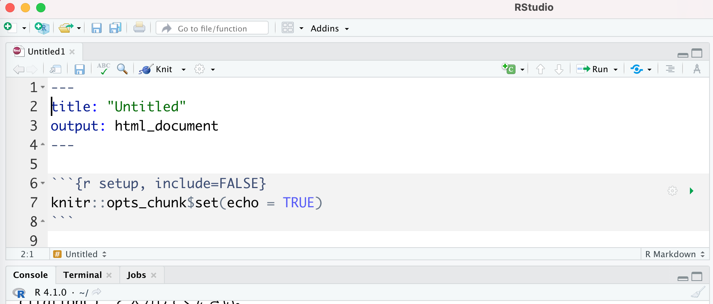
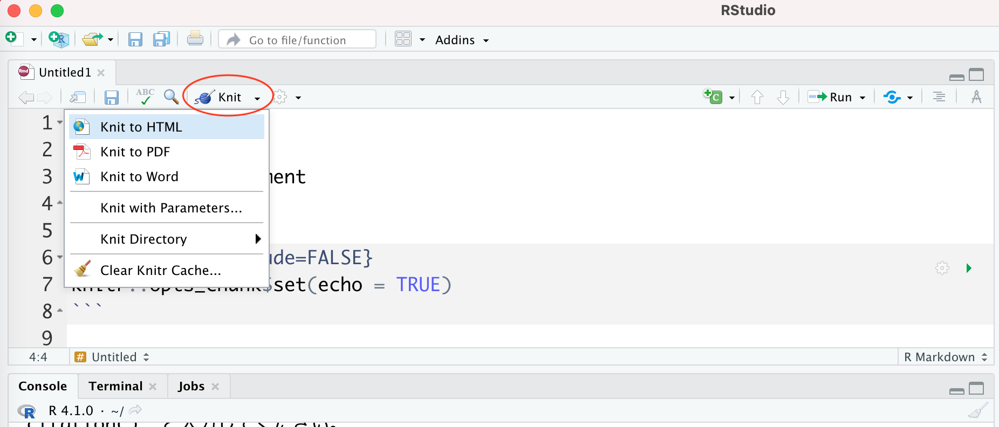
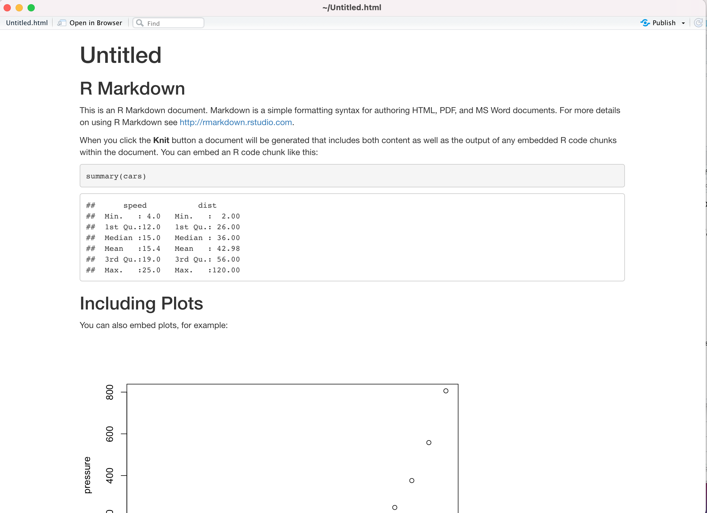

```{r, include=FALSE}
knitr::opts_chunk$set(echo = TRUE)
library(tidyverse)

```

# (APPENDIX) 付録 {.unnumbered}

# 確率分布{#A_Probs}

ここでは、代表的な確率分布とその確率分布を扱うRの関数を説明する。

## 連続型確率分布{#A_Continuous}

-   正規分布
-   指数分布
-   対数正規分布
-   t分布
-   カイ二乗分布
-   F分布
-   コーシー分布

### 正規分布 {.unnumbered}

**正規分布(normal distribution)**は、平均$\mu$、標準偏差$\sigma$を持つ確率分布である。**ガウス分布（gaussian distribution）**とも呼ばれる。


$$
f(x) = \frac{1}{\sqrt{2\pi\sigma^2}}\exp\left(-\frac{(x-\mu)^2}{2\sigma^2}\right)
$$


Rでは、正規分布を扱うための関数として`norm`が用意されている。

```{r, eval = FALSE}

#mean = 平均、sd = 標準偏差
dnorm(x = seq(-3,3, 0.1), mean = 0, sd = 1)
qnorm(p = 0.95, mean = 0, sd = 1)
pnorm(q = 1.64, mean = 0, sd = 1)
rnorm(n = 10, mean = 0, sd = 1)

```

```{r}
norm_1 = data.frame(x = seq(-4,4, 0.1), f = dnorm(x = seq(-4,4, 0.1), mean = 0, sd = 1), par = "mean = 0, sd = 1")
norm_2 = data.frame(x = seq(-4,4, 0.1), f = dnorm(x = seq(-4,4, 0.1), mean = 1, sd = 1), par = "mean = 1, sd = 1")
norm_3 = data.frame(x = seq(-4,4, 0.1), f = dnorm(x = seq(-4,4, 0.1), mean = 0, sd = 2), par = "mean = 0, sd = 2")
norm = rbind(norm_1, norm_2, norm_3)

ggplot() +
  ggplot2::geom_line(data = norm, aes(x = x, y = f, colour = par, linetype = par)) + 
  labs(y = "f(x)", x = "x", colour = "mean, sd", linetype = "mean, sd") + theme_classic()
```


### 指数分布 {.unnumbered}

**指数分布(exponential distribution)**は連続型確率分布であり、パラメータは$\lambda$である。指数分布の確率変数は、ゼロ以上の正の値のみを取りうる。

$$
f(x) = \lambda \exp(-\lambda x)\\
x \sim \text{Exponential}(\lambda)\\
$$

Rでは、指数分布を扱うための関数として`exp`が用意されている。

```{r, eval = FALSE}

#rate = パラメータ
dexp(x = seq(0,3, 0.1), rate = 1)
qexp(p = 0.95, rate = 1)
pexp(q = 3.0, rate = 1)
rexp(n = 10, rate = 1)

```

```{r}
exp_1 = data.frame(x = seq(0,3, 0.1), f = dexp(seq(0,3, 0.1), rate = 0.5), rate = 0.5)
exp_2 = data.frame(x = seq(0,3, 0.1), f = dexp(seq(0,3, 0.1), rate = 1), rate = 1)
exp_3 = data.frame(x = seq(0,3, 0.1), f = dexp(seq(0,3, 0.1), rate = 2), rate = 2)
exp = rbind(exp_1, exp_2, exp_3)

ggplot() +
  ggplot2::geom_line(data = exp, aes(x = x, y = f, colour = factor(rate), linetype = factor(rate))) + 
  labs(y = "f(x)", x = "x", colour = "rate", linetype = "rate") + theme_classic()
```

ある一定期間の間に平均して$\lambda$回生じるイベントの時間間隔は、指数分布に従う。災害が生じてから次の災害が生じるまでの期間、店に客が来てから次の客が来るまでの期間などは指数分布に従う。

### 対数正規分布 {.unnumbered}

**対数正規分布(log-normal distribution)**は連続型確率分布であり、正規分布と同様に平均$\mu$と標準偏差$\sigma$の２つのパラメータを持つ分布である。名前の通り、正規分布とは深い関係にある。

$$
f(x) = \frac{1}{\sqrt{2\pi\sigma}x}\exp\left(-\frac{(\ln x-\mu)^2}{2\sigma^2}\right)\\
x \sim \text{logNormal}(\mu, \sigma)\\
$$

Rでは、対数正規分布を扱うための関数として`lnorm`が用意されている。

```{r, eval = FALSE}

dlnorm(x = seq(0, 5, 0.1), meanlog = 0, sdlog = 1)
qlnorm(p = 0.95, meanlog = 0, sdlog = 1)
plnorm(q = 5.18, meanlog = 0, sdlog = 1)
rlnorm(n = 10, meanlog = 0, sdlog = 1)

```

```{r}
lnorm_1 = data.frame(x=seq(0,5, 0.1), f = dlnorm(seq(0, 5, 0.1), meanlog = 0, sdlog = 1), par = "mean=0, sd = 1")
lnorm_2 = data.frame(x=seq(0,5, 0.1), f = dlnorm(seq(0, 5, 0.1), meanlog = 0.5, sdlog = 1), par = "mean=0.5, sd = 1")
lnorm_3 = data.frame(x=seq(0,5, 0.1), f = dlnorm(seq(0, 5, 0.1), meanlog = 0, sdlog = 2), par = "mean=0, sd = 2")
lnorm = rbind(lnorm_1, lnorm_2, lnorm_3)

ggplot() +
  ggplot2::geom_line(data = lnorm, aes(x = x, y = f, colour = factor(par), linetype = factor(par))) + 
  labs(y = "f(x)", x = "x", colour = "par", linetype = "par") + theme_classic()
```

対数正規分布は、右の方に長い裾を描く分布である。対数正規分布に従うものとしては、年収の分布などが知られている。

#### 正規分布との関係 {.unnumbered}

ランダムな変数を足し合わせた物は正規分布に従うのに対し、ランダムな変数をかけ合わせたものは対数正規分布に従う。

```{r, message=FALSE, warning=FALSE}
#サイコロを7回振って、それぞれの値で掛け算をする。これを10,000回行ったときの出目の合計値の分布

sample.prod = sapply(c(1:10000), function(x) {prod(round(runif(n = 7,min = 1,max = 6),0))} ) #prod()はカッコ内のベクトルの要素をかけ合わせる関数

hist(sample.prod)

```

「ランダムな変数をかけ合わせたもの」の対数を取ってその分布を確認すると、正規分布のかたちになることがわかる。

```{r, message=FALSE, warning=FALSE}
sample.prod_2 = log(sample.prod)
hist(sample.prod_2)

```

掛け算の対数を取るということは、足し算に直すことと同じである。つまり、対数を取ることで「ランダムな変数をかけ合わせたもの」が「ランダムな変数を足し合わせたもの」に変換される。「ランダムな変数を足し合わせたもの」は、中心極限定理により正規分布に従う。したがって、対数正規分布の対数を取ったものは正規分布になる。

### t分布 {.unnumbered}

**t分布(Student's t distribution)**は、自由度$v$をパラメータとする連続型確率分布である。

標本平均$\bar{X}$、不偏標本分散$S^2$、サンプルサイズ$n$から、以下の統計量$t$を計算する（母集団平均$\mu$は$\bar{X}$と等しいと仮定する）。

$$
t = \frac{\bar{X}-\mu}{\sqrt{S^2n}}
$$

$t$は、以下の自由度$v$を持つt分布に従う（$v=n-1$とする）。

$$
f(t) = \frac{\Gamma((v+1)/2)}{\sqrt{\pi v}(v/2) }(1+t^{2}/v)^{-(v+1)/2}\\

x \sim \text{Student's t}(v)\\
$$


Rでは、t分布を扱うための関数として`t`が用意されている。

```{r, eval = FALSE}

#dfが自由度
dt(x = seq(-3, 3, 0.01), df = 30)
qt(p = 0.95, df = 30)
pt(q = 1.69, df = 30)
rt(n = 10, df = 30)

```


以下に、$df=10$, $df=50$, $df=100$のt分布の例を示す。
t分布は、自由度$v$（サンプルサイズ）によって形状が変化する。

```{r}

dat_t5 = data.frame(x = seq(-3, 3, 0.01), y = dt(x = seq(-3, 3, 0.01), df = 5), df = 5)
dat_t10 = data.frame(x = seq(-3, 3, 0.01), y = dt(x = seq(-3, 3, 0.01), df = 10), df = 10)
dat_t50 = data.frame(x = seq(-3, 3, 0.01), y = dt(x = seq(-3, 3, 0.01), df = 50), df = 50)

dat_t = rbind(dat_t5, dat_t10, dat_t50)

ggplot() + 
  geom_line(data = dat_t, aes(x = x, y = y, linetype = factor(df))) + xlim(-3,3) + labs(x = "y", y = "density", linetype = "df") + theme_classic()


```


### カイ二乗分布 {.unnumbered}

標準正規分布（平均=0, 標準偏差=1の正規分布）$Z$の二乗を$v$回足し合わせた分布は、自由度$v$を持つ**カイ二乗分布(Cahi-Squared distribution)**に従う。

$$
\chi^2 = \sum_{k=1}^v Z_{k}^2
$$

Rでは、カイ二乗分布を扱うための関数として`chisq`が用意されている。

```{r, eval = FALSE}

dchisq(x = seq(0, 5, 0.01), df = 2)
qchisq(p = 0.95, df = 2)
pchisq(q = 5.99, df = 2)
rchisq(n = 10, df = 2)

```


以下に、自由度を1, 5, 10に変えたカイ二乗分布を示す。

```{r}

dat_chisq_1 = data.frame(x = seq(0, 5, 0.01), 
                        y= dchisq(x = seq(0, 5, 0.01), df = 1), 
                        df = 1)
dat_chisq_5 = data.frame(x = seq(0, 5, 0.01), 
                        y= dchisq(x = seq(0, 5, 0.01), df = 5), 
                        df = 5)
dat_chisq_10 = data.frame(x = seq(0, 5, 0.01), 
                        y= dchisq(x = seq(0, 5, 0.01), df = 10), 
                        df = 10)

dat_chisq = rbind(dat_chisq_1, dat_chisq_5, dat_chisq_10)

ggplot() + 
  geom_line(data = dat_chisq, aes(x = x, y = y, linetype = factor(df))) + xlim(0,5) + ylim(0,1) + labs(x = "y", y = "density", linetype = "df") + theme_classic()


```


### F分布 {.unnumbered}

自由度がそれぞれ$v_{1}$と$v_{2}$である2つのカイ二乗分布の比として表される以下の$F$は、自由度$v_{1}$と$v_{2}$を持つ**F分布(F distribution)**に従う。F分布のパラメータは、2つの自由度である。

$$
F = \frac{\chi^2_{v_{1}}/v_{1}}{\chi^2_{v_{2}}/v_{2}}
$$

Rでは、F分布を扱うための関数として`f`が用意されている。

```{r, eval = FALSE}

df(x = seq(0, 5, 0.01), df1 = 10, df2 = 10)
qf(p = 0.95, df1 = 10, df2 = 10)
pf(q = 2.98, df1 = 10, df2 = 10)
rf(n = 10, df1 = 10, df2 = 10)

```


以下に、自由度$v_{1}$を10に固定して、自由度$v_{2}$をそれぞれ、10, 50, 100に変えたF分布を示す。

```{r}

dat_f_10 = data.frame(x = seq(0, 5, 0.01), 
                        y= df(x = seq(0, 5, 0.01), df1 = 10, df2 = 10), 
                        df2 = 10)
dat_f_50 = data.frame(x = seq(0, 5, 0.01), 
                        y= df(x = seq(0, 5, 0.01), df1 = 10, df2 = 50), 
                        df2 = 50)
dat_f_100 = data.frame(x = seq(0, 5, 0.01), 
                        y= df(x = seq(0, 5, 0.01), df1 = 10, df2 = 100), 
                        df2 = 100)

dat_f = rbind(dat_f_10, dat_f_50, dat_f_100)

ggplot() + 
  geom_line(data = dat_f, aes(x = x, y = y, linetype = factor(df2))) + xlim(0,5) + ylim(0,1) + labs(x = "y", y = "density", linetype = "df2", title = "df1 = 10") + theme_classic()

```


### コーシー分布 {.unnumbered}

**コーシー分布(Cauchy distribution)**は形状が正規分布に似ているが、裾が広いことが特徴である。つまり、極端な値が出る確率が正規分布よりも大きい。パラメータは、$l$(location)と$s$(scale)の2つである。

$$
f(x) = \frac{1}{\pi s}\left(1+\left(\frac{x-l}{s}\right)^{2}\right)^{-1}\\

x \sim \text{Cauchy}(l, s)\\
$$

Rでは、コーシー分布を扱うための関数として`cauchy`が用意されている。

```{r, eval = FALSE}

dcauchy(x = seq(-6, 6, 0.01), location = 0, scale = 1)
qcauchy(p = 0.95, location = 0, scale = 1)
pcauchy(q = 6.31, location = 0, scale = 1)
rcauchy(n = 10, location = 0, scale = 1)

```


以下に、$l=0$かつ$s=1$、$l=0$かつ$s=3$のコーシー分布の例を示す。

```{r}

dat_cauchy_1 = data.frame(x = seq(-6, 6, 0.01), 
                        y= dcauchy(x = seq(-6, 6, 0.01), location = 0, scale = 1), 
                        scale = 1)

dat_cauchy2 = data.frame(x = seq(-6, 6, 0.01), 
                        y= dcauchy(x = seq(-6, 6, 0.01), location = 0, scale = 3), 
                        scale = 3)

dat_cauchy = rbind(dat_cauchy_1, dat_cauchy2)

ggplot() + 
  geom_line(data = dat_cauchy, aes(x = x, y = y, linetype = factor(scale))) + xlim(-6,6) + labs(x = "y", y = "density", linetype = "scale") + theme_classic()


```

#### 中心極限定理との関係 {.unnumbered}

コーシー分布は、極端な値が存在することにより、その分布の特徴を平均や標準偏差などで捉えることができない。

```{r}

d_cauchy = rcauchy(n = 100, location = 0, scale = 1) #location = 0, scale = 1のコーシー分布から乱数を100個生成する

mean(d_cauchy)
median(d_cauchy)
sd(d_cauchy)

```

コーシー分布には中心極限定理を適用できない。

コーシー分布から乱数を100個作って足し合わせることを5回やり、分布を確認する。足し合わせても、正規分布に近似しないことがわかる。

```{r}

d_cauchy = rcauchy(n = 100, location = 0, scale = 1) + 
rcauchy(n = 100, location = 0, scale = 1) + 
rcauchy(n = 100, location = 0, scale = 1) + 
rcauchy(n = 100, location = 0, scale = 1) + 
rcauchy(n = 100, location = 0, scale = 1) 

ggplot() + 
  geom_histogram(data = NULL, aes(x = d_cauchy)) + theme_classic()

```


## 離散型確率分布{#A_Discrete}

-   二項分布
-   ポアソン分布
-   負の二項分布
-   幾何分布
-   超幾何分布

### 二項分布 {.unnumbered}

**二項分布(binomial distribution)**は、ある事象が生じる確率（成功確率）を$q$としたとき、試行回数$n$回のうち成功する回数$x$が従う確率分布である。パラメータは、成功確率$q$と試行回数の$n$である。\

$$
P(x) = {}_n\mathrm{C}_xq^{x}(1-q)^{(n-x)}
$$

コイントスで、表が出るのを成功、裏が出るのを失敗とする。二項分布は、全試行中表が出る回数の確率を表している。

Rでは、二項分布を扱うための関数として`binom`が用意されている。

```{r, eval = FALSE}

#size = 全試行回数, prob = 成功試行が生じる確率
dbinom(x = 0:10, size = 10, prob = 0.5)
qbinom(p = 0.95, size = 10, prob = 0.5)
pbinom(q = 8, size = 10, prob = 0.5)
rbinom(n = 10, size = 10, prob = 0.5)

```


以下は、全試行回数$n = 10$とし、$q=0.2$, $q=0.5$, $q=0.6$としたときの二項分布である。

```{r}
binom_1 = data.frame(x = 0:10, p = dbinom(0:10, size = 10, prob = 0.2), q = 0.2)
binom_2 = data.frame(x = 0:10, p = dbinom(0:10, size = 10, prob = 0.5), q = 0.5)
binom_3 = data.frame(x = 0:10, p = dbinom(0:10, size = 10, prob = 0.6), q = 0.6)
binom = rbind(binom_1, binom_2, binom_3)

ggplot() +
  ggplot2::geom_bar(data = binom, aes(x = factor(x), y = p, fill = factor(q)), color = "black", stat = "identity", position = "dodge") + 
  labs(y = "P(x)", x = "number of success", fill = "q", title = "number of trials = 10") + theme_classic()
```


第6章も参照のこと。

### 負の二項分布 {.unnumbered}

**負の二項分布(negative binomial distribution)**は、ある事象が生じる確率（成功確率）を$q$, 成功回数を$r$としたとき、 失敗回数$x$を確率変数とした場合に$x$が従う確率分布である。パラメータは、成功確率$q$と成功回数$r$である。\
（二項分布とは異なり、試行回数が定まっていない）

$$
P(x) = {}_{x+r-1}\mathrm{C}_{r-1} q^{r}(1-q)^{x}\\
x \sim \text{Negative Binomial}(r, q)
$$

コイントスを例として考える。表が出るのを成功、裏が出るのを失敗とする。３回表が出たら投げるのをやめるとした場合、３回表が出るまでに裏が出る回数の確率は負の二項分布に従う。

Rでは、負の二項分布を扱うための関数として`nbinom`が用意されている。

```{r, eval = FALSE}

#size = 成功回数, prob = 成功試行が生じる確率
dnbinom(x = 0:10, size = 5, prob = 0.5)
qnbinom(p = 0.95, size = 5, prob = 0.5)
pnbinom(q = 18, size = 5, prob = 0.5)
rnbinom(n = 10, size = 5, prob = 0.5)

```

以下は、成功回数$r = 3$とし、$q=0.2$, $q=0.5$, $q=0.6$としたときの負の二項分布である。

```{r}
nbinom_1 = data.frame(x = 0:10, p = dnbinom(0:10, size = 3, prob = 0.2), q = 0.2)
nbinom_2 = data.frame(x = 0:10, p = dnbinom(0:10, size = 3, prob = 0.5), q = 0.5)
nbinom_3 = data.frame(x = 0:10, p = dnbinom(0:10, size = 3, prob = 0.6), q = 0.6)
nbinom = rbind(nbinom_1, nbinom_2, nbinom_3)

ggplot() +
  ggplot2::geom_bar(data = nbinom, aes(x = factor(x), y = p, fill = factor(q)), color = "black", stat = "identity", position = "dodge") + 
  labs(y = "P(x)", x = "number of failure", fill = "q", title = "number of success = 3") + theme_classic()
```

### 幾何分布 {.unnumbered}

**幾何分布 (geometric distribution)**は、成功確率を$q$としたとき、失敗が$x$回繰り返し続いたあとで初めて成功するまでの$x$が従う確率分布である。\
コイントスを例とすると、裏（失敗）が何回か続いて初めて初めて表（成功）が出るときの確率である。

$$
P(x) = q(1-q)^{x}\\
x \sim \text{Geometric}(q)\\
$$ 

Rでは、幾何分布を扱うための関数として`geom`が用意されている。

```{r, eval = FALSE}

#prob = 成功試行が生じる確率
dgeom(x = 0:10, prob = 0.5)
qgeom(p = 0.95, prob = 0.5)
pgeom(q = 4, prob = 0.5)
rgeom(n = 10, prob = 0.5)

```

以下は、$q=0.2$, $q=0.5$, $q=0.6$の幾何分布である。

```{r}
geom_1 = data.frame(x = 0:10, p = dgeom(0:10, prob = 0.2), q = 0.2)
geom_2 = data.frame(x = 0:10, p = dgeom(0:10, prob = 0.5), q = 0.5)
geom_3 = data.frame(x = 0:10, p = dgeom(0:10, prob = 0.6), q = 0.6)
geom = rbind(geom_1, geom_2, geom_3)

ggplot() +
  ggplot2::geom_bar(data = geom, aes(x = factor(x), y = p, fill = factor(q)), color = "black", stat = "identity", position = "dodge") + 
  labs(y = "P(x)", x = "x", fill = "q") + theme_classic()
```

### 超幾何分布 {.unnumbered}

**超幾何分布 (hypergeometric distribution)**について、次のような場合を考える。つぼの中に玉が入っていて、白玉が$m$個、黒玉が$n$個入っている。そのつぼの中から玉を$k$個取り出した時、取り出した玉のうち白玉の個数$x$が従う確率分布が超幾何分布である。超幾何分布は、非復元抽出（玉を取り出したらつぼに戻さないで、引き続き玉を取り出す）によるサンプリングに基づく確率分布である。

$$
P(x) = \frac{{}_m C_x \quad {}_n C_{k-x}}{{}_{m+n} C_k}\\
x \sim \text{HyperGeometric}(m,n,k)\\
$$

Rでは、超幾何分布を扱うための関数として`hyper`が用意されている。

```{r, eval = FALSE}

# m = 白玉, n = 黒玉, k = 取り出す玉の数
dhyper(x = 0:5, m = 5, n = 5, k = 5)
qhyper(p = 0.95, m = 5, n = 5, k = 5)
phyper(q = 4, m = 5, n = 5, k = 5)
rhyper(nn = 10, m = 5, n = 5, k = 5)

```

以下は、$m=10$, $n=30$, $k=10$の超幾何分布である。

```{r}
hyper = data.frame(x = 0:10, p = dhyper(x = 0:10, m = 10, n = 30, k = 10))

ggplot() +
  ggplot2::geom_bar(data = hyper, aes(x = factor(x), y = p), color = "black", stat = "identity") + 
  labs(y = "P(x)", x = "x") + theme_classic()

```

#### Fisherの正確検定との関係 {.unnumbered}

超幾何分布は、フィッシャーの正確検定(Fisher's exact test)でp値を求めるときに使われる。フィッシャーの正確検定は、2つのカテゴリカル変数の間に有意な関連があるかを検定するのに使われる。  
  
つぼから白玉と黒玉を取り出す例で考えると、それぞれの頻度は以下のクロス表で表すことができる。

```{r, echo=FALSE}


knitr::kable(data.frame(玉の色 = c("白玉", "黒玉", "合計"),
                          取り出した玉 = c("x", "k - x", "k"),
                          つぼの中の玉 = c("m - x", "n - (k - x)", "m + n - k"),
                        合計 = c("m", "n", "m + n")))

```


例えば、白玉が10個($m=10$)と黒玉が30個($n=30$)入っているつぼから玉を10個( $k=10$)取り出すとする。ここで、取り出した白玉が6個($x = 6$)だったとする。クロス表でまとめると以下になる。

```{r, echo=FALSE}

knitr::kable(data.frame(玉の色 = c("白玉", "黒玉", "合計"),
                          取り出した玉 = c("6", "4", "10"),
                          つぼの中の玉 = c("4", "26", "30"),
                        合計 = c("10", "30", "40")))

```

このとき、取り出した玉のうち白玉の個数が$x$個である確率は、先ほどの、$m=10$, $n=30$, $k=10$の超幾何分布に従う。この幾何分布を帰無仮説として、今回の結果である$x=6$よりも珍しい結果が生じる確率(p値)を求める。
さきほどの$m=10$, $n=30$, $k=10$の超幾何分布のグラフでいえば、$p(x = 6), p(x = 7), p(x = 8), p(x = 9),p(x = 10)$の合計がp値を意味することになる（$p(x = 8)$以下である確率の合計）。直接計算すると、以下のとおりである。

```{r}

p = dhyper(x = 0:10, m = 10, n = 30, k = 10)
p[7] + p[8] + p[9] + p[10] + p[11]

```

Rにある`fisher.test`関数でも計算することができる。

```{r}

tab = matrix(c(6, 4, 4, 26), nrow = 2, ncol = 2) #クロス表を作成する
fisher.test(tab)#fisher.testの中に表のデータを入れる

```

### ポアソン分布 {.unnumbered}

**ポアソン分布 (Poisson distribution)**は、0以上の整数$x$（$x = 0, 1, 2, 3, ...$）が従う確率分布である。パラメータは$\lambda$のみで、$\lambda$は分布の平均と分散を表す。つまり、ポアソン分布は平均と分散が等しい分布である。

$$
P(x) = \frac{\lambda^x\exp(-\lambda)}{x!}\\
$$

Rでは、ポアソン分布を扱うための関数として`pois`が用意されている。

```{r, eval = FALSE}

#lambda = パラメータ（平均・分散）
dpois(x = 0:10, lambda = 2)
qpois(p = 0.95, lambda = 2)
ppois(q = 5, lambda = 2)
rpois(n = 10, lambda = 2)

```

以下に、$\lambda = 1$, $\lambda = 2$, $\lambda = 3$のポアソン分布を示す。

```{r}
pois_1 = data.frame(x=seq(0,10), p=dpois(seq(0,10), lambda=1), lambda=1)
pois_2 = data.frame(x=seq(0,10), p=dpois(seq(0,10), lambda=2), lambda=2)
pois_3 = data.frame(x=seq(0,10), p=dpois(seq(0,10), lambda=3), lambda=3)
pois = rbind(pois_1, pois_2, pois_3)

ggplot() +
  ggplot2::geom_bar(data = pois, aes(x=factor(x), y=p, fill=factor(lambda)), stat="identity", color = "black", position = "dodge") + 
  labs(y= "P(x)", x = "x", fill = "lambda") + theme_classic()
```


#### 二項分布との関係 {.unnumbered}


二項分布の成功確率パラメータを$p=\lambda/n$とする。試行回数である$n$を大きくすると、二項分布はパラメータ$\lambda$を持つポアソン分布に近似する。すなわち、生じる確率が小さいイベントはポアソン分布に従う。


ポアソン分布については、第7章も参照のこと。


# R Markdownの使い方{#A_Markdown}

RStudioならば、R Markdownの機能を使うことで、自分が行った分析のコードや出力をドキュメント形式で残しておくことができて便利である。 以下に、R Markdownの簡単な使い方について示す。

1.  New Fileから「R Markdown」を選択する


2.  「New R Markdown」というウィンドウが出てくる。「Document」を選んで「OK」を選ぶ。Title（ドキュメントのタイトル）やAuthor（著者名）の情報を入力しても構わない。


3.  R Markdownドキュメントがサンプルコードとともに表示される。



試しにこのサンプルコードをHTMLファイルで出力してみよう。

4.  「Knit」のプルダウンから、「Knit to HTML」を選ぶ。



ドキュメントのプレビューが出力される。



5.  R Markdownファイルを保存する。\
    「.Rmd」という拡張子のファイルで保存される。「.Rmd」ファイルをRStudioで開けば、編集することができる。

このように、R Markdownに記した文章、Rのコード、出力結果（分析結果、グラフなど）をドキュメントで保存することができる。

R Markdownの使い方の詳細については、他の資料を参照のこと。\
RmarkdownのCheatsheetsにも、Rmarkdownのチートシートが掲載されている。「Translations」のところに日本語訳もある。 [https://www.rstudio.com/resources/cheatsheets/](https://rstudio.com/resources/cheatsheets/)


# 参考資料{#A_References}

## 文献{#A_ReferenceBooks}

### 統計学の解説書{#A_ReferenceBooks1}

-   東京大学教養学部統計学教室 編 (1991). 統計学入門 東京大学出版会\
-   南風原朝和 (2002). 心理統計学の基礎：統合的理解のために 有斐閣\
-   大久保街亜・岡田謙介 (2012). 伝えるための心理統計：効果量・信頼区間・検定力 勁草書房\
-   阿部真人(2021). データ分析に必須の知識・考え方　統計学入門：仮説検定から統計モデリングまで重要トピックを完全網羅　ソシム

### Rを用いた統計解析の解説書{#A_ReferenceBooks2}

-   山田剛史・杉澤武俊・村井潤一郎 (2008). Rによるやさしい統計学 オーム社\
-   石田基広 監修、奥村晴彦 (2016). Rで楽しむ統計　共立出版\
-   金明哲　(2016). 定性的データ分析（Useful R 5） 共立出版\
-   嶋田正和・阿部真人 (2017). Rで学ぶ統計学入門　東京化学同人

### データ・ビジュアライゼーション{#A_ReferenceBooks3}

-   Nordmann E, McAleer P, Toivo W, Paterson H, DeBruine LM. Data Visualization Using R for Researchers Who Do Not Use R. Advances in Methods and Practices in Psychological Science. 2022;5(2). doi:10.1177/25152459221074654

### 一般化線形モデル、マルチレベルモデルなどの解説書{#A_ReferenceBooks4}

-   久保拓哉 (2012). データ解析のための統計モデリング入門：一般化線形モデル・階層ベイズモデル・MCMC　岩波書店\
-   金明哲 編、粕谷英一　(2012). 一般化線形モデル（Rで学ぶデータサイエンス 10） 共立出版
- Brown VA. An Introduction to Linear Mixed-Effects Modeling in R. Advances in Methods and Practices in Psychological Science. 2021;4(1). doi:10.1177/2515245920960351


### ベイズ統計モデリングの解説書{#A_ReferenceBooks5}

-   石田基広 監修、松浦健太郎 (2016). StanとRでベイズ統計モデリング　共立出版\
-   馬場真哉 (2019). RとStanではじめるベイズ統計モデリングによるデータ分析入門（実践Data Science シリーズ） 講談社\
-   McElrearth R. (2020). Statistical Rethinking: A Bayesian Course with Examples in R and Stan (2nd Ed.) Boca Raton, FL: CRC Press

## Webサイト{#A_ReferenceWeb}

RStudio Cheatsheets（代表的なパッケージの使い方などが簡単にまとめられた"チートシート"を入手できる）\
<https://rstudio.com/resources/cheatsheets/>

`tidyverse`の公式ページ\
<https://www.tidyverse.org>

Stan User's Guide\
<https://mc-stan.org/users/documentation/>

