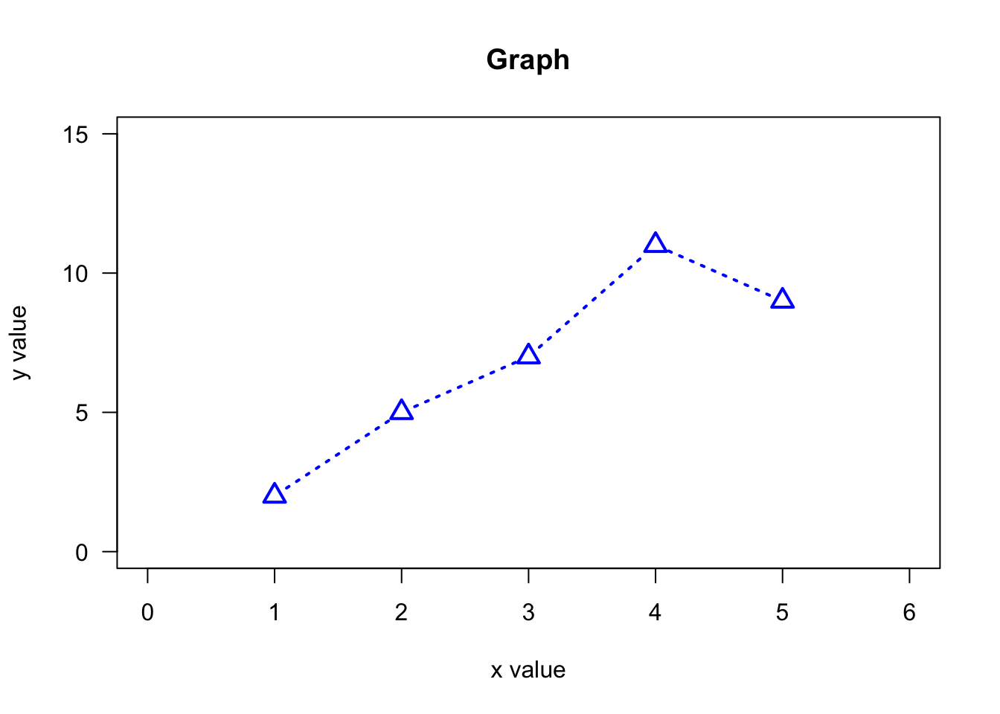
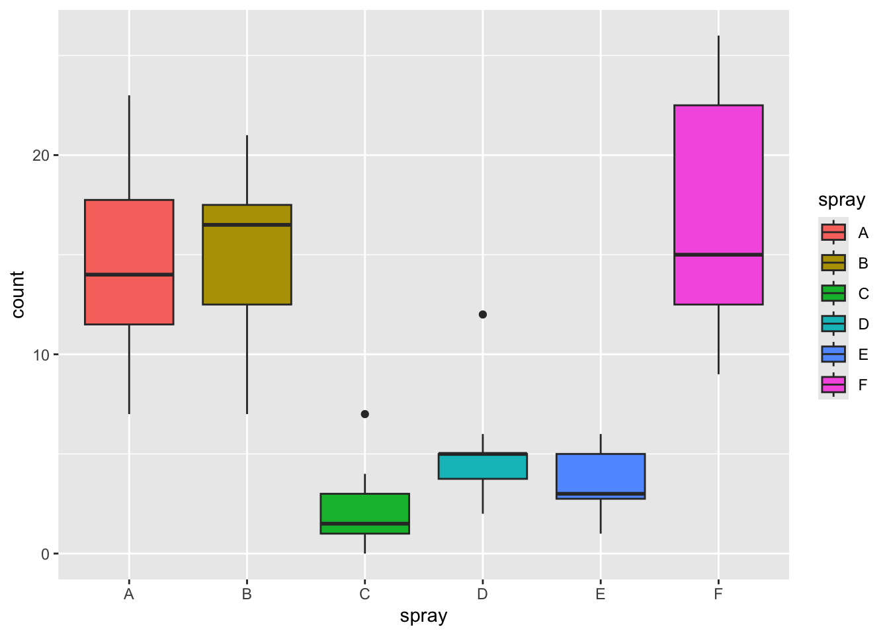
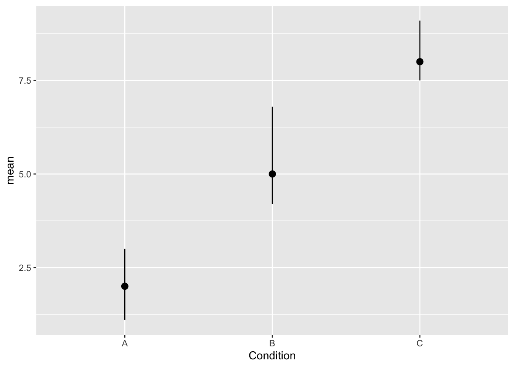
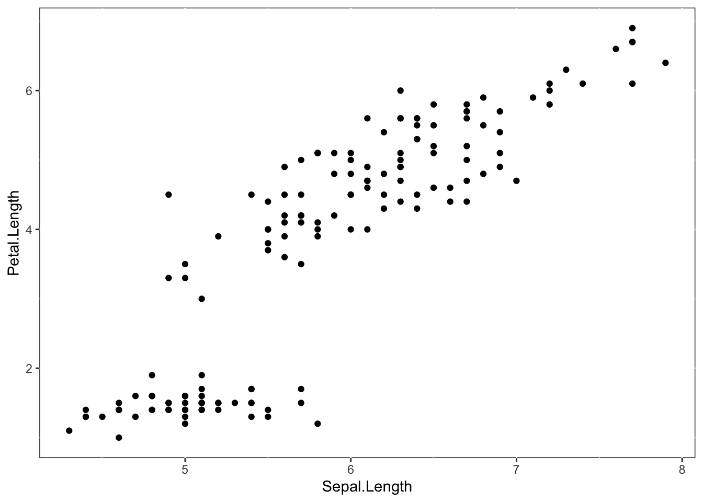

# データ・ビジュアライゼーション{#chap05_Visualization}

データをグラフで表現する方法について学ぶ。
  
データの傾向をグラフによって表現することを**可視化(visualization)**という。この章では、Rに標準で入っているグラフィック関数を確認しつつ、可視化に特化した`ggplot2`パッケージを使った可視化の方法について学んでいく。更に、`ggplot2`以外の可視化用パッケージについても触れていく。  

## Rのグラフィック関数{#chap05_Graphic}

Rには標準でグラフを作成するための関数がいくつか用意されている。  

### plot{#chap05_plot}

`plot`はグラフを作る基本となる関数である。


``` r
#サンプルデータをつくる
sample = data.frame(
  x = 1:5,
  y = c(2, 5, 7, 11, 9)
)
sample
```

```
##   x  y
## 1 1  2
## 2 2  5
## 3 3  7
## 4 4 11
## 5 5  9
```

``` r
plot(x = sample$x, y = sample$y)
```


`plot()`にx軸とy軸にプロットするデータをベクトルのかたちで入れると、図を作成してくれる。 
更に、`plot()`関数では、自分の好みに合わせてグラフの体裁を変えることもできるオプションも用意されている。  

#### オプションの指定{-}

以下に例として、様々なオプションを変更したグラフを示す。


``` r
plot(x = sample$x, y = sample$y, 
     type = "b", #type: グラフの種類
     pch = 2, #点の種類
     cex = 1.5, #点の大きさ
     lty = "dotted", #線の種類
     lwd = 2, #線の太さ
     col = "blue", #色
     xlim = c(0,6), #x軸の範囲（最小値, 最大値）
     ylim = c(0,15), #y軸の範囲（最小値, 最大値）
     las = 1, #軸の文字の配置
     main = "Graph", #グラフのタイトル
     xlab = "x value", #x軸のラベル
     ylab = "y value" #y軸のラベル
     )
```



`type`: グラフの種類を変える（"p" = 点（デフォルト）、 "l" = 線、 "b" = 点と線の両方、"n" = 何も描画しない、など）。  
`pch`: 点の種類を指定（0 = 四角、1 = 丸（デフォルト）、2 = 三角、など）。  
`cex`: 点の大きさを指定。数値を入力する。  
`lty`: 線の種類を指定（"solid" = 実線（デフォルト）、"dotted" = ドット、"dashed" = ダッシュ、など）  
`lwd`: 線の太さの指定。数値を入力する。  
`col`: 色を変更する。"red", "blue"など色の名前を指定する。  
`xlim`, `ylim`: それぞれx軸とy軸の最小値と最大値を指定。  
`las`: 軸の文字の配置を指定（1 = x軸もy軸も水平方向）。  
`main`, `xlab`, `ylab`: それぞれグラフのラベルを指定。  
  
他にもどのようなオプションを指定できるか確認したい場合は、ヘルプを参照。`?pars`と入力するとヘルプが表示される。


### その他のグラフ{#chap05_otherplot}

以下では、Rで標準でに入っているサンプルデータ`iris`で様々なグラフを作ってみよう。


``` r
head(iris) #データの上数行を表示して中身を確認する。
```

```
##   Sepal.Length Sepal.Width Petal.Length Petal.Width Species
## 1          5.1         3.5          1.4         0.2  setosa
## 2          4.9         3.0          1.4         0.2  setosa
## 3          4.7         3.2          1.3         0.2  setosa
## 4          4.6         3.1          1.5         0.2  setosa
## 5          5.0         3.6          1.4         0.2  setosa
## 6          5.4         3.9          1.7         0.4  setosa
```


#### 散布図{-}

`plot()`で作成する。


``` r
plot(x = iris$Sepal.Length, y = iris$Sepal.Width) 
```


#### ヒストグラム{-}

`hist()`で作成する。


``` r
hist(iris$Sepal.Length, 
     breaks = 20, #breaksでビン（棒）の数を指定できる
     col = "red",
     main = "Histgram", xlab = "Sepal Length", ylab = "Frequency") #その他のオプションも指定可能
```


#### 箱ひげ図{-}


`boxplot()`で作成する。


``` r
boxplot(x = iris$Sepal.Length,
     main = "Boxplot", 
     col = "red",
     xlab = "Sepal Length") #その他のオプションも指定可能
```


``` r
boxplot(data = iris, Sepal.Length ~ Species, 
        main = "Boxplot", 
        col = c("red", "blue", "green"),
        xlab = "Sepal Length") #グループごとに示す場合
```


#### グラフを重ねる{-}

同じグラフの中でグループ別にデータを表示したい場合は、例えば以下のようにグラフを重ねて描画していくかたちで表現することができる。  
  
以下に例として、`iris`データの`Species`ごとに色や点の形を変えて散布図を示してみる。  
まず、グラフの領域を作成して、その上にグループ別に`point`や`lines`などで点や線を重ねていくかたちで描画していく。


``` r
#該当する部分を取り出してベクトルに格納する。
Sepal.Length_setosa <- iris$Sepal.Length[iris$Species == "setosa"]
Sepal.Width_setosa <- iris$Sepal.Width[iris$Species == "setosa"]

Sepal.Length_versicolor <- iris$Sepal.Length[iris$Species == "versicolor"]
Sepal.Width_versicolor <- iris$Sepal.Width[iris$Species == "versicolor"]

Sepal.Length_virginica <- iris$Sepal.Length[iris$Species == "virginica"]
Sepal.Width_virginica <- iris$Sepal.Width[iris$Species == "virginica"]

plot(0, 0, type = "n", xlim = c(3.5, 8.5), ylim=c(0, 6), xlab = "Sepal Length", ylab = "Sepal Width")#まず、空のプロットを作る（軸の範囲やラベルを指定する）
points(x = Sepal.Length_setosa, y = Sepal.Width_setosa, col = "red", pch = 0)
points(x = Sepal.Length_versicolor, y = Sepal.Width_versicolor, col = "blue", pch = 1) 
points(x = Sepal.Length_virginica, y = Sepal.Width_virginica, col = "orange", pch = 2) 
legend("topleft", legend = c("setosa", "versicolor", "virginica"), pch = c(0, 1, 2), col = c("red", "blue", "orange")) #legendで凡例を重ねることもできる。
```

<!-- -->


### 図の保存{#chap05_saveplots}


``` r
#png形式で保存する場合
png("plot.png", height = 400, width = 400)  #ファイル名を指定する。画像サイズも任意に指定できる（特に指定しなくても出力してくれる）。
plot(x = iris$Sepal.Length, y = iris$Petal.Length) #グラフを作る
dev.off()    #描画デバイスを閉じる
```


RStudio ならば、右下の「Plots」ウィンドウの「Export」から保存することも可能。

  
## ggplot2パッケージ{#chap05_ggplot2}

手っ取り早くデータの分布や相関を確認したい場合は、`plot`などの関数を使えば十分である。`plot`などでもオプションを駆使すれば研究報告向きのグラフを作れないこともないが、プログラムやオプションの指定の方法も複雑で、作成できるグラフの種類も少ない。  
  
これに対し、様々なグラフを作る機能に特化した`ggplot2`というパッケージがある。以降で、`ggplot2`の基本的な使い方について解説する。  

まずは、`ggplot2`パッケージをロードする。


``` r
library(ggplot2) 
```

早速、`ggplot2`を使ってグラフを作ってみよう。以下のプログラムを実行してみよう。


``` r
p = ggplot2::ggplot() + 
  geom_point(data = iris, aes(x=Sepal.Length, y=Petal.Length)) + 
  labs(x = "Length of sepal", y = "Length of petal") 
p
```


プログラムの解説：  
  
`ggplot()`：初期設定。「ggplot2を使ってグラフを書きます」という意味。必ず書く。カッコの中には何も入れなくて良い。  
  
`geom_xxxx()`：グラフの種類の指定。必ず書く。`xxxx`には、グラフの種類を入力する。この例では、散布図を書くので`geom_point`を指定した。更に、カッコの中に必要な設定を記す。  
  
`data =`でグラフを描画するデータを指定する。  
更に、`aes()`のカッコの中に描画に必要な要素を指定する。`x=`と`y=`でそれぞれ、 x軸とy軸に指定したい変数を指定する。点の大きさ、色、線の種類など、グラフの種類によって指定できる要素がある。  
  
オプション：上での例では、`labs()`でx軸やy軸のラベルを指定している。他にも、軸の値の範囲、軸のラベル、グラフの色の設定などをオプションで指定することができる。オプションを加えなくてもグラフは出力される。  
  
  
とりあえず、これらだけ知っておけば`ggplot2`でグラフを作れる。  

### 散布図{#chap05_geompoint}

`geom_point`で作成できる。


``` r
p = ggplot2::ggplot() + 
  geom_point(data=mpg, aes(x=cty, y=hwy, shape = fl)) 
p
```


この例では、`shape =`でグループを指定して、グループごとに点のかたちを変えた散布図を作成した。    
    
点が重なって見えにくい場合は、`geom_jitter`を使うとランダムのズレを生成して表示してくれる。


``` r
p = ggplot2::ggplot() + 
  geom_jitter(data=mpg, aes(x=cty, y=hwy, shape = fl)) 
p
```


### ヒストグラム{#chap05_geomhistogram}

`geom_histogram`で作成する。


``` r
p = ggplot2::ggplot() + 
  geom_histogram(data = iris, aes(x=Sepal.Length))  #xに、横軸にしたい変数を入れる。
p
```


``` r
p = ggplot2::ggplot() + 
  geom_histogram(data = iris, aes(x=Sepal.Length, fill = Species))  #種類ごとに色の塗りつぶしを変えたい場合は、fillに指定する。
p
```


``` r
p = ggplot2::ggplot() + 
  geom_histogram(data = iris, aes(x=Sepal.Length, color = Species))  #colorだと周りの線の色を変える。
p
```


### 箱ひげ図{#chap05_geomboxplot}

`geom_boxplot`で作成する。

最小値、第一分位点、中央値、第三分位点、最大値を示す（外れ値は点で示される）。


``` r
p = ggplot2::ggplot() + 
  geom_boxplot(data = InsectSprays, aes(x=spray, y=count))
p
```


``` r
p = ggplot2::ggplot() + 
  geom_boxplot(data = InsectSprays, aes(x=spray, y=count, fill = spray))
p
```




### バイオリンプロット{#chap05_geomviolin}

データの分布を表現したグラフ。
`geom_violin`で作成する。


``` r
p = ggplot2::ggplot() + 
  geom_violin(data = InsectSprays, aes(x=spray, y=count))
p
```


``` r
p = ggplot2::ggplot() + 
  geom_violin(data = InsectSprays, aes(x=spray, y=count, fill = spray))
p
```


### 折れ線グラフ{#chap05_geomline}

`geom_line()`を使う。`geom_line()`だけだと線のみだが、`geom_point()`で作ったグラフを重ねることで、点もつけることができる。このように、*複数のグラフを重ねて描画することもできる*。


``` r
#サンプルデータをつくる: 10日間の気温の変化
temperature = data.frame(
    Days  = 1:10, 
    Celsius = c(17.2, 17.5, 18.1, 18.8, 19.0, 19.2, 19.7, 20.2, 20.5, 20.1)
)
temperature
```

```
##    Days Celsius
## 1     1    17.2
## 2     2    17.5
## 3     3    18.1
## 4     4    18.8
## 5     5    19.0
## 6     6    19.2
## 7     7    19.7
## 8     8    20.2
## 9     9    20.5
## 10   10    20.1
```

``` r
p = ggplot2::ggplot() + 
  geom_line(data = temperature, aes(x=Days, y=Celsius)) + 
  geom_point(data = temperature, aes(x=Days, y=Celsius)) 
p
```


### エラーバーつきのグラフ{#chap05_geomerrorbar}

`geom_errorbar()`でエラーバーをつけることができる。
あるいは、`geom_pointrange()`でも作れる。


``` r
#サンプルデータをつくる
sample_dat = data.frame(Condition=c("A", "B" ,"C"), 
                        mean=c(2, 5, 8), 
                        lower=c(1.1, 4.2, 7.5), 
                        upper=c(3.0, 6.8, 9.1))
#meanが平均、lowerとupperにそれぞれ下限値と上限値。

p = ggplot2::ggplot() + 
  geom_point(data = sample_dat, aes(x = Condition, y = mean)) + 
  geom_errorbar(data = sample_dat, aes(x = Condition, ymax = upper, ymin = lower), width = 0.1) 
#まず、geom_pointで平均を点で示したグラフを作成する。そのグラフに、ymaxとyminにそれぞれ上限値と下限値を指定したエラーバーのグラフを重ねる（widthでエラーバーの横の長さを指定できる）。
p
```


``` r
p2 = ggplot2::ggplot() + 
  geom_pointrange(data = sample_dat, aes(x = Condition, y = mean, ymax = upper, ymin = lower)) 
#geom_pointrangeならば、点とエラーバーの両方を一括して指定できる。
p2
```




## オプション{#chap05_ggplot2option}


### ファセット（Facet）{#chap05_facet}

グループごとにグラフを分けたい場合は、ファセット（facet）を利用すると良い。`facet_wrap()`を使う。


``` r
p = ggplot2::ggplot() +
  geom_point(data = iris, aes(x=Sepal.Length, y=Petal.Length)) + 
  facet_wrap(vars(Species)) 
p
```


### ラベル（labs）{#chap05_labs}

x軸やy軸のラベルを変えたいときは、`labs`を使うと良い。


``` r
p = ggplot2::ggplot() +
  geom_point(data = iris, aes(x=Sepal.Length, y=Petal.Length)) + 
  labs(x = "Length of sepal", y = "Length of petal")
p
```


### テーマ（Theme）{#chap05_theme}

`theme()`で、フォントの大きさや色などグラフのテーマも細かく変えることができる。具体的にどの部分を変えられるかは、`theme()`のヘルプで確認してほしい。  
  


``` r
p = ggplot2::ggplot() +
  geom_point(data = iris, aes(x=Sepal.Length, y=Petal.Length)) 
p + theme(axis.title.x = element_text(size = 20)) #x軸のフォントサイズを変える
```


``` r
p + theme(panel.background = element_rect(fill = "white", colour = "black")) #背景や枠線の色を変える
```



  
手っ取り早く一括でテーマを変えたい場合は、予め用意されている既存のテーマを選ぶと良い。`theme_bw()`, `theme_classic()`などが用意されている。 


``` r
p = ggplot2::ggplot() +
  geom_point(data = iris, aes(x=Sepal.Length, y=Petal.Length)) 
p + theme_bw()
```


``` r
p + theme_gray()
```


``` r
p + theme_classic(base_size = 20) #base_sizeで軸や軸ラベルなどのバランスを考慮した上でフォントサイズを整えることができる
```


### 図の保存{#chap05_ggsave}

`ggplot2`パッケージの`ggsave()`で保存できる。`plot`に保存した図を、`filename`にファイル名を指定すると、ワーキングディレクトリに作成した図が保存される。


``` r
p = ggplot2::ggplot() + 
  geom_point(data = iris, aes(x=Sepal.Length, y=Petal.Length)) + 
  labs(x = "Sepal Length", y = "Petal Length") + 
  theme_bw()

ggplot2::ggsave(plot = p, filename = "plot.png") #ファイル名を指定する。拡張子も忘れずにつける。
ggplot2::ggsave(plot = p, filename = "plot_2.png", dpi = 300) #解像度（dpi）を指定可能。
ggplot2::ggsave(plot = p, filename = "plot_3.png", width = 8, height = 5) #幅(width)や高さ(height)を指定可能（単位はインチ）。
```


## 応用的なグラフ{#chap05_ggothers}

その他のパッケージとの併用で、更に応用的なグラフの作成も可能である。

### Rain-cloud plot{#chap05_raincloud}

箱ひげ図、密度曲線、ドットプロットをあわせて表示したもの。データの分布がよりわかりやすい。  
  
以下は、`ggplot2`と`ggdist`パッケージを使って作図した例である。


``` r
library(ggdist)

ggplot2::ggplot()+
  ggdist::stat_halfeye(data = iris, aes(x = Species, y = Sepal.Length, fill = Species), width = 0.5,.width = 0, point_colour = NA, position = position_nudge(x = 0.2)) +
  geom_boxplot(data = iris, aes(x = Species, y = Sepal.Length, fill = Species), width=0.2, outlier.color = NA, position = position_nudge(x = 0)) +
  geom_jitter(data = iris, aes(x = Species, y = Sepal.Length), width = 0.05,alpha = 0.5) + 
  coord_flip() +
  labs(y = "Sepal Length", x = "Species") + 
    theme_bw() 
```


### Ridge plot{#chap05_ridge}

密度曲線をグループ別に示したもの。  
    
以下は、`ggplot2`と`ggridges`パッケージを使って作図した例である。


``` r
library(ggridges)

ggplot2::ggplot()+
  ggridges::geom_density_ridges(data = iris, aes(x = Sepal.Length, y = Species, fill = Species), alpha = 0.5, scale = 1)  +
  labs(x = "Sepal Length", y = "Species") + 
  theme_bw()
```


### Alluvial plot{#chap05_alluvial}

複数のカテゴリの分類をフローの形式で表現したグラフ。`ggalluvial`パッケージを使って作図する。


``` r
library(ggalluvial)

UCBAdmissions_2 = data.frame(UCBAdmissions) #サンプルデータUCBAdmissionsを使ってみる。データフレーム形式に修正する。
head(UCBAdmissions_2) #カテゴリ別に頻度を集計したデータフレームを用意する。
```

```
##      Admit Gender Dept Freq
## 1 Admitted   Male    A  512
## 2 Rejected   Male    A  313
## 3 Admitted Female    A   89
## 4 Rejected Female    A   19
## 5 Admitted   Male    B  353
## 6 Rejected   Male    B  207
```

``` r
ggplot2::ggplot(data = UCBAdmissions_2, aes(axis1 = Gender, axis2 = Dept, axis3 = Admit, y = Freq)) +
  ggalluvial::geom_alluvium(aes(fill = Admit))  +
  ggalluvial::geom_stratum() + 
  ggplot2::geom_text(stat = "stratum", aes(label = after_stat(stratum))) +
  scale_x_discrete(limits = c("Gender", "Dept", "Admit")) +
  labs(x = "", y = "Frequency") + 
  theme_bw()
```


## その他の機能{#chap05_otherfunctions}

ここで紹介しているのは`ggplot2`の一部の機能にすぎない。このテキストで説明しきれないことについては、関数のヘルプやRStudioのサイトにある`ggplot2`のCheat sheetを見てみよう（日本語訳もある）。  
[https://rstudio.com/resources/cheatsheets/](https://rstudio.com/resources/cheatsheets/)


## 確認問題{#chap05_Practice}

Rに標準で入っている`mtcars`データを使って、グラフを作成しよう。

### 問１{-}

Rで標準で入っている`hist()`を使って、変数`mpg`のヒストグラムを作ろう。  

### 問２{-}

Rで標準で入っている`plot()`を使って、変数`mpg`と変数`wt`の散布図を作ろう。


### 問３{-}

`ggplot()`で、変数`mpg`と変数`wt`の散布図を作ろう。グラフには以下の点を反映させること。  
  
* x軸をmpg、y軸をwtとする。  
* x軸のラベルは「Miles/gallon」、y軸のラベルは「Weight」とする。  
* テーマはtheme_classic()にする。  

