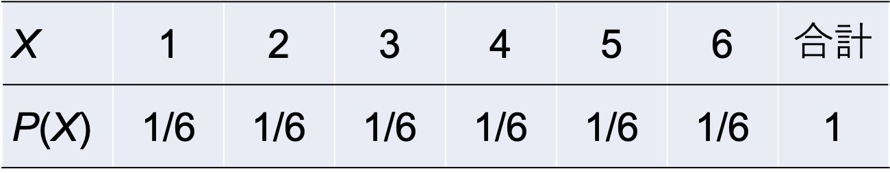
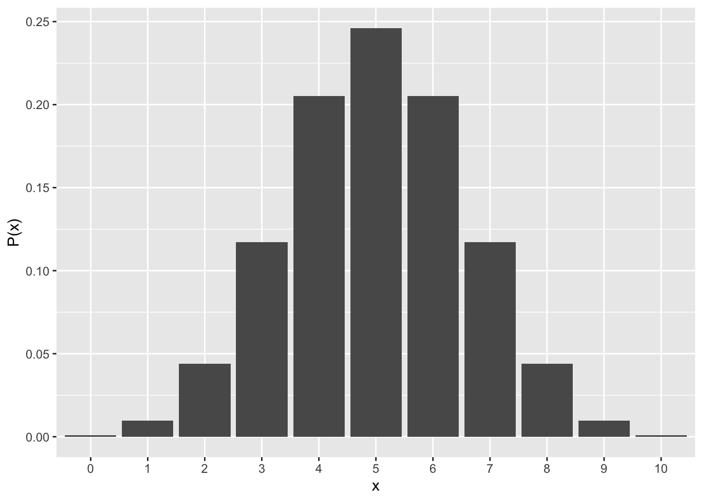
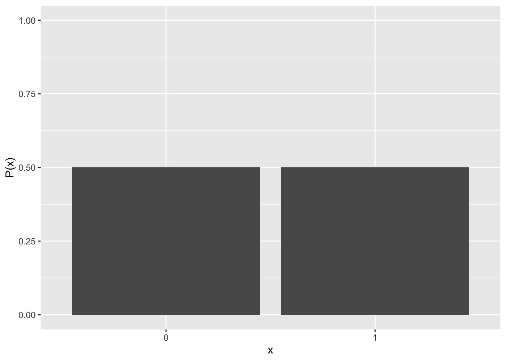
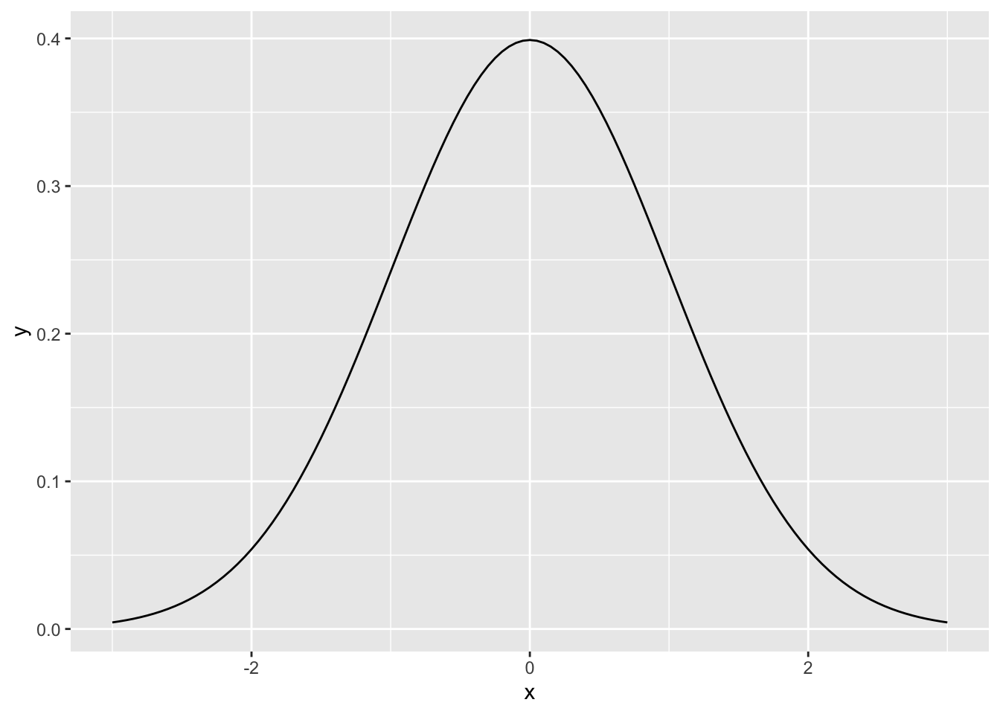
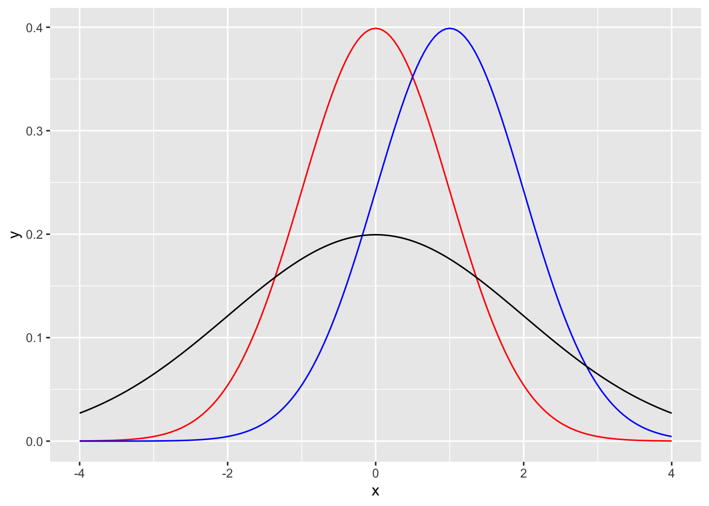
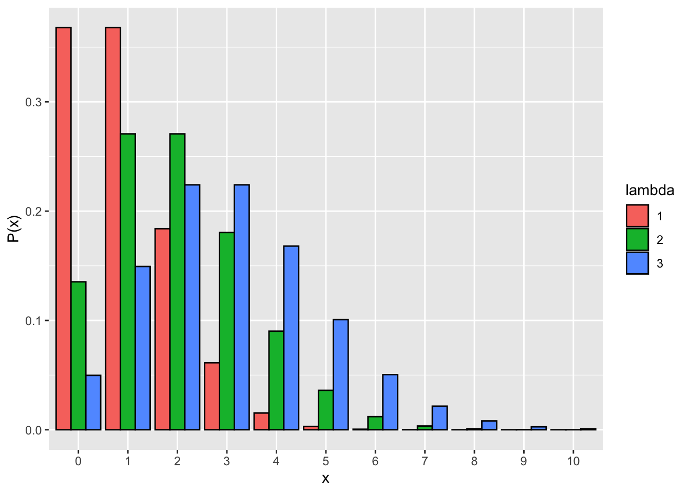
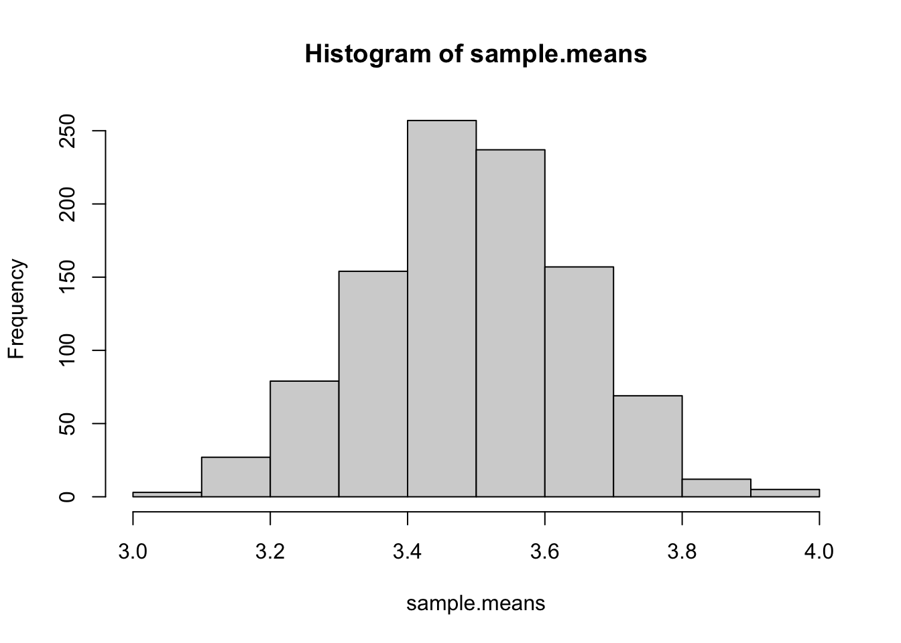
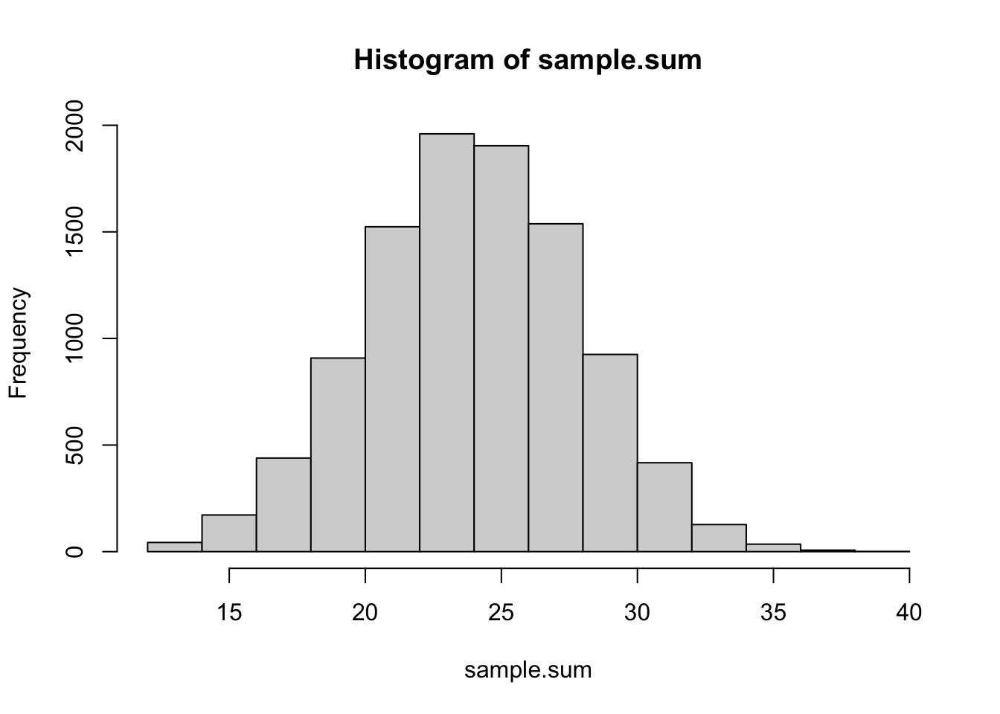
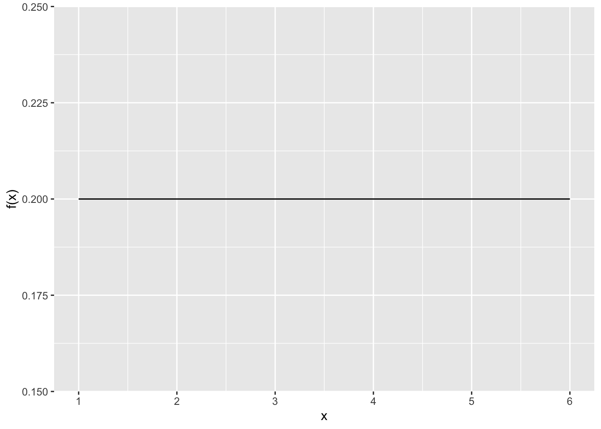

# 確率分布{#chap06_Probability}

前章まではRの使い方について扱ってきたが、この章以降から本格的に統計解析を学んでいく。まずは、基礎統計学の復習として、「確率分布」を学んでいく。確率分布は統計学の基礎であると同時に、今後学んでいく**統計モデル**を理解する上でとても重要な知識である。  
  
* 確率変数と確率分布
* 一様分布  
* 二項分布  
* 正規分布  
* ポアソン分布  
* Rの確率分布関数  
* 中心極限定理  
* その他の確率分布  
  
準備として、以下のプログラムを実行しよう。
この章でも`ggplot2`パッケージを使うので、ロードしておく。  


``` r
library(ggplot2)
```

更に、乱数の種を指定する。`set.seed(1)`と入力して実行する。このプログラムを実行しておくと、このテキストに書かれているプログラムの結果と同じ結果を再現できる。


``` r
set.seed(1)
```


## 確率変数と確率分布{#chap06_ProbDistribution}

まず、サイコロを例として、確率分布とは何かについて理解する。   
  
サイコロを1個投げるとする。それぞれの目が出る確率は1/6である。それぞれの目を$X$（1, 2, 3, 4, 5, 6）、それぞれの目が出る確率を$P(X)$とする。$X$と$P(X)$を以下の表で示す。 

  
  
このとき、Xを**確率変数**と呼ぶ。確率変数とは、その値と対応する確率が存在する変数のことをいう。表のように、確率変数とその変数が取り得る確率の分布を**確率分布**という。  
  
確率分布は大きく分けて、確率変数が離散値である**離散型分布**と連続値である**連続型分布**に分かれる。  

### 離散型分布{#chap06_Discrete}

確率変数が**離散値**（小数の値を取らないもの）である場合の確率分布である。例えば、以下のようなものがある。  
  
* （離散型）一様分布  
* 二項分布  
* ベルヌーイ分布  
* ポアソン分布  
* 負の二項分布  
* 多項分布  
  

### 連続型分布{#chap06_Continuous}

確率変数が**連続値**（小数の値が存在するもの）である確率分布である。例えば、以下のようなものがある。  

* （連続型）一様分布  
* 正規分布  
* 指数分布  
* 対数正規分布  
* t分布  
* χ二乗分布  
* コーシー分布  
* ガンマ分布  

  
今後の章でも扱う確率分布として、**二項分布**（ベルヌーイ分布）、**正規分布**、**ポアソン分布**について学んでいく。


## 二項分布{#chap06_Binomial}

コインを$n$回投げる。表が出る確率を$q$とすると、裏が出る確率は$(1-q)$である。$n$回中表が$x$回出る確率$P(x)$は、以下の式で求められる。

$$
P(x) = {}_n\mathrm{C}_xq^{x}(1-q)^{(n-x)}
$$

$x$を確率変数とした場合、上記の式の確率に従う確率分布を**二項分布(binomial distribution)**という。
  
つまり二項分布は、**2つのカテゴリで表現されるある事象が何回生じるか**の確率を表している。コイン（表か裏）を何回か投げたときに表が出る回数、学生の中から何人か選んだときの男の人数など。これらのような事象が生じる確率は、理論的には二項分布に従う。
  

例えば、コインの表が出る確率$q$を0.5とする。10回投げたときに表が6回出る確率を計算してみよう。Rならば、`dbinom()`関数を使えば計算できる（この関数の意味については、また後で説明する）。


``` r
#xは確率変数（コインの例でいうと表が出た回数）、sizeは試行回数（コインの例でいうとコインを投げた回数）、
dbinom(x=6, size=10, prob=0.5)
```

```
## [1] 0.2050781
```

``` r
#上の式n, x, pに実際に値を入れて計算する。dbinom()関数を使った場合と結果が一致することを確認しよう。
choose(10, 6) * 0.5^6 * (1 - 0.5) ^4
```

```
## [1] 0.2050781
```

### 二項分布の期待値と分散{#chap06_BinomStat}

表が出る回数$x$が0〜10の全てについて、それぞれが生じる確率を計算すると以下のようになる。


``` r
dbinom(x=0:10, size=10, prob=0.5)
```

```
##  [1] 0.0009765625 0.0097656250 0.0439453125 0.1171875000 0.2050781250
##  [6] 0.2460937500 0.2050781250 0.1171875000 0.0439453125 0.0097656250
## [11] 0.0009765625
```

グラフにすると以下のようになる。横軸をx, 縦軸をP(x)とする。


``` r
d_plot = data.frame(x=0:10, p=dbinom(x=0:10, size=10, prob=0.5))

p = ggplot2::ggplot() + 
  ggplot2::geom_bar(data = d_plot, aes(x = factor(x), y = p), stat="identity") + 
  labs(y= "P(x)", x= "x")
p
```



グラフからもわかるように、表が出る確率が0.5のコインを10回投げたときに、最も出やすいのは10回中5回であることがわかる。10回中8回以上はほとんどまれであることがわかる。  
この図からも、確率分布には最も出やすい変数（平均値。確率分布の場合は「期待値」と呼ぶ）と分散が存在することがわかる。  
  
二項分布の期待値$E(x)$と分散$Var(x)$は、以下の式から計算できる。

$$
E(x) = nq\\
Var(x) = nq(1-q)
$$

この式から、表が出る確率が0.5（つまり、$q=0.5$）として、10回投げた場合(つまり, $n=10$)における、表が出る回数の期待値と分散を計算してみよう。


``` r
#E(x) = nq
10*0.5
```

```
## [1] 5
```

``` r
#Var(x) = nq(1-q)
10*0.5*(1-0.5)
```

```
## [1] 2.5
```

### ベルヌーイ分布{#chap06_Bernoulli}

二項分布で$n=1$のときは、**ベルヌーイ分布(Bernoulli distribution)**と呼ぶ。$x$は1か0を取る変数で、$x=1$のときの確率を$q$とすると、$x=1$及び$x=0$となる確率は以下の式で表される。
  
$$
P(x=1) = q\\
P(x=0) = 1 - q\\
$$


例： 
コインを一回だけ投げたときに、表が出るあるいは裏が出る確率。
サイコロを一回だけ振ったときに、1が出るあるいは1以外が出る確率。


``` r
dbinom(x=0:1, size=1, prob=0.5) #表が出る確率0.5のコインを投げた時に、表が出ない時の確率と表が出る時の確率が出力される。
```

```
## [1] 0.5 0.5
```

``` r
dbinom(x=0:1, size=1, prob=1/6)#ある目が出る確率1/6のサイコロを振った時に、その目以外が出る確率とその目が出る確率が出力される。
```

```
## [1] 0.8333333 0.1666667
```


``` r
d_plot = data.frame(x=0:1, p=dbinom(x=0:1, size=1, prob=0.5))

p = ggplot2::ggplot() + 
  ggplot2::geom_bar(data = d_plot, aes(x = factor(x), y = p), stat="identity") + 
  ylim(c(0, 1)) + 
  labs(y= "P(x)", x= "x")
p
```




## 正規分布{#chap06_Gaussian}

### 正規分布の基礎{#chap06_Gaussian1}

統計学で用いられる確率分布の中でも有名なのは、**正規分布(normal distribution)**である。正規分布は、平均$\mu$、標準偏差$\sigma$を持つ確率分布で、釣鐘型（ベル・カーブ）の分布を描く。  
  
平均$\mu$、標準偏差$\sigma$とする正規分布の確率密度関数$f(x)$は、以下の式から計算される（「確率密度関数」とは何かは、後で説明する）。  
  

$$
f(x) = \frac{1}{\sqrt{2\pi\sigma^2}}\exp\left(-\frac{(x-\mu)^2}{2\sigma^2}\right)
$$

***

正規分布の式を覚える必要はない。式の中に平均$\mu$と標準偏差$\sigma$が含まれていることだけ覚えておこう。また、正規分布は**ガウス分布（gaussian distribution）**と呼ばれることもある。  

***

試しに、平均0、標準偏差1の正規分布のグラフを作ってみよう。以下のプログラムでは`dnorm()`という新しく出てきた関数もあるが、使い方については後で解説する。


``` r
x = seq(-3, 3, 0.05) # -3から3まで0.05刻みで数字の連続を作る
y = dnorm(x=x, mean=0, sd=1) #平均0、標準偏差1の正規分布の確率を算出する
dat_norm = data.frame(x = x, y = y)

p = ggplot2::ggplot() + 
  ggplot2::geom_line(data = dat_norm, aes(x = x, y = y))
p
```



### 確率密度関数{#chap06_ProbDensity}

正規分布のグラフは確率分布を表しているのではなく、**確率密度関数**であることにも注意してほしい。先程の二項分布では、縦軸は、横軸の値（確率変数）が生じる「確率」そのものを意味していた。しかし、正規分布のグラフの縦軸は、横軸の値が生じる確率を意味しない。確率密度関数は、**グラフの面積**が確率を表す。
  

例えば、x = 0のときのyの値を確認しよう。


``` r
dnorm(x = 0, mean = 0, sd = 1)  # 平均0、標準偏差1に従う正規分布 
```

```
## [1] 0.3989423
```

`dnorm()`は、確率密度関数の縦軸の値を出力する。`x = 0`のときの縦軸の値は0.4であり、先程のグラフからもわかるように、縦軸の値と一致している。しかし、`x = 0`が生じる確率は0.4ではない。確率密度関数の場合、縦軸の値そのものは何の意味も持たない。  
  
***
  
二項分布のような離散型の変数である場合に対して、正規分布のように変数が連続型（小数点を含む値）であるものは、特定の値の確率を定義することができない。例えば、身長が170.5cmである確率を求めるにしても、170cmから171cmまでの間に,170.001cm, 170.002cmと無限の値が広がっている。170.5cmぴったりである確率を求めることはできず、連続型の変数において特定の値が生じる確率はゼロということになる。したがって、連続型の変数の確率については、個々の確率を求めるのではなく、確率密度関数によって区間の確率を求める方法が取られる。  
  
***
  
x < 0の範囲の面積を求めよう。正規分布の左半分なので、確率は0.5である。


``` r
pnorm(q = 0, mean = 0, sd = 1) #-∞からqの値までの範囲を求めてくれる。
```

```
## [1] 0.5
```


### 正規分布の平均値と標準偏差{#chap06_GaussStat}

以下が、平均$\mu$と標準偏差$\sigma$の値をそれぞれ変えた場合の正規分布である。赤が平均0で標準偏差1、青が平均1で標準偏差1, 黒が平均0で標準偏差2である。平均と標準偏差によって、正規分布の形状が変化することを理解しよう。  
  


``` r
x = seq(-4, 4, 0.05)

y_1 = dnorm(x=x, mean=0, sd=1) 
y_2 = dnorm(x=x, mean=1, sd=1) 
y_3 = dnorm(x=x, mean=0, sd=2) 


dat_norm_1 = data.frame(x = x, y = y_1)
dat_norm_2 = data.frame(x = x, y = y_2)
dat_norm_3 = data.frame(x = x, y = y_3)

p = ggplot2::ggplot() + 
  ggplot2::geom_line(data = dat_norm_1, aes(x = x, y = y), color="red")+
  ggplot2::geom_line(data = dat_norm_2, aes(x = x, y = y), color= "blue")+
  ggplot2::geom_line(data = dat_norm_3, aes(x = x, y = y), color="black")
p
```




## ポアソン分布{#chap06_Poisson}

xは0以上の整数（0, 1, 2, 3, ...）とする。xがポアソン分布に従う場合、xの値それぞれが生じる確率は以下のように表す。

$$
P(x) = \frac{\lambda^x\exp(-\lambda)}{x!}\\
$$

**ポアソン分布 (Poisson distribution)**の期待値（平均）は$\lambda$、分散は$\lambda$である。つまり、ポアソン分布は平均と分散が等しい分布である。
以下に、$\lambda$をそれぞれ変えた場合のポアソン分布を示す。


``` r
pois_1 = data.frame(x=seq(0,10), p=dpois(seq(0,10), lambda=1), lambda=1)
pois_2 = data.frame(x=seq(0,10), p=dpois(seq(0,10), lambda=2), lambda=2)
pois_3 = data.frame(x=seq(0,10), p=dpois(seq(0,10), lambda=3), lambda=3)
pois = rbind(pois_1, pois_2, pois_3)

ggplot() +
  ggplot2::geom_bar(data = pois, aes(x=factor(x), y=p, fill=factor(lambda)), stat="identity", color = "black", position = "dodge") + 
  labs(y= "P(x)", x = "x", fill = "lambda")
```



一定の期間中にランダムで生じる事象はポアソン分布に従う。具体的な例としては、1日の間に届くメールの件数、営業時間中に来る客の数など。  
  
二項分布の試行数$n$が十分大きくかつ確率$q$が小さい場合は、平均を$np$とするポアソン分布に近似する。つまり、*めったに起こらない事象*はポアソン分布に従う。例えば、1年間の間に生じる交通事故の件数など（365日それぞれの日に0.1%で生じる場合など）。歴史的に有名な例として、「ドイツ軍で1年間で馬に蹴られて死亡した兵士の数」がポアソン分布に従うといったものがある。  
  
二項分布と同じく、*ポアソン分布の確率変数は離散値である*。離散値は、1個、2個、3個と数える個数のような整数の値をいう（1.1個といった小数の値が存在しないもの）。それに対し、正規分布の確率変数は連続量である。


## Rで使える確率分布関数{#chap06_RProbfunction}

ここまで、`dbinom`、`dnorm`, `dpois`, `pnorm`など、確率分布を扱う関数がいくつか出てきた。これらは、Rに標準で入っている関数である。  
  
Rには確率分布から乱数を生成したり、確率変数の確率を求めることができる関数が実装されている。関数は、確率分布それぞれに`rXXXX`, `qXXXX`, `pXXXX`, `dXXXX`といった4種類の関数が用意されている（
XXXXには確率分布の種類が入る）。  
  

`rXXXX`は、乱数(random number)を出力する。


``` r
rnorm(n = 10, mean = 0, sd = 1) #平均0、標準偏差1に従う正規分布から乱数を10個生成する
```

```
##  [1] -0.6264538  0.1836433 -0.8356286  1.5952808  0.3295078 -0.8204684
##  [7]  0.4874291  0.7383247  0.5757814 -0.3053884
```

`dXXXX`は、確率変数xが生じる確率密度（確率密度関数の縦軸の値）を出力する。


``` r
dnorm(x = 0.5, mean = 0, sd = 1)  # 平均0、標準偏差1に従う正規分布 で、x=0.5のときの確率密度を求める（確率密度の値であって、確率そのものではないので注意）
```

```
## [1] 0.3520653
```

`qXXXX`は、確率点(quantile)を出力する。ある確率を取る時のx軸の値を出力してくれる。


``` r
qnorm(p = 0.5, mean = 0, sd = 1)  # 平均0、標準偏差1に従う正規分布 で、p ≤ 0.5の確率となるときの確率変数の値を求める
```

```
## [1] 0
```

`pXXXX`は、累積確率を出力する。


``` r
pnorm(q = 1, mean = 0, sd = 1)  # 平均0、標準偏差1に従う正規分布 で、x ≤ 1の確率を求める
```

```
## [1] 0.8413447
```


他の確率分布についても同様に、4種類の関数が用意されている。


``` r
#乱数を作る関数
runif(n=100, min = 0, max = 1) #一様分布からの乱数
rbinom(n=100, size = 10, prob = 0.5) #二項分布からの乱数
rpois(n=100, lambda = 3) #ポアソン分布からの乱数
```


## 正規分布と他の確率変数との関係{#chap06_Theorem}

なぜ正規分布は「正規（normal）」な分布なのか？よく言われるのは、「現実世界の様々な分布が正規分布に従う」からという説明である。  
  
しかし、現実には正規分布に従わないデータの方が多い。体重や身長なども、実際には正規分布を描くことは少ない。年収なども釣鐘型の分布にならない。また、正規分布は確率変数が連続量の場合の確率分布である。心理学ではアンケートへの回答得点などを分析したりするが、離散値や順序尺度（すなわちカテゴリカル変数）が正規分布に従うという前提を置くのはそもそも適切ではない。  
   
では、正規分布がよく使われる理由は何か。もっとらしい理由は、数学的な扱いやすさである。なぜならば、元の変数がどのような確率分布に従っていたとしても、**変数を足し合わせた結果は正規分布に従う**という都合の良い性質があるからである。この性質は、**中心極限定理**と呼ばれるものである。中心極限定理により、正規分布は身近に現れる「正規な分布」となり得るのである。

### 中心極限定理{#chap06_Theorem1}


**中心極限定理**とは、「母集団が平均及び標準偏差を持つ確率分布であるならば、たとえ母集団が正規分布でなくても、母集団から標本を無作為抽出して平均値を計算することを何回も繰り返すとその分布は正規分布に近づく」という定理である。  
  
    
シミュレーションで中心極限定理を実感してみよう。6面のサイコロを100回振る実験を行うとする。  
  
以下のプログラムを実行してみよう。`runif()`は一様分布から乱数を生成する関数である（一様分布の詳細については、以降の「その他の確率分布」を参照）。`round()`は値を丸める関数で、以下では小数点以下の値を丸めて整数の値を出力するようにしている。


``` r
X = round(runif(n = 100, min = 1, max = 6),0)
mean(X)
```

```
## [1] 3.5
```

それぞれの目が出る確率は1/6で一定である。すなわち、サイコロが出る目は一様分布に従う（つまり、元の分布は正規分布ではない）。一様分布の平均値は、最大値をa, 最小値をbとすると、(a+b)/2。つまり、サイコロの例の場合の平均値は理論的には(1+6)/2=3.5となる。  
    
サイコロを100回振って平均値を求める。この平均値を求めるのを、1,000回繰り返す。求めた平均値1,000個の分布を見てみよう。  
  
以下のプログラムで、シミュレーションとグラフの作成を行う。`sapply`は、ある処理を繰り返し行う関数である。詳細な説明は省くが、以下のプログラムでは、100回サイコロを振って平均値を求める処理`mean(round(runif(n = 100,min=1,max=6),0))`を1,000回行ってその結果を保存して、`sample.means`という名前のベクトルで保存している。


``` r
sample.means = sapply(c(1:1000), function(x) {mean(round(runif(n = 100,min=1,max=6),0))} )

hist(sample.means)
```




ヒストグラムは正規分布に似ている。もっと回数を増やすと、より正規分布っぽいかたちになる。  


``` r
#サイコロを7回振ってその合計を求める。これを10,000回行ったときの出目の合計値の分布

sample.sum = sapply(c(1:10000), function(x) {sum(round(runif(n = 7,min=1,max=6),0))} )#sum()はカッコ内のベクトルの要素を足し合わせる関数

hist(sample.sum)
```




このように、元の母集団の分布がたとえ正規分布でなくても（この例の場合は一様分布）、その標本平均は正規分布に近似する。平均値を計算しなくても、単に値を足し合わせるだけでも同じある。  
  
中心極限定理により、たとえ元の変数が正規分布に従っていなくても、変数を加算したものは正規分布に近似する。なので、心理学で行われる様々なデータ分析も、以下のような処理を行うことで変数が正規分布に従うという前提を置いて分析が行われる。
  
* 複数の質問項目（順序尺度）をまとめて平均化した心理尺度を分析に使う。  
* 選挙への投票（「した」もしくは「しなかった」の二値）者の割合を県ごとに算出して、県を単位として分析に使う。  

中心極限定理は簡単に言うと、「**どのような確率分布に従う変数でも、足し合わせると正規分布に近づく**」ということである。

***

ただし、中心極限定理が成り立たない（足し合わせても正規分布に近似しない）確率分布もある。詳しくは、付録の「確率分布」の「コーシー分布」の解説を参照のこと。


## 確率分布の表現の仕方{#chap06_ProbDistEquation}

確率変数と確率分布の関係は、以下のように表現することもある。


#### 二項分布の場合{-}

$$
x \sim \text{Binomial}(n, q)
$$

Binomialのカッコ内のn, qのように、確率分布を構成する変数のことを**パラメータ(parameter)**と呼ぶ。
Binomialは二項分布、$\sim$は「従う」という意味である。つまりこの式は、「$x$は、$n$と$q$をパラメータとする二項分布に従う」ということを示している。


#### 正規分布の場合{-}


$$
x \sim \text{Normal}(\mu, \sigma)
$$


正規分布のパラメータは、平均$\mu$と標準偏差$\sigma$である。この2つが決まれば、正規分布の形状が決まる。  
  
#### ポアソン分布の場合{-}


$$
x \sim \text{Poisson}(\lambda)
$$

ポアソン分布のパラメータは、平均及び分散を表す$\lambda$のみである。


## その他の確率分布{#chap06_OtherDist}


他にも、確率分布はたくさんある。ここでは、この章でも挙げている一様分布について解説する。その他、統計分析でよく使う確率分布については付録を参照のこと。  
  
### 一様分布{-}

冒頭の確率分布の説明の際に挙げた「1個のサイコロを振ったとき、それぞれの目が出る確率」は、どれも1/6で等しい。このように、どの確率変数$X$についても常に一定の値の確率を取る確率分布は、**一様分布(uniform distribution)**という。  

一様分布は確率変数が離散値の場合もあれば、連続値の場合もある。サイコロの例は、離散型一様分布である。  
一様分布を扱うRの関数(`dunif`, `runif`など)は連続型一様分布を扱う関数である。  
連続型一様分布を式で表すと以下のようになる（$min$は取りうる値の最小値、$max$は最大値を意味する。

$$
f(x) = \frac{1}{max - min}\\
x \sim \text{Uniform}(min, max)\\
$$

例えば、以下は最小値が1、最大値が6の連続型一様分布である。以下のグラフは確率密度を示してあり、ある範囲の面積の合計がその範囲の値が生じる確率を意味する。




## 確認問題{#chap06_Practice}


### 問１{-}

あなたは野球部の監督で、自分のチームの勝率はこれまでの練習の経験から32%だとわかっている。  
  
これから遠征で、全部で10試合を行う予定である。

* 勝つ試合の回数をnとし、nとそれぞれのnに対応する確率を求めよ。  
  
ヒント:dbinom()関数を使おう。

* 平均して何試合勝つことができるかを求めよ。

ヒント:二項分布の平均値の求め方を復習する。


### 問２{-}

ある学校で小学6年生の身長を測ったところ、平均は150.2 cmで標準偏差が3.5 cmであった。

* 身長152 cmから155 cmの児童の割合はいくらか。  

ヒント：pnorm()を使って求めよう。  

* 身長158 cmを超える児童の割合はいくらか。  

ヒント：同じく、pnorm()を使う。なお、全ての範囲の確率の合計は1である。


