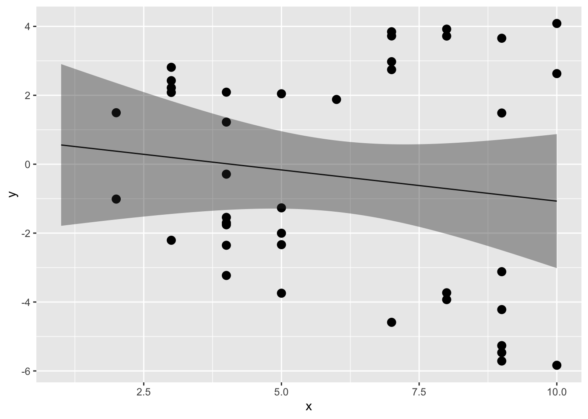
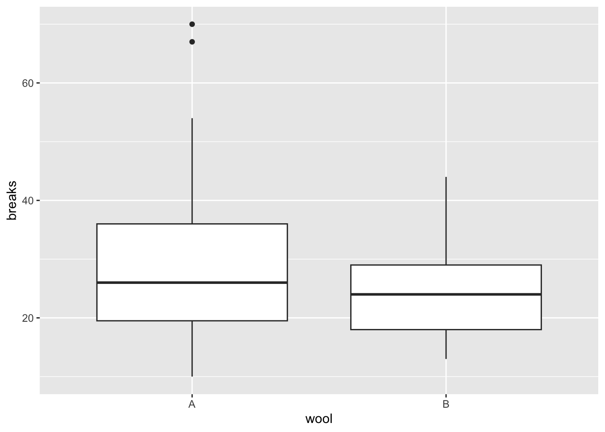

# 線形モデル（t検定, 分散分析, 共分散分析）{#chap11_lmmodels}

前の章では、線形モデルの概要を見てきた。前の章で線形モデルを用いて行った分析は、要は「単回帰分析（一つの連続変量から、もう一方の連続変量の値を予測する分析）」であった。  
  
この章では、線形モデルを用いて他の分析を行う。予測変数のパターンが異なるケースの演習を通して、線形モデルは正規分布を扱うあらゆるタイプの分析を内包したモデルであることを確認していく。  

* 変数の標準化  
* 予測変数がカテゴリの場合（ダミー変数）  
* 予測変数がカテゴリの場合（複数のダミー変数）  
* 交互作用    


## 準備{#chap11_preparation}
  
必要なパッケージをロードする。


``` r
library(dplyr)
library(ggplot2)
```

  
## 線形モデルに含まれる統計解析{#chap11_lmgroup}  
  
線形モデルとは特定の解析を指すものではなく、正規分布を扱う様々な統計解析を包括的に扱う統計モデルである。例えば、変数の正規性を前提とするt検定や分散分析も線形モデルの中に含まれる。予測変数の種類や個数の違いによって、線形モデルは以下のそれぞれの統計解析と一致する。
  

|分析       |予測変数                   |予測変数の個数                 |
|:----------|:--------------------------|:------------------------------|
|t検定      |二値(0 or 1)               |1個                            |
|分散分析   |二値                       |2個以上                        |
|共分散分析 |二値及び連続量             |二値が2個以上、連続量が1個以上 |
|単回帰分析 |連続量                     |1個                            |
|重回帰分析 |連続量（二値を含んでも可） |2個以上                        |

前章では単回帰分析（予測変数が連続量で1個）を例として演習を行った。以下では、t検定や分散分析と似たことを`lm()`関数で行う練習を通して、**予測変数がカテゴリーの場合**の扱い方を学んでいく。


## 変数の標準化{#chap11_scaling}

解析の演習に入る前に、**標準化(standardizing)**について確認しておこう。標準化とは、元の値を「ゼロが平均値、1が標準偏差」と等しくなるように値を変換する処理のことをいう。変数を標準化しておくと、線形モデルの係数の解釈が直感的に理解しやすくなる事が多い。  
  
例えば、前の章では`iris`データを使って単回帰分析を行った。


``` r
dat = iris #ここではirisを別の名前（dat）に変えて練習に用いる
result = lm(data = dat, Petal.Length ~ 1 + Sepal.Length)
summary(result)
```

```
## 
## Call:
## lm(formula = Petal.Length ~ 1 + Sepal.Length, data = dat)
## 
## Residuals:
##      Min       1Q   Median       3Q      Max 
## -2.47747 -0.59072 -0.00668  0.60484  2.49512 
## 
## Coefficients:
##              Estimate Std. Error t value Pr(>|t|)    
## (Intercept)  -7.10144    0.50666  -14.02   <2e-16 ***
## Sepal.Length  1.85843    0.08586   21.65   <2e-16 ***
## ---
## Signif. codes:  0 '***' 0.001 '**' 0.01 '*' 0.05 '.' 0.1 ' ' 1
## 
## Residual standard error: 0.8678 on 148 degrees of freedom
## Multiple R-squared:   0.76,	Adjusted R-squared:  0.7583 
## F-statistic: 468.6 on 1 and 148 DF,  p-value: < 2.2e-16
```

切片の値は`Sepal.Length`がゼロのときの`Petal.Length`の予測値である。しかし、アヤメの花弁の長さがマイナスやゼロの値を取るというのはありえない。また、切片は予測変数がゼロのときの応答変数の値であるが、このデータも予測変数（すなわちがくの長さ）がゼロの場合も論理的には有り得ない。このように、元の値をそのまま使っても係数の解釈にこまる場面がある。  
  
  
応答変数及び予測変数を標準化したものを使って同じ解析をして、結果を比較してみよう。具体的には、元の得点から**平均値を引いて**差の得点を求め、その差の得点を**標準偏差で割る**。


``` r
dat = dat |> dplyr::mutate(Petal.Length_std = (Petal.Length - mean(Petal.Length))/sd(Petal.Length),
                           Sepal.Length_std = (Sepal.Length - mean(Sepal.Length))/sd(Sepal.Length))

head(dat)
```

```
##   Sepal.Length Sepal.Width Petal.Length Petal.Width Species Petal.Length_std
## 1          5.1         3.5          1.4         0.2  setosa        -1.335752
## 2          4.9         3.0          1.4         0.2  setosa        -1.335752
## 3          4.7         3.2          1.3         0.2  setosa        -1.392399
## 4          4.6         3.1          1.5         0.2  setosa        -1.279104
## 5          5.0         3.6          1.4         0.2  setosa        -1.335752
## 6          5.4         3.9          1.7         0.4  setosa        -1.165809
##   Sepal.Length_std
## 1       -0.8976739
## 2       -1.1392005
## 3       -1.3807271
## 4       -1.5014904
## 5       -1.0184372
## 6       -0.5353840
```

標準化した得点を用いて線形モデルで解析を行う。


``` r
result_std = lm(data = dat, Petal.Length_std ~ 1 + Sepal.Length_std)
summary(result_std)
```

```
## 
## Call:
## lm(formula = Petal.Length_std ~ 1 + Sepal.Length_std, data = dat)
## 
## Residuals:
##      Min       1Q   Median       3Q      Max 
## -1.40343 -0.33463 -0.00379  0.34263  1.41343 
## 
## Coefficients:
##                   Estimate Std. Error t value Pr(>|t|)    
## (Intercept)      1.333e-16  4.014e-02    0.00        1    
## Sepal.Length_std 8.718e-01  4.027e-02   21.65   <2e-16 ***
## ---
## Signif. codes:  0 '***' 0.001 '**' 0.01 '*' 0.05 '.' 0.1 ' ' 1
## 
## Residual standard error: 0.4916 on 148 degrees of freedom
## Multiple R-squared:   0.76,	Adjusted R-squared:  0.7583 
## F-statistic: 468.6 on 1 and 148 DF,  p-value: < 2.2e-16
```


標準化しない得点を使ったときの解析結果と比べると、係数の値が変わっている。しかし、傾きのt値及びp値は変わっていない（標準化は単にデータを平行移動させただけなので、回帰直線の傾きは変わらない）。  
  
切片は0、`Sepal.Length_std`の効果は0.87である。切片の値は、`Sepal.Length_std`がゼロのとき、つまり`Sepal.Length`が平均値と等しいとき、`Petal.Length_std`はほぼゼロの値を取る、つまり`Petal.Length`の平均値であることを意味している。また、`Sepal.Length_std`の傾きは、`Sepal.Length_std`が1のとき（つまり`Sepal.Length`が1標準偏差分増加したとき）、`Petal.Length_std`が0.87増えることを意味する。  
  
このように、標準化することで算出された係数の解釈がしやすくなることが多い。以降の線形モデルを扱う分析の例でも、応答変数は標準化したものを用いる。

***
Rには標準化を行うための関数も用意されている。`scale()`を用いる。


``` r
dat = iris |> dplyr::mutate(Petal.Length_std = scale(Petal.Length)) 

head(dat)
```

```
##   Sepal.Length Sepal.Width Petal.Length Petal.Width Species Petal.Length_std
## 1          5.1         3.5          1.4         0.2  setosa        -1.335752
## 2          4.9         3.0          1.4         0.2  setosa        -1.335752
## 3          4.7         3.2          1.3         0.2  setosa        -1.392399
## 4          4.6         3.1          1.5         0.2  setosa        -1.279104
## 5          5.0         3.6          1.4         0.2  setosa        -1.335752
## 6          5.4         3.9          1.7         0.4  setosa        -1.165809
```


## 予測変数がカテゴリカル変数の場合（ダミー変数）{#chap11_dummy}

予測変数はカテゴリカル変数（質的変数）でも構わない。ただし、予測変数を0か1のどちらかの値を取る**ダミー変数**(dummy variable)に変換する必要がある。  
  
Rに入っている`sleep`データを少し変えたもの使って、カテゴリカル変数を予測変数に含む線形モデルの解析をしてみよう。


``` r
sleep_1 = sleep |> dplyr::select(-ID) |> 
  dplyr::mutate(group = ifelse(group == 1, "control", "treatment"))
sleep_1
```

```
##    extra     group
## 1    0.7   control
## 2   -1.6   control
## 3   -0.2   control
## 4   -1.2   control
## 5   -0.1   control
## 6    3.4   control
## 7    3.7   control
## 8    0.8   control
## 9    0.0   control
## 10   2.0   control
## 11   1.9 treatment
## 12   0.8 treatment
## 13   1.1 treatment
## 14   0.1 treatment
## 15  -0.1 treatment
## 16   4.4 treatment
## 17   5.5 treatment
## 18   1.6 treatment
## 19   4.6 treatment
## 20   3.4 treatment
```

`group`はグループを意味する変数である（統制群`control`もしくは実験群`treatment`）。まずこれを、「`treatment`なら1、`control`なら0」とする新たな変数`dgroup`を作る。  


``` r
sleep_1 = sleep_1 |> dplyr::mutate(dgroup = ifelse(group == "treatment", 1, 0))
sleep_1
```

```
##    extra     group dgroup
## 1    0.7   control      0
## 2   -1.6   control      0
## 3   -0.2   control      0
## 4   -1.2   control      0
## 5   -0.1   control      0
## 6    3.4   control      0
## 7    3.7   control      0
## 8    0.8   control      0
## 9    0.0   control      0
## 10   2.0   control      0
## 11   1.9 treatment      1
## 12   0.8 treatment      1
## 13   1.1 treatment      1
## 14   0.1 treatment      1
## 15  -0.1 treatment      1
## 16   4.4 treatment      1
## 17   5.5 treatment      1
## 18   1.6 treatment      1
## 19   4.6 treatment      1
## 20   3.4 treatment      1
```

`ifelse()`関数は、`ifelse(XXX, A, B)`と表記することで、「XXXの条件に当てはまればA、当てはまらなければB」という処理をしてくれる。ここでは、変数`group`について、`treatment`ならば1, それ以外なら0に変換し、0か1を取る変数`dgroup`を新たに作った。  
  
この`dgroup`が*ダミー変数*である。  
  
解析に用いるモデルを確認すると、以下のようになる。

$$
\begin{equation}
  \hat{y} = \alpha + \beta dgroup \\ \tag{1}\\
  y \sim \text{Normal}(\hat{y}, \sigma)
\end{equation}
$$

$dgroup$は0か1のどちらかを取る変数で、$dgroup = 0$のとき、つまり統制群のとき、応答変数の予測値は$\mu = \alpha$となる。$dgroup = 1$のとき、つまり実験群のとき、応答変数の予測値は$\mu = \alpha + \beta$となる。すなわち、切片$\alpha$は統制群のときの効果、傾き$\beta$は実験群の時に加わる実験群特有の効果を意味する。  

`lm()`を使って、上のモデル式のパラメータの推定をしよう。


``` r
sleep_1 = sleep_1 |> dplyr::mutate(extra_std = scale(extra)) #応答変数を標準化したものを用いる

result = lm(data = sleep_1, extra_std ~ 1 + dgroup)
summary(result)
```

```
## 
## Call:
## lm(formula = extra_std ~ 1 + dgroup, data = sleep_1)
## 
## Residuals:
##     Min      1Q  Median      3Q     Max 
## -1.2042 -0.6467 -0.2874  0.7210  1.5709 
## 
## Coefficients:
##             Estimate Std. Error t value Pr(>|t|)  
## (Intercept)  -0.3915     0.2975  -1.316   0.2048  
## dgroup        0.7830     0.4208   1.861   0.0792 .
## ---
## Signif. codes:  0 '***' 0.001 '**' 0.01 '*' 0.05 '.' 0.1 ' ' 1
## 
## Residual standard error: 0.9409 on 18 degrees of freedom
## Multiple R-squared:  0.1613,	Adjusted R-squared:  0.1147 
## F-statistic: 3.463 on 1 and 18 DF,  p-value: 0.07919
```

2つの群間で平均値を比較するときにはt検定がよく使われる。`t.test()`関数を使って$dgroup=0$と$dgroup=1$との間で$y$の値の平均値を比較したときのt値及びp値の結果が、`lm()`の傾きのt値及びp値と一致することを確認しよう。


``` r
t.test(data = sleep_1, extra_std ~ dgroup)
```

```
## 
## 	Welch Two Sample t-test
## 
## data:  extra_std by dgroup
## t = -1.8608, df = 17.776, p-value = 0.07939
## alternative hypothesis: true difference in means between group 0 and group 1 is not equal to 0
## 95 percent confidence interval:
##  -1.6677984  0.1018292
## sample estimates:
## mean in group 0 mean in group 1 
##      -0.3914923       0.3914923
```

`lm()`の傾きの検定は、「傾きがゼロである」という帰無仮説を検定している。傾きの係数が意味することは、予測変数$dgroup$が1単位増えたときの応答変数$y$の変化量であった。傾きの検定は、「$dgroup=0$ から $dgroup=1$ に変化することによって、 応答変数（`extra`） が上昇（下降）するか（傾きがゼロではないか）」を検定している。要は、「$dgroup=0$と$dgroup=1$の間で$y$の値に差があるか」を検定しているのと論理的に同じである。  
  
このように、*予測変数が1つで、予測変数が二値（0もしくは1）であるときの線形モデルは、t検定に対応する*。  


## グループが複数ある場合（一要因の分散分析）{#chap11_onewayANOVA}

先ほどの例は、統制群と実験群の二つのグループの場合であった。例えば実験で統制群、実験群1、実験群2といったように三つ以上のグループを設定した場合は、どうダミー変数を作成すればよいのか？  
  
Rに入っている`PlantGrowth`を例として見ていこう。以下のプログラムを実行して、データを作ろう。


``` r
dat = PlantGrowth |>
  dplyr::mutate(t1 = ifelse(group == "trt1", 1, 0),
                t2 = ifelse(group == "trt2", 1, 0)
                )
dat
```

```
##    weight group t1 t2
## 1    4.17  ctrl  0  0
## 2    5.58  ctrl  0  0
## 3    5.18  ctrl  0  0
## 4    6.11  ctrl  0  0
## 5    4.50  ctrl  0  0
## 6    4.61  ctrl  0  0
## 7    5.17  ctrl  0  0
## 8    4.53  ctrl  0  0
## 9    5.33  ctrl  0  0
## 10   5.14  ctrl  0  0
## 11   4.81  trt1  1  0
## 12   4.17  trt1  1  0
## 13   4.41  trt1  1  0
## 14   3.59  trt1  1  0
## 15   5.87  trt1  1  0
## 16   3.83  trt1  1  0
## 17   6.03  trt1  1  0
## 18   4.89  trt1  1  0
## 19   4.32  trt1  1  0
## 20   4.69  trt1  1  0
## 21   6.31  trt2  0  1
## 22   5.12  trt2  0  1
## 23   5.54  trt2  0  1
## 24   5.50  trt2  0  1
## 25   5.37  trt2  0  1
## 26   5.29  trt2  0  1
## 27   4.92  trt2  0  1
## 28   6.15  trt2  0  1
## 29   5.80  trt2  0  1
## 30   5.26  trt2  0  1
```

ダミー変数を2つ作成した。`ctrl`のときは「`t1` = 0, `t2` = 0」,`trt1`のときは「`t1` = 1, `t2` = 0」,`trt2`のときは「`t1` = 0, `t2` = 1」となっている。これら２つのダミー変数を線形予測子に加えたモデルは、モデルは以下のようになる。

$$
\begin{equation}
  \hat{y} = \alpha + \beta_{t1} t_1 + \beta_{t2} t_2  \\ \tag{3}
  y \sim \text{Normal}(\hat{y}, \sigma)
\end{equation}
$$
切片$\alpha$は「`t1` = 0, `t2` = 0（すなわち、`ctrl`のとき）」の$\hat{y}$の値と等しい。  
傾き$\beta_{t1}$は「`t1` = 1, `t2` = 0（すなわち、`trt1`のとき）」の$\hat{y}$の値と等しい。  
傾き$\beta_{t2}$は「`t1` = 0, `t2` = 1（すなわち、`trt2`のとき）」の$\hat{y}$の値と等しい。  
  
このように、グループの数が$K$個ある場合には、ダミー変数を$K-1$個作れば全てのグループの予測値$\hat{y}$を線形予測子で表すことができる。

`lm()`で傾き及び切片のパラメータを推定しよう。


``` r
dat = dat |> dplyr::mutate(weight_std = scale(weight)) #応答変数を標準化したものを用いる
result = lm(data = dat, weight_std ~ t1 + t2 + 1) 
summary(result)
```

```
## 
## Call:
## lm(formula = weight_std ~ t1 + t2 + 1, data = dat)
## 
## Residuals:
##      Min       1Q   Median       3Q      Max 
## -1.52740 -0.59613 -0.00856  0.37472  1.95239 
## 
## Coefficients:
##             Estimate Std. Error t value Pr(>|t|)  
## (Intercept) -0.05847    0.28113  -0.208   0.8368  
## t1          -0.52910    0.39758  -1.331   0.1944  
## t2           0.70451    0.39758   1.772   0.0877 .
## ---
## Signif. codes:  0 '***' 0.001 '**' 0.01 '*' 0.05 '.' 0.1 ' ' 1
## 
## Residual standard error: 0.889 on 27 degrees of freedom
## Multiple R-squared:  0.2641,	Adjusted R-squared:  0.2096 
## F-statistic: 4.846 on 2 and 27 DF,  p-value: 0.01591
```


式（3）より、切片の推定値は$t_1=0$かつ$t_2=0$のときの$\mu$、つまり統制群(ctrl)のときの応答変数`weight_std`の推定値を意味している。各ダミー変数の係数（傾き）は、切片に加わる各条件の効果を意味している。例えば、`t2`の係数は0.7であるが、これは$t_2$のとき（つまりtrt2のとき）の応答変数の予測値は、 0.65(= 切片 + `t2`の傾き)となることを示している。  
  
係数の意味することは、基準となるグループ（どのダミー変数も0となるグループ）と比べての効果ということになる。  
  

図でも条件別に`weight_std`の分布を確認してみよう。分布を見ても同様の傾向があるが、線形モデルの解析の結果その効果が有意であることが確認できた。
  

``` r
ggplot() + 
  geom_boxplot(data = dat, aes(x = group, y = weight_std))
```


モデル（式）を確認しながら、係数が何を意味しているのかを常に意識するようにしよう。

***

このテキストでは練習のためにダミー変数を自分でプログラムを書いて作っているが、`lm()`関数にカテゴリカル変数をそのまま入れても結果を出力してくれる。カテゴリのうちアルファベット順で最初に出てくるカテゴリ(以下の`PlantGrowth`の例では`ctrl`)を基準として、残りのダミー変数を自動で作ってくれている。


``` r
dat = PlantGrowth |> dplyr::mutate(weight_std = scale(weight)) #応答変数を標準化したものを用いる
result = lm(data = dat, weight_std ~ group) 
summary(result)
```

```
## 
## Call:
## lm(formula = weight_std ~ group, data = dat)
## 
## Residuals:
##      Min       1Q   Median       3Q      Max 
## -1.52740 -0.59613 -0.00856  0.37472  1.95239 
## 
## Coefficients:
##             Estimate Std. Error t value Pr(>|t|)  
## (Intercept) -0.05847    0.28113  -0.208   0.8368  
## grouptrt1   -0.52910    0.39758  -1.331   0.1944  
## grouptrt2    0.70451    0.39758   1.772   0.0877 .
## ---
## Signif. codes:  0 '***' 0.001 '**' 0.01 '*' 0.05 '.' 0.1 ' ' 1
## 
## Residual standard error: 0.889 on 27 degrees of freedom
## Multiple R-squared:  0.2641,	Adjusted R-squared:  0.2096 
## F-statistic: 4.846 on 2 and 27 DF,  p-value: 0.01591
```


## 交互作用（2要因の分散分析）{#chap11_interaction}

次は、線形モデルで**交互作用**を扱う方法について確認する。2要因以上の分散分析と同様のことを線形モデルで行う。  
  
以下のプログラムを実行して、サンプルデータ`d`を作ろう。


``` r
set.seed(1)
x = round(runif(n = 20, min = 1, max = 10),0) 
mu = 0.1 + 0.4 * x
y = rnorm(n = 20, mean = mu, sd = 1)
d_M = data.frame(x = x, y = y, gender = "M")

x = round(runif(n = 20, min = 1, max = 10),0) 
mu = 0.3 + -0.6 * x
y = rnorm(n = 20, mean = mu, sd = 1)
d_F = data.frame(x = x, y = y, gender = "F")

d = rbind(d_M, d_F)

head(d)
```

```
##   x        y gender
## 1 3 2.811781      M
## 2 4 2.089843      M
## 3 6 1.878759      M
## 4 9 1.485300      M
## 5 3 2.424931      M
## 6 9 3.655066      M
```


このデータ`d`には、`x`, `y`, `gender`の3つの変数が含まれている。`gender`は性別を意味する変数とする。M（男性）かF（女性）のいずれかである。男女別に、実験で2つの変数を測定したとしよう。

応答変数を`y`、予測変数を`x`として線形モデルで切片及び`x`の傾きのパラメータを推定する。モデルは以下のようになる。

$$
\begin{equation}
  \hat{y} = \alpha + \beta x  \\ \tag{4}
  y \sim \text{Normal}(\hat{y}, \sigma)
\end{equation}
$$


`lm()`関数を使って推定しよう（$x$と$y$の散布図及び係数の信頼区間も図示する）。


``` r
result = lm(data = d, y ~ 1 + x)
summary(result)
```

```
## 
## Call:
## lm(formula = y ~ 1 + x, data = d)
## 
## Residuals:
##     Min      1Q  Median      3Q     Max 
## -4.8209 -2.5577 -0.7021  2.4363  5.1560 
## 
## Coefficients:
##             Estimate Std. Error t value Pr(>|t|)
## (Intercept)   0.7389     1.3472   0.549    0.587
## x            -0.1811     0.2060  -0.879    0.385
## 
## Residual standard error: 3.231 on 38 degrees of freedom
## Multiple R-squared:  0.01993,	Adjusted R-squared:  -0.005863 
## F-statistic: 0.7727 on 1 and 38 DF,  p-value: 0.3849
```

``` r
newdat = data.frame(x = seq(1,10,0.1))
result_conf = predict(result, new = newdat, interval = "confidence", level = 0.95)
plot_conf = data.frame(x = seq(1,10,0.1), result_conf)

ggplot2::ggplot() + 
  ggplot2::geom_point(data = d, aes(x = x, y = y), size = 3) + 
  ggplot2::geom_line(data = plot_conf, aes(x = x, y = fit)) + 
  ggplot2::geom_ribbon(data = plot_conf, aes(x = x, ymax = upr, ymin = lwr), alpha = 0.4) 
```



予測変数`x`の傾きはほぼフラットで、`y`に対してあまり効果がないようにみえる。  
  
しかし、このデータ`d`にはもう一つ性別を意味する`gender`という変数が含まれていた。`gender`を区別して、また`x`と`y`の散布図を見てみよう。


``` r
ggplot2::ggplot() + 
  ggplot2::geom_point(data = d, aes(x = x, y = y, shape = gender, color=gender), size = 3) 
```


性別が女性（F）か男性（M）かで、`x`と`y`の関係が違うようである。  
このように、別の変数との組み合わせにより、変数間の関係が変化することを**交互作用(interaction)**という。このデータでも、応答変数`y`に対して性別`gender`と`x`の交互作用がありそうである。  
  
交互作用のあるモデルは、以下のように表現する。

$$
\begin{equation}
  \hat{y} = \alpha + \beta_{1} x + \beta_{2} M + \beta_{3} xM  \\ \tag{5}
  y \sim \text{Normal}(\hat{y}, \sigma)
\end{equation}
$$

$M$は性別`gender`のダミー変数で、`M`（男性）ならば1、`F`（女性）ならば0の変数とする。  
線形モデルでは、**交互作用は予測変数同士の積**で扱う。男性（M=1）の場合の$\mu$の推定値は、$\mu = \alpha +(\beta_{1} + \beta_{3}) x +\beta_{2}$となる。一方、女性（M=0）の場合は、$mu = \alpha +\beta_{1} x$となる。$\beta_{3}$は、男性のときの$x$に係る傾きの変化量を意味することになる。このように、交互作用を考慮する予測変数の積をモデルに加えることで、男性か女性かで切片及び傾きが変化することを表現できる。


``` r
d$M = ifelse(d$gender == "M", 1, 0) #genderがMならば1, Fならば1のダミー変数を作る
result = lm(data = d, y ~ 1 + x*M)
summary(result)
```

```
## 
## Call:
## lm(formula = y ~ 1 + x * M, data = d)
## 
## Residuals:
##     Min      1Q  Median      3Q     Max 
## -2.3555 -0.6534  0.2205  0.5636  1.6618 
## 
## Coefficients:
##             Estimate Std. Error t value Pr(>|t|)    
## (Intercept)  0.05079    0.53625   0.095    0.925    
## x           -0.53691    0.08107  -6.622 1.03e-07 ***
## M            1.04827    0.73745   1.421    0.164    
## x:M          0.77868    0.11274   6.907 4.35e-08 ***
## ---
## Signif. codes:  0 '***' 0.001 '**' 0.01 '*' 0.05 '.' 0.1 ' ' 1
## 
## Residual standard error: 0.8827 on 36 degrees of freedom
## Multiple R-squared:  0.9307,	Adjusted R-squared:  0.9249 
## F-statistic: 161.1 on 3 and 36 DF,  p-value: < 2.2e-16
```

2つの予測変数の積の傾き（$\beta_{3}$）は、`x:M`である。p値も小さく、有意な効果を持っているようである。  
  
サンプルデータについて、推定されたパラメータを元に、男女別に線形モデルの直線の信頼区間を図示したのが以下の図である。  
  

``` r
new_x = seq(1,10,0.1)
newdat = data.frame(x = rep(new_x,2), M = c(rep(0,length(new_x)), rep(1,length(new_x))))
result_conf = predict(result, new = newdat, interval = "confidence", level = 0.95)
plot_conf = data.frame(newdat, result_conf)
plot_conf$gender = ifelse(plot_conf$M == 1, "M", "F")

ggplot2::ggplot() + 
  ggplot2::geom_point(data = d, aes(x = x, y = y, shape = gender, color=gender), size = 3) + 
  ggplot2::geom_line(data = plot_conf, aes(x = x, y = fit, color=gender)) + 
  ggplot2::geom_ribbon(data = plot_conf, aes(x = x, ymax = upr, ymin = lwr, color =gender), alpha = 0.4) 
```


### 交互作用を扱うモデルの解釈{#chap11_NotingInteraction}  
  
2要因以上の分散分析と同様に、線形モデルでも交互作用の有無を検討することができる。しかし、ここで注意が必要なのは、交互作用を含む線形モデルは解釈が複雑になることである。
　　
分散分析では、変数の組み合わせの効果である交互作用とは別に、その変数そのものの効果である主効果についての検定も行われる。では、上述の線形モデルの$\beta_{1}$及び$\beta_{2}$のパラメータはそれぞれ、性別$M$及び予測変数$x$の主効果として解釈できるのだろうか？  
  
例えば$\beta_{1}$について見てみよう。先述のように、男性（M=1）の場合の$y$の推定値は$\hat{y} = \alpha +(\beta_{1} + \beta_{3}) x +\beta_{2}$、女性（M=0）の場合は$\hat{y} = \alpha +\beta_{1} x$となる。すなわち、$\beta_{1}$は「女性のときのxの傾き」を意味し、性別が無関係なxの効果を必ずしも意味しない。 

このように、交互作用を含むモデルの場合、**予測変数の傾きは必ずしも主効果を意味するわけではない**。次の節の補足で、この問題に対する対処法について説明する。


## 予測変数が複数ある場合（共分散分析または重回帰分析）{#chap11_ANCOVA}

予測変数は連続量もカテゴリカル変数でも何でも含めても良い。  
  
### 変数の効果の統制{#chap11_Controlling}

予測変数を複数加えた線形モデルの解析のメリットは、ある予測変数について他の予測変数の効果を**統制(control)**したときの効果を検討できることにある。  
  
Rで標準で入っている`attitude`データを使って、予測変数が複数ある場合の線形モデルの解析の結果を確認してみよう。


``` r
head(attitude)
```

```
##   rating complaints privileges learning raises critical advance
## 1     43         51         30       39     61       92      45
## 2     63         64         51       54     63       73      47
## 3     71         70         68       69     76       86      48
## 4     61         63         45       47     54       84      35
## 5     81         78         56       66     71       83      47
## 6     43         55         49       44     54       49      34
```

以下のように、`complaints`, `privileges`, `learning`, `raises`の4つを予測変数として、`rating`の値の推定を行ってみよう。


``` r
dat = attitude |> dplyr::mutate(rating_std = scale(rating),
                                complaints_std = scale(complaints),
                                privileges_std = scale(privileges),
                                learning_std = scale(learning),
                                raises_std = scale(raises)
                                ) #変数を標準化したものを使う

result = lm(data = dat, rating_std ~ 1 + complaints_std + privileges_std + learning_std + raises_std)
summary(result)
```

```
## 
## Call:
## lm(formula = rating_std ~ 1 + complaints_std + privileges_std + 
##     learning_std + raises_std, data = dat)
## 
## Residuals:
##     Min      1Q  Median      3Q     Max 
## -0.9255 -0.4433  0.0492  0.4765  0.9231 
## 
## Coefficients:
##                  Estimate Std. Error t value Pr(>|t|)    
## (Intercept)    -1.056e-15  1.049e-01   0.000    1.000    
## complaints_std  7.560e-01  1.593e-01   4.745 7.21e-05 ***
## privileges_std -1.034e-01  1.326e-01  -0.780    0.443    
## learning_std    2.375e-01  1.488e-01   1.596    0.123    
## raises_std     -2.179e-02  1.571e-01  -0.139    0.891    
## ---
## Signif. codes:  0 '***' 0.001 '**' 0.01 '*' 0.05 '.' 0.1 ' ' 1
## 
## Residual standard error: 0.5748 on 25 degrees of freedom
## Multiple R-squared:  0.7152,	Adjusted R-squared:  0.6697 
## F-statistic:  15.7 on 4 and 25 DF,  p-value: 1.509e-06
```


切片（Intercept）は全ての予測変数の値がゼロ（ここでは標準化しているので平均）のときの応答変数の予測値であり、各予測変数の係数は予測変数が1単位（1標準偏差）増えた場合の応答変数の変化量を意味している。例えば、`complaints_std`の係数は0.76であるが、これは「`complaints`が1増えると`rating`は0.76増える傾向にある」ことを意味している。  
  
各係数の値は「他の変数の値がゼロであるときの効果」を意味している。先程の`complaints`の係数0.76は、その他の予測変数`privileges`, `learning`, `raises`がゼロのときの、`complaints`が`rating`に与えるそのものの効果を示している。  
  
このように複数の予測変数を入れたモデルで推定される係数は、他の予測変数の効果を統制した上での予測変数が応答変数に及ぼす効果を意味する。   


***

交互作用を含むモデルの場合も、（ダミー変数も含めて）予測変数を標準化すると係数を解釈しやすくなる。  
  


``` r
#データを再度作成する。
set.seed(1)
x = round(runif(n = 20, min = 1, max = 10),0) 
mu = 0.1 + 0.4 * x
y = rnorm(n = 20, mean = mu, sd = 1)
d_M = data.frame(x = x, y = y, gender = "M")

x = round(runif(n = 20, min = 1, max = 10),0) 
mu = 0.3 + -0.6 * x
y = rnorm(n = 20, mean = mu, sd = 1)
d_F = data.frame(x = x, y = y, gender = "F")

d = rbind(d_M, d_F)
d$M = ifelse(d$gender == "M", 1, 0) #genderがMならば1, Fならば1のダミー変数を作る
```


``` r
#標準化する前の結果
result = lm(data = d, y ~ 1 + x*M)
summary(result)
```

```
## 
## Call:
## lm(formula = y ~ 1 + x * M, data = d)
## 
## Residuals:
##     Min      1Q  Median      3Q     Max 
## -2.3555 -0.6534  0.2205  0.5636  1.6618 
## 
## Coefficients:
##             Estimate Std. Error t value Pr(>|t|)    
## (Intercept)  0.05079    0.53625   0.095    0.925    
## x           -0.53691    0.08107  -6.622 1.03e-07 ***
## M            1.04827    0.73745   1.421    0.164    
## x:M          0.77868    0.11274   6.907 4.35e-08 ***
## ---
## Signif. codes:  0 '***' 0.001 '**' 0.01 '*' 0.05 '.' 0.1 ' ' 1
## 
## Residual standard error: 0.8827 on 36 degrees of freedom
## Multiple R-squared:  0.9307,	Adjusted R-squared:  0.9249 
## F-statistic: 161.1 on 3 and 36 DF,  p-value: < 2.2e-16
```

応答変数と予測変数を標準化する。ダミー変数も標準化する。


``` r
#変数を標準化
d = d |> dplyr::mutate(y_std = scale(y),
                       x_std = scale(x),
                       M_std = scale(M)
                       )
head(d)
```

```
##   x        y gender M     y_std       x_std     M_std
## 1 3 2.811781      M 1 0.9835716 -1.21465482 0.9874209
## 2 4 2.089843      M 1 0.7594727 -0.81640734 0.9874209
## 3 6 1.878759      M 1 0.6939495 -0.01991237 0.9874209
## 4 9 1.485300      M 1 0.5718146  1.17483007 0.9874209
## 5 3 2.424931      M 1 0.8634883 -1.21465482 0.9874209
## 6 9 3.655066      M 1 1.2453383  1.17483007 0.9874209
```

``` r
result = lm(data = d, y_std ~ 1 + x_std*M_std)
summary(result)
```

```
## 
## Call:
## lm(formula = y_std ~ 1 + x_std * M_std, data = d)
## 
## Residuals:
##      Min       1Q   Median       3Q      Max 
## -0.73117 -0.20282  0.06843  0.17496  0.51584 
## 
## Coefficients:
##             Estimate Std. Error t value Pr(>|t|)    
## (Intercept)  0.01209    0.04336   0.279   0.7821    
## x_std       -0.11502    0.04394  -2.618   0.0129 *  
## M_std        0.90526    0.04391  20.615  < 2e-16 ***
## x_std:M_std  0.30734    0.04450   6.907 4.35e-08 ***
## ---
## Signif. codes:  0 '***' 0.001 '**' 0.01 '*' 0.05 '.' 0.1 ' ' 1
## 
## Residual standard error: 0.274 on 36 degrees of freedom
## Multiple R-squared:  0.9307,	Adjusted R-squared:  0.9249 
## F-statistic: 161.1 on 3 and 36 DF,  p-value: < 2.2e-16
```

それぞれの係数とp値が変わった。それぞれの係数の値は、他の変数がゼロのときの応答変数の増減分を意味する、すなわち他の全ての変数が平均（=0）であるときの、その変数そのものの効果（平均的効果）を意味することになる。  
    
変数を標準化する前のモデルでは、パラメータ$\beta_{1}$は「女性のときの`x`の傾き」であり、予測変数`x`そのものの効果を意味するものではなかった。  
これに対し、標準化した後のモデルでは`x_std`の傾きを「変数`x`の平均的効果」として捉えることができる。`x_std`の傾きが意味することは、「他の変数がゼロのとき、つまり平均であるときに、`x_std`が1単位（1標準偏差）変化したときの応答変数の変化量」を意味することになり、係数の値をそのまま用いて直感的に解釈することができる。  
交互作用項の係数も、一方の変数の効果が一定の場合（0のとき）、`M`または`x`に追加分で係る効果として理解することができる。  


## まとめ{#chap11_Summary}

この章では、予測変数がカテゴリカル変数の場合及び交互作用を含むモデルの場合を学んできた。

- 予測変数がカテゴリカル変数の場合は、0か1の値を取るダミー変数にして線形予測子に投入する。  
- 3つ以上のカテゴリの場合は、カテゴリの数-1個分のダミー変数を線形予測子に投入する。  
- 2つの予測変数の組み合わせの効果（交互作用）を見たい場合は、2つの予測変数の積を線形予測子に投入する。  
- 予測変数を複数加えたときの各予測変数の傾きは、他の予測変数がゼロのときのその予測変数が応答変数に及ぼす効果を意味する。  

線形予測子を拡張することで、正規分布を扱う様々な統計解析を線形モデルを扱う関数(`lm`)のみで行うことができることを学んできた。  
  
この章では、応答変数は正規分布に従うという前提をおいてきたが、応答変数が従う確率分布を正規分布以外にすることも可能である。以降の章では、応答変数が従う確率分布を変更して一般化した「一般化線形モデル」を扱っていく。

  
## 確認問題 {#chap11_Practice}
  
### 問1 {-}

Rで標準で入っているデータ`warpbreaks`を使って練習をする。  


``` r
prac_dat_1 = warpbreaks #別の名前で保存する

head(prac_dat_1)
```

```
##   breaks wool tension
## 1     26    A       L
## 2     30    A       L
## 3     54    A       L
## 4     25    A       L
## 5     70    A       L
## 6     52    A       L
```

``` r
ggplot2::ggplot() + 
  ggplot2::geom_boxplot(data = prac_dat_1, aes(x = wool, y = breaks))
```



``` r
ggplot2::ggplot() + 
  ggplot2::geom_boxplot(data = prac_dat_1, aes(x = tension, y = breaks))
```


#### 1-1 {-}


変数`wool`について, 「`A`を1, それ以外を0」としたダミー変数を作成し、そのダミー変数を予測変数、`breaks`を応答変数として線形モデルを行い、切片及びダミー変数に係る傾きの推定値を報告せよ。  
  
また、ダミー変数の傾きの推定値からどのような結論が導かれるかを述べよ。


#### 1-2 {-}

変数`tension`について, 「`L`を1, それ以外を0」、「`M`を1, それ以外を0」とした2種類のダミー変数を作成し、それら2つのダミー変数を予測変数、`breaks`を応答変数として線形モデルを行い、切片及び各ダミー変数に係る傾きの推定値を報告せよ。    
更に、そのときの切片及び各ダミー変数の係数が意味することを説明せよ。  


#### 1-3 {-}


1-2で作ったダミー変数に加え、更に「`H`を1, それ以外を0」としたダミー変数を追加で作成する。  
更に、`breaks`から全体の`breaks`の平均を引いた変数`breaks_2`を作成する。  
  
それら3つのダミー変数を予測変数、`breaks_2`を応答変数として線形モデルを行い、各ダミー変数に係る傾きの推定値を報告せよ。ただし、モデルには切片の項は加えないものとする。      
  
更に、そのときの各ダミー変数の係数が意味することを説明せよ。  


  
### 問2 {-}

問1に引き続き、Rで標準で入っているデータ`warpbreaks`を使って練習をする。ただし、`tension`が`H`の部分を除いたデータを用いる。 


``` r
prac_dat_2 = subset(warpbreaks, tension != "H") #tension == Hは除き、別の名前で保存する

head(prac_dat_2)
```

```
##   breaks wool tension
## 1     26    A       L
## 2     30    A       L
## 3     54    A       L
## 4     25    A       L
## 5     70    A       L
## 6     52    A       L
```


``` r
ggplot2::ggplot() + 
  ggplot2::geom_boxplot(data = prac_dat_2, aes(x = wool, y = breaks, fill = tension))
```


breaksを応答変数、wool, tension, wool及びtensionの交互作用項を予測変数とした線形モデルを行い、切片、woolの傾き、tensionの傾き、交互作用項の推定値を報告せよ。  


## 補足(emmeans){#chap11_emmeans}

この章では、ダミー変数を複数加えたモデル及び交互作用を加えたモデルで一要因の分散分析や二要因の分散分析と同様のことができることを学んできた。ただし、分散分析では条件の効果が有意だった場合には、どの条件間で差があるかを多重比較補正をした上で比較するプロセスが必要となる。  
  
ここでは、`emmeans`パッケージを用いて`lm()`関数で多重比較補正を行う手順を紹介する（詳細は`emmeans`パッケージのヘルプを参照のこと）。


``` r
library(emmeans)
```

### 一要因の分散分析における多重比較{#chap11_emmeans1}


``` r
dat = PlantGrowth |> dplyr::mutate(weight_std = scale(weight))
result = lm(data = dat, weight_std ~ group) 

emm = emmeans::emmeans(result, ~ group) #モデルから推定された各カテゴリのmarginal mean(emmeans)を算出する
emm
```

```
##  group  emmean    SE df lower.CL upper.CL
##  ctrl  -0.0585 0.281 27  -0.6353   0.5184
##  trt1  -0.5876 0.281 27  -1.1644  -0.0107
##  trt2   0.6460 0.281 27   0.0692   1.2229
## 
## Confidence level used: 0.95
```

``` r
emmeans::contrast(emm, method = "pairwise", adjust = "tukey")    #pairwiseで条件の組み合わせごとのemmeansの比較の結果が表示される。adjustで多重比較補正の方法を指定できる。
```

```
##  contrast    estimate    SE df t.ratio p.value
##  ctrl - trt1    0.529 0.398 27   1.331  0.3909
##  ctrl - trt2   -0.705 0.398 27  -1.772  0.1980
##  trt1 - trt2   -1.234 0.398 27  -3.103  0.0120
## 
## P value adjustment: tukey method for comparing a family of 3 estimates
```


### 二要因の分散分析における単純主効果検定{#chap11_emmeans2}


``` r
dat = warpbreaks |> dplyr::mutate(breaks_std = scale(breaks))
result = lm(data = dat, breaks_std ~ wool * tension)

emm = emmeans::emmeans(result, ~ wool * tension)
emm
```

```
##  wool tension   emmean    SE df lower.CL upper.CL
##  A    L        1.24311 0.276 48    0.688    1.799
##  B    L        0.00561 0.276 48   -0.550    0.561
##  A    M       -0.31429 0.276 48   -0.870    0.241
##  B    M        0.04770 0.276 48   -0.508    0.603
##  A    H       -0.27219 0.276 48   -0.828    0.283
##  B    H       -0.70995 0.276 48   -1.265   -0.154
## 
## Confidence level used: 0.95
```

``` r
pairs(emm, simple = "wool")    #wool内でtension間の比較を行う
```

```
## tension = L:
##  contrast estimate    SE df t.ratio p.value
##  A - B       1.238 0.391 48   3.167  0.0027
## 
## tension = M:
##  contrast estimate    SE df t.ratio p.value
##  A - B      -0.362 0.391 48  -0.926  0.3589
## 
## tension = H:
##  contrast estimate    SE df t.ratio p.value
##  A - B       0.438 0.391 48   1.120  0.2682
```

``` r
pairs(emm, simple = "tension")     #tension内でwool間の比較を行う
```

```
## wool = A:
##  contrast estimate    SE df t.ratio p.value
##  L - M      1.5574 0.391 48   3.986  0.0007
##  L - H      1.5153 0.391 48   3.878  0.0009
##  M - H     -0.0421 0.391 48  -0.108  0.9936
## 
## wool = B:
##  contrast estimate    SE df t.ratio p.value
##  L - M     -0.0421 0.391 48  -0.108  0.9936
##  L - H      0.7156 0.391 48   1.831  0.1704
##  M - H      0.7577 0.391 48   1.939  0.1389
## 
## P value adjustment: tukey method for comparing a family of 3 estimates
```
