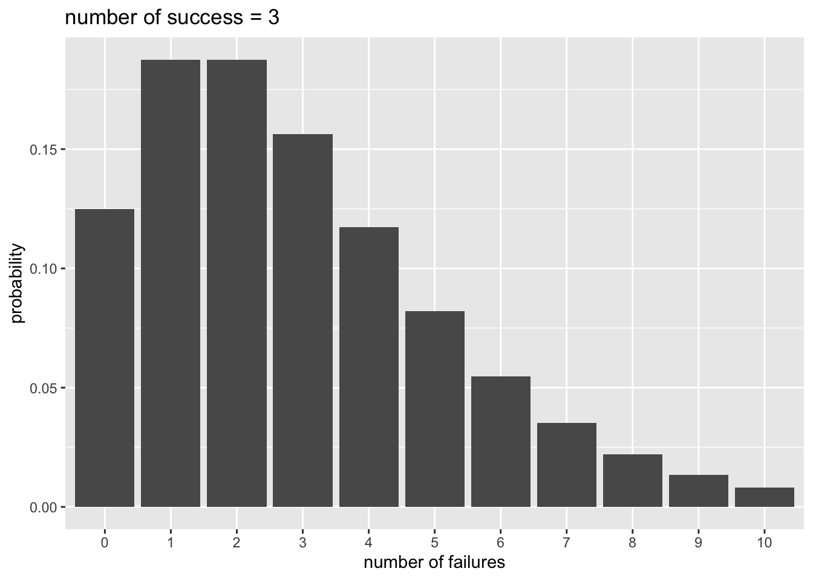

# 一般化線形モデル（過分散への対処）{#chap14_Overdisperse}

この章では、カウントデータをその他の一般化線形モデルを紹介する。それぞれ、過分散のあるデータの場合にポアソン回帰の代替となるモデルになり得る。

-   負の二項回帰\
-   ゼロ過剰ポアソン回帰

## 準備{#chap14_Preparation}

可視化のための`ggplot2`パッケージに加え、`MASS`、`pscl`パッケージを使う。\
`MASS`パッケージは負の二項分布を用いたモデルのときに、`pscl`パッケージはゼロ過剰ポアソン回帰のときに必要になる。初めて使う際には、事前にインストールが必要なので注意。


``` r
library(ggplot2)
library(MASS)
library(pscl)
```

## 負の二項回帰{#chap14_NegativeBinom}

前の章で、応答変数がカウントデータの場合、ポアソン回帰で解析するのが適切であると学んだ。しかし、実際のデータは分散が平均よりも大きい場合が多く、平均と分散が等しいという前提のポアソン分布を用いると予測変数の効果を誤って判断してしまう恐れがある。これが、**過分散（overdispersion）**と呼ばれる問題である。

過分散対策として、応答変数が従う分布としてポアソン分布の代わりに、**負の二項分布(negative
binomial distribution)**を用いる方法がよく使われる。

### 負の二項分布{#chap14_NegativeBinom1}

例えばコインを投げて表が出る確率を0.5として、表が3回出るまで投げると決めたとする。8回投げたところで表が3回出た場合、表が3回出る確率は以下から求めることができる。


``` r
choose(8-1, 3-1) * 0.5^2 * (1-0.5)^(8-3) * 0.5 #つまり、7回中表が2回、裏が5回出て、最後の１回で表が出る確率を求める。
```

```
## [1] 0.08203125
```

これを一般化した式が以下である。成功確率を$q$、成功回数を$r$、全試行数（成功回数+失敗回数）を$n$とした場合の確率$P(n)$を表している。（上の例の場合は、$q=0.5$,
$r=3$, $n=8$である）

$$
P(n) = {}_{n-1}\mathrm{C}_{r-1} q^{r}(1-q)^{n-r}
$$
失敗回数を$x$として、以下のように置き換えることもできる。ある事象が$r$回生じるまでに、$x$回失敗する確率と言い換えることができる。この確率分布を負の二項分布という。

$$
P(x) = {}_{x+r-1}\mathrm{C}_{r-1} q^{r}(1-q)^{x}
$$

Rでも`nbinom`で負の二項分布の確率を計算することができる。


``` r
x = 0:10
p_y = dnbinom(x = x, size = 3, prob = 0.5) #x = 失敗回数, size = 成功回数, prob = 成功確率

d_plot = data.frame(x = x, p_y = p_y)

ggplot2::ggplot() + 
  ggplot2::geom_bar(data = d_plot, aes(x = factor(x), y = p_y), stat = "identity") + 
  ggplot2::labs(x = "number of failures", y = "probability", title = "number of success = 3")
```



期待値$E(x)$と分散$Var(x)$は、以下から計算される。

$$
E(x) = \frac{r(1-q)}{q}\\
Var(x) = \frac{r(1-q)}{q^2}\\
$$

`dnbinom()`に期待値`mu`を入力しても、確率を計算してくれる。


``` r
dnbinom(x = x, size = 3, prob = 0.5) 
```

```
##  [1] 0.125000000 0.187500000 0.187500000 0.156250000 0.117187500 0.082031250
##  [7] 0.054687500 0.035156250 0.021972656 0.013427734 0.008056641
```

``` r
dnbinom(x = x, size = 3, mu = 3*0.5/(1-0.5)) 
```

```
##  [1] 0.125000000 0.187500000 0.187500000 0.156250000 0.117187500 0.082031250
##  [7] 0.054687500 0.035156250 0.021972656 0.013427734 0.008056641
```

期待値を$E(x)=\mu$とすると、分散は$Var(x)=\mu + \mu^{2}/r$で、分散が期待値（平均）よりも$\mu^{2}/r$大きい。負の二項分布によって、分散が平均よりも大きい分布を扱うことができる。

### Rでの負の二項回帰{#chap14_glmnb}

Rでは、`MASS`パッケージに含まれている`glm.nb()`関数で、負の二項回帰を扱うことができる。Rに入っている`warpbreaks`をサンプルデータとして、ポアソン回帰と負の二項回帰の結果を比較してみよう。


``` r
d = warpbreaks #別の名前(d)で保存する
d$A <- ifelse(d$wool == "A", 1, 0) #Aなら1, Bなら0のダミー
head(d)
```

```
##   breaks wool tension A
## 1     26    A       L 1
## 2     30    A       L 1
## 3     54    A       L 1
## 4     25    A       L 1
## 5     70    A       L 1
## 6     52    A       L 1
```

``` r
ggplot2::ggplot() + 
  ggplot2::geom_histogram(data = d, aes(x = breaks, fill = wool), binwidth = 1)
```


`breaks`に対する`wool`(A or
B)の効果を検討する。まずは、ポアソン回帰の結果を見てみる。`breaks`を$y$、`A`を$x$とすると、モデルは以下のように表現できる。

$$
\lambda = \alpha + \beta x\\
y \sim \text{Poisson}(\lambda)
$$


``` r
model_poisson = glm(data = d, breaks ~ 1 + A, family = poisson(link = "log"))
summary(model_poisson)
```

```
## 
## Call:
## glm(formula = breaks ~ 1 + A, family = poisson(link = "log"), 
##     data = d)
## 
## Coefficients:
##             Estimate Std. Error z value Pr(>|z|)    
## (Intercept)  3.22919    0.03829  84.331  < 2e-16 ***
## A            0.20599    0.05157   3.994 6.49e-05 ***
## ---
## Signif. codes:  0 '***' 0.001 '**' 0.01 '*' 0.05 '.' 0.1 ' ' 1
## 
## (Dispersion parameter for poisson family taken to be 1)
## 
##     Null deviance: 297.37  on 53  degrees of freedom
## Residual deviance: 281.33  on 52  degrees of freedom
## AIC: 560
## 
## Number of Fisher Scoring iterations: 4
```

``` r
mean(d$breaks)
```

```
## [1] 28.14815
```

``` r
var(d$breaks)
```

```
## [1] 174.2041
```

`A`に係る傾きの推定値について、かなり小さいp値が推定されている。


次に、負の二項回帰の結果と比較してみよう。

$$
\mu = \alpha + \beta x\\
y \sim \text{NegativeBinom}(\mu, r)
$$

`MASS`パッケージの`glm.nb()`を使う。


``` r
model_nb = MASS::glm.nb(data = d, breaks ~ 1 + A) #lm関数と同じ要領で、線形の式を入力する。確率分布はオプションで指定しないで良い。
summary(model_nb)
```

```
## 
## Call:
## MASS::glm.nb(formula = breaks ~ 1 + A, data = d, init.theta = 6.960797279, 
##     link = log)
## 
## Coefficients:
##             Estimate Std. Error z value Pr(>|z|)    
## (Intercept)  3.22919    0.08238  39.197   <2e-16 ***
## A            0.20599    0.11533   1.786   0.0741 .  
## ---
## Signif. codes:  0 '***' 0.001 '**' 0.01 '*' 0.05 '.' 0.1 ' ' 1
## 
## (Dispersion parameter for Negative Binomial(6.9608) family taken to be 1)
## 
##     Null deviance: 57.400  on 53  degrees of freedom
## Residual deviance: 54.212  on 52  degrees of freedom
## AIC: 419.97
## 
## Number of Fisher Scoring iterations: 1
## 
## 
##               Theta:  6.96 
##           Std. Err.:  1.63 
## 
##  2 x log-likelihood:  -413.975
```

ポアソン回帰と比べると`A`のp値が大きくなり、過分散が解消されたことがうかがえる。

## ゼロ過剰ポアソンモデル{#chap14_ZIP}

**ゼロ過剰ポアソンモデル(Zero-inflated Poisson
model)**は、データにゼロが多いカウントデータに適用されるモデルであり、ベルヌーイ分布とポアソン分布を混合させた統計モデルである。

### 例題{#chap14_ZIPExpample}

夏休みの間に毎日、カブトムシを採りに森に出かけた。カブトムシが何匹か見つかる日もあれば、全く見つからない日もある。その日の天気や気温などがカブトムシが見つかる確率に影響を及ぼしていたかを検討する。
以下のプログラムを実行し、サンプルデータを作成する。`y`がその日見つかったカブトムシの数、`Rain`がその日に雨が降っていたか（1=雨,
0=雨ではない）、`Humidity`と`Temperature`はそれぞれ湿度と気温とする。


``` r
y = c(1, 2, 0, 0, 2, 0, 0, 0, 0, 0, 
      0, 3, 0, 4, 4, 0, 0, 0, 3, 0, 
      1, 1, 7, 0, 0, 5, 1, 4, 0, 2)
Rain = c(0, 0, 1, 1, 0, 1, 1, 1, 1, 0, 
         0, 0, 1, 0, 1, 0, 1, 1, 0, 1, 
         1, 0, 1, 0, 0, 0, 0, 0, 1, 0)
Humidity = c(50, 50, 59, 58, 56, 59, 58, 51, 30, 56, 
             49, 48, 35, 45, 54, 64, 49, 54, 49, 36, 
             46, 46, 49, 61, 58, 48, 47, 57, 56, 43)
Temperature = c(29, 30, 31, 30, 31, 30, 29, 30, 29, 31,
                32, 30, 29, 31, 30, 32, 30, 31, 30, 29,
                30, 28, 31, 30, 32, 30, 29, 31, 29, 29)

d_zip = data.frame(y = y, Rain = Rain, Humidity = Humidity, Temperature = Temperature)
head(d_zip)
```

```
##   y Rain Humidity Temperature
## 1 1    0       50          29
## 2 2    0       50          30
## 3 0    1       59          31
## 4 0    1       58          30
## 5 2    0       56          31
## 6 0    1       59          30
```

ヒストグラムでデータの頻度を確認する。このデータにはゼロが非常に多く、ほとんどの日でカブトムシが見つからなかったことがわかる。


``` r
ggplot2::ggplot() + 
  ggplot2::geom_histogram(data = d_zip, aes(x = y), binwidth = 1, fill = "white", color="black")  + theme_classic()
```


## ゼロ過剰ポアソンモデルの詳細{#chap14_ZIP1}

ゼロ過剰ポアソンモデルは、ロジスティック回帰とポアソン回帰を混合させたモデルである。

1\. ベルヌーイ分布から過剰なゼロが生じる確率を推定する

まず、ロジスティック回帰のモデルからゼロが生じる過程を推定する。ゼロが生じる確率を$q$とする。

2\. ポアソン分布から応答変数が生じる確率を推定する

確率$1-q$のときに、ポアソン回帰のモデルに従い、応答変数（ゼロを含む正の整数）が生じるとする。

ゼロが生じる確率$Pr(0|q,\lambda)$とカウントデータである$y$($y>0$)が生じる確率$Pr(y|q,\lambda)$は、以下のように表現する。

$$
\log \frac{q}{1-q} = \alpha_{1} + \beta x_{1}\\ 
\log(\lambda) = \alpha_{2} + \beta x_{2}\\ 
Pr(0|q,\lambda) = q + (1-q)\exp(-\lambda)\\
Pr(y|q,\lambda) = (1-q)\frac{\lambda^y\exp(-\lambda)}{y!}\
$$

### Rでのゼロ過剰ポアソンモデル{#chap14_zeroinfl}

`pscl`パッケージの`zeroinfl()`関数でゼロ過剰ポアソンモデルの当てはめをすることができる。
ここでは、過剰なゼロを予測する変数として天気（`Rain`）を想定し、湿度（`Humidity`）と温度（`Temperature`）でカブトムシの数を推定する。


``` r
library(pscl)
model_zeroinfl = pscl::zeroinfl(data = d_zip, y ~ Humidity + Temperature | Rain)
summary(model_zeroinfl)
```

```
## 
## Call:
## pscl::zeroinfl(formula = y ~ Humidity + Temperature | Rain, data = d_zip)
## 
## Pearson residuals:
##     Min      1Q  Median      3Q     Max 
## -1.3357 -0.4763 -0.3775  0.3633  3.0017 
## 
## Count model coefficients (poisson with log link):
##              Estimate Std. Error z value Pr(>|z|)   
## (Intercept) -15.13389    6.88209  -2.199  0.02788 * 
## Humidity     -0.04123    0.05112  -0.806  0.41996   
## Temperature   0.60345    0.23266   2.594  0.00949 **
## 
## Zero-inflation model coefficients (binomial with logit link):
##             Estimate Std. Error z value Pr(>|z|)  
## (Intercept)  -0.9197     0.5988  -1.536   0.1246  
## Rain          2.0315     0.9017   2.253   0.0243 *
## ---
## Signif. codes:  0 '***' 0.001 '**' 0.01 '*' 0.05 '.' 0.1 ' ' 1 
## 
## Number of iterations in BFGS optimization: 23 
## Log-likelihood: -39.5 on 5 Df
```

ベルヌーイ分布からゼロを予測するモデル（Zero-inflation
model）とポアソン回帰からカウントデータを予測するモデル（Count
model）の2種類の推定結果が出力される。

------------------------------------------------------------------------

カウントデータが従う確率分布として、ポアソン分布以外の確率分布を設定することもできる。以下は負の二項分布に変えた場合である。


``` r
model_zeroinfl_2 = pscl::zeroinfl(data = d_zip, y ~ Humidity + Temperature | Rain, dist = "negbin") #distで指定する
summary(model_zeroinfl_2)
```

```
## 
## Call:
## pscl::zeroinfl(formula = y ~ Humidity + Temperature | Rain, data = d_zip, 
##     dist = "negbin")
## 
## Pearson residuals:
##     Min      1Q  Median      3Q     Max 
## -1.3357 -0.4763 -0.3775  0.3633  3.0018 
## 
## Count model coefficients (negbin with log link):
##              Estimate Std. Error z value Pr(>|z|)   
## (Intercept) -15.13409    6.88214  -2.199  0.02788 * 
## Humidity     -0.04123    0.05112  -0.806  0.41996   
## Temperature   0.60345    0.23266   2.594  0.00949 **
## Log(theta)   12.83152  273.28934   0.047  0.96255   
## 
## Zero-inflation model coefficients (binomial with logit link):
##             Estimate Std. Error z value Pr(>|z|)  
## (Intercept)  -0.9197     0.5988  -1.536   0.1246  
## Rain          2.0315     0.9017   2.253   0.0243 *
## ---
## Signif. codes:  0 '***' 0.001 '**' 0.01 '*' 0.05 '.' 0.1 ' ' 1 
## 
## Theta = 373816.6121 
## Number of iterations in BFGS optimization: 26 
## Log-likelihood: -39.5 on 6 Df
```

### ハードルモデル{#chap14_Hurdle}

ゼロ過剰ポアソンモデルはベルヌーイ分布からだけではなくポアソン分布からもゼロが予測されるが、ゼロが生成されるモデルと1以上の正の整数が生成されるモデルを分けた**ハードルモデル(Hurdle
model)**というものもある。

`pscl`パッケージにある`hurdle`関数で実行することができる。


``` r
model_hurdle = pscl::hurdle(data = d_zip, y ~ Humidity + Temperature | Rain)
summary(model_hurdle)
```

```
## 
## Call:
## pscl::hurdle(formula = y ~ Humidity + Temperature | Rain, data = d_zip)
## 
## Pearson residuals:
##     Min      1Q  Median      3Q     Max 
## -1.2984 -0.4556 -0.4446  0.2950  3.1423 
## 
## Count model coefficients (truncated poisson with log link):
##              Estimate Std. Error z value Pr(>|z|)   
## (Intercept) -20.93522    8.10270  -2.584  0.00977 **
## Humidity     -0.02487    0.04360  -0.570  0.56839   
## Temperature   0.76575    0.28073   2.728  0.00638 **
## Zero hurdle model coefficients (binomial with logit link):
##             Estimate Std. Error z value Pr(>|z|)  
## (Intercept)   0.7885     0.5394   1.462   0.1438  
## Rain         -2.0877     0.8457  -2.469   0.0136 *
## ---
## Signif. codes:  0 '***' 0.001 '**' 0.01 '*' 0.05 '.' 0.1 ' ' 1 
## 
## Number of iterations in BFGS optimization: 25 
## Log-likelihood: -38.2 on 5 Df
```

## 確認問題{#chap14_Practice}

`MASS`パッケージに入っているサンプルデータ、`housing`を使って練習をする。


``` r
d = housing #dという名前で保存する
d$ID = 1:nrow(d)

head(d)
```

```
##      Sat   Infl  Type Cont Freq ID
## 1    Low    Low Tower  Low   21  1
## 2 Medium    Low Tower  Low   21  2
## 3   High    Low Tower  Low   28  3
## 4    Low Medium Tower  Low   34  4
## 5 Medium Medium Tower  Low   22  5
## 6   High Medium Tower  Low   36  6
```

(1)Freqを応答変数、Contを予測変数としたポアソン回帰と、(2)同じくFreqを応答変数、Contを予測変数とした負の二項回帰を行い、結果を比較せよ。


