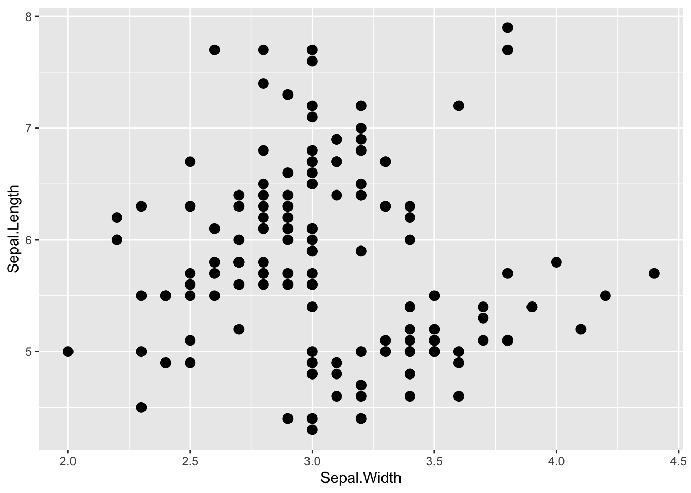
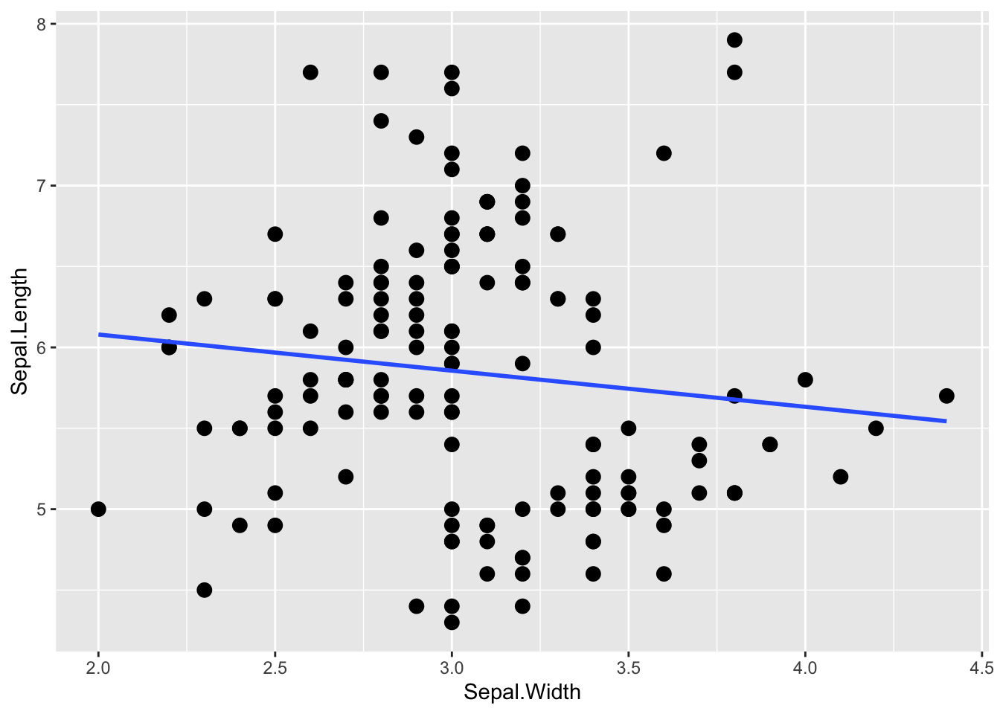
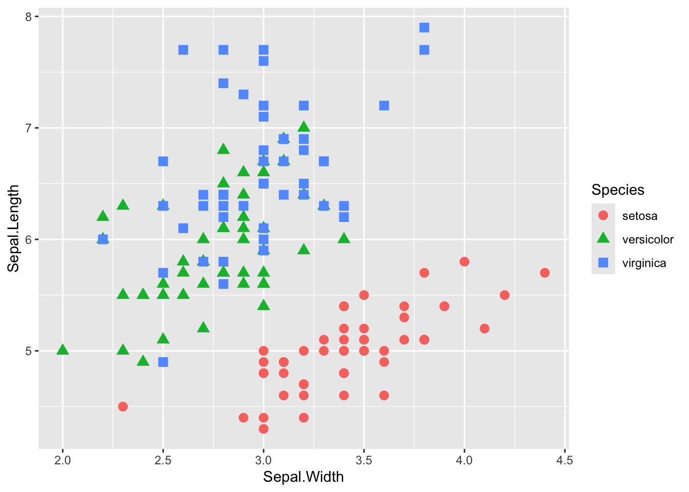
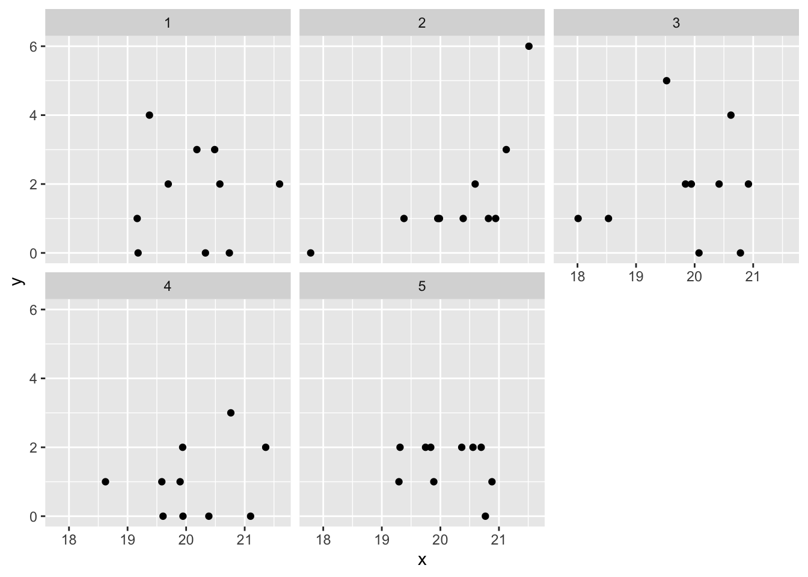

# マルチレベルモデル{#chap16_Multilevel}

一般化線形モデルを拡張し、個人差や集団差を扱うモデルについて学ぶ。  

## 準備{#chap16_Preparation}

`ggplot2`パッケージに加え、新たに`lme4`及び`lmerTest`というパッケージを使う。`lme4`と`lmerTest`は初めて使うので、インストールした上でロードしよう。


``` r
library(ggplot2)

install.packages("lme4", "lmerTest")
library(lme4)
library(lmerTest)
```


## 個人差や集団差の問題{#chap16_BasisMultilevel}

以下では、Rにデフォルトで入っている `iris` データを例として使う。
  


``` r
head(iris) #irisデータの上数行を表示
```

```
##   Sepal.Length Sepal.Width Petal.Length Petal.Width Species
## 1          5.1         3.5          1.4         0.2  setosa
## 2          4.9         3.0          1.4         0.2  setosa
## 3          4.7         3.2          1.3         0.2  setosa
## 4          4.6         3.1          1.5         0.2  setosa
## 5          5.0         3.6          1.4         0.2  setosa
## 6          5.4         3.9          1.7         0.4  setosa
```

まず、がくの長さ（`Sepal.Length`）とがくの幅（`Sepal.Width`）の関係を散布図で示してみよう。


``` r
graph_1 = ggplot2::ggplot() +
  ggplot2::geom_point(data=iris, aes(x=Sepal.Width, y=Sepal.Length),size = 3)
graph_1
```




まず、`lm()`を使って、がくの長さを応答変数、がくの幅を予測変数とした線形モデルで係数を推定する。


``` r
iris_lm = lm(data = iris, Sepal.Length ~ 1 + Sepal.Width)
summary(iris_lm)
```

```
## 
## Call:
## lm(formula = Sepal.Length ~ 1 + Sepal.Width, data = iris)
## 
## Residuals:
##     Min      1Q  Median      3Q     Max 
## -1.5561 -0.6333 -0.1120  0.5579  2.2226 
## 
## Coefficients:
##             Estimate Std. Error t value Pr(>|t|)    
## (Intercept)   6.5262     0.4789   13.63   <2e-16 ***
## Sepal.Width  -0.2234     0.1551   -1.44    0.152    
## ---
## Signif. codes:  0 '***' 0.001 '**' 0.01 '*' 0.05 '.' 0.1 ' ' 1
## 
## Residual standard error: 0.8251 on 148 degrees of freedom
## Multiple R-squared:  0.01382,	Adjusted R-squared:  0.007159 
## F-statistic: 2.074 on 1 and 148 DF,  p-value: 0.1519
```

推定された切片及び傾きの値から予測直線を引くと、以下のようになる。  


``` r
graph_lm = ggplot2::ggplot()+
  ggplot2::geom_point(data = iris, aes(x = Sepal.Width, y = Sepal.Length), size = 3)  +
  ggplot2::geom_smooth(data = iris, aes(x = Sepal.Width, y = Sepal.Length), formula = y~ 1 + x, method = "lm", se = FALSE)
graph_lm
```



がくの幅（`Sepal.Width`）は、がくの長さに対して負の影響を持っているように見える。  
  
  
では、この散布図を種（`Species`）ごとに色わけして示してみる。


``` r
graph_2 = ggplot2::ggplot() +
  ggplot2::geom_point(data = iris, aes(x = Sepal.Width, y = Sepal.Length, color = Species, shape = Species), size = 3) 
graph_2
```




種を無視して検討したところ、がくの幅と長さの間には負の関係があるようにみえたが、種ごとに分けてみると「がくの長さが大きくなるほど、がくの幅が大きくなる」関係にあるように見える。  
  
このあやめのデータのように、いくつかのデータが同じグループに属している構造の場合、グループの影響を統制しないと誤った結論を招いてしまう恐れがある。それらのデータ間には、**統計的独立性が保証されていない**ためである。つまり、同じ種同士のものは似た傾向にある可能性が高い（データ間で相関が存在する）。  
    
**独立(independence)**とは、各データが他のデータに影響されないという意味である。これまで学んできた確率分布では、**独立同分布(independent and identically distributed: i.i.d.)**が前提とされている。例えば、コインを数回投げて表が出る回数は二項分布に従うが、表が出るかどうかは前の試行に影響されることはない（前回表が出たら、次も表が出やすいということはありえないという前提を置く）。  
  
しかし、現実のデータでは、データ間の相関などにより、事象の独立性が保たれていないケースもありえる。その場合、統計的独立性を前提とした解析を行うと、上の例のように誤った結論を導いてしまう恐れがある。  
  

この例に限らず、**階層構造を持つデータや繰り返し測定データ**にも、同じことがいえる。例えば、学校ごとに学力テストを行った場合、同じ学校の生徒たちは成績が似通っている可能性がある（上位校の生徒は他の学校と比べて成績が良いなど）。同一参加者に複数の実験条件に参加してもらった場合、その参加者のデータは似たような傾向になる可能性も考えられる。    

このようなデータに対して、**個人や集団の影響を考慮した**統計モデルとして、**マルチレベルモデル(multilevel model)**が提案されている。  
  
***

マルチレベルモデルは、「階層モデル(hierarchical model)」、「混合モデル(mixied model)」など別の名称もある。  


## マルチレベルモデルの概要{#chap16_BasisMultilevel1}  

マルチレベルモデルでは、予測変数が応答変数に及ぼす効果だけではなく、個人や集団の効果を扱う。予測変数そのものの効果は**固定効果（fixed effect）**と呼ばれ、個人や集団ごとの効果は**ランダム効果（random effect）**と呼ばれて区別される。前章まで扱ってきた、一般化線形モデルは固定効果のみを含むモデルである。  
  
例として、 **繰り返し測定されたデータ**を扱う。以下のプログラムを実行して、サンプルデータ`example`を作ろう。


``` r
set.seed(1)
example = data.frame(i = 1:6, j = c(1, 1, 2, 2, 3, 3), y = round(rnorm(6), 2), x = rep(c(0, 1),3) )

example
```

```
##   i j     y x
## 1 1 1 -0.63 0
## 2 2 1  0.18 1
## 3 3 2 -0.84 0
## 4 4 2  1.60 1
## 5 5 3  0.33 0
## 6 6 3 -0.82 1
```

$i$がデータを意味する番号（何行目か）、$j$を個人もしくはグループを意味する番号とする。例えば、個人$j$が$x=0$の場合と$x=1$の場合の2回$y$を測定している、あるいは同じ集団$j$から2人が選ばれてそれぞれの人について$y$が測定された、といったケースが当てはまる。  
  
一般化線形モデルの線形予測子は、以下のような数式で表現できた。  

$$
\hat{y}_{i} = \alpha + \beta x_{i}\\
y_{i} \sim \text{Normal}(\hat{y}_{i}, \sigma)
$$

$\alpha$が切片、$\beta$が予測変数$x$に係る傾きであった。  
  
これに対し、マルチレベルモデルでは、以下のように線形予測子に$\alpha_{j}$が加わる。

$$
\hat{y}_{i} = \alpha_{0} + \beta x_{i} + \alpha_{j}  \\
\alpha_{j} \sim \text{Normal}(0, \sigma_{\alpha})\\
y_{i} \sim \text{Normal}(\hat{y}_{i}, \sigma)
$$
線形予測子には、これまでと同様に切片（$\alpha$）と傾き （$\beta$）が含まれている。これは全てのグループに共通する効果であり、**固定効果（Fixed effect）**と表現する。  
  
更に、モデルにはグループごとに異なる切片$\alpha_{j}$が加わっている。このようにグループごとに追加で加わる効果を**ランダム効果（random effect）**と表現する。ここではランダム効果を切片で表しており、**ランダム切片(random intercept)**とも呼ばれる。  
また、$\alpha_{j} \sim \text{Normal}(0, \sigma_{\alpha})$とあるように、「グループごとに異なる切片$\alpha_{j}$は、平均をゼロ、$\sigma_{\alpha}$を標準偏差とする正規分布から生成される」という仮定を置く。  
  
このように線形予測子にランダム切片を加えることで、グループ全体に共通する効果とは別に、グループごとの差をモデルで表現できる。  

***  

傾きを$\beta_{ j}$にする、すなわちグループごとに予測変数に係る効果が異なるという前提を置くこともできる。これは、**ランダム傾き（random slope）**と呼ばれる。

$$
\hat{y}_{i} = \alpha_{0} + \beta_{j} x_{i} + \alpha_{j}  \\
\alpha_{j} \sim \text{Normal}(0, \sigma_{\alpha})\\
\beta_{j} \sim \text{Normal}(0, \sigma_{\beta})\\
y_{i} \sim \text{Normal}(\hat{y}_{i}, \sigma)
$$

ただ、以下のRプログラムの解説でも述べるように、ランダム傾きを含むモデルの推定は困難な場合が多いので、グループ差の統計的統制はランダム切片のみを加えたモデルで行うのが一般的である。

## Rでのマルチレベルモデル{#chap16_lmer}

Rでマルチレベルモデルで解析を行うためには、外部パッケージが必要になる。様々なパッケージがあるが、`lme4`パッケージが扱いやすい。以下では、`lme4`パッケージに含まれる`glmer()`を使った解析の例を示す。  
  
基本的に、`lm()`関数と似た表記で使うことができる。ランダム切片は、`(1|グループを意味する変数名)`のかたちで線形予測子に入れる。


``` r
model_lmm = lme4::lmer(data= iris, Sepal.Length ~ 1 + Sepal.Width + (1|Species)) #(1|Species)を加える
summary(model_lmm)
```

```
## Linear mixed model fit by REML ['lmerMod']
## Formula: Sepal.Length ~ 1 + Sepal.Width + (1 | Species)
##    Data: iris
## 
## REML criterion at convergence: 194.6
## 
## Scaled residuals: 
##     Min      1Q  Median      3Q     Max 
## -2.9846 -0.5842 -0.1182  0.4422  3.2267 
## 
## Random effects:
##  Groups   Name        Variance Std.Dev.
##  Species  (Intercept) 1.0198   1.010   
##  Residual             0.1918   0.438   
## Number of obs: 150, groups:  Species, 3
## 
## Fixed effects:
##             Estimate Std. Error t value
## (Intercept)   3.4062     0.6683   5.097
## Sepal.Width   0.7972     0.1062   7.506
## 
## Correlation of Fixed Effects:
##             (Intr)
## Sepal.Width -0.486
```


出力結果を見てみると、`Fixed effects`という部分がある。ここに、固定効果の推定結果が表示される。見方は一般化線形モデルのときと同じである。切片(intercept)と予測変数に係る傾きの係数の推定結果が表示されている（個体差にかかわらず、すべての個体共通に係る予測変数の効果）。 
    
がくの幅（`Sepal.Width`)の回帰係数（Estimate）を見ると、`lm()`での推定結果とは逆に、プラスになっている。やはり、グループの違いを統制すると、実際にはがくの幅が大きくなるほど、がくの長さも大きくなる関係にあることが、`lmer()`による推定結果からわかる。
 

*** 

ランダム傾きを加える場合には、以下のようにプログラムで指定する。


``` r
model_lmm_2 = lmer(data= iris, Sepal.Length ~ 1 + Sepal.Width + (1 + Sepal.Length|Species)) 
summary(model_lmm_2)
```

```
## Linear mixed model fit by REML. t-tests use Satterthwaite's method [
## lmerModLmerTest]
## Formula: Sepal.Length ~ 1 + Sepal.Width + (1 + Sepal.Length | Species)
##    Data: iris
## 
## REML criterion at convergence: -4239.4
## 
## Scaled residuals: 
##        Min         1Q     Median         3Q        Max 
## -0.0182513 -0.0040510  0.0003048  0.0034958  0.0172606 
## 
## Random effects:
##  Groups   Name         Variance  Std.Dev.  Corr 
##  Species  (Intercept)  1.084e-13 3.292e-07      
##           Sepal.Length 2.028e-02 1.424e-01 -0.99
##  Residual              1.012e-14 1.006e-07      
## Number of obs: 150, groups:  Species, 3
## 
## Fixed effects:
##               Estimate Std. Error         df t value Pr(>|t|)
## (Intercept)  2.286e-06  1.043e-07  5.325e-02  21.922    0.757
## Sepal.Width -4.300e-11  2.994e-08  5.410e-02  -0.001    1.000
## 
## Correlation of Fixed Effects:
##             (Intr)
## Sepal.Width -0.223
## optimizer (nloptwrap) convergence code: 0 (OK)
## Model failed to converge with max|grad| = 2.26442 (tol = 0.002, component 1)
## Model is nearly unidentifiable: very large eigenvalue
##  - Rescale variables?
```

ランダム傾きも加えた複雑なモデルの推定の場合は、最尤推定法では解が求まらない場合がある。ランダム傾きを含むマルチレベルモデルを扱う際には、ベイズ統計モデリングの手法を用いるのが望ましい。

*** 

`lmer()`では、デフォルトで係数のp値は表示されない。p値も出したいならば、`lmerTest()`パッケージをインストールしておく必要がある。


``` r
model_lmm = lmer(data= iris, Sepal.Length ~ 1 + Sepal.Width + (1|Species)) 
summary(model_lmm)
```

```
## Linear mixed model fit by REML. t-tests use Satterthwaite's method [
## lmerModLmerTest]
## Formula: Sepal.Length ~ 1 + Sepal.Width + (1 | Species)
##    Data: iris
## 
## REML criterion at convergence: 194.6
## 
## Scaled residuals: 
##     Min      1Q  Median      3Q     Max 
## -2.9846 -0.5842 -0.1182  0.4422  3.2267 
## 
## Random effects:
##  Groups   Name        Variance Std.Dev.
##  Species  (Intercept) 1.0198   1.010   
##  Residual             0.1918   0.438   
## Number of obs: 150, groups:  Species, 3
## 
## Fixed effects:
##             Estimate Std. Error       df t value Pr(>|t|)    
## (Intercept)   3.4062     0.6683   3.4050   5.097   0.0107 *  
## Sepal.Width   0.7972     0.1062 146.6648   7.506 5.45e-12 ***
## ---
## Signif. codes:  0 '***' 0.001 '**' 0.01 '*' 0.05 '.' 0.1 ' ' 1
## 
## Correlation of Fixed Effects:
##             (Intr)
## Sepal.Width -0.486
```

他には、直接p値を計算する方法ではないが、信頼区間を算出して有意かどうか（信頼区間にゼロが含まれていないか）を判断するという手もある。


``` r
model_lmm = lmer(data= iris, Sepal.Length ~ 1 + Sepal.Width + (1|Species)) 
confint(model_lmm, level = 0.95) #confintで信頼区間を計算する。デフォルトで95%信頼区間が出力される（levelで範囲を指定可能）。
```

```
##                 2.5 %    97.5 %
## .sig01      0.4320405 2.4380677
## .sigma      0.3909640 0.4915558
## (Intercept) 1.9780097 4.8131087
## Sepal.Width 0.5844733 1.0030191
```


## 正規分布以外を扱う例{#chap16_GLMM}

### ロジスティック回帰{#chap16_GLMMLogit}

応答変数が正規分布以外に従う場合のマルチレベルモデルについても見ていこう。  
`lme4`パッケージの`glmer()`で、正規分布以外の確率分布を指定したマルチレベルモデルの解析を行うことができる。以下では、ランダム効果を加えたロジスティック回帰分析の例を示す。  
  
  
まず、以下のプログラムを実行してサンプルデータ`data_sample`を作ろう。


``` r
x1 = c(1.0, 2.0, 3.0, 4.2, 5.1, 3.1, 4.2, 5.0, 6.1, 7.0, 5.3, 6.0, 7.0, 8.1, 9.0)
y1 = c(0, 0, 1, 1, 1, 0, 0, 0, 0, 1, 0, 1, 1, 1, 1)
ID = c(rep("a",5),rep("b",5),rep("c",5))
data_sample = data.frame(ID, x1, y1)
head(data_sample)
```

```
##   ID  x1 y1
## 1  a 1.0  0
## 2  a 2.0  0
## 3  a 3.0  1
## 4  a 4.2  1
## 5  a 5.1  1
## 6  b 3.1  0
```

`x1`を予測変数（量的変数）、`y1`を応答変数（0か1のいずれかを取る）、`ID`が個体を示す変数とする。1つの個体から`x1`を変えて5回、`y1`が計測がされた実験をイメージしてほしい。  

予測変数と応答変数の関係に、個体特有の効果を加えたモデルは以下となる。  

$$
\log\frac{q}{1-q} = \alpha_{0} + \beta x + \alpha_{\text{ID}} \\
\alpha_{\text{ID}} \sim \text{Normal}(0, \sigma_{\alpha})\\
y \sim \text{Binomial}(1, q)
$$

$y=1$が生じる確率を$q$とし、線形予測子をロジット関数で変換する。更に、応答変数$y$は、$q$をパラメータとする二項分布から生成されるとする。これらの点は、一般化線形モデルで学んだ。  
更に、線形予測子には、`ID`ごとに異なるランダム切片$\alpha_{\text{ID}}$を加えている。$\alpha_{\text{ID}}$は、平均ゼロ、標準偏差$\sigma_{\alpha}$の正規分布に従って生成されるとする。  
  

正規分布以外の確率分布を扱うマルチレベルは、Rでは`lme4`パッケージの`glmer()`で扱うことができる。さっきの`lmer()`と同じ要領で、線形予測子に個体を識別する変数（`ID`）を加える。以下のように、`(1|ID)`というかたちで入れる。  
  
あとは、確率分布とリンク関数を指定する。指定の仕方は、`glm()`のときと同じ要領である。確率分布は`binomial`（二項分布）、リンク関数は`logit`（ロジット関数）を指定する。リンク関数の指定は省略しても構わない（二項分布を指定すれば、デフォルトでロジット関数を選択してくれる）。


``` r
model_logistic_glmm = lme4::glmer(data = data_sample, y1 ~ 1 + x1 + (1|ID), family = binomial(link="logit"))
summary(model_logistic_glmm)
```

```
## Generalized linear mixed model fit by maximum likelihood (Laplace
##   Approximation) [glmerMod]
##  Family: binomial  ( logit )
## Formula: y1 ~ 1 + x1 + (1 | ID)
##    Data: data_sample
## 
##       AIC       BIC    logLik -2*log(L)  df.resid 
##      14.3      16.4      -4.2       8.3        12 
## 
## Scaled residuals: 
##      Min       1Q   Median       3Q      Max 
## -0.01928  0.00000  0.00000  0.00000  0.04031 
## 
## Random effects:
##  Groups Name        Variance Std.Dev.
##  ID     (Intercept) 67795    260.4   
## Number of obs: 15, groups:  ID, 3
## 
## Fixed effects:
##             Estimate Std. Error z value Pr(>|z|)    
## (Intercept) -220.575     27.607   -7.99 1.35e-15 ***
## x1            38.996      4.887    7.98 1.46e-15 ***
## ---
## Signif. codes:  0 '***' 0.001 '**' 0.01 '*' 0.05 '.' 0.1 ' ' 1
## 
## Correlation of Fixed Effects:
##    (Intr)
## x1 -0.987
```


### ポアソン回帰{#chap16_GLMMPoisson}


同じく、`lme4`パッケージの`glmer()`でランダム効果を扱ったポアソン回帰を実行することができる。


まず、以下のプログラムを実行してサンプルデータ`dat`を作る。


``` r
set.seed(1)
alpha = 0.5
beta = 0.2
x = rnorm(n=50, mean = 0, sd = 1)
alpha_0 = rnorm(n=5, mean = 0, sd = 0.2)


lambda_1 = exp(alpha + beta * x[1:10] + alpha_0[1])
lambda_2 = exp(alpha + beta * x[11:20] + alpha_0[2])
lambda_3 = exp(alpha + beta * x[21:30] + alpha_0[3])
lambda_4 = exp(alpha + beta * x[31:40] + alpha_0[4])
lambda_5 = exp(alpha + beta * x[41:50] + alpha_0[5])
y_1 = rpois(n = 10, lambda_1)
y_2 = rpois(n = 10, lambda_2)
y_3 = rpois(n = 10, lambda_3)
y_4 = rpois(n = 10, lambda_4)
y_5 = rpois(n = 10, lambda_5)

dat = data.frame(y = c(y_1, y_2, y_3, y_4, y_5), 
           x = x + 20,
           ID = sort(rep(1:5, 10)))
dat$x_std = dat$x - mean(dat$x)

head(dat)
```

```
##   y        x ID       x_std
## 1 4 19.37355  1 -0.72690209
## 2 3 20.18364  1  0.08319504
## 3 1 19.16437  1 -0.93607689
## 4 2 21.59528  1  1.49483252
## 5 0 20.32951  1  0.22905949
## 6 0 19.17953  1 -0.92091666
```

`x`を予測変数（量的変数）、`y`を応答変数（正の整数を取るカウントデータ）、`ID`が集団を意味する変数とする。5つの集団があり、それぞれの集団に`x`及び`y`が10個ずつあるデータである。


``` r
ggplot2::ggplot() + 
  ggplot2::geom_point(data = dat, aes(x = x, y = y)) +
  ggplot2::facet_wrap(vars(factor(ID)))
```



 

モデルは以下のようになる。  


$$
\log\lambda = \alpha_{0} + \beta x + \alpha_{\text{ID}}  \\
\alpha_{\text{ID}} \sim \text{Normal}(0, \sigma_{\alpha})\\
y \sim \text{Poisson}(\lambda)
$$

線形予測子を対数関数で変換する。応答変数$y$は、$\lambda$をパラメータとするポアソン分布から生成されるとする。  
更に、線形予測子に、ランダム切片$\alpha_{\text{ID}}$を加えている。$\alpha_{\text{ID}}$は、平均ゼロ、標準偏差$\sigma_{\alpha}$の正規分布に従って生成されるとする。  
  
ロジスティック回帰のときと同様に、`lme4`パッケージの`glmer`関数を使って分析を行う。確率分布は`poisson`（ポアソン分布）、リンク関数は`log`（対数）を指定する。リンク関数の指定は省略しても構わない（ポアソン分布を指定すれば、デフォルトで対数関数を選択してくれる）。


``` r
result = lme4::glmer(data = dat, y ~ 1 + x_std + (1|ID), family = poisson(link="log"))
```

```
## boundary (singular) fit: see help('isSingular')
```

``` r
summary(result)
```

```
## Generalized linear mixed model fit by maximum likelihood (Laplace
##   Approximation) [glmerMod]
##  Family: poisson  ( log )
## Formula: y ~ 1 + x_std + (1 | ID)
##    Data: dat
## 
##       AIC       BIC    logLik -2*log(L)  df.resid 
##     161.4     167.2     -77.7     155.4        47 
## 
## Scaled residuals: 
##     Min      1Q  Median      3Q     Max 
## -1.4045 -0.6295 -0.0597  0.4675  3.2093 
## 
## Random effects:
##  Groups Name        Variance Std.Dev.
##  ID     (Intercept) 0        0       
## Number of obs: 50, groups:  ID, 5
## 
## Fixed effects:
##             Estimate Std. Error z value Pr(>|z|)    
## (Intercept)   0.4235     0.1157   3.660 0.000253 ***
## x_std         0.2560     0.1474   1.737 0.082439 .  
## ---
## Signif. codes:  0 '***' 0.001 '**' 0.01 '*' 0.05 '.' 0.1 ' ' 1
## 
## Correlation of Fixed Effects:
##       (Intr)
## x_std -0.206
## optimizer (Nelder_Mead) convergence code: 0 (OK)
## boundary (singular) fit: see help('isSingular')
```


### マルチレベルモデルによる過分散への対処{#chap16_GLMMOverdisperse}

ポアソン分布の理論的な分散よりも実際のデータの分散が大きい「過分散」がある場合には、ポアソン回帰の結果が信頼できなくなる問題があった。


``` r
#サンプルデータの作成
set.seed(1)
N= 50
x = rnorm(n=N, mean = 2, sd = 1)
e = rnorm(n=N, mean = 0, sd = 1)
lambda = exp(0.01 + 0.1*x + e)
y = rpois(n=N, lambda = lambda)
dat_dis = data.frame(y=y, x=x)

result_dis = glm(data = dat_dis, y ~ 1 + x, family = poisson(link = "log"))
summary(result_dis)
```

```
## 
## Call:
## glm(formula = y ~ 1 + x, family = poisson(link = "log"), data = dat_dis)
## 
## Coefficients:
##             Estimate Std. Error z value Pr(>|z|)    
## (Intercept)  -0.1417     0.3139  -0.451  0.65177    
## x             0.4393     0.1268   3.465  0.00053 ***
## ---
## Signif. codes:  0 '***' 0.001 '**' 0.01 '*' 0.05 '.' 0.1 ' ' 1
## 
## (Dispersion parameter for poisson family taken to be 1)
## 
##     Null deviance: 166.37  on 49  degrees of freedom
## Residual deviance: 153.39  on 48  degrees of freedom
## AIC: 260.41
## 
## Number of Fisher Scoring iterations: 6
```

``` r
library(performance)
performance::check_overdispersion(result_dis) #過分散のチェック
```

```
## # Overdispersion test
## 
##        dispersion ratio =   4.048
##   Pearson's Chi-Squared = 194.291
##                 p-value = < 0.001
```

```
## Overdispersion detected.
```


マルチレベルモデルでは、過分散の問題にも対処することができる。


``` r
dat_dis$ID = 1:nrow(dat_dis) #観測値ごとに番号を割り振る（1からデータ数までの数値の連続）
head(dat_dis)
```

```
##   y        x ID
## 1 1 1.373546  1
## 2 0 2.183643  2
## 3 1 1.164371  3
## 4 0 3.595281  4
## 5 3 2.329508  5
## 6 8 1.179532  6
```

このデータに対して、以下のモデルを当てはめる。

$$
\log\lambda = \alpha_{0} + \beta x + \alpha_{\text{ID}} \tag{5} \\
\alpha_{\text{ID}} \sim \text{Normal}(0, \sigma_{\alpha})\\
y \sim \text{Poisson}(\lambda)
$$

このデータは繰り返し測定のデータ（同じ個人もしくは集団から複数のデータが測定されているデータ）ではないが、観測値ごとのランダム切片（$\alpha_{\text{ID}}$）を加えることで、余分な分散を正規分布の標準偏差のパラメータ（$\sigma_{\alpha}$）で表現する。


``` r
result_poisson_glmm = lme4::glmer(data = dat_dis, y ~ 1 + x + (1|ID), family = poisson(link = "log"))
summary(result_poisson_glmm)
```

```
## Generalized linear mixed model fit by maximum likelihood (Laplace
##   Approximation) [glmerMod]
##  Family: poisson  ( log )
## Formula: y ~ 1 + x + (1 | ID)
##    Data: dat_dis
## 
##       AIC       BIC    logLik -2*log(L)  df.resid 
##     202.3     208.0     -98.1     196.3        47 
## 
## Scaled residuals: 
##     Min      1Q  Median      3Q     Max 
## -0.9658 -0.2773 -0.1231  0.3444  0.8207 
## 
## Random effects:
##  Groups Name        Variance Std.Dev.
##  ID     (Intercept) 0.7871   0.8872  
## Number of obs: 50, groups:  ID, 50
## 
## Fixed effects:
##             Estimate Std. Error z value Pr(>|z|)
## (Intercept) -0.01303    0.47791  -0.027    0.978
## x            0.18846    0.20904   0.902    0.367
## 
## Correlation of Fixed Effects:
##   (Intr)
## x -0.921
```

ランダム切片を入れない通常のポアソン回帰では予測変数`x`は`y`に対して有意な効果を有していたが、観測値ごとのランダム切片を加えたマルチレベルモデルでは、`x`の係数が小さくなり有意な効果も見られなくなった。通常のポアソン回帰では過分散の影響で`x`の効果を過剰に評価していたことが伺える。余計な分散をランダム切片に吸収させることで、予測変数が持つ効果を推定することができた。


### その他の一般化線形モデルの場合{#chap16_GLMMOthers}

順序ロジスティック回帰や多項ロジスティック回帰など、他の一般化線形モデルをマルチレベルモデルに拡張するには、別のパッケージを用いる必要がある（例えば、順序ロジスティック回帰の場合は`ordinal`パッケージの`clmm`関数がある）。    
  
ただし、扱う確率分布が特殊でランダム効果も含むといった複雑なモデルを扱う場合には、第20章で紹介するベイズ統計モデリングを扱う`brms`パッケージを使うのが良い。これを用いる場合でも、一般化線形モデル及びマルチレベルモデルの知識が前提となる。自分で分析のためのモデルの式を立てられるように、理解を固めておこう。  
  

## まとめ{#chap16_Summary}

- 同じグループから生成されたデータ同士は相関している可能性が高い。分析の際には、同じグループ同士のデータで見られる特徴（グループごとの差）の調整が必要になる。    
- マルチレベルモデルはデータ全体の効果を表す「固定効果」に加え、グループごとに異なる効果である「ランダム効果」を線形予測子に加えたモデルである。  
  

## 確認問題{#chap16_Practice}

### 問１{-}

`car`パッケージに入っているカナダにおける職業の威信度に関する調査データ`Prestige`を使う。102業種に関する調査結果が入っている。


``` r
library(car)
head(Prestige)
```

```
##                     education income women prestige census type
## gov.administrators      13.11  12351 11.16     68.8   1113 prof
## general.managers        12.26  25879  4.02     69.1   1130 prof
## accountants             12.77   9271 15.70     63.4   1171 prof
## purchasing.officers     11.42   8865  9.11     56.8   1175 prof
## chemists                14.62   8403 11.68     73.5   2111 prof
## physicists              15.64  11030  5.13     77.6   2113 prof
```


`prestige`を応答変数、`education`, `income`及び `women`を予測変数、`type`をランダム効果（切片）としたマルチレベルモデルで解析せよ。応答変数が従う確率分布は、正規分布を用いるものとする。  
  
各予測変数が応答変数に及ぼす効果について述べよ（その予測変数が1単位変化すると、応答変数がどう変化するか）。 
    
なお、変数の意味は以下の通りである。  
`prestige`：職業威信度（値が高いほど威信度が高い）  
`education`：在職者の平均教育年数  
`income`：平均所得（単位はドル）  
`women`：女性の割合  
`type`：職業のカテゴリ（bc=ブルーカラー、wc=ホワイトカラー、prof=専門職）  
  
    
ヒント：正規分布を扱うマルチレベルの場合は、`lme4`パッケージの`lmer()`を使えば良い。なお、出力時にメッセージが出ても無視して良い（中心化せよという命令だが、無視して良い）。


