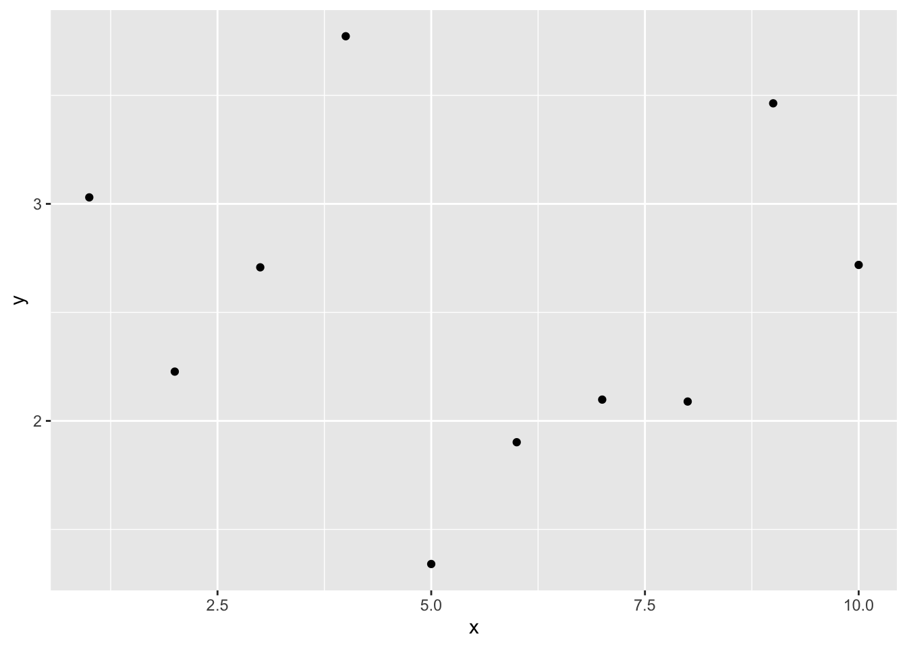

# モデルの評価{#chap17_Evaluation}

この章では一般化線形モデル（マルチレベルモデルを含む）を扱う上での注意点について学んでいく。  
  
そのモデルはデータを上手く予測できているかをどう評価するかについて学んでいく。

- 信頼区間と予測区間  
- 多重共線性  
- 過学習  

## 準備{#chap17_Preparation}

この章では、`performance`パッケージを使う。


``` r
library(performance)
```

## 信頼区間と予測区間{#chap17_Intervals}

モデルでパラメータの推定を行ったあとは、そのモデルがデータを上手く予測できているかを確認することも重要である。  
  
具体的には、パラメータの**信頼区間(confidence interval)**とデータの**予測区間 (predictive interval)**をチェックする。  
  
信頼区間とは、パラメータが分布する区間のことをいう。今回得られた標本を用いて係数を推定したが、標本の元となる母集団の係数の値はどのくらいか？その母集団の係数の予想の範囲が、信頼区間である。  
  
予測区間とは、標本がどの範囲に分布するかを予測する範囲のことをいう。新たな標本を取ったときに、そのデータがどの範囲に分布するか。その予想の範囲が予測区間である。  
  
Rには、線形モデルの推定結果から信頼区間と予測区間を算出してくれる`predict()`関数が用意されている。先ほどの線形モデルの解析結果を使って、信頼区間と予測区間を求めてみよう。

### 信頼区間{#chap17_CI}


``` r
result = lm(data = iris, Petal.Length ~ 1 + Sepal.Length) 

result_conf = predict(result, interval = "confidence", level = 0.95)
```

`interval = "confidence"`とすると、信頼区間を求めてくれる。
`level =` に信頼区間の幅を入力する（デフォルトで0.95だが、幅を変えたい場合は指定する）。


``` r
head(result_conf)
```

```
##        fit      lwr      upr
## 1 2.376565 2.188121 2.565009
## 2 2.004878 1.792226 2.217531
## 3 1.633192 1.393955 1.872428
## 4 1.447348 1.194160 1.700536
## 5 2.190722 1.990526 2.390917
## 6 2.934095 2.775149 3.093040
```

uprが95%信頼区間の上限、lwrが95%信頼区間の下限に当たる。


求めた信頼区間を図示してみよう


``` r
plot_conf = cbind(iris, result_conf) #実測値のデータと予測値のデータを結合する。

ggplot2::ggplot() + 
  ggplot2::geom_point(data = plot_conf, aes(x = Sepal.Length, y = Petal.Length)) + 
  ggplot2::geom_line(data = plot_conf, aes(x = Sepal.Length, y = fit)) + 
  ggplot2::geom_ribbon(data = plot_conf, aes(x = Sepal.Length, ymax = upr, ymin = lwr), alpha = 0.4) 
```


### 予測区間{#chap17_PI}


``` r
result = lm(data = iris, Petal.Length ~ 1 + Sepal.Length) 

new = data.frame(Sepal.Length = seq(4, 8, 0.1)) #0.1刻みで4から8まで範囲の数値ベクトルを入れたデータを仮に作る

result_pred = predict(result, newdata = new, interval = "prediction", level = 0.95) #newdataに先ほど作成した仮のデータを入れる。

head(result_pred) #仮データの数値に対応する予測区間が求められる
```

```
##         fit        lwr      upr
## 1 0.3322885 -1.4165179 2.081095
## 2 0.5181318 -1.2277203 2.263984
## 3 0.7039751 -1.0390829 2.447033
## 4 0.8898184 -0.8506063 2.630243
## 5 1.0756617 -0.6622915 2.813615
## 6 1.2615050 -0.4741389 2.997149
```

`interval = "prediction"`と入力する。

予測区間を図示してみよう。


``` r
plot_pred = data.frame(Sepal.Length = seq(4, 8, 0.1), result_pred) #予測区間のデータを作成する

ggplot2::ggplot() + 
  ggplot2::geom_point(data = iris, aes(x = Sepal.Length, y = Petal.Length)) + 
  ggplot2::geom_line(data = plot_pred, aes(x = Sepal.Length, y = fit)) + 
  ggplot2::geom_ribbon(data = plot_pred, aes(x = Sepal.Length, ymax = upr, ymin = lwr), alpha = 0.4) 
```


実際のデータが予測区間の範囲に収まっているならば、そのモデルは概ねよくデータを予測できていることを示している。


## 多重共線性{#chap17_Multico}

予測変数同士が非常に強く相関しあっている場合、予測変数の係数の推定結果が信頼できなくなる恐れがある。この問題は、**多重共線性(multicollinearity)**と呼ばれる。  
  
サンプルデータを使って確認してみよう。Rには多重共線性の例として`longley`というサンプルデータがある。  
  

``` r
head(longley)
```

```
##      GNP.deflator     GNP Unemployed Armed.Forces Population Year Employed
## 1947         83.0 234.289      235.6        159.0    107.608 1947   60.323
## 1948         88.5 259.426      232.5        145.6    108.632 1948   61.122
## 1949         88.2 258.054      368.2        161.6    109.773 1949   60.171
## 1950         89.5 284.599      335.1        165.0    110.929 1950   61.187
## 1951         96.2 328.975      209.9        309.9    112.075 1951   63.221
## 1952         98.1 346.999      193.2        359.4    113.270 1952   63.639
```

まず、このデータに入っている変数間の相関を確認してみよう。


``` r
cor(longley)
```

```
##              GNP.deflator       GNP Unemployed Armed.Forces Population
## GNP.deflator    1.0000000 0.9915892  0.6206334    0.4647442  0.9791634
## GNP             0.9915892 1.0000000  0.6042609    0.4464368  0.9910901
## Unemployed      0.6206334 0.6042609  1.0000000   -0.1774206  0.6865515
## Armed.Forces    0.4647442 0.4464368 -0.1774206    1.0000000  0.3644163
## Population      0.9791634 0.9910901  0.6865515    0.3644163  1.0000000
## Year            0.9911492 0.9952735  0.6682566    0.4172451  0.9939528
## Employed        0.9708985 0.9835516  0.5024981    0.4573074  0.9603906
##                   Year  Employed
## GNP.deflator 0.9911492 0.9708985
## GNP          0.9952735 0.9835516
## Unemployed   0.6682566 0.5024981
## Armed.Forces 0.4172451 0.4573074
## Population   0.9939528 0.9603906
## Year         1.0000000 0.9713295
## Employed     0.9713295 1.0000000
```

`Employed`を応答変数、`GNP.deflator`を予測変数としたモデル（model01）と、`Employed`を応答変数、`GNP`を予測変数とした線形モデル（model02）でそれぞれ解析してみよう。


``` r
model01 = lm(data = longley, Employed ~ 1 + GNP.deflator)
summary(model01)
```

```
## 
## Call:
## lm(formula = Employed ~ 1 + GNP.deflator, data = longley)
## 
## Residuals:
##      Min       1Q   Median       3Q      Max 
## -1.68522 -0.44820 -0.07106  0.57166  1.61777 
## 
## Coefficients:
##              Estimate Std. Error t value Pr(>|t|)    
## (Intercept)  33.18917    2.12919   15.59 3.06e-10 ***
## GNP.deflator  0.31597    0.02083   15.17 4.39e-10 ***
## ---
## Signif. codes:  0 '***' 0.001 '**' 0.01 '*' 0.05 '.' 0.1 ' ' 1
## 
## Residual standard error: 0.8706 on 14 degrees of freedom
## Multiple R-squared:  0.9426,	Adjusted R-squared:  0.9385 
## F-statistic: 230.1 on 1 and 14 DF,  p-value: 4.389e-10
```

``` r
model02 = lm(data = longley, Employed ~ 1 + GNP)
summary(model02)
```

```
## 
## Call:
## lm(formula = Employed ~ 1 + GNP, data = longley)
## 
## Residuals:
##      Min       1Q   Median       3Q      Max 
## -0.77958 -0.55440 -0.00944  0.34361  1.44594 
## 
## Coefficients:
##              Estimate Std. Error t value Pr(>|t|)    
## (Intercept) 51.843590   0.681372   76.09  < 2e-16 ***
## GNP          0.034752   0.001706   20.37 8.36e-12 ***
## ---
## Signif. codes:  0 '***' 0.001 '**' 0.01 '*' 0.05 '.' 0.1 ' ' 1
## 
## Residual standard error: 0.6566 on 14 degrees of freedom
## Multiple R-squared:  0.9674,	Adjusted R-squared:  0.965 
## F-statistic: 415.1 on 1 and 14 DF,  p-value: 8.363e-12
```

次に、`Employed`を応答変数、`GNP`と`GNP.deflator`の両方を予測変数として入れて解析をしてみよう。


``` r
model03 = lm(data = longley, Employed ~ 1 + GNP.deflator + GNP)
summary(model03)
```

```
## 
## Call:
## lm(formula = Employed ~ 1 + GNP.deflator + GNP, data = longley)
## 
## Residuals:
##      Min       1Q   Median       3Q      Max 
## -0.81315 -0.54330  0.05572  0.27894  1.40590 
## 
## Coefficients:
##              Estimate Std. Error t value Pr(>|t|)    
## (Intercept)  56.94504    7.44945   7.644 3.67e-06 ***
## GNP.deflator -0.08511    0.12374  -0.688   0.5037    
## GNP           0.04391    0.01343   3.269   0.0061 ** 
## ---
## Signif. codes:  0 '***' 0.001 '**' 0.01 '*' 0.05 '.' 0.1 ' ' 1
## 
## Residual standard error: 0.6693 on 13 degrees of freedom
## Multiple R-squared:  0.9685,	Adjusted R-squared:  0.9637 
## F-statistic:   200 on 2 and 13 DF,  p-value: 1.727e-10
```

それぞれの予測変数の係数を見てみると、一つずつ予測変数として入れたときと比べて値が変わっており、p値も低くなっている。  
  
`GNP`と`GNP.deflator`同士は相関係数0.99とかなり強く相関している。このように、強く相関し合う変数を入れると係数の効果について信頼できる結果が得られなくなってしまう。  
  
なぜ強く相関しあっている変数を入れるとまずいのか？モデルから考えてみよう。

$$
\begin{equation}
  \mu = \alpha + \beta_{1} x_{1} + \beta_{2} x_{2} \\ \tag{6}
\end{equation}
$$

2つの予測変数$x_{1}$と$x_{2}$が強く相関している場合、つまり$x_{1}=x_{2}$だとすると、式(6)は以下のように置き換えることができる。

$$
\begin{equation}
  \mu = \alpha + (\beta_{1} + \beta_{2}) x_{1} \\ \tag{7}
\end{equation}
$$

$(\beta_{1} + \beta_{2})$について、パラメータ$\beta_{1}$と$\beta_{2}$の組み合わせは無限に考えられる。このように、強く相関する予測変数を入れると２つの予測変数のパラメータについて推定することが難しくなってしまう（パラメータの信頼区間が大きくなってしまう）。  
  
### 多重共線性の評価{#chap17_EvalMultico}

多重共線性の評価として、**VIF(variance inflation factor)**という指標がよく用いられる。一般的に、$VIF > 10$の場合は、多重共線性を疑った方が良いといわれている。VIFの高い変数同士のうちどちらか一方を予測変数から除くといった対処をして、解析し直してみるのが良い。

`performance`パッケージの`check_collinearity()`関数を使えば、VIFを確認することができる。


``` r
performance::check_collinearity(model03)
```

```
## # Check for Multicollinearity
## 
## High Correlation
## 
##          Term   VIF      VIF 95% CI adj. VIF Tolerance Tolerance 95% CI
##  GNP.deflator 59.70 [30.69, 117.04]     7.73      0.02     [0.01, 0.03]
##           GNP 59.70 [30.69, 117.04]     7.73      0.02     [0.01, 0.03]
```


## 過学習{#chap17_Overfitting}

以下のプログラムを実行して、サンプルデータ`d`を作成しよう。


``` r
set.seed(10)

N = 10
x = seq(1,N,1)
y = runif(N, min = 1, max = 5)
d = data.frame(x = x, y = y)
str(d)
```

```
## 'data.frame':	10 obs. of  2 variables:
##  $ x: num  1 2 3 4 5 6 7 8 9 10
##  $ y: num  3.03 2.23 2.71 3.77 1.34 ...
```

``` r
ggplot2::ggplot() + 
  ggplot2::geom_point(data =d, aes(x=x, y = y))
```



このデータについて、以下の線形モデルを当てはめ、パラメータを推定しよう。図に線形モデルの直線及び信頼区間を図示するところまでやってみる。

$$
\begin{equation}
  \mu = \alpha + \beta_{1} x\\ \tag{8}
\end{equation}
$$


``` r
result_1 = lm(data = d, y ~ 1 + x)

newdat = data.frame(x = x)
conf.int_1 = predict(result_1, newdata = newdat, interval = "confidence", level = 0.95)
conf_dat = data.frame(d, newdat, conf.int_1)


ggplot2::ggplot() + 
  ggplot2::geom_point(data = conf_dat, aes(x = x, y = y))+
  ggplot2::geom_line(data = conf_dat, aes(x = x, y = fit)) +
  ggplot2::geom_ribbon(data = conf_dat, aes(x = x, ymin = lwr, ymax = upr), alpha =0.2)
```


直線はほとんど観測値から外れており、当てはまりが悪いようである。  
  
そこで、予測変数を増やして検討してみる。`lm()`では、予測変数$x$のn乗を含む多項式のモデルを考慮することも可能である。例えば、以下は3次の多項式の例である。  

$$
\begin{equation}
  \mu = \alpha + \beta_{1} x  + \beta_{2} x^{2}  + \beta_{3} x^{3}\\ \tag{9}
\end{equation}
$$

n次式のモデルは**多項式回帰**(polynomial regression)と呼ばれる。  
    
`lm()`では、`I()`の中に書くかたちでn次の予測変数を入れることができる。  


``` r
result_3 = lm(data = d, y ~ 1 + x + I(x^2) + I(x^3))
```

同じく、3次の多項式による予測の結果を図で確認しよう。


``` r
newdat = data.frame(x = x)
conf.int_3 = predict(result_3, newdata = newdat, interval = "confidence", level = 0.95)
conf_dat = data.frame(d, newdat, conf.int_3)


ggplot2::ggplot() + 
  ggplot2::geom_point(data = conf_dat, aes(x = x, y = y))+
  ggplot2::geom_line(data = conf_dat, aes(x = x, y = fit)) + 
  ggplot2::geom_ribbon(data = conf_dat, aes(x = x, ymin = lwr, ymax = upr), alpha =0.2)
```


9次の式でも推定してみよう。  


``` r
result_9 = lm(data = d, y ~ 1 + x + I(x^2) + I(x^3) + I(x^4) + I(x^5) + I(x^6) + I(x^7) + I(x^8) + I(x^9))


newdat = data.frame(x = x)
conf.int_9 = predict(result_9, newdata = newdat, interval = "confidence", level = 0.95)
conf_dat = data.frame(d, newdat, conf.int_9)


ggplot2::ggplot() + 
  ggplot2::geom_point(data = conf_dat, aes(x = x, y = y))+
  ggplot2::geom_line(data = conf_dat, aes(x = x, y = fit)) + 
  ggplot2::geom_ribbon(data = conf_dat, aes(x = x, ymin = lwr, ymax = upr), alpha =0.2)
```


線は全てのデータ点を通っている。当然ながら、データの観測値の分だけパラメータがあれば、そのモデルはデータ点を全て通る線を引くことができる。現在のデータ点全てを予測することができる。  
  
しかし、そのモデルは現在のデータを全て当てられても、*将来得られる未知のデータを当てられるとは限らない*。予測変数を多くすると現在のデータには当てはまるが、当てはまりすぎて未知のデータの予測力が低下してしまうことを、**過学習(overfitting)**という。  
  
複雑なモデルが現在のデータによく当てはまるのは、ある意味当然である（単なる偶然で生じた誤差も無駄に説明してしまっている）。しかし、複雑なモデルは現在のデータに当てはまっても、未知のデータにもうまく当てはまるとは限らない。  
  
理想的なモデルは、「**予測力が高く、かつ予測変数ができるだけ少なくてシンプルなモデル**」となる。


## モデルの予測力の評価{#chap17_Creteria}

モデルの予測力を評価するために使われる指標について説明する。

### 決定係数{#chap17_Rsq} 

線形モデルでは、データに対する回帰分析のモデルの予測力を表す指標として、**決定係数**（R-squared）がある。  
  
サンプルデータ`attitude`を例に見てみよう。


``` r
model_01 = lm(data=attitude, rating ~ 1 + complaints + learning)
summary(model_01)$r.squared #r.squaredで決定係数のみを取り出すことができる。
```

```
## [1] 0.7080152
```

これは、モデルから求めた予測値と実測値の分散が、実際のデータの分散に占める割合を意味する指標である。つまり、そのモデルでどれだけ全データの分散を説明できているかを意味する。

$$
R^2 = \sum_{i=1}^{n} \frac {(y_{i}-\mu_{i})^2}{(y_{i}-\bar{y})^2} \tag{10}
$$

ただし、決定係数は単純に、予測変数が増えるほど大きくなる（説明できる分散の量が増える）。  
  
例えば`attitude`データ内の全ての変数を予測変数に使ってみる。


``` r
model_full = lm(data=attitude, rating ~ .) #線形予測子を入力するところにドットを入力すると、そのデータに含まれる全ての変数を予測変数として扱う
summary(model_full)$r.squared 
```

```
## [1] 0.732602
```

応答変数に影響を及ぼさない変数を含めても、決定係数は上昇してしまう。  
  
決定係数は、「予測力が高く、シンプルなモデル」を探すには常に適切な指標であるとは言えない。

### 赤池情報量規準（AIC）{#chap17_AIC}

モデルのシンプルさ（予測変数の少なさ）とモデルの予測力とのバランスを取った指標の一つとして、**赤池情報量規準(Akaike inoformation criteria: AIC)**がよく知られている。AICは以下の式で計算される。

$$
AIC = -2 \log L + 2k \tag{11}\\
$$

$\log L$は最大対数尤度、$k$はモデルのパラメータ数である。  

第9章で、モデルのパラメータを推定する方法として「最尤法」を紹介した。最尤法は、モデルのもっともらしさ（データが生じる確率）を意味する「対数尤度」が最大となるときのパラメータを求める方法であった。最大対数尤度は、現在のモデルに対する当てはまりの良さを反映している。その最大対数尤度に対し、パラメータ数$k$に応じてペナルティ(penalty term)を加える。  
  
**AICの値が低いほど**、モデルの予測力が高いと評価する。AICは余計なパラメータが多くなる（$k$が大きくなる）ほど大きい値を取る。つまり、データをうまく予測しつつ、かつパラメータ数を抑えてシンプルなモデルを探る目的にかなっている。  
  
`AIC()`関数でモデルをカッコ内に入れると、AICを算出してくれる。さきほどの`attitude`に当てはめた2つのモデルのAICを見てみよう。


``` r
AIC(model_full)
```

```
## [1] 210.4998
```

``` r
AIC(model_01)
```

```
## [1] 205.1387
```

`model_full`よりも`model_01`のAICが低く、`model_01`の予想力の方が高いことを示している。

***

AIC以外にも、モデルを評価する**情報量基準**がいくつか提案されている。  
例えば、ベイズ情報量規準(Bayesian Information Criterion: BIC)がある。  
  
BICは以下の式で求められる。$\log L$と$k$はそれぞれ対数尤度とパラメータ数であり、$n$はオブザベーション数（データの数）を意味する。AICと同様に、数値が小さいほどモデルによく当てはまっていると判断する。
  
$$
BIC = -2 \log L + k\log(n) \tag{12}\\
$$


``` r
BIC(model_01)
```

```
## [1] 210.7435
```


## 確認問題 {#chap17_Practice}

Rで標準で入っている`airquality`を使う。


``` r
prac_dat_3 =  na.omit(airquality) #欠損値を除き、別の名前で保存する

head(prac_dat_3)
```

```
##   Ozone Solar.R Wind Temp Month Day
## 1    41     190  7.4   67     5   1
## 2    36     118  8.0   72     5   2
## 3    12     149 12.6   74     5   3
## 4    18     313 11.5   62     5   4
## 7    23     299  8.6   65     5   7
## 8    19      99 13.8   59     5   8
```


#### 3-1 {-}

`Ozone`を応答変数、`Solar.R`, `Wind`, `Temp`の3つを予測変数とした線形モデルを行う。そして、切片及び傾きの推定値を報告せよ。


#### 3-2 {-}

3-1で行った線形モデルについて、決定係数を報告せよ（Multiple R-squared）。

#### 3-3 {-}

以下の3種類の線形モデルの解析を行い、  
モデル1: `Ozone`を応答変数、`Solar.R`, `Wind`, `Temp`の3つを予測変数とした線形モデル  
モデル2: `Ozone`を応答変数、`Solar.R`,  `Temp`の2つを予測変数とした線形モデル  
モデル3: `Ozone`を応答変数、`Temp`を予測変数とした線形モデル  
  
それぞれのモデルのAICを報告するとともに、3つのモデルのうち予測力が高いと考えられるものはどれかを報告せよ。


