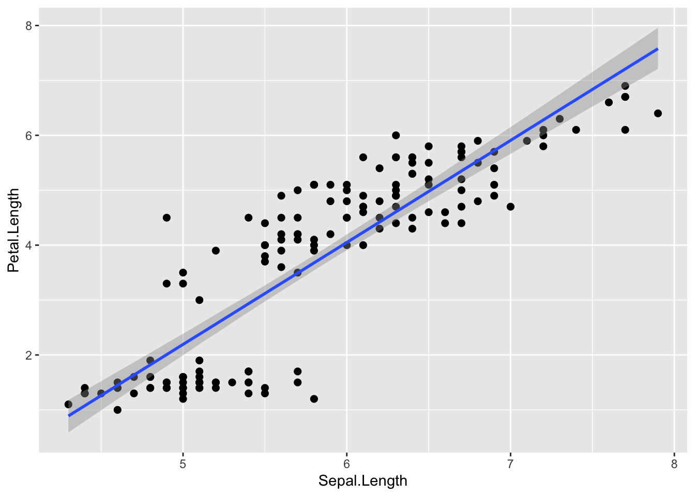

# ベイズ統計モデリング{#chap19_BayesianModels}

この章では、これまで学んできた一般化線形モデルなどの解析をベイズ統計の枠組みで行う方法について解説する。`rstan`と`brms`パッケージを使い、一般化線形モデルやマルチレベルモデルのパラメータの事後分布をMCMCで推定する。  
  
この章で書かれている内容を行う前に、前の章で説明したベイズ統計の概要を理解しておくこと（前の章を読んでいるという前提で説明をする）。「事前分布」、「事後分布」、「MCMC」について、前の章で確認しておくこと。

## 準備{#chap19_Preparation}

### Rstanのインストール{#chap19_Rstan}

MCMCを行うために、Stanと呼ばれるプラットフォームが必要にある。RStanはRからStanを使うために開発されたインターフェースである。この章の内容の解析を行うためには、RStanパッケージのインストールが事前に必要となる。  
  
RStan（`rstan`）のインストール方法については、「RStan Getting Started (Japanese)」[https://github.com/stan-dev/rstan/wiki/RStan-Getting-Started-(Japanese)](https://github.com/stan-dev/rstan/wiki/RStan-Getting-Started-(Japanese))のページを参照のこと。「Rtool」、「C++コンパイラ（MacならばXCode）」のインストールも必要になる。  


### brmsパッケージのインストール{#chap19_brmspackage}
  
`rstan`をインストールできたら、`brms`パッケージもインストールする。  
Stanを使ってベイズ推定（MCMC）を行うためには、Stan言語で解析用のコードを書く必要があるが、`brms`パッケージを使えばユーザーがコードを書く必要なく、線形のモデルやオプションを指定するだけで自動でStanコードを生成してMCMCを行ってくれる。  


``` r
install.packages("brms")
```

### パッケージのロード{#chap19_loadpackage}

`rstan`と`brms`をロードする。


``` r
library(rstan)
library(brms)
```

また、計算の高速化のために、以下のプログラムも実行しておく。


``` r
#計算を高速化するオプション
rstan_options(auto_write = TRUE)
options(mc.cores = parallel::detectCores())
```

## Rによるベイズ統計モデリング{#chap19_brms}

回帰分析のパラメータ（傾きと切片）のベイズ推定を例として、`brms`パッケージを使った解析の手順について確認していく。  
  
第9章で、`iris`データを用いて以下の回帰分析を行った。


``` r
result = lm(data = iris, Petal.Length ~ 1 + Sepal.Length) 
summary(result)
```

```
## 
## Call:
## lm(formula = Petal.Length ~ 1 + Sepal.Length, data = iris)
## 
## Residuals:
##      Min       1Q   Median       3Q      Max 
## -2.47747 -0.59072 -0.00668  0.60484  2.49512 
## 
## Coefficients:
##              Estimate Std. Error t value Pr(>|t|)    
## (Intercept)  -7.10144    0.50666  -14.02   <2e-16 ***
## Sepal.Length  1.85843    0.08586   21.65   <2e-16 ***
## ---
## Signif. codes:  0 '***' 0.001 '**' 0.01 '*' 0.05 '.' 0.1 ' ' 1
## 
## Residual standard error: 0.8678 on 148 degrees of freedom
## Multiple R-squared:   0.76,	Adjusted R-squared:  0.7583 
## F-statistic: 468.6 on 1 and 148 DF,  p-value: < 2.2e-16
```

同じデータについて`brms`パッケージの`brm()`を使って、MCMCでパラメータの事後分布を推定してみよう。`glm()`と同じ書き方で、線形予測子、確率分布、リンク関数を指定すれば良い。回帰分析なので、確率分布は正規分布(gaussian)、リンク関数は恒等リンク(identity)とする。  
  
また、オプションの`seed`には常に一定の値を指定すること（ここでは1と指定した）。MCMCは乱数を使ったシミュレーションであるので、やり直すたびに微妙に異なる結果が得られる可能性にある。しかし、`seed`に同じ値を設定すれば、やり直しても同じ結果を再現することできる。  
  


``` r
result_brms_lm = brms::brm(data = iris, 
                        Petal.Length ~ 1 + Sepal.Length, 
                        family = gaussian(link="identity"),
                        seed = 1 
                        )
```


``` r
summary(result_brms_lm)
```

```
##  Family: gaussian 
##   Links: mu = identity 
## Formula: Petal.Length ~ 1 + Sepal.Length 
##    Data: iris (Number of observations: 150) 
##   Draws: 4 chains, each with iter = 2000; warmup = 1000; thin = 1;
##          total post-warmup draws = 4000
## 
## Regression Coefficients:
##              Estimate Est.Error l-95% CI u-95% CI Rhat Bulk_ESS Tail_ESS
## Intercept       -7.10      0.51    -8.12    -6.07 1.00     3831     2967
## Sepal.Length     1.86      0.09     1.69     2.03 1.00     3797     2942
## 
## Further Distributional Parameters:
##       Estimate Est.Error l-95% CI u-95% CI Rhat Bulk_ESS Tail_ESS
## sigma     0.87      0.05     0.78     0.98 1.00     4074     2871
## 
## Draws were sampled using sampling(NUTS). For each parameter, Bulk_ESS
## and Tail_ESS are effective sample size measures, and Rhat is the potential
## scale reduction factor on split chains (at convergence, Rhat = 1).
```


最初に、応答変数が従う確率分布(Family)、リンク関数(Links)、線形予測子(Formula)、データ(Data)の情報が出力される。更に、Samplesの部分にMCMCの設定が表記されているが、これらの意味については後ほど説明する。  
  
`lm()`の出力と同様に、Population-Level Effectsという部分に各パラメータ（切片と傾き）の推定結果が出力されている。Estimateが係数の事後分布の期待値を示している。`lm()`で解析したときとほぼ同じ値が推定されている。    
他にも、l-95% CIとu-95% CIといった数値が出力されているが、これらの意味を理解するにはパラメータの事後分布を図示するとよい。`plot()`に出力結果を入れると、MCMCの結果を図で示してくれる。


``` r
plot(result_brms_lm)
```


左側に表示されているのが、パラメータの事後分布（MCMCでサンプリングされた事後分布に従う乱数の分布）である。右側は、**トレースプロット(traceplot)**と呼ばれるものである。トレースプロットの下の軸はMCMCの試行数を示しており、MCMCのサンプリング結果の推移を示している。  
  
もう一度`brm()`の出力のl-95% CIとu-95% CIの値を確認し、図との関係を確認しよう。l-95% CIとu-95%は、パラメータの事後分布の下位5%点と上位95%点の値を示しており、この下位5%から上位95%の範囲は95% **信用区間(credible intervals)**と呼ばれる。95%信用区間とは、95%の確率で真のパラメータの値が含まれる範囲を意味する。  
  
例えば、切片（`intercept`）の事後分布のプロットを確認すると、だいたい-7が分布の中央に位置しており、推定された切片の事後分布の期待値（Estimate）と概ね一致しているのがわかる。また、-8から-6の範囲に事後分布の大部分が締めており、これも95%信用区間の推定結果と概ね一致している。  
  
***
最尤推定法（最小二乗法）によるパラメータ推定である`lm()`の出力結果とは異なり、ベイズ推定である`brm()`の結果ではp値が表示されていていない点に注目しよう。前の章でも述べたように、データを定数、パラメータを確率変数として考えるベイズ統計には、統計的仮説検定の枠組みで扱うp値（帰無仮説のもとでデータが得られる確率）という概念はない。  
  
ベイズ推定による一般化線形モデルで係数の効果に意味があるかを議論したいのならば、パラメータの信用区間について注目する。`brm()`の出力結果で係数の信用区間にゼロが含まれているかどうかが、`lm()`のp値が示す結果（係数がゼロから有意に離れているか）と対応している。  


## ベイズ統計モデリングのプロセス{#chap19_Basisbrm}

`brm()`のプログラムの書き方を確認しながら、ベイズ統計モデリングの手順について確認していこう。

### 事前分布の設定{#chap19_brmprior}

パラメータの事後分布を推定するためには、まずパラメータ（切片と傾き）の事前分布を設定する必要がある。何か仮説があって事前にパラメータの範囲を設けることに正当な理由があるのならば、任意の範囲を設定しても構わない。例えば、身長を予測するならば切片の事前分布として0cm - 300cmの一様分布を設定するというのは妥当であろう。それに対し、特に仮説がない、パラメータの事前分布について確信がない場合は、**無情報事前分布(non-informative prior)**を設定する。  
  
特に仮説がなければ、`brm()`では何も設定する必要はない。自動で事前分布を無情報事前分布としてくれる（例えば傾きなどをフラットな一様分布に設定してくれる）。  
  
`get_prior()`に、モデル、確率分布、リンク関数を指定すれば、設定される事前分布を推定の前に確認することができる。


``` r
brms::get_prior(data= iris, 
                Sepal.Length ~ 1 + Sepal.Width,
                family = gaussian(link="identity")) 
```

```
##                   prior     class        coef group resp dpar nlpar lb ub tag
##                  (flat)         b                                            
##                  (flat)         b Sepal.Width                                
##  student_t(3, 5.8, 2.5) Intercept                                            
##    student_t(3, 0, 2.5)     sigma                                    0       
##        source
##       default
##  (vectorized)
##       default
##       default
```


事前分布を任意に指定したい場合は、`brm()`のオプションとして`set_prior()`で設定することができる。以下に、プログラムの例を示す。


``` r
result_brm_lm = brms::brm(data= iris, 
                          Sepal.Length ~ 1 + Sepal.Width,
                          family = gaussian(link="identity"),
                          prior = c(set_prior("normal(0,10)", class = "b"),
                                    #傾きbの事前分布を平均0, 標準偏差10の正規分布に設定
                                    set_prior("cauchy(0,5)", class = "sigma")
                                    #正規分布の分散の事前分布を半コーシー分布に設定
                                    ),
                          seed = 1
)
brms::prior_summary(result_brm_lm) #prior_summaryに結果を入れると、設定した事前分布を確認することができる
```


### MCMCの設定{#chap19_brmMCMC}

`brm()`のオプションで、MCMCシミュレーションの設定を指定することができる。


``` r
result_brms = brms::brm(data = iris, 
                        Petal.Length ~ 1 + Sepal.Length, 
                        iter = 2000,
                        warmup = 1000,
                        chains = 4,
                        seed = 1)
```

`iter`で乱数生成の試行数、`warmup`でwarmup期間の数、`chains`でマルコフ連鎖の数を指定する。前の章の内容をおさらいすると、MCMCではパラメータの事後分布に従う乱数を生成するシミュレーションを繰り返し、全シミュレーションの結果から作られた分布をパラメータの事後分布として採用する。`iter`で、乱数生成の繰り返し数を設定する（この例では、2,000試行に設定）。また、MCMCシミュレーションの最初の部分は、乱数の初期値による影響を大きく受けていて最終的に事後分布を作成する上で使い物にならない。そのため、最初の試行は切り捨てられる。`warmup`で、その切り捨てる期間を指定する（この例では、最初の1,000試行を切り捨てるように設定）。MCMCでは一般的に乱数生成を1からやり直して何セットか行い、事後分布を評価する。`chain`で、このセット数を設定する（この例では、4セットに設定）。最終的に得られるMCMCサンプル（シミュレーションの結果）は、(iter - warmup)*chains個になる。  
  
`iter`, `warmup`, `chains`の指定をしなければ、デフォルトで設定されている値(`iter = 2000, warmup = 1000, chains = 4`)でMCMCが実行される。  
    

### 事後分布の評価{#chap19_brmposterior}

事前分布、MCMCの設定ができたら、`brm()`を実行してMCMCを行う。  
  
シミュレーションが終わったら、結果を確認する。先ほど示したように、`summary()`で事後分布の期待値などの要約を確認するのももちろん、図でも確認する。`plot()`で簡単な図を作成することができる。


``` r
summary(result_brms_lm)
plot(result_brms_lm)
```


他にも、MCMCの結果を図示するためのパッケージとして、`bayesplot`パッケージがある（`brms`パッケージをインストールすると一緒にインストールされる）。
  
以下に、事後分布を図示する例をいくつか示す（`pars`で出力したいパラメータの値を任意に指定することも可能）。


``` r
library(bayesplot)

bayesplot::mcmc_trace(result_brms_lm, pars = c("b_Intercept", "b_Sepal.Length")) #トレースプロット
```


``` r
bayesplot::mcmc_hist(result_brms_lm, pars = c("b_Intercept", "b_Sepal.Length")) #事後分布（ヒストグラム）
```


``` r
bayesplot::mcmc_dens(result_brms_lm, pars = c("b_Intercept", "b_Sepal.Length")) #事後分布（密度曲線）
```


``` r
bayesplot::mcmc_intervals(result_brms_lm, 
                          pars = c("b_Intercept", "b_Sepal.Length"), 
                          prob = 0.89, #太い線が意味する範囲（89%区間とした）
                          prob_outer = 0.95#細い線が意味する範囲（95%区間とした）
                          ) #パラメータの分布を線で示したグラフ
```


``` r
bayesplot::mcmc_areas(result_brms_lm, 
                          pars = c("b_Intercept", "b_Sepal.Length"), 
                          prob = 0.89, #色が塗られた部分（89%区間とした）
                          prob_outer = 0.95#細い線が意味する範囲（95%区間とした）
) #分布も一緒に示したグラフ
```


``` r
bayesplot::mcmc_combo(result_brms_lm, combo = c("hist", "dens"), 
                      pars = c("b_Intercept", "b_Sepal.Length"))#mcmc_comboで、出力する図を複数指定することができる。
```


### 収束の評価{#chap19_brmconvergence}

MCMCによる事後分布の推定は乱数を使ったシミュレーションなので、シミュレーション結果は毎回異なる。しかし、得られた結果が毎回かなり違うのならば、その結果は信用できないということになる。`summary()`の出力に表示されている`Rhat`が、MCMCの結果が安定している（収束している）かを評価する指標として用いられる。`Rhat`が1.00を超えている場合は収束していないことが疑われるので、MCMCの設定やモデルの修正などの対処が必要になる（詳細については、参考文献リストに挙げたベイズ統計モデリングに関する解説書を参照のこと）。  
  

### モデルの予測評価{#chap19_brmprediction}

推定結果が、実際のデータをうまく予測できているかを評価する。ここでは、回帰直線の信用区間や予測区間を図示して確認する方法を示す。


``` r
pred_line = brms::conditional_effects(result_brms_lm,
                                      method = "posterior_epred", prob=0.95 #95%信用区間を表示 
                                      )
plot(pred_line, points=TRUE)　#points=TRUEで点と一緒に示す
```



``` r
pred_line = brms::conditional_effects(result_brms_lm,
                                      method = "posterior_predict", prob=0.95 #95%予測区間を表示 
                                      )
plot(pred_line, points=TRUE)　#pointsで点と一緒に示す
```


## brmsパッケージでの一般化線形モデル{#chap19_brmGLM}

`brm()`で確率分布やリンク関数を変更すれば、ロジスティック回帰やポアソン回帰のベイズ推定も行うことができる。プログラムの書き方は`glm()`とほぼ同じである。  
  
以下のプログラムの例ではリンク関数の指定も記述しているが、省略しても構わない（デフォルトでその確率分布に対して適切なリンク関数が設定されている）。


### ロジスティック回帰{#chap19_brmbernoulli}

第12章でロジスティック回帰の練習に使ったサンプルデータを使って、パラメータの事後分布の推定を行ってみよう。以下に第12章に示したサンプルデータの作成プログラムを再掲する。


``` r
library(MASS) 
dat = biopsy
dat$y = ifelse(dat$class == "malignant", 1, 0) #classがbenignならばゼロ、それ以外なら1という変数yを作る
dat$x = dat$V1 #V1という変数をxという名前に変える
head(dat)
```

```
##        ID V1 V2 V3 V4 V5 V6 V7 V8 V9     class y x
## 1 1000025  5  1  1  1  2  1  3  1  1    benign 0 5
## 2 1002945  5  4  4  5  7 10  3  2  1    benign 0 5
## 3 1015425  3  1  1  1  2  2  3  1  1    benign 0 3
## 4 1016277  6  8  8  1  3  4  3  7  1    benign 0 6
## 5 1017023  4  1  1  3  2  1  3  1  1    benign 0 4
## 6 1017122  8 10 10  8  7 10  9  7  1 malignant 1 8
```

確率分布（family）にはベルヌーイ分布(`bernoulli`)、リンク関数（link）には`logit`を指定する。


``` r
result_brms_logistic = brms::brm(data = dat, 
          y ~ 1 + x, 
          family = bernoulli(link="logit"), 
          seed = 1)
```


``` r
summary(result_brms_logistic)
```

```
##  Family: bernoulli 
##   Links: mu = logit 
## Formula: y ~ 1 + x 
##    Data: dat (Number of observations: 699) 
##   Draws: 4 chains, each with iter = 2000; warmup = 1000; thin = 1;
##          total post-warmup draws = 4000
## 
## Regression Coefficients:
##           Estimate Est.Error l-95% CI u-95% CI Rhat Bulk_ESS Tail_ESS
## Intercept    -5.21      0.38    -6.01    -4.49 1.00     2156     2007
## x             0.95      0.07     0.81     1.10 1.00     2370     2346
## 
## Draws were sampled using sampling(NUTS). For each parameter, Bulk_ESS
## and Tail_ESS are effective sample size measures, and Rhat is the potential
## scale reduction factor on split chains (at convergence, Rhat = 1).
```


### ポアソン回帰{#chap19_brmPoisson}

第12章のサンプルデータを使って、`brm()`でポアソン回帰を行ってみる。


``` r
set.seed(1)
N= 50
x = rnorm(n=N, mean = 2, sd=1)
lambda = exp(0.01+ 0.6*x)
y = rpois(n=N, lambda = lambda)
dat = data.frame(y=y, x=x)
head(dat)
```

```
##    y        x
## 1  3 1.373546
## 2  3 2.183643
## 3  1 1.164371
## 4 17 3.595281
## 5  5 2.329508
## 6  1 1.179532
```


確率分布（family）にはポアソン分布(`poisson`)、リンク関数（link）には`log`を指定する。


``` r
result_brms_poisson = brms::brm(data = dat, 
                                 y ~ 1 + x, 
                                 family = poisson(link="log"),
                                seed = 1) 
```


``` r
summary(result_brms_poisson)
```

```
##  Family: poisson 
##   Links: mu = log 
## Formula: y ~ 1 + x 
##    Data: dat (Number of observations: 50) 
##   Draws: 4 chains, each with iter = 2000; warmup = 1000; thin = 1;
##          total post-warmup draws = 4000
## 
## Regression Coefficients:
##           Estimate Est.Error l-95% CI u-95% CI Rhat Bulk_ESS Tail_ESS
## Intercept    -0.70      0.28    -1.26    -0.17 1.00     1464     1687
## x             0.90      0.11     0.70     1.11 1.00     1595     1976
## 
## Draws were sampled using sampling(NUTS). For each parameter, Bulk_ESS
## and Tail_ESS are effective sample size measures, and Rhat is the potential
## scale reduction factor on split chains (at convergence, Rhat = 1).
```


### 負の二項回帰{#chap19_brmnegbinom}

サンプルデータを使って、`brm()`で負の二項回帰を行ってみる。


``` r
d = warpbreaks #別の名前(d)で保存する
d$A <- ifelse(d$wool == "A", 1, 0) #Aなら1, Bなら0のダミー
head(d)
```

```
##   breaks wool tension A
## 1     26    A       L 1
## 2     30    A       L 1
## 3     54    A       L 1
## 4     25    A       L 1
## 5     70    A       L 1
## 6     52    A       L 1
```

確率分布（family）には負の二項分布(`negbinomial`)、リンク関数（link）には`log`を指定する。


``` r
result_brms_negbin = brms::brm(data = d, 
                                 breaks ~ 1 + A, 
                                 family = negbinomial(link = "log"),
                               seed = 1) 
```


``` r
summary(result_brms_negbin)
```

```
##  Family: negbinomial 
##   Links: mu = log 
## Formula: breaks ~ 1 + A 
##    Data: d (Number of observations: 54) 
##   Draws: 4 chains, each with iter = 2000; warmup = 1000; thin = 1;
##          total post-warmup draws = 4000
## 
## Regression Coefficients:
##           Estimate Est.Error l-95% CI u-95% CI Rhat Bulk_ESS Tail_ESS
## Intercept     3.23      0.09     3.06     3.40 1.00     3304     2674
## A             0.21      0.12    -0.03     0.44 1.00     3150     2910
## 
## Further Distributional Parameters:
##       Estimate Est.Error l-95% CI u-95% CI Rhat Bulk_ESS Tail_ESS
## shape     6.79      1.65     4.07    10.48 1.00     3163     2654
## 
## Draws were sampled using sampling(NUTS). For each parameter, Bulk_ESS
## and Tail_ESS are effective sample size measures, and Rhat is the potential
## scale reduction factor on split chains (at convergence, Rhat = 1).
```


### 順序ロジスティック回帰{#chap19_brmclm}

第13章のサンプルデータを使って、`brm()`で順序ロジスティック回帰を行ってみる。


``` r
###サンプルデータの作成
Sleep = c(6,1,5,2,5,6,2,6,2,5,6,2,5,3,5,3,3,7,2,7,6,1,2,1,7,1,1,7,5,3)
Score = c(3,3,3,2,3,3,5,5,2,2,2,3,4,1,3,2,3,5,1,4,4,3,3,3,4,1,3,3,3,2)
Score = factor(Score, levels = c("1", "2", "3", "4", "5"), ordered = TRUE)

sample_ordered = data.frame(Score = Score, Sleep = Sleep)
head(sample_ordered)
```

```
##   Score Sleep
## 1     3     6
## 2     3     1
## 3     3     5
## 4     2     2
## 5     3     5
## 6     3     6
```


確率分布（family）に`cumulative`、リンク関数（link）には`logit`を指定する。


``` r
result_brms_cum = brms::brm(data = sample_ordered,
                            Score ~ 1 + Sleep,
                            family = cumulative(link = "logit"),
                            seed = 1) 
```


``` r
summary(result_brms_cum)
```

```
##  Family: cumulative 
##   Links: mu = logit 
## Formula: Score ~ 1 + Sleep 
##    Data: sample_ordered (Number of observations: 30) 
##   Draws: 4 chains, each with iter = 2000; warmup = 1000; thin = 1;
##          total post-warmup draws = 4000
## 
## Regression Coefficients:
##              Estimate Est.Error l-95% CI u-95% CI Rhat Bulk_ESS Tail_ESS
## Intercept[1]    -0.79      0.85    -2.57     0.80 1.00     3034     2855
## Intercept[2]     0.77      0.74    -0.69     2.29 1.00     3928     3263
## Intercept[3]     3.20      0.97     1.38     5.23 1.00     2810     2563
## Intercept[4]     4.48      1.13     2.45     6.82 1.00     2888     2695
## Sleep            0.46      0.18     0.11     0.84 1.00     2813     2578
## 
## Further Distributional Parameters:
##      Estimate Est.Error l-95% CI u-95% CI Rhat Bulk_ESS Tail_ESS
## disc     1.00      0.00     1.00     1.00   NA       NA       NA
## 
## Draws were sampled using sampling(NUTS). For each parameter, Bulk_ESS
## and Tail_ESS are effective sample size measures, and Rhat is the potential
## scale reduction factor on split chains (at convergence, Rhat = 1).
```

### 多項ロジスティック回帰{#chap19_brmcategorical}

第13章のサンプルデータを使って、`brm()`で多項ロジスティック回帰を行ってみる。


``` r
###サンプルデータの作成
set.seed(1)
Male = c(rep(0:1, 25))
Grade = rnorm(n=50, 5, 2)
Faculty = c(rep("Literature", 15), rep("Economics", 20), rep("Physical", 15))
sample_mnl = data.frame(Faculty = Faculty, Male = Male, Grade = Grade)
head(sample_mnl)
```

```
##      Faculty Male    Grade
## 1 Literature    0 3.747092
## 2 Literature    1 5.367287
## 3 Literature    0 3.328743
## 4 Literature    1 8.190562
## 5 Literature    0 5.659016
## 6 Literature    1 3.359063
```


確率分布（family）としてカテゴリカル分布（`categorical`）、`logit`を指定する。


``` r
result_brms_mnl = brms::brm(data = sample_mnl, 
                            Faculty ~ 1 + Male + Grade, 
                            family = categorical(link = "logit"),
                            seed = 1) 
```


``` r
summary(result_brms_mnl)
```

```
##  Family: categorical 
##   Links: muLiterature = logit; muPhysical = logit 
## Formula: Faculty ~ 1 + Male + Grade 
##    Data: sample_mnl (Number of observations: 50) 
##   Draws: 4 chains, each with iter = 2000; warmup = 1000; thin = 1;
##          total post-warmup draws = 4000
## 
## Regression Coefficients:
##                        Estimate Est.Error l-95% CI u-95% CI Rhat Bulk_ESS
## muLiterature_Intercept    -0.41      1.30    -3.10     2.09 1.00     4645
## muPhysical_Intercept      -0.84      1.32    -3.46     1.70 1.00     4350
## muLiterature_Male         -0.12      0.72    -1.56     1.24 1.00     4269
## muLiterature_Grade         0.03      0.22    -0.40     0.49 1.00     4846
## muPhysical_Male            0.18      0.72    -1.21     1.61 1.00     4464
## muPhysical_Grade           0.09      0.22    -0.35     0.53 1.00     4390
##                        Tail_ESS
## muLiterature_Intercept     3144
## muPhysical_Intercept       2935
## muLiterature_Male          3261
## muLiterature_Grade         3169
## muPhysical_Male            2987
## muPhysical_Grade           2970
## 
## Draws were sampled using sampling(NUTS). For each parameter, Bulk_ESS
## and Tail_ESS are effective sample size measures, and Rhat is the potential
## scale reduction factor on split chains (at convergence, Rhat = 1).
```

### ゼロ過剰ポアソンモデル{#chap19_brmZIP}

第13章のサンプルデータを使って、`brm()`でゼロ過剰ポアソンモデルを当てはめてみる。


``` r
y = c(1, 2, 0, 0, 2, 0, 0, 0, 0, 0, 
      0, 3, 0, 4, 4, 0, 0, 0, 3, 0, 
      1, 1, 7, 0, 0, 5, 1, 4, 0, 2)
Rain = c(0, 0, 1, 1, 0, 1, 1, 1, 1, 0, 
         0, 0, 1, 0, 1, 0, 1, 1, 0, 1, 
         1, 0, 1, 0, 0, 0, 0, 0, 1, 0)
Humidity = c(50, 50, 59, 58, 56, 59, 58, 51, 30, 56, 
             49, 48, 35, 45, 54, 64, 49, 54, 49, 36, 
             46, 46, 49, 61, 58, 48, 47, 57, 56, 43)
Temperature = c(29, 30, 31, 30, 31, 30, 29, 30, 29, 31,
                32, 30, 29, 31, 30, 32, 30, 31, 30, 29,
                30, 28, 31, 30, 32, 30, 29, 31, 29, 29)
d_zip = data.frame(y = y, Rain = Rain, Humidity = Humidity, Temperature = Temperature)
head(d_zip)
```

```
##   y Rain Humidity Temperature
## 1 1    0       50          29
## 2 2    0       50          30
## 3 0    1       59          31
## 4 0    1       58          30
## 5 2    0       56          31
## 6 0    1       59          30
```


`brm()`では、ゼロ過剰ポアソンモデルを扱うための`zero_inflated_poisson`という確率分布のfamilyが用意されている。`bf()`で、カウントデータを予測する線形予測子と、ゼロ過剰(`zi`)を予測する線形予測子のそれぞれを分けて入力する。リンク関数は、カウントデータの推定(`link`)には`log`、ゼロの推定（`link_zi`）には`logit`を指定する。  


``` r
result_brms_zip = brms::brm(data = d_zip,
                            bf(y ~ 1 + Humidity + Temperature, zi ~ 1 + Rain),
                            family = zero_inflated_poisson(link = "log", link_zi = "logit"),
                            seed = 1) 
```


``` r
summary(result_brms_zip)
```

```
##  Family: zero_inflated_poisson 
##   Links: mu = log; zi = logit 
## Formula: y ~ 1 + Humidity + Temperature 
##          zi ~ 1 + Rain
##    Data: d_zip (Number of observations: 30) 
##   Draws: 4 chains, each with iter = 2000; warmup = 1000; thin = 1;
##          total post-warmup draws = 4000
## 
## Regression Coefficients:
##              Estimate Est.Error l-95% CI u-95% CI Rhat Bulk_ESS Tail_ESS
## Intercept      -13.59      7.31   -27.97     0.71 1.00     2448     2294
## zi_Intercept    -1.32      0.95    -3.63     0.06 1.00     1727      951
## Humidity        -0.06      0.05    -0.16     0.04 1.00     2268     2782
## Temperature      0.57      0.24     0.10     1.04 1.00     2623     2585
## zi_Rain          2.46      1.22     0.45     5.20 1.00     2233     1270
## 
## Draws were sampled using sampling(NUTS). For each parameter, Bulk_ESS
## and Tail_ESS are effective sample size measures, and Rhat is the potential
## scale reduction factor on split chains (at convergence, Rhat = 1).
```

カウントデータの予測にポアソン分布ではなく負の二項分布を扱う場合には、`zero_inflated_negbinomial`が用意されている。


``` r
brms::brm(data = d_zip,
          bf(y ~ 1 + Humidity + Temperature, zi ~ 1 + Rain),
          family = zero_inflated_negbinomial(link = "log", link_zi = "logit"),
          seed = 1)
```

##  brmsパッケージでのマルチレベルモデル{#chap19_brmGLMM}

繰り返し測定を含むデータの場合は、マルチレベルモデルで個人差や集団差を統制する必要がある（マルチレベルモデルについては、第13章を参照のこと）。`brm()`では、マルチレベルモデルを扱うこともできる。  
`lme4`パッケージの`glmer()`関数と同様の形式でランダム効果を加えることで、マルチレベルモデルの推定を行うことができる。  
  
第13章で例として用いた`iris`データを使って、マルチレベルモデルのベイズ推定を行ってみよう。

### ランダム切片{#chap19_brmRandIntercept}

グループごとに異なる切片（ランダム切片）を考慮する場合、式の中に`(1|グループを意味する変数)`というかたちでランダム切片を加える。


``` r
model_brm_lmm = brms::brm(data= iris, 
                          Sepal.Length ~ 1 + Sepal.Width + (1|Species),#(1|Species)をランダム切片として加える
                          family = gaussian(link="identity"),
                          seed = 1
                          )
```


``` r
summary(model_brm_lmm)
```

```
##  Family: gaussian 
##   Links: mu = identity 
## Formula: Sepal.Length ~ 1 + Sepal.Width + (1 | Species) 
##    Data: iris (Number of observations: 150) 
##   Draws: 4 chains, each with iter = 2000; warmup = 1000; thin = 1;
##          total post-warmup draws = 4000
## 
## Multilevel Hyperparameters:
## ~Species (Number of levels: 3) 
##               Estimate Est.Error l-95% CI u-95% CI Rhat Bulk_ESS Tail_ESS
## sd(Intercept)     1.63      0.88     0.56     3.76 1.04      129      127
## 
## Regression Coefficients:
##             Estimate Est.Error l-95% CI u-95% CI Rhat Bulk_ESS Tail_ESS
## Intercept       3.51      1.03     1.46     5.75 1.06       50       25
## Sepal.Width     0.81      0.11     0.59     1.00 1.01      507     1882
## 
## Further Distributional Parameters:
##       Estimate Est.Error l-95% CI u-95% CI Rhat Bulk_ESS Tail_ESS
## sigma     0.44      0.03     0.39     0.49 1.05       73      158
## 
## Draws were sampled using sampling(NUTS). For each parameter, Bulk_ESS
## and Tail_ESS are effective sample size measures, and Rhat is the potential
## scale reduction factor on split chains (at convergence, Rhat = 1).
```

上の例では、あやめの種（`Species`）ごとに切片（`Intercept`）が異なるという前提で推定を行っている。Group-Level Effectsに、ランダム切片の分散の推定結果が出力されている。

### ランダム傾き{#chap19_brmRandSlope}

グループごとに異なる傾き、すなわちランダム傾きをモデルに入れることもできる。式の中に`(予測変数|グループを意味する変数)`というかたちで加える。


``` r
model_brm_lmm_2 = brms::brm(data= iris, 
                          Sepal.Length ~ 1 + Sepal.Width + (Sepal.Width|Species),
                          #(Sepal.Width|Species)を加える。Speciesごとに異なる切片とSepal.Widthに係る傾きを想定する。
                          family = gaussian(link="identity"),
                          seed = 1
)
```


``` r
summary(model_brm_lmm_2)
```

```
##  Family: gaussian 
##   Links: mu = identity 
## Formula: Sepal.Length ~ 1 + Sepal.Width + (Sepal.Width | Species) 
##    Data: iris (Number of observations: 150) 
##   Draws: 4 chains, each with iter = 2000; warmup = 1000; thin = 1;
##          total post-warmup draws = 4000
## 
## Multilevel Hyperparameters:
## ~Species (Number of levels: 3) 
##                            Estimate Est.Error l-95% CI u-95% CI Rhat Bulk_ESS
## sd(Intercept)                  1.24      0.97     0.07     3.78 1.00      906
## sd(Sepal.Width)                0.38      0.34     0.02     1.28 1.00      831
## cor(Intercept,Sepal.Width)     0.13      0.56    -0.91     0.97 1.00     1464
##                            Tail_ESS
## sd(Intercept)                   837
## sd(Sepal.Width)                1336
## cor(Intercept,Sepal.Width)     1915
## 
## Regression Coefficients:
##             Estimate Est.Error l-95% CI u-95% CI Rhat Bulk_ESS Tail_ESS
## Intercept       3.42      0.81     1.74     5.20 1.00      832      928
## Sepal.Width     0.80      0.24     0.26     1.30 1.01      875      628
## 
## Further Distributional Parameters:
##       Estimate Est.Error l-95% CI u-95% CI Rhat Bulk_ESS Tail_ESS
## sigma     0.44      0.03     0.40     0.50 1.00     1995     2409
## 
## Draws were sampled using sampling(NUTS). For each parameter, Bulk_ESS
## and Tail_ESS are effective sample size measures, and Rhat is the potential
## scale reduction factor on split chains (at convergence, Rhat = 1).
```

上の例では、あやめの種（`Species`）ごとに`Sepal.Width`に係る傾きが異なるという前提で推定を行っている。  
  
Group-Level Effectsの部分に、ランダム傾きとランダム切片の分散の推定結果が表示されている。同時に、ランダム効果同士（グループごとの傾きと切片）の相関の推定結果も出力される。  
  


## その他{#chap19_Others}

### Stanコードの出力{#chap19_brmStanCode}

`make_stancode()`で、モデルのStanコードを出力することができる。モデルに直接修正を加えたいときに使える。


``` r
brms::make_stancode(data = iris, 
                    Petal.Length ~ Sepal.Length, 
                    family = gaussian(link="identity"))
```

```
## // generated with brms 2.23.0
## functions {
## }
## data {
##   int<lower=1> N;  // total number of observations
##   vector[N] Y;  // response variable
##   int<lower=1> K;  // number of population-level effects
##   matrix[N, K] X;  // population-level design matrix
##   int<lower=1> Kc;  // number of population-level effects after centering
##   int prior_only;  // should the likelihood be ignored?
## }
## transformed data {
##   matrix[N, Kc] Xc;  // centered version of X without an intercept
##   vector[Kc] means_X;  // column means of X before centering
##   for (i in 2:K) {
##     means_X[i - 1] = mean(X[, i]);
##     Xc[, i - 1] = X[, i] - means_X[i - 1];
##   }
## }
## parameters {
##   vector[Kc] b;  // regression coefficients
##   real Intercept;  // temporary intercept for centered predictors
##   real<lower=0> sigma;  // dispersion parameter
## }
## transformed parameters {
##   // prior contributions to the log posterior
##   real lprior = 0;
##   lprior += student_t_lpdf(Intercept | 3, 4.3, 2.5);
##   lprior += student_t_lpdf(sigma | 3, 0, 2.5)
##     - 1 * student_t_lccdf(0 | 3, 0, 2.5);
## }
## model {
##   // likelihood including constants
##   if (!prior_only) {
##     target += normal_id_glm_lpdf(Y | Xc, Intercept, b, sigma);
##   }
##   // priors including constants
##   target += lprior;
## }
## generated quantities {
##   // actual population-level intercept
##   real b_Intercept = Intercept - dot_product(means_X, b);
## }
```


### より深く学ぶには{#chap19_furtherLearning}

このように、`brm()`を使えばStanに関するプログラミングの知識が特になくても、簡単にMCMCで一般化線形モデルのパラメータ推定を行うことができる。ただし、この章の内容は、あくまでMCMCの練習に過ぎない。特にマルチレベルモデルのような複雑なモデルの推定は、推定結果が収束しないなど、うまく行かないケースに直面することも多い。  
  
本格的にMCMCによる一般化線形モデルのベイズ推定を行うとなると、事前分布やMCMCの設定についてもっと深い知識が必要になる。より深く学ぶには、StanのWebサイトあるいはRとStanの使い方に関する解説書などを参照してほしい（付録の参考文献リストに示している）。  
  

